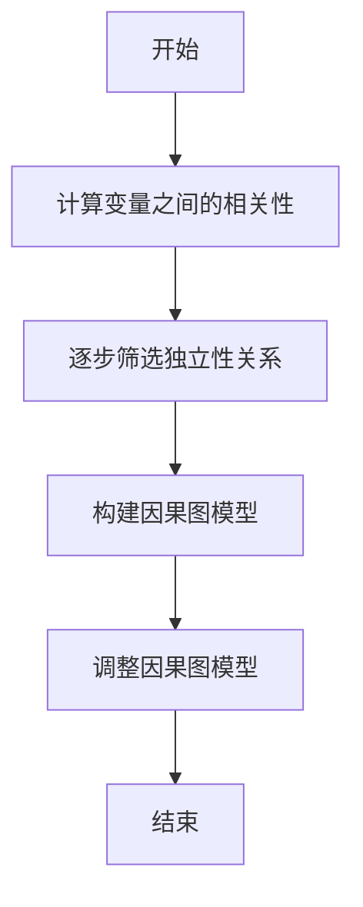
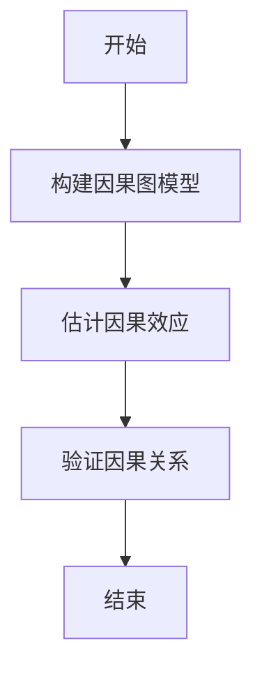
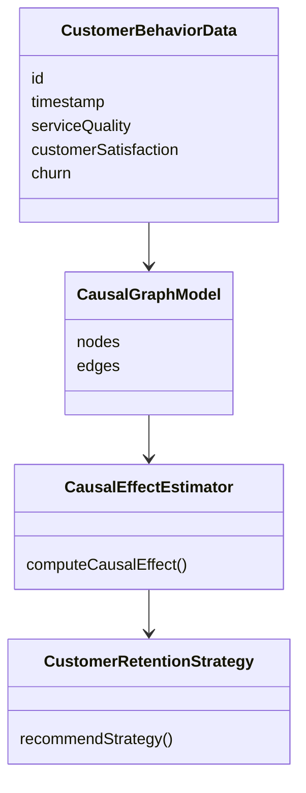

                 


# 企业AI Agent的因果推理在客户流失分析中的应用

> 关键词：企业AI Agent，因果推理，客户流失分析，因果图模型，因果发现算法，潜在结果框架

> 摘要：本文深入探讨了企业AI Agent如何利用因果推理技术分析客户流失问题。通过理论与实践相结合的方式，详细介绍了因果推理的核心概念、算法原理、系统设计以及项目实战。本文旨在为企业技术决策者和数据科学家提供一套基于因果推理的客户流失分析解决方案，帮助企业在复杂多变的市场环境中制定更有效的客户 retention策略。

---

## 第一部分：背景与概述

### 第1章：企业AI Agent与因果推理概述

#### 1.1 什么是企业AI Agent
企业AI Agent是一种能够理解、推理和响应企业环境中复杂问题的智能实体。它通过感知企业内外部数据，利用人工智能技术为企业决策提供支持。

- **定义与特点**：企业AI Agent具有自主性、反应性、目标导向和社交能力四大特点。它能够根据实时数据调整行为，帮助企业在动态环境中做出最优决策。
- **应用场景**：企业AI Agent广泛应用于客户服务、风险控制、供应链优化等领域。在客户流失分析中，企业AI Agent可以通过分析客户行为数据，预测客户流失风险，并提供针对性的解决方案。

#### 1.2 因果推理的基本概念
因果推理是研究因果关系的数学方法，其目标是通过数据识别变量之间的因果关系，从而更好地理解和预测现象。

- **因果关系与相关性**：相关性描述变量之间的关联程度，而因果关系则关注变量之间是否具有“原因与结果”的关系。例如，客户流失率高可能与服务质量差有关，但因果推理可以帮助我们确定服务质量是否是客户流失的直接原因。
- **潜在结果框架**：潜在结果框架（Potential Outcome Framework）是因果推理的重要工具。它假设每个个体在每种可能的处理情况下都有一个潜在的结果。通过比较不同处理情况下的结果，我们可以估计因果效应。
- **因果图模型**：因果图模型（Causal Graph Model）是一种用于表示变量之间因果关系的图形化工具。它通过绘制变量之间的因果关系图，帮助我们识别因果路径和潜在的混淆变量。

#### 1.3 客户流失分析的重要性
客户流失分析是企业经营中的重要环节，直接关系到企业的收入和市场竞争力。

- **客户流失的定义与影响**：客户流失是指客户不再与企业进行交易的行为。高客户流失率意味着企业需要不断获取新客户以维持业务增长，这会增加企业的营销成本，并可能影响企业的品牌声誉。
- **传统客户流失分析方法的局限性**：传统客户流失分析方法通常基于统计相关性分析，难以区分因果关系。例如，通过相关性分析，我们可能发现客户流失率与服务质量之间存在负相关关系，但无法确定服务质量是否是客户流失的直接原因。
- **为什么引入因果推理？**：因果推理可以帮助我们识别客户流失的真正原因，从而制定更有效的客户 retention策略。例如，通过因果推理，我们可以确定服务质量是否是客户流失的直接原因，并根据因果关系制定改进措施。

### 第2章：因果推理的核心概念与联系

#### 2.1 因果推理的基本原理
因果推理的核心思想是通过识别变量之间的因果关系，理解现象之间的内在联系。

- **因果关系的数学表示**：因果关系可以通过概率分布来表示。假设X是原因，Y是结果，那么因果关系可以表示为P(Y|do(X))，其中do(X)表示对X进行干预。
- **潜在结果框架**：潜在结果框架通过定义每个个体在不同处理情况下的潜在结果，帮助我们估计因果效应。例如，对于每个客户，我们可以定义他们在接受某种服务质量干预下的潜在结果，从而估计服务质量对客户流失的影响。
- **因果图模型的构建与解释**：因果图模型通过绘制变量之间的因果关系图，帮助我们识别因果路径和潜在的混淆变量。例如，在客户流失分析中，我们可以绘制客户流失、服务质量、客户满意度之间的因果关系图，从而识别服务质量是否是客户流失的直接原因。

#### 2.2 因果推理与客户流失分析的结合
因果推理在客户流失分析中的应用可以帮助企业识别客户流失的真正原因，并制定有效的客户 retention策略。

- **客户流失的因果关系建模**：通过因果图模型，我们可以构建客户流失的因果关系模型，识别变量之间的因果关系。例如，我们可以确定服务质量是否是客户流失的直接原因，或者客户满意度是否是服务质量的中介变量。
- **因果推理在客户流失预测中的优势**：因果推理可以帮助我们预测客户流失的可能性，并根据因果关系制定干预措施。例如，如果我们确定服务质量是客户流失的直接原因，我们可以通过提高服务质量来降低客户流失率。
- **实际案例分析：因果推理如何帮助降低客户流失率**：通过实际案例分析，我们可以看到因果推理在客户流失分析中的实际应用效果。例如，某电信公司通过因果推理分析发现，客户流失的主要原因是服务质量问题，因此通过提高服务质量，客户流失率显著下降。

#### 2.3 实体关系图与因果图模型
实体关系图与因果图模型是因果推理的重要工具，可以帮助我们更好地理解变量之间的关系。

- **ER图的基本概念**：ER图（Entity-Relationship Diagram）是一种用于描述数据库设计的工具，用于展示实体之间的关系。在客户流失分析中，我们可以使用ER图来描述客户、服务、交易等实体之间的关系。
- **因果图模型的构建**：因果图模型通过绘制变量之间的因果关系图，帮助我们识别因果路径和潜在的混淆变量。例如，在客户流失分析中，我们可以绘制客户流失、服务质量、客户满意度之间的因果关系图。
- **使用Mermaid绘制因果图模型**：通过Mermaid工具，我们可以轻松绘制因果图模型，并将其嵌入到文章中。例如：


---

## 第二部分：算法原理讲解

### 第3章：因果发现算法

#### 3.1 因果发现的基本思想
因果发现算法的目标是通过数据识别变量之间的因果关系。

- **独立性假设**：因果发现算法通常基于独立性假设。假设在因果关系中，原因变量与结果变量独立，而混淆变量与原因变量独立。
- **贝叶斯网络与因果发现**：贝叶斯网络是一种概率图模型，可以通过贝叶斯定理来表示变量之间的条件概率关系。在因果发现中，贝叶斯网络可以帮助我们识别变量之间的因果关系。
- **PC算法的基本原理**：PC算法是一种常用的因果发现算法，它通过逐步筛选变量之间的独立性关系，构建因果图模型。

#### 3.2 PC算法的实现步骤
PC算法的实现步骤如下：

1. **计算变量之间的相关性**：首先，我们需要计算变量之间的相关性，筛选出可能的相关变量。
2. **逐步筛选独立性关系**：通过逐步筛选变量之间的独立性关系，构建因果图模型。
3. **调整因果图模型**：根据变量之间的独立性关系，调整因果图模型，确保因果关系的正确性。

#### 3.3 使用Mermaid绘制PC算法流程图
通过Mermaid工具，我们可以绘制PC算法的流程图，帮助读者更好地理解算法的实现步骤。



#### 3.4 PC算法的Python实现
以下是PC算法的Python实现示例代码：

```python
import pandas as pd
import numpy as np
from sklearn.linear_model import LinearRegression
from sklearn.metrics import r2_score

def compute_partial_correlation(X, y, control):
    # 计算偏相关系数
    model = LinearRegression()
    model.fit(X, y)
    r2 = model.score(X, y)
    partial_corr = np.sqrt((1 - r2) / (1 - r2))
    return partial_corr

def pc_algorithm(data, alpha=0.05):
    # 数据预处理
    n = data.shape[1]
    adj_matrix = np.zeros((n, n))
    
    for i in range(n):
        for j in range(n):
            if i == j:
                continue
            # 计算偏相关系数
            X = data.iloc[:, j]
            Y = data.iloc[:, i]
            control = data.iloc[:, k for k in range(n) if k != i and k != j]
            partial_corr = compute_partial_correlation(X, Y, control)
            if partial_corr > alpha:
                adj_matrix[i, j] = 1
    return adj_matrix
```

---

### 第4章：因果推断算法

#### 4.1 因果推断的基本思想
因果推断的目标是通过数据估计因果效应，即干预某变量后对结果变量的影响。

- **因果效应的定义**：因果效应是指在干预某变量后，结果变量的变化程度。例如，在客户流失分析中，因果效应可以表示为提高服务质量后客户流失率的下降幅度。
- **反事实推理**：反事实推理是因果推断的重要方法，通过假设相反的事实来估计因果效应。例如，我们可以假设如果客户接受了某种服务质量干预，他们的流失概率会如何变化。

#### 4.2 因果推断的实现步骤
因果推断的实现步骤如下：

1. **构建因果图模型**：首先，我们需要构建变量之间的因果图模型，识别因果路径和潜在的混淆变量。
2. **估计因果效应**：通过反事实推理或其他因果推断方法，估计因果效应。
3. **验证因果关系**：通过实验或其他验证方法，确认因果关系的正确性。

#### 4.3 使用Mermaid绘制因果推断流程图
通过Mermaid工具，我们可以绘制因果推断的流程图，帮助读者更好地理解算法的实现步骤。



#### 4.4 因果推断的Python实现
以下是因果推断的Python实现示例代码：

```python
import pandas as pd
import numpy as np
from sklearn.linear_model import LinearRegression
from sklearn.metrics import r2_score

def compute_causal_effect(X, y, treatment):
    # 计算因果效应
    model = LinearRegression()
    model.fit(X, y)
    causal_effect = model.coef_[treatment]
    return causal_effect

def do_calculus(data, treatment):
    # 反事实推理
    n = data.shape[0]
    treated = np.zeros(n)
    treated[data[:, treatment] == 1] = 1
    causal_effect = compute_causal_effect(data, y, treatment)
    return causal_effect
```

---

## 第三部分：系统分析与架构设计方案

### 第5章：系统功能设计

#### 5.1 问题场景介绍
在客户流失分析中，企业需要通过分析客户行为数据，识别客户流失的真正原因，并制定有效的客户 retention策略。

- **客户流失预测**：通过分析客户行为数据，预测客户流失的可能性。
- **因果关系分析**：识别客户流失的真正原因，例如服务质量、客户满意度等。
- **客户 retention策略制定**：根据因果关系分析结果，制定有效的客户 retention策略。

#### 5.2 系统功能设计
系统功能设计包括以下几个方面：

1. **数据采集与预处理**：从企业数据库中采集客户行为数据，进行数据清洗和特征提取。
2. **因果图模型构建**：通过因果图模型，识别变量之间的因果关系。
3. **因果效应估计**：通过因果推断算法，估计因果效应，识别客户流失的真正原因。
4. **客户 retention策略制定**：根据因果效应估计结果，制定有效的客户 retention策略。

#### 5.3 使用Mermaid绘制系统功能设计类图
通过Mermaid工具，我们可以绘制系统功能设计类图，帮助读者更好地理解系统功能设计。



---

## 第四部分：项目实战

### 第6章：项目实战

#### 6.1 环境安装与数据准备
在项目实战中，我们需要首先安装必要的Python库，并准备客户行为数据。

- **环境安装**：安装Pandas、NumPy、Scikit-learn等Python库。
- **数据准备**：从企业数据库中采集客户行为数据，包括客户ID、服务时间、服务质量、客户满意度、客户流失等字段。

#### 6.2 系统核心实现源代码
以下是系统核心实现的Python代码示例：

```python
import pandas as pd
import numpy as np
from sklearn.linear_model import LinearRegression
from sklearn.metrics import r2_score

def compute_partial_correlation(X, y, control):
    model = LinearRegression()
    model.fit(X, y)
    r2 = model.score(X, y)
    partial_corr = np.sqrt((1 - r2) / (1 - r2))
    return partial_corr

def pc_algorithm(data, alpha=0.05):
    n = data.shape[1]
    adj_matrix = np.zeros((n, n))
    
    for i in range(n):
        for j in range(n):
            if i == j:
                continue
            X = data.iloc[:, j]
            Y = data.iloc[:, i]
            control = data.iloc[:, k for k in range(n) if k != i and k != j]
            partial_corr = compute_partial_correlation(X, Y, control)
            if partial_corr > alpha:
                adj_matrix[i, j] = 1
    return adj_matrix

def compute_causal_effect(X, y, treatment):
    model = LinearRegression()
    model.fit(X, y)
    causal_effect = model.coef_[treatment]
    return causal_effect

def do_calculus(data, treatment):
    n = data.shape[0]
    treated = np.zeros(n)
    treated[data[:, treatment] == 1] = 1
    causal_effect = compute_causal_effect(data, y, treatment)
    return causal_effect
```

#### 6.3 代码应用解读与分析
通过上述代码，我们可以实现因果发现和因果推断算法，构建因果图模型，估计因果效应，并制定客户 retention策略。

---

## 第五部分：总结与展望

### 第7章：总结与展望

#### 7.1 总结
本文深入探讨了企业AI Agent如何利用因果推理技术分析客户流失问题。通过理论与实践相结合的方式，详细介绍了因果推理的核心概念、算法原理、系统设计以及项目实战。

#### 7.2 未来展望
未来，随着人工智能技术的不断发展，企业AI Agent在客户流失分析中的应用将更加广泛。因果推理技术也将更加成熟，为企业提供更精准的客户流失分析和客户 retention策略。

#### 7.3 最佳实践 Tips
- 在实际应用中，建议企业结合自身业务特点，选择合适的因果推理算法。
- 在数据准备阶段，建议企业确保数据质量和完整性，以提高因果推理结果的准确性。
- 在系统设计阶段，建议企业结合业务需求，设计合理的系统架构，以实现高效的客户流失分析。

---

## 作者信息

作者：AI天才研究院/AI Genius Institute & 禅与计算机程序设计艺术 /Zen And The Art of Computer Programming

---

希望这篇技术博客能够为您提供有价值的内容！如果需要进一步调整或补充，请随时告知。

