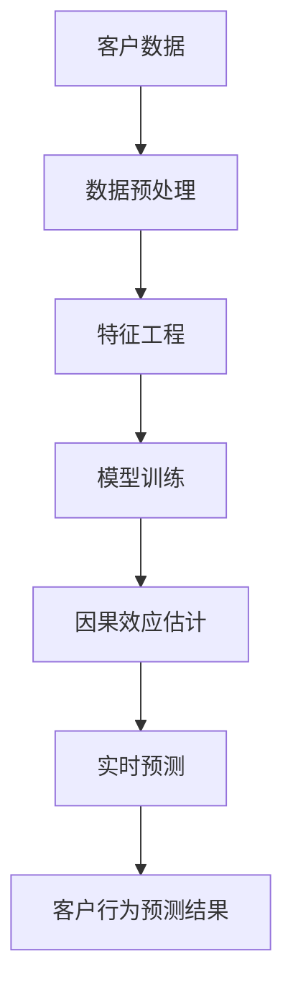

                 


# 企业AI Agent的因果推理在客户行为分析与预测中的应用

> 关键词：企业AI Agent，因果推理，客户行为分析，预测模型，系统架构

> 摘要：本文深入探讨了企业AI Agent如何通过因果推理技术来分析和预测客户行为。首先，我们介绍了因果推理的基本概念和其在客户行为分析中的重要性。接着，详细讲解了因果推理的算法原理，包括潜在结果框架和倾向评分。然后，通过系统架构设计和项目实战，展示了如何将这些理论应用于实际场景。最后，总结了最佳实践经验和未来研究方向。

---

## 第一部分: 企业AI Agent的因果推理基础

## 第2章: 因果推理的核心概念与联系

### 2.2 AI Agent与因果推理的关系

#### 2.2.1 AI Agent如何支持因果推理

AI Agent通过集成因果推理算法，能够从数据中识别因果关系，而不仅仅停留在相关性的层面。例如，AI Agent可以通过以下方式支持因果推理：

1. **数据收集与预处理**：AI Agent能够自动收集多源异构数据，并进行清洗和特征工程，为因果推理提供高质量的数据输入。
2. **因果图构建**：AI Agent可以基于领域知识和数据特征，自动或半自动地构建因果图，识别变量之间的因果关系。
3. **因果推断**：AI Agent能够执行潜在结果框架（Potential Outcome Framework）或结构方程模型（SEM），计算因果效应。
4. **动态调整与优化**：AI Agent可以根据因果推理结果，动态调整策略，优化客户行为预测的准确性。

#### 2.2.2 因果推理如何增强AI Agent的决策能力

因果推理为AI Agent提供了更深层次的决策能力：

1. **从相关到因果的跃迁**：传统机器学习模型通常只能识别相关关系，而因果推理能够帮助AI Agent理解变量之间的因果关系，从而做出更可靠的决策。
2. **反事实推理**：通过因果推理，AI Agent可以进行反事实推理（Counterfactual Reasoning），即预测在特定干预下的结果，从而支持更灵活的决策策略。
3. **动态调整与优化**：因果推理帮助AI Agent在动态变化的环境中，实时调整策略，优化客户行为预测的准确性和可解释性。

#### 2.2.3 两者结合的典型应用场景

以下是AI Agent与因果推理结合的几个典型应用场景：

1. **客户流失预测与干预**：通过因果推理，AI Agent可以识别导致客户流失的关键因素，并设计有效的干预策略。
2. **个性化推荐系统**：因果推理帮助AI Agent理解推荐行为对客户购买决策的实际影响，从而优化推荐策略。
3. **营销效果评估**：通过因果推理，AI Agent可以准确评估不同营销策略对客户行为的实际效果，为后续决策提供支持。

---

## 第3章: 算法原理讲解

### 3.1 潜在结果框架（Potential Outcome Framework）

#### 3.1.1 案例分析

假设我们希望预测一个客户在收到个性化推荐后是否会购买某商品。我们可以定义潜在结果如下：

- 对于客户$i$，$Y_i^{0}$表示客户$i$未收到推荐时的购买行为（0或1）。
- $Y_i^{1}$表示客户$i$收到推荐后的购买行为（0或1）。

我们的目标是估计因果效应$\tau = E[Y_i^{1} - Y_i^{0}]$。

#### 3.1.2 算法流程

以下是潜在结果框架的算法流程：

1. **数据预处理**：收集客户的基本信息、历史行为数据和是否接受推荐的标记。
2. **特征工程**：构建客户画像，提取影响购买行为的关键特征。
3. **模型训练**：使用机器学习模型（如随机森林或XGBoost）预测$Y_i^{1}$和$Y_i^{0}$。
4. **因果效应估计**：计算平均处理效应（ATE）或分层处理效应（HTE）。

#### 3.1.3 代码实现

以下是Python代码示例：

```python
import pandas as pd
import numpy as np
from sklearn.ensemble import RandomForestClassifier
from sklearn.metrics import accuracy_score

# 假设data是包含客户特征和推荐标记的数据框
data = pd.DataFrame({
    '客户ID': [1,2,3,4,5],
    '是否推荐': [0,1,1,0,1],
    '购买行为': [0,1,0,0,1]
})

# 定义潜在结果
def potential_outcome(row):
    if row['是否推荐'] == 0:
        return row['购买行为']
    else:
        return 1 - row['购买行为']

data['Y0'] = data['购买行为']
data['Y1'] = data.apply(potential_outcome, axis=1)

# 训练模型
model = RandomForestClassifier()
model.fit(data[['客户ID', '是否推荐']], data['Y1'])

# 预测因果效应
tau = model.predict_proba(data[['客户ID', '是否推荐']])[:,1].mean() - model.predict_proba(data[['客户ID', '是否推荐']])[:,0].mean()
print("因果效应τ:", tau)
```

---

## 第4章: 数学模型与公式

### 4.1 结构方程模型（SEM）

#### 4.1.1 模型定义

结构方程模型通过一组方程描述变量之间的因果关系。假设我们有变量$X$和$Y$，且$X$是$Y$的直接原因，那么模型可以表示为：

$$ Y = \beta X + \epsilon $$

其中$\beta$是因果效应，$\epsilon$是误差项。

#### 4.1.2 参数估计

通过最大似然估计（MLE）可以估计模型参数：

$$ \hat{\beta} = \frac{Cov(X, Y)}{Var(X)} $$

---

## 第5章: 系统分析与架构设计

### 5.1 问题场景介绍

假设我们正在设计一个客户行为预测系统，目标是预测客户在特定营销活动下的购买行为。

---

### 5.2 系统架构设计

#### 5.2.1 系统功能设计

以下是系统功能模块设计：

1. **数据预处理模块**：清洗数据，处理缺失值和异常值。
2. **特征工程模块**：提取客户画像特征和行为特征。
3. **模型训练模块**：训练因果推理模型，估计因果效应。
4. **预测与部署模块**：实时预测客户行为，并部署到生产环境。

#### 5.2.2 系统架构设计

以下是系统架构图（使用mermaid）：



---

### 5.3 项目实战

#### 5.3.1 环境安装

以下是环境配置代码：

```bash
pip install python-dotenv pandas numpy scikit-learn
```

---

## 第6章: 最佳实践与总结

### 6.1 最佳实践

1. **数据质量**：确保数据的完整性和准确性，避免偏差。
2. **模型解释性**：选择可解释性强的模型，如决策树或线性回归。
3. **实时预测**：结合流数据处理技术，实现实时客户行为预测。

---

## 结论

企业AI Agent通过因果推理技术，能够更准确地分析和预测客户行为，为企业的决策提供更强大的支持。未来，随着技术的不断进步，因果推理在客户行为分析中的应用将更加广泛和深入。

---

## 作者

作者：AI天才研究院/AI Genius Institute & 禅与计算机程序设计艺术 /Zen And The Art of Computer Programming

