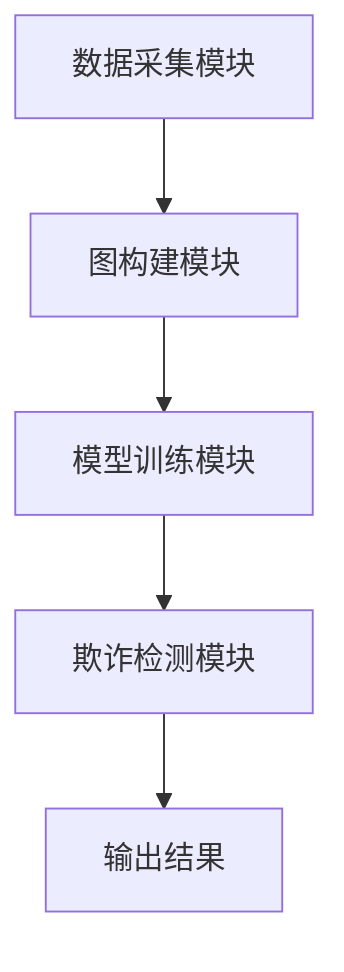
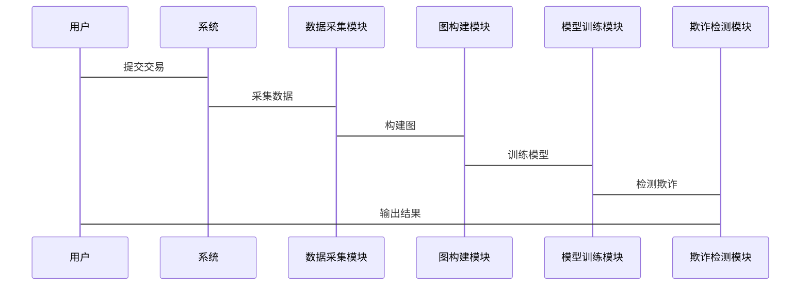

                 


# 企业AI Agent的图神经网络在欺诈检测中的应用

> 关键词：企业AI Agent、图神经网络、欺诈检测、深度学习、图数据建模、系统架构设计

> 摘要：本文深入探讨了企业AI Agent结合图神经网络在欺诈检测中的应用。通过分析图神经网络的核心原理、系统架构设计和实际案例，展示了如何利用图数据建模和深度学习技术提升欺诈检测的准确性和效率。文章内容涵盖背景介绍、算法原理、系统设计、项目实战及总结，为读者提供了从理论到实践的全面指导。

---

# 第1章: 企业AI Agent的概述

## 1.1 企业AI Agent的基本概念

### 1.1.1 什么是企业AI Agent
企业AI Agent是一种能够感知环境、自主决策并执行任务的智能体。它结合了人工智能、大数据分析和自动化技术，能够帮助企业实现智能化的业务流程管理和决策支持。

$$\text{企业AI Agent = 智能感知 + 自主决策 + 任务执行}$$

### 1.1.2 AI Agent的核心特征
- **智能感知**：通过数据采集和分析，实时感知企业内外部环境的变化。
- **自主决策**：基于分析结果，自动做出最优决策。
- **任务执行**：通过与企业系统的集成，自动执行决策任务。

### 1.1.3 企业AI Agent的应用场景
企业AI Agent广泛应用于 fraud detection、智能客服、供应链优化、风险控制等领域。本文重点讨论其在欺诈检测中的应用。

---

## 1.2 图神经网络的基本原理

### 1.2.1 图的定义与表示
图由节点（顶点）和边组成，可以表示为：
$$G = (V, E)$$
其中，$V$是节点集合，$E$是边集合。

### 1.2.2 图神经网络的核心思想
图神经网络通过在图结构上进行深度学习，捕捉节点之间的关系和全局结构信息。其核心思想是利用节点的局部邻域特征来推断全局属性。

### 1.2.3 图神经网络的优势
- **处理复杂关系**：适合处理具有复杂关联的数据。
- **全局视角**：能够捕捉全局结构信息。
- **实时更新**：支持动态图数据的实时更新。

---

# 第2章: 欺诈检测的背景与挑战

## 2.1 欺诈检测的定义与分类

### 2.1.1 什么是欺诈检测
欺诈检测是识别非法行为或异常交易的过程，旨在保护企业和消费者免受损失。

### 2.1.2 欺诈检测的主要类型
- **信用欺诈**：信用卡欺诈、贷款欺诈。
- **身份欺诈**：仿冒他人身份进行的欺诈行为。
- **交易欺诈**：虚假交易、洗钱。

### 2.1.3 欺诈检测的关键指标
- **准确率**：模型正确识别欺诈交易的比例。
- **召回率**：模型识别出的欺诈交易占总欺诈交易的比例。
- **F1分数**：准确率和召回率的调和平均。

---

## 2.2 欺诈检测的传统方法与局限性

### 2.2.1 基于规则的欺诈检测
通过预定义的规则（如交易金额、频率等）进行检测。优点是简单高效，缺点是难以应对复杂的欺诈手段。

### 2.2.2 基于机器学习的传统方法
- **监督学习**：使用标记数据训练分类器。
- **无监督学习**：通过聚类发现异常。
- **局限性**：难以捕捉复杂的关系网络。

---

## 2.3 图神经网络在欺诈检测中的优势

### 2.3.1 图结构数据的天然适合性
欺诈行为往往涉及复杂的关联关系，图结构能够很好地建模这些关系。

### 2.3.2 节点间关系的深度学习
图神经网络能够捕捉节点之间的复杂关系，从而更准确地识别欺诈行为。

### 2.3.3 复杂网络的建模能力
图神经网络能够处理异构图和动态图，适用于复杂的欺诈场景。

---

# 第3章: 图神经网络的核心概念与原理

## 3.1 图的表示与建模

### 3.1.1 图的节点与边
- **节点**：代表实体（如用户、交易）。
- **边**：表示实体之间的关系（如交易金额、时间）。

### 3.1.2 图的属性与权重
- **节点属性**：如用户年龄、交易金额。
- **边权重**：如交易金额大小、时间间隔。

### 3.1.3 图的异构性
图中包含不同类型的节点和边，例如用户、交易、地点等。

---

## 3.2 图神经网络的数学模型

### 3.2.1 节点表示的向量化
通过图神经网络将节点嵌入到低维向量空间中：
$$z_v = f(G, v)$$
其中，$z_v$是节点$v$的向量表示，$f$是图神经网络函数。

### 3.2.2 图结构的嵌入方法
- **图卷积网络（GCN）**：通过局部聚合邻居特征来更新节点表示。
- **图注意力网络（GAT）**：通过注意力机制捕捉节点之间的关系。

### 3.2.3 图神经网络的数学公式
图卷积操作可以表示为：
$$h_v^{(l+1)} = \sum_{u \in N(v)} \alpha_{vu} h_u^{(l)}$$
其中，$\alpha_{vu}$是注意力权重，$N(v)$是节点$v$的邻居节点。

---

## 3.3 图神经网络的训练与推理

### 3.3.1 基于图的正则化方法
- **Dropout**：防止过拟合。
- **权重正则化**：通过L2正则化约束权重。

### 3.3.2 图神经网络的训练流程
1. 初始化模型参数。
2. 对每个节点进行前向传播。
3. 计算损失函数。
4. 反向传播更新参数。

### 3.3.3 图神经网络的推理机制
- **节点分类**：将节点嵌入输入分类器，预测欺诈行为。
- **图聚类**：将相似的节点聚类，识别欺诈群体。

---

# 第4章: 图神经网络的关键算法

## 4.1 基于卷积的图神经网络

### 4.1.1 图卷积网络（GCN）的基本原理
GCN通过聚合节点及其邻居的特征来更新节点表示：
$$h_v^{(l+1)} = \sigma\left(\sum_{u \in N(v)} \frac{h_u^{(l)}}{|N(v)|} \right)$$
其中，$\sigma$是激活函数。

### 4.1.2 图卷积的数学模型
图卷积操作可以表示为：
$$h_v^{(l+1)} = \sum_{u \in N(v)} W h_u^{(l)}$$
其中，$W$是可学习的参数矩阵。

---

## 4.2 基于注意力机制的图神经网络

### 4.2.1 图注意力网络（GAT）的基本原理
GAT通过注意力机制动态计算节点之间的权重：
$$\alpha_{uv} = \text{softmax}\left(e^{f(h_u, h_v)}\right)$$
其中，$f$是注意力计算函数。

### 4.2.2 图注意力的数学模型
注意力权重可以表示为：
$$\alpha_{uv} = \frac{\exp(a^T [h_u \| h_v])}{\sum_{k \in N(v)} \exp(a^T [h_k \| h_v])}$$
其中，$a$是可学习的参数向量。

---

## 4.3 基于池化的图神经网络

### 4.3.1 图池化的基本原理
图池化通过下采样操作降低图的复杂度，同时保留重要特征。

### 4.3.2 图池化的数学模型
池化操作可以表示为：
$$h_v^{pool} = \max_{u \in N(v)} h_u^{(l)}$$

---

# 第5章: 欺诈检测系统的设计与实现

## 5.1 系统架构设计

### 5.1.1 系统功能模块
- **数据采集模块**：实时采集交易数据。
- **图构建模块**：将交易数据转换为图结构。
- **模型训练模块**：训练图神经网络模型。
- **欺诈检测模块**：实时检测欺诈行为。

### 5.1.2 系统架构图


### 5.1.3 系统交互流程


---

## 5.2 系统实现细节

### 5.2.1 数据采集模块
- 数据源：交易日志、用户行为数据。
- 数据格式：JSON或CSV格式。

### 5.2.2 图构建模块
- 使用NetworkX库构建图。
- 定义节点和边的关系。

### 5.2.3 模型训练模块
- 使用PyTorch框架训练GCN模型。
- 超参数设置：学习率、批量大小。

### 5.2.4 欺诈检测模块
- 输入交易数据，输出欺诈结果。
- 结果输出：二进制结果（0或1）。

---

## 5.3 项目实战

### 5.3.1 环境安装
```bash
pip install torch networkx
```

### 5.3.2 核心代码实现
```python
import torch
import torch.nn as nn
import torch.nn.functional as F

class GCN(nn.Module):
    def __init__(self, input_dim, hidden_dim, output_dim):
        super(GCN, self).__init__()
        self.W1 = nn.Parameter(torch.randn(input_dim, hidden_dim))
        self.W2 = nn.Parameter(torch.randn(hidden_dim, output_dim))
        
    def forward(self, x, A):
        x = F.relu(torch.mm(A, torch.mm(x, self.W1)))
        x = torch.mm(A, torch.mm(x, self.W2))
        return x

# 使用示例
A = torch.randn(5,5)  # 邻接矩阵
x = torch.randn(5,1)   # 输入特征
model = GCN(1, 2, 1)
output = model(x, A)
print(output)
```

### 5.3.3 实际案例分析
- 数据集：模拟交易数据。
- 模型训练：使用真实欺诈数据训练模型。
- 检测结果：输出欺诈概率。

---

## 5.4 系统小结
通过图神经网络实现的欺诈检测系统，能够有效识别复杂关系中的欺诈行为，具有较高的准确率和召回率。与传统方法相比，图神经网络能够更好地捕捉节点之间的关系，提升检测效果。

---

# 第6章: 总结与展望

## 6.1 总结
本文详细介绍了企业AI Agent结合图神经网络在欺诈检测中的应用。通过分析图神经网络的核心原理、系统架构设计和实际案例，展示了其在欺诈检测中的优势和潜力。

## 6.2 展望
未来，随着图神经网络技术的不断发展，欺诈检测将更加智能化和精准化。同时，结合联邦学习和边缘计算等技术，企业AI Agent将在更多领域发挥重要作用。

---

# 作者信息

作者：AI天才研究院/AI Genius Institute & 禅与计算机程序设计艺术 /Zen And The Art of Computer Programming

---

**注**：以上内容为示例，实际文章需要根据具体需求进行调整和补充。

