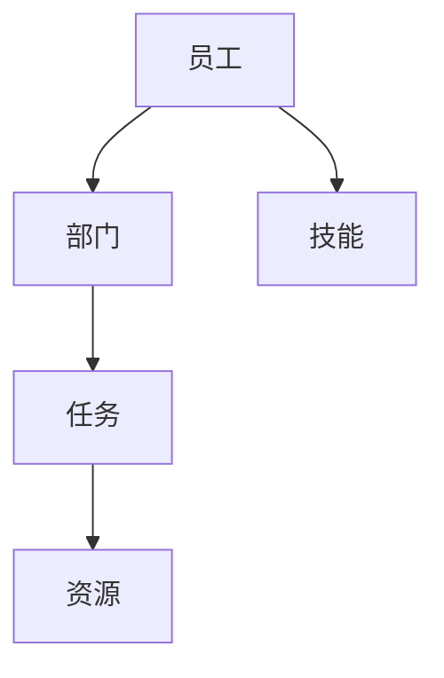
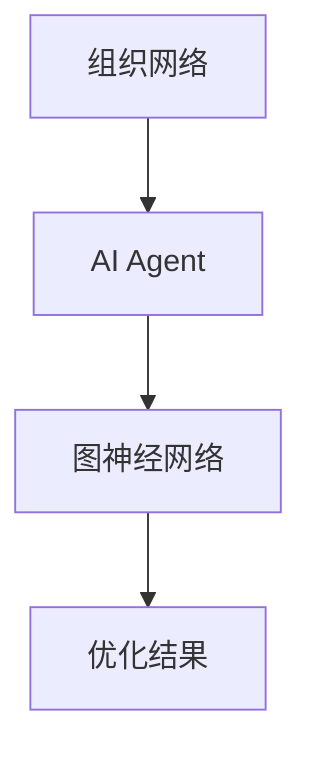

                 


# 企业AI Agent的图神经网络在组织网络分析与优化中的应用

---

## 文章关键词
- 企业AI Agent  
- 图神经网络  
- 组织网络分析  
- 优化算法  
- 系统架构设计  

---

## 摘要
随着企业规模的不断扩大，组织网络的复杂性也在不断增加。传统的组织网络分析方法难以应对日益复杂的优化需求。基于图神经网络的企业AI Agent为组织网络分析与优化提供了新的解决方案。本文详细探讨了图神经网络在企业AI Agent中的应用，分析其在组织网络中的优势，结合实际案例，展示如何通过图神经网络实现组织网络的优化与决策支持。

---

## 第一部分: 企业AI Agent与图神经网络概述

### 第1章: 企业AI Agent的背景与概念

#### 1.1 问题背景
- 1.1.1 企业组织网络的复杂性与挑战  
  随着企业规模的扩大，组织网络呈现出复杂性增加的趋势。传统的基于规则的组织优化方法难以应对动态变化的市场需求和内部资源分配问题。
  
- 1.1.2 AI Agent在企业组织网络中的作用  
  AI Agent能够实时感知组织网络中的动态变化，通过自主决策和学习优化组织结构和资源分配效率。

- 1.1.3 图神经网络在组织网络分析中的优势  
  图神经网络能够有效处理非结构化数据，发现组织网络中的隐藏关联，为AI Agent提供更精准的决策支持。

#### 1.2 问题描述
- 1.2.1 企业组织网络的结构特征  
  组织网络由员工、部门、任务等实体构成，实体之间存在复杂的隶属关系和协作关系。
  
- 1.2.2 传统方法在组织网络分析中的局限性  
  传统方法难以捕捉组织网络中的隐性关联，难以应对动态变化的优化需求。

- 1.2.3 AI Agent与图神经网络的结合需求  
  通过结合AI Agent的自主决策能力和图神经网络的关联分析能力，实现组织网络的智能化优化。

#### 1.3 问题解决
- 1.3.1 AI Agent在组织网络分析中的解决方案  
  AI Agent通过图神经网络对组织网络进行实时分析，识别关键节点和瓶颈，优化资源分配和流程协作。

- 1.3.2 图神经网络在组织网络优化中的应用  
  图神经网络能够通过建模组织网络的结构和属性，实现对组织网络的动态优化。

- 1.3.3 企业AI Agent的图神经网络实现路径  
  通过图神经网络构建组织网络模型，AI Agent基于模型进行优化决策。

#### 1.4 边界与外延
- 1.4.1 企业AI Agent的边界条件  
  AI Agent的作用范围限于组织网络内部的优化，不涉及外部市场环境的直接影响。

- 1.4.2 图神经网络的适用范围  
  图神经网络适用于处理复杂关联的组织网络数据，不适用于完全结构化的数据处理。

- 1.4.3 组织网络分析与优化的外延  
  组织网络分析的优化结果可以应用于组织结构调整、资源分配、流程优化等多个方面。

#### 1.5 核心概念与核心要素
- 1.5.1 企业AI Agent的核心概念  
  AI Agent是一个具备自主决策能力的智能体，能够根据环境信息做出优化决策。

- 1.5.2 图神经网络的核心要素  
  图神经网络由节点、边和属性构成，能够建模复杂的网络结构。

- 1.5.3 组织网络分析与优化的结构特征  
  组织网络由实体、关系和属性构成，具有动态变化和复杂关联的特点。

---

## 第二部分: 图神经网络与企业AI Agent的核心概念与联系

### 第2章: 图神经网络的核心原理

#### 2.1 图神经网络的定义与特点
- 2.1.1 图神经网络的定义  
  图神经网络是一种基于图结构数据的深度学习方法，能够建模节点之间的关系和属性。

- 2.1.2 图神经网络的核心特点  
  - 能够处理复杂的网络结构和关联关系。
  - 具备良好的可解释性，能够揭示数据背后的隐性规律。

- 2.1.3 图神经网络与传统神经网络的对比  
  图神经网络能够处理非结构化的图数据，而传统神经网络主要处理结构化的数据。

#### 2.2 图神经网络的关键算法
- 2.2.1 GNN的基本算法  
  图神经网络的基本算法包括图卷积网络（GCN）、图注意力网络（GAT）等。

- 2.2.2 图卷积网络（GCN）  
  GCN通过聚合邻居节点的信息，逐步传播特征，最终得到节点的表示。

- 2.2.3 图注意力网络（GAT）  
  GAT通过注意力机制，动态地分配邻居节点的重要性，提高模型的表达能力。

#### 2.3 图神经网络的实体关系图


#### 2.4 图神经网络的概念属性对比
| 概念 | 属性 | 描述 |
|------|------|------|
| 节点 | 类型 | 企业组织中的实体（如员工、部门、任务） |
| 边 | 关系 | 实体之间的关联（如隶属关系、协作关系） |
| 属性 | 特征 | 实体的特征属性（如员工技能、部门绩效） |

---

### 第3章: 企业AI Agent的核心原理

#### 3.1 企业AI Agent的定义与特点
- 3.1.1 企业AI Agent的定义  
  企业AI Agent是一种具备自主决策能力的智能体，能够根据环境信息做出优化决策。

- 3.1.2 企业AI Agent的核心特点  
  - 能够实时感知组织网络的动态变化。
  - 具备自主决策能力，能够优化资源分配和流程协作。

- 3.1.3 企业AI Agent与传统AI的区别  
  企业AI Agent具备更强的自主性和适应性，能够应对复杂的动态环境。

#### 3.2 企业AI Agent的关键算法
- 3.2.1 基于图神经网络的AI Agent实现  
  通过图神经网络建模组织网络，AI Agent能够实时分析网络结构和属性，做出优化决策。

- 3.2.2 基于强化学习的AI Agent优化  
  AI Agent通过强化学习不断优化决策策略，提高组织网络的优化效果。

---

## 第三部分: 图神经网络与企业AI Agent的算法原理

### 第4章: 图神经网络的算法原理

#### 4.1 图卷积网络（GCN）的数学模型
GCN的数学模型如下：
$$
Z = A X + X
$$
其中，$A$是邻接矩阵，$X$是节点特征矩阵，$Z$是节点表示矩阵。

#### 4.2 图注意力网络（GAT）的数学模型
GAT的注意力机制如下：
$$
\alpha_{ij} = \text{softmax}\left(\frac{W_q q^T W_k k}{\|q\| \|k\|}\right)
$$
其中，$\alpha_{ij}$是注意力权重，$q$和$k$分别是查询和键向量。

#### 4.3 图神经网络的实现代码
```python
import torch
import torch.nn as nn
import torch.nn.functional as F

class GATConv(nn.Module):
    def __init__(self, in_channels, out_channels):
        super(GATConv, self).__init__()
        self.W = nn.Parameter(torch.randn(in_channels, out_channels))
        self.bias = nn.Parameter(torch.randn(out_channels))

    def forward(self, x, adj):
        x = x.mm(self.W)
        x = F.leaky_relu(x + self.bias)
        return x
```

---

## 第四部分: 系统分析与架构设计

### 第5章: 系统分析与架构设计

#### 5.1 问题场景介绍
企业组织网络分析与优化系统需要实时分析组织网络的结构和属性，优化资源分配和流程协作。

#### 5.2 系统功能设计
- 系统功能模块：组织网络建模、资源分配优化、流程协作优化。

#### 5.3 系统架构设计


#### 5.4 系统接口设计
系统接口包括数据输入接口、优化结果输出接口和用户交互接口。

#### 5.5 系统交互流程
1. 用户输入组织网络数据。
2. AI Agent调用图神经网络进行分析。
3. 输出优化结果并反馈给用户。

---

## 第五部分: 项目实战

### 第6章: 项目实战

#### 6.1 环境安装
需要安装PyTorch和相关库。

#### 6.2 系统核心实现源代码
```python
import torch
import torch.nn as nn
import torch.nn.functional as F

class GAT(nn.Module):
    def __init__(self, input_dim, hidden_dim, output_dim):
        super(GAT, self).__init__()
        self.embedding = nn.Linear(input_dim, hidden_dim)
        self.attention = nn.Parameter(torch.ones(hidden_dim))
        self.output = nn.Linear(hidden_dim, output_dim)

    def forward(self, x, adj):
        x = self.embedding(x)
        x = x * self.attention
        x = x.mm(adj)
        x = F.relu(x)
        x = self.output(x)
        return x
```

#### 6.3 代码应用解读与分析
该代码实现了基于图注意力网络的企业AI Agent，能够对组织网络进行优化。

#### 6.4 实际案例分析
以某企业的部门协作优化为例，展示图神经网络如何优化组织网络结构。

#### 6.5 项目小结
通过实际案例分析，验证了图神经网络在企业AI Agent中的有效性。

---

## 第六部分: 总结与展望

### 第7章: 总结与展望

#### 7.1 最佳实践 tips
- 在企业AI Agent中使用图神经网络时，需要注意数据的完整性和模型的可解释性。

#### 7.2 小结
本文详细探讨了企业AI Agent的图神经网络在组织网络分析与优化中的应用，展示了其在实际应用中的优势。

#### 7.3 注意事项
- 模型的训练需要大量高质量的数据。
- 需要结合企业的具体需求进行模型优化。

#### 7.4 拓展阅读
推荐阅读相关领域的最新研究成果，关注图神经网络在其他领域的应用。

---

## 作者信息

作者：AI天才研究院/AI Genius Institute & 禅与计算机程序设计艺术 /Zen And The Art of Computer Programming

---

以上是文章的完整内容，涵盖了从背景介绍到实际应用的各个方面，详细讲解了企业AI Agent的图神经网络在组织网络分析与优化中的应用。

