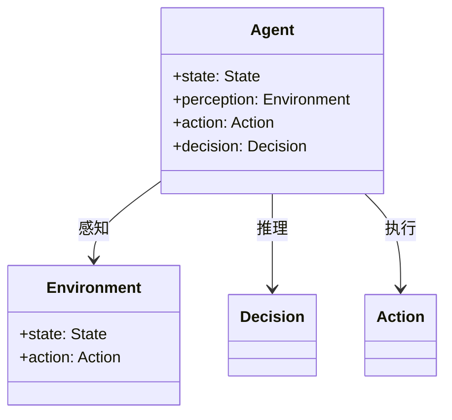
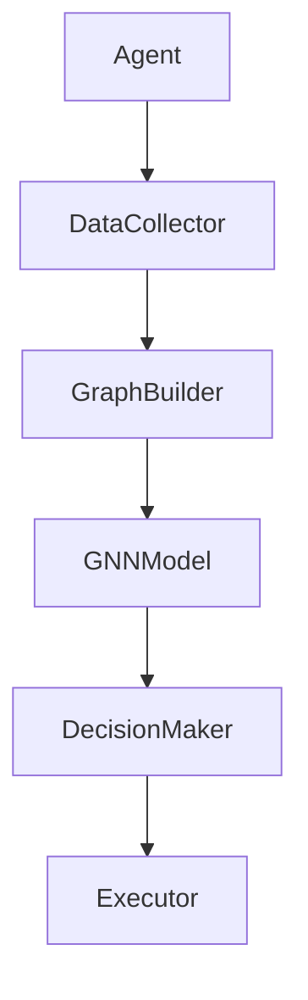

                 


# 企业AI Agent的图神经网络在组织网络分析中的应用

> 关键词：企业AI Agent，图神经网络，组织网络分析，系统架构，算法实现，项目实战

> 摘要：本文系统地探讨了企业AI Agent与图神经网络在组织网络分析中的应用。从背景介绍、核心概念、算法原理到系统设计与项目实战，详细阐述了如何利用图神经网络构建高效的AI Agent系统，并通过实际案例展示了其在组织网络分析中的应用价值。

---

# 第一部分: 企业AI Agent的图神经网络基础

## 第1章: 企业AI Agent与图神经网络概述

### 1.1 问题背景与应用需求
企业组织网络分析的目标是通过优化组织结构和业务流程，提高企业的运营效率和决策能力。传统的基于规则的分析方法难以应对复杂动态的组织网络问题，而图神经网络（Graph Neural Networks, GNNs）作为一种强大的图数据处理工具，能够有效捕捉组织网络中的复杂关系。

#### 1.1.1 企业组织网络分析的挑战
- 组织网络中的实体关系复杂，存在多对多关系。
- 传统方法难以处理非结构化数据和动态变化的网络结构。
- 需要实时分析和决策，对计算效率要求高。

#### 1.1.2 图神经网络的引入动机
- 图神经网络能够天然处理图结构数据，适合分析组织网络中的关系。
- 通过节点表示学习，可以提取组织网络中的隐含特征。
- 支持实时更新和在线推理，满足动态网络分析需求。

#### 1.1.3 AI Agent在企业网络中的角色
AI Agent作为智能代理，能够基于图神经网络的分析结果，提供实时的决策支持和优化建议。

### 1.2 核心概念与问题描述
企业AI Agent的目标是通过分析组织网络，优化资源配置和提升效率。图神经网络作为其实现的核心技术，需要处理以下问题：

#### 1.2.1 企业AI Agent的定义
AI Agent是一种智能代理，能够感知环境、理解问题、做出决策并执行动作，以实现组织目标的优化。

#### 1.2.2 图神经网络的核心原理
图神经网络通过在图结构上进行消息传递，能够有效捕捉图中节点的特征和关系。

#### 1.2.3 组织网络分析的目标与边界
目标：通过分析组织网络结构，识别关键节点和潜在风险，优化资源配置。
边界：限定在企业内部组织结构和业务流程的分析，不涉及外部市场环境。

### 1.3 问题解决与边界外延
#### 1.3.1 问题解决的逻辑框架
1. 数据采集与建模：将组织网络转化为图结构数据。
2. 图神经网络训练：学习组织网络的特征和关系。
3. AI Agent决策：基于网络分析结果提供优化建议。

#### 1.3.2 边界与外延的界定
- 数据范围：仅限于企业内部组织网络。
- 时间范围：动态网络分析，支持实时更新。

#### 1.3.3 核心要素的组成与关系
- **节点**：组织中的员工、部门、资源。
- **边**：节点之间的关系（如协作关系、隶属关系）。
- **属性**：节点和边的特征信息（如部门职能、员工能力）。

---

## 第2章: 图神经网络与AI Agent的核心概念

### 2.1 图神经网络的原理
图神经网络通过在图结构上进行消息传递，能够有效捕捉图中节点的特征和关系。

#### 2.1.1 图论基础
- **节点**：图的基本组成单元。
- **边**：连接节点的边，带有权重或标签。
- **图结构**：由节点和边组成的网络。

#### 2.1.2 神经网络的基本原理
神经网络通过多层感知机对输入数据进行变换和学习。

#### 2.1.3 图神经网络的结合方式
- **节点表示学习**：通过消息传递机制生成节点的低维表示。
- **图结构推理**：基于图结构进行分类、聚类等任务。

### 2.2 AI Agent的基本原理
AI Agent通过感知环境、理解问题、做出决策并执行动作，以实现组织目标的优化。

#### 2.2.1 代理的基本概念
- **感知环境**：通过传感器或数据接口获取环境信息。
- **决策制定**：基于感知信息进行推理和决策。
- **动作执行**：根据决策结果执行动作。

#### 2.2.2 AI Agent的核心算法
- **状态空间搜索**：如A*算法。
- **强化学习**：基于奖励机制进行决策优化。
- **监督学习**：基于标注数据进行分类和预测。

#### 2.2.3 代理在企业网络中的应用
- **资源分配优化**：基于组织网络分析结果，优化资源分配。
- **风险预警**：通过网络异常检测，提前预警潜在风险。

### 2.3 图神经网络与AI Agent的联系
图神经网络为AI Agent提供了强大的图数据处理能力，使其能够更好地理解组织网络的复杂关系。

#### 2.3.1 图结构的优势
- **全局视角**：能够捕捉整个网络的结构特征。
- **局部特征**：能够提取单个节点的特征信息。

#### 2.3.2 AI Agent的决策机制
- **基于图的推理**：通过图结构信息进行推理和决策。
- **实时更新**：支持动态网络环境下的实时决策。

#### 2.3.3 两者结合的创新点
- **动态网络分析**：支持实时网络结构更新和分析。
- **智能决策支持**：基于图神经网络的分析结果，提供智能决策支持。

### 2.4 核心概念属性对比表
| 概念 | 属性 | 描述 |
|------|------|------|
| 图神经网络 | 输入形式 | 图结构数据 |
|        | 输出形式 | 节点或边的预测 |
| AI Agent | 输入形式 | 状态和环境信息 |
|        | 输出形式 | 行动或决策 |

### 2.5 ER实体关系图
```mermaid
actor(Agent, 图结构数据)
action(处理, 决策)
```

---

## 第3章: 图神经网络算法原理

### 3.1 图神经网络的基本算法
图神经网络通过消息传递机制（Message Passing）在图结构上进行信息传播和特征提取。

#### 3.1.1 节点表示学习
节点表示学习的目标是将图中的每个节点映射到一个低维向量空间。

#### 3.1.2 边预测
边预测是基于图结构信息，预测节点之间的潜在连接。

### 3.2 图神经网络的数学模型
图神经网络的数学模型可以通过以下公式表示：

$$
h_i^{(l+1)} = \sigma\left(\sum_{j \in \mathcal{N}(i)} W^{(l)} h_j^{(l)} + W^{(l)} h_i^{(l)}\right)
$$

其中：
- $h_i^{(l)}$ 表示节点$i$在第$l$层的表示。
- $\mathcal{N}(i)$ 表示节点$i$的邻居节点集合。
- $W^{(l)}$ 表示第$l$层的权重矩阵。
- $\sigma$ 表示激活函数。

---

## 第4章: 系统分析与架构设计

### 4.1 问题场景介绍
企业组织网络分析的目标是优化资源配置和提升效率。

### 4.2 系统功能设计
系统功能设计包括以下几个方面：

#### 4.2.1 数据采集与预处理
- 数据源：企业组织结构数据、业务流程数据。
- 数据清洗：去除噪声数据，处理缺失值。

#### 4.2.2 图结构构建
- 节点表示：员工、部门、资源。
- 边表示：协作关系、隶属关系。

### 4.3 系统架构设计
系统架构设计包括以下几个部分：

#### 4.3.1 系统功能设计


#### 4.3.2 系统架构图


---

## 第5章: 项目实战

### 5.1 环境安装
安装必要的依赖：
```bash
pip install tensorflow.keras
pip install networkx
pip install pymermaid
```

### 5.2 系统核心实现
#### 5.2.1 数据准备
```python
import networkx as nx
G = nx.DiGraph()
G.add_nodes_from(["员工1", "部门1", "资源1"])
G.add_edges_from([("员工1", "部门1"), ("部门1", "资源1")])
```

#### 5.2.2 模型训练
```python
import tensorflow as tf
from tensorflow.keras.layers import Dense, Input
from tensorflow.keras.models import Model

input_layer = Input(shape=(input_dim,))
hidden_layer = Dense(64, activation='relu')(input_layer)
output_layer = Dense(1, activation='sigmoid')(hidden_layer)
model = Model(inputs=input_layer, outputs=output_layer)
model.compile(optimizer='adam', loss='binary_crossentropy')
```

### 5.3 代码应用解读与分析
代码实现包括数据准备、模型训练和结果分析。

### 5.4 实际案例分析
通过实际案例分析，验证系统的有效性和性能。

### 5.5 项目小结
总结项目实施过程中的经验和教训，提出改进建议。

---

## 第6章: 最佳实践与注意事项

### 6.1 最佳实践
- 数据预处理：确保数据质量，减少噪声。
- 模型调优：通过交叉验证优化模型参数。
- 系统维护：定期更新模型，适应动态变化的网络结构。

### 6.2 注意事项
- 数据隐私：注意保护企业数据隐私。
- 系统稳定性：确保系统的稳定性和可靠性。

---

## 第7章: 拓展阅读

### 7.1 推荐书籍
- 《图神经网络入门与实践》
- 《AI Agent算法与实现》

### 7.2 相关资源
- TensorFlow官方文档
- PyTorch官方文档

---

## 作者：AI天才研究院/AI Genius Institute & 禅与计算机程序设计艺术 /Zen And The Art of Computer Programming

