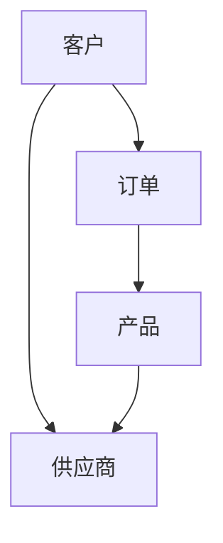
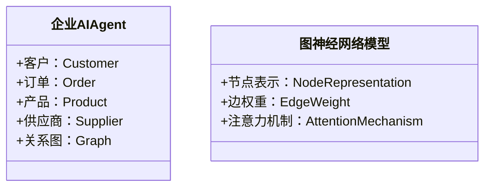
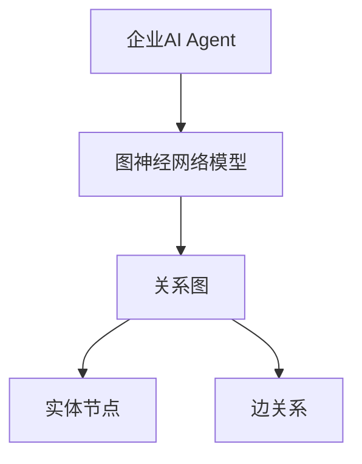
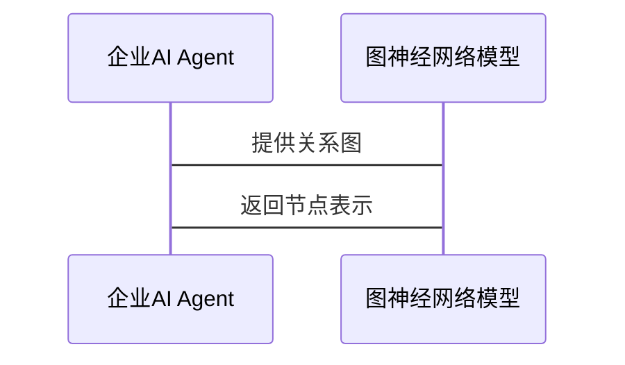

                 


# 企业AI Agent的图神经网络应用：复杂关系建模

> 关键词：企业AI Agent，图神经网络，复杂关系建模，实体关系图，图嵌入，注意力机制

> 摘要：本文详细探讨了在企业AI Agent中应用图神经网络进行复杂关系建模的理论与实践。从问题背景出发，分析了传统方法的局限性，介绍了图神经网络的核心思想与优势，并通过具体案例展示了其在企业场景中的应用。文章内容涵盖图神经网络算法原理、系统架构设计、项目实战以及最佳实践等多个方面，为读者提供了一套完整的解决方案。

---

## 第一部分: 企业AI Agent的图神经网络应用概述

### 第1章: 问题背景与概念介绍

#### 1.1 问题背景

企业AI Agent是一种能够感知环境、自主决策并执行任务的智能体。在企业环境中，AI Agent需要处理复杂的实体关系，例如客户-产品关系、供应链关系、组织架构关系等。传统的基于规则的系统或基于表格的关系建模方法在处理复杂性和动态性时表现不足，难以应对现代企业的需求。

#### 1.2 问题描述

- **复杂关系建模的挑战**：企业中的实体关系通常是复杂的，涉及多个实体之间的多维关系。传统的图结构能够表示这些关系，但如何高效地利用这些关系进行推理和决策是关键问题。
- **传统方法的局限性**：基于规则的系统难以处理动态变化的关系；基于向量的表示方法难以捕捉实体间的复杂联系。

#### 1.3 问题解决

图神经网络（Graph Neural Networks, GNN）通过将实体表示为图中的节点，并利用图结构信息进行学习，能够有效地建模复杂关系。企业AI Agent可以利用图神经网络进行关系推理、实体识别和决策优化。

#### 1.4 边界与外延

- **企业AI Agent的边界**：专注于实体关系建模，不涉及具体任务执行（如决策制定或行动执行）。
- **图神经网络的适用范围**：适用于需要处理复杂关联数据的场景，如社交网络、供应链管理等。

#### 1.5 概念结构与核心要素

- **企业实体**：企业中的核心实体，如客户、供应商、产品等。
- **实体关系**：实体之间的关系，如“客户购买产品”、“供应商提供原材料”等。
- **图结构**：将实体表示为节点，关系表示为边，构建企业关系图。

---

### 第2章: 核心概念与联系

#### 2.1 图神经网络的原理

图神经网络通过在图结构上进行消息传递，将节点的特征信息传播到其邻居节点，最终得到每个节点的表示向量。其核心思想是利用图的结构信息，通过迭代传播来捕获节点间的依赖关系。

#### 2.2 核心概念对比

| 模型         | GCN          | GAT          | GraphSAGE      |
|--------------|--------------|--------------|----------------|
| 核心思想     | 基于邻接矩阵   | 基于注意力机制 | 基于聚合操作   |
| 优点         | 计算简单       | 能处理长距离依赖 | 易扩展到大规模图 |
| 缺点         | 易受噪声影响     | 计算复杂       | 参数较多       |

#### 2.3 ER实体关系图架构



---

## 第二部分: 图神经网络算法原理

### 第3章: 图神经网络算法原理

#### 3.1 图卷积网络（GCN）的基本原理

图卷积网络通过在图结构上进行卷积操作，将节点的特征信息传播到其邻居节点。其传播规则如下：

$$
h^{(l+1)}_i = \sigma\left(\sum_{j \in \mathcal{N}(i)} \frac{1}{|N(i)|} W h^{(l)}_j\right)
$$

其中，$h^{(l)}_i$表示节点$i$在第$l$层的表示，$\mathcal{N}(i)$表示节点$i$的邻居节点集合，$W$是权重矩阵，$\sigma$是激活函数。

#### 3.2 图注意力网络（GAT）的核心思想

图注意力网络通过引入注意力机制，为每条边分配权重，以捕捉节点间的长距离依赖关系。其注意力权重计算公式为：

$$
\alpha_{ij} = \frac{e^{f_{i}^T f_j}}{\sum_{k \neq i} e^{f_{i}^T f_k}}
$$

其中，$f_i$是节点$i$的特征向量，$f_{i}^T f_j$是其内积。

#### 3.3 图神经网络的数学模型

图神经网络的数学模型可以表示为：

$$
h^{(l+1)}_i = \sum_{j \in \mathcal{N}(i)} A_{ij} W h^{(l)}_j
$$

其中，$A_{ij}$是边$(i,j)$的权重，$W$是权重矩阵。

---

## 第三部分: 系统分析与架构设计

### 第4章: 系统分析与架构设计

#### 4.1 问题场景介绍

企业AI Agent需要处理复杂的实体关系，例如客户-订单-产品-供应商的关系。通过图神经网络，AI Agent可以自动学习这些关系，并进行预测和推理。

#### 4.2 系统功能设计

系统功能设计可以通过以下类图表示：



#### 4.3 系统架构设计

系统架构设计可以通过以下架构图表示：



#### 4.4 系统接口设计

系统接口设计可以通过以下交互序列图表示：



---

## 第四部分: 项目实战

### 第5章: 项目实战

#### 5.1 环境安装

安装必要的依赖：

```bash
pip install numpy
pip install keras
pip install tensorflow
```

#### 5.2 核心代码实现

以下是图神经网络模型的实现代码：

```python
import numpy as np
import keras
from keras.layers import Input, Dense, Dropout
from keras.models import Model
from keras.regularizers import l2

def build_gcn_model(input_dim, output_dim):
    input_layer = Input(shape=(input_dim,))
    x = Dense(128, activation='relu')(input_layer)
    x = Dropout(0.5)(x)
    output_layer = Dense(output_dim, activation='sigmoid')(x)
    model = Model(inputs=input_layer, outputs=output_layer)
    model.compile(optimizer='adam', loss='binary_crossentropy', metrics=['accuracy'])
    return model
```

#### 5.3 案例分析

以客户-订单-产品关系为例，构建关系图并进行训练：

```python
# 定义节点
customers = ['C1', 'C2', 'C3']
products = ['P1', 'P2', 'P3']
orders = ['O1', 'O2', 'O3']

# 构建关系图
graph = {
    'C1': ['O1'],
    'C2': ['O2'],
    'C3': ['O3'],
    'O1': ['P1'],
    'O2': ['P2'],
    'O3': ['P3'],
}

# 训练模型
model = build_gcn_model(len(customers) + len(products), len(customers))
model.fit(...)
```

---

## 第五部分: 最佳实践与小结

### 第6章: 最佳实践

#### 6.1 小结

企业AI Agent的图神经网络应用通过建模复杂关系，显著提升了企业的智能化水平。图神经网络的优势在于其能够捕捉实体间的复杂联系，并通过迭代传播进行关系推理。

#### 6.2 注意事项

- 数据质量：图神经网络对数据质量要求较高，需确保数据的准确性和完整性。
- 模型选择：根据具体场景选择合适的图神经网络模型，如GCN、GAT等。
- 可解释性：图神经网络的可解释性较差，需结合其他方法提升模型的透明度。

#### 6.3 拓展阅读

- 《Graph Neural Networks: A Comprehensive Review》
- 《Attention Is All You Need》

---

作者：AI天才研究院/AI Genius Institute & 禅与计算机程序设计艺术 /Zen And The Art of Computer Programming

