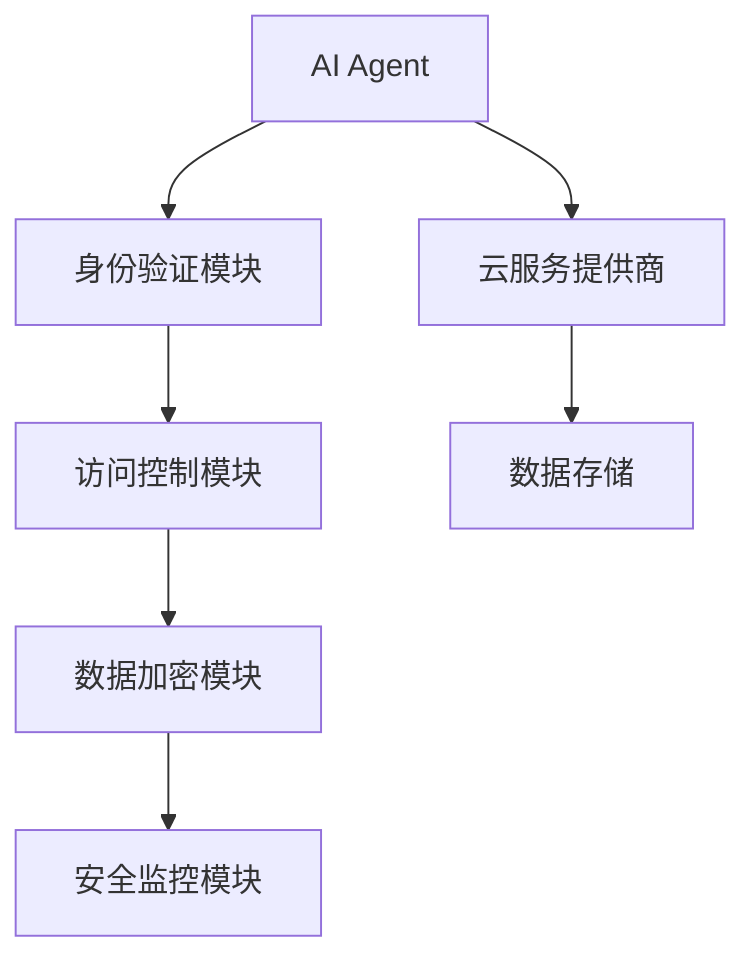
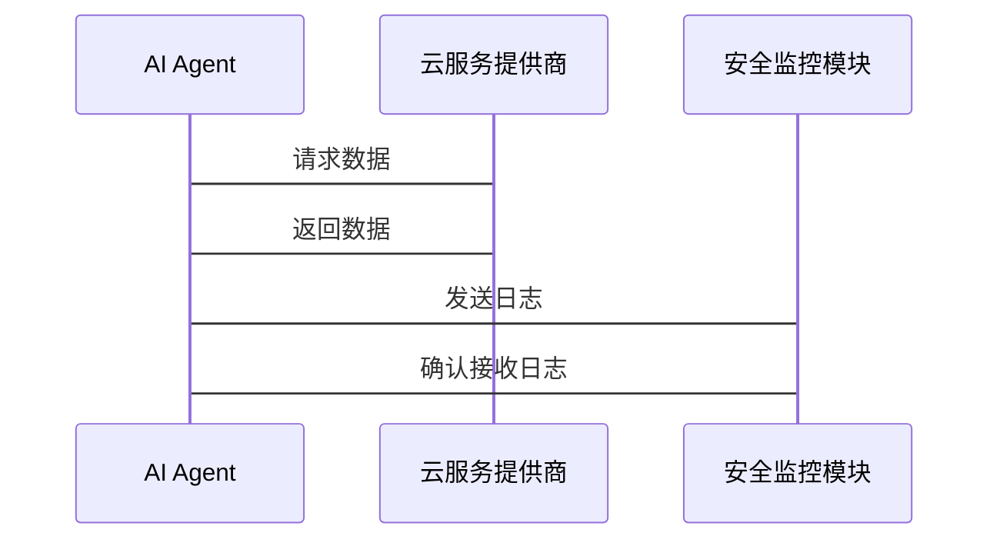

                 


# 企业AI Agent的多云环境安全策略

> 关键词：企业AI Agent，多云环境，安全策略，零信任原则，数据加密，身份认证

> 摘要：随着企业AI Agent在多云环境中的广泛应用，其安全问题日益凸显。本文将从AI Agent的基本概念、多云环境的特点出发，系统地分析多云环境下AI Agent面临的安全威胁，并提出一套完整的安全策略。通过结合实际案例和系统架构设计，本文详细阐述了如何在多云环境中构建安全、可靠的AI Agent运行机制。

---

# 第一部分：引言

## 第1章：企业AI Agent与多云环境安全概述

### 1.1 企业AI Agent的概念与特点

#### 1.1.1 AI Agent的基本定义
AI Agent（人工智能代理）是指能够感知环境、自主决策并执行任务的智能实体。它通常具备以下特点：
- **自主性**：能够在没有外部干预的情况下自主运行。
- **反应性**：能够感知环境并实时调整行为。
- **目标导向**：通过设定目标来驱动行动。
- **学习能力**：能够通过数据和经验不断优化自身性能。

#### 1.1.2 企业级AI Agent的核心特征
企业级AI Agent通常具备以下特征：
- **高可用性**：确保在复杂环境中稳定运行。
- **可扩展性**：能够根据业务需求动态调整资源。
- **智能化**：具备复杂问题的分析和决策能力。
- **安全性**：保护企业数据和系统的安全。

#### 1.1.3 多云环境下的AI Agent特点
在多云环境下，AI Agent的特点包括：
- **分布式部署**：AI Agent可以在多个云平台和边缘设备上运行。
- **资源弹性**：能够根据负载自动调整资源使用。
- **多租户支持**：支持多个用户或业务部门的独立运行。

### 1.2 多云环境的定义与挑战

#### 1.2.1 多云环境的定义
多云环境是指企业同时使用多个云服务提供商（如AWS、Azure、Google Cloud等）构建其IT基础设施的环境。这种部署方式能够提供更高的灵活性、可靠性和成本效益。

#### 1.2.2 多云环境的主要优势
- **灵活性**：企业可以根据业务需求选择最优的云服务。
- **冗余性**：通过多云部署降低单点故障风险。
- **成本优化**：可以在不同云提供商之间选择最经济的方案。

#### 1.2.3 多云环境的安全挑战
- **复杂的访问控制**：多云环境下，AI Agent需要在多个云平台之间进行交互，这增加了权限管理的复杂性。
- **数据孤岛**：数据分散在不同云平台，增加了数据管理和安全的风险。
- **合规性问题**：不同云平台可能有不同的数据隐私和合规要求。

### 1.3 企业AI Agent的多云安全问题

#### 1.3.1 多云环境下AI Agent的安全需求
- **数据保护**：确保AI Agent处理的数据在传输和存储过程中不被泄露。
- **身份验证**：确保AI Agent能够安全地与多个云服务进行交互。
- **权限管理**：严格控制AI Agent对云资源的访问权限。

#### 1.3.2 安全威胁对企业AI Agent的影响
- **数据泄露**：攻击者可能通过AI Agent获取敏感数据。
- **服务中断**：恶意攻击可能导致AI Agent无法正常运行。
- **信任破裂**：如果AI Agent被入侵，可能会影响企业与客户之间的信任关系。

#### 1.3.3 安全策略的核心目标
- **保护数据完整性**：确保AI Agent处理的数据准确无误。
- **确保系统可用性**：保证AI Agent在遭受攻击时仍能正常运行。
- **实现最小权限原则**：赋予AI Agent仅完成任务所需的最低权限。

---

## 第2章：多云环境下的AI Agent安全策略背景

### 2.1 企业AI Agent的多云部署现状

#### 2.1.1 多云部署的常见模式
- **混合云部署**：结合公有云、私有云和边缘计算的部署方式。
- **多云平台集成**：AI Agent同时使用多个云平台提供的服务。
- **分布式计算**：AI Agent的计算任务分布在多个云平台上。

#### 2.1.2 多云环境中的资源分配问题
- **资源分配不均**：不同云平台的资源使用效率不一致。
- **资源冗余**：为了保证冗余，可能需要在多个云平台上分配相同的资源。

#### 2.1.3 多云环境下的服务集成挑战
- **服务异构性**：不同云平台提供的服务接口和协议可能不一致。
- **服务发现**：在多云环境下，如何快速发现和调用所需的服务是一个挑战。

### 2.2 安全威胁分析

#### 2.2.1 多云环境中的主要安全威胁
- **网络攻击**：通过网络攻击手段破坏AI Agent的正常运行。
- **数据泄露**：非法获取AI Agent处理的敏感数据。
- **身份伪造**：假冒合法用户或服务对AI Agent发起攻击。

#### 2.2.2 AI Agent面临的典型攻击方式
- **注入攻击**：通过输入非法数据导致AI Agent执行恶意代码。
- **拒绝服务攻击（DoS）**：通过消耗资源使AI Agent无法正常服务。
- **中间人攻击（MITM）**：拦截并篡改AI Agent与云服务之间的通信。

#### 2.2.3 安全事件对企业的影响
- **经济损失**：数据泄露可能导致企业面临巨额罚款和赔偿。
- **声誉损失**：安全事件可能会影响企业的市场信誉。
- **业务中断**：服务中断可能导致企业无法正常运营。

### 2.3 安全策略的重要性

#### 2.3.1 安全策略对企业AI Agent的保护作用
- **防御网络攻击**：通过安全策略可以有效防止常见网络攻击。
- **保护数据隐私**：确保AI Agent处理的数据不会被未经授权的人员访问。
- **提升系统韧性**：通过安全策略可以增强系统的容灾能力。

#### 2.3.2 安全策略对业务连续性的保障
- **确保服务可用性**：通过安全策略可以减少服务中断的风险。
- **维护业务连续性**：在发生安全事件时，能够快速恢复业务。
- **降低合规风险**：符合相关法律法规和行业标准，避免合规风险。

#### 2.3.3 安全策略的合规性要求
- **遵守数据保护法规**：如GDPR、CCPA等。
- **符合行业标准**：如ISO 27001、NIST等。
- **满足企业内部政策**：符合企业的内部安全政策和规范。

---

## 第3章：多云环境下的AI Agent安全策略核心概念

### 3.1 安全原则概述

#### 3.1.1 最小权限原则
**最小权限原则**是指赋予AI Agent仅完成其任务所需的最低权限。这可以通过以下方式实现：
1. **基于角色的访问控制（RBAC）**：根据AI Agent的角色和职责分配权限。
2. **基于属性的访问控制（ABAC）**：根据AI Agent的属性（如位置、时间、用户身份等）动态调整权限。

#### 3.1.2 零信任原则
**零信任原则**是指不信任任何试图访问系统的人或物，即使在企业内部也是如此。在多云环境下，零信任原则可以通过以下方式实现：
1. **严格的认证和授权**：确保所有访问请求都经过严格的认证和授权。
2. **微分段**：将网络划分为多个小区域，每个区域都有独立的安全策略。

#### 3.1.3 可观测性原则
**可观测性原则**是指通过监控和日志分析，实时了解AI Agent的运行状态和安全事件。这可以通过以下方式实现：
1. **日志管理**：收集和分析AI Agent的日志，及时发现异常行为。
2. **实时监控**：使用监控工具实时查看AI Agent的运行状态。

---

### 3.2 安全原则的实现方法

#### 3.2.1 基于角色的访问控制（RBAC）
**RBAC**通过角色和权限的分配来控制用户的访问权限。例如，可以将AI Agent的角色设置为“数据分析角色”，并为其分配仅读取特定数据集的权限。

#### 3.2.2 基于上下文的动态授权
**基于上下文的动态授权**是指根据当前的环境和上下文动态调整AI Agent的权限。例如，当AI Agent在特定时间访问特定数据时，可以动态调整其权限。

#### 3.2.3 可观测性实现
**可观测性实现**可以通过以下步骤完成：
1. **日志收集**：在AI Agent和云平台之间部署日志收集工具，收集所有相关的日志信息。
2. **日志分析**：使用日志分析工具（如ELK Stack）对日志进行分析，识别异常行为。
3. **实时监控**：使用监控工具（如Prometheus）实时监控AI Agent的运行状态。

---

## 第4章：多云环境下的AI Agent安全威胁分析

### 4.1 多云环境中的主要安全威胁
在多云环境中，AI Agent可能面临以下主要安全威胁：
1. **数据泄露**：AI Agent处理的敏感数据可能被泄露。
2. **身份伪造**：攻击者可能假冒合法用户对AI Agent发起攻击。
3. **拒绝服务攻击（DoS）**：攻击者通过消耗资源使AI Agent无法正常运行。

### 4.2 安全威胁的应对策略
1. **数据加密**：对AI Agent处理的数据进行加密，防止数据泄露。
2. **身份认证**：使用多因素认证（MFA）确保身份的真实性。
3. **流量监控**：通过流量分析检测异常行为，防止DoS攻击。

---

## 第5章：多云环境下的AI Agent安全技术实现

### 5.1 数据加密技术
**数据加密技术**可以有效防止数据在传输和存储过程中被泄露。常用的数据加密方法包括：
1. **对称加密**：如AES算法，适用于大量数据的加密。
2. **非对称加密**：如RSA算法，适用于数字签名和加密通信。

### 5.2 身份认证技术
**身份认证技术**可以通过多因素认证（MFA）确保AI Agent的身份真实性。例如，可以结合用户名、密码和短信验证码进行认证。

### 5.3 访问控制技术
**访问控制技术**可以通过基于角色的访问控制（RBAC）和基于属性的访问控制（ABAC）实现。例如，可以设置AI Agent只能访问特定的数据资源。

### 5.4 安全监控技术
**安全监控技术**可以通过日志分析和实时监控工具（如SIEM）检测异常行为。例如，当检测到AI Agent的异常行为时，可以立即采取措施阻止攻击。

---

## 第6章：多云环境下的AI Agent安全架构设计

### 6.1 系统功能设计
AI Agent的安全架构设计需要考虑以下功能：
1. **身份验证模块**：确保AI Agent的身份真实性。
2. **访问控制模块**：限制AI Agent对云资源的访问权限。
3. **数据加密模块**：对敏感数据进行加密处理。
4. **安全监控模块**：实时监控AI Agent的运行状态。

### 6.2 系统架构设计
以下是多云环境下AI Agent的安全架构设计图：



### 6.3 系统接口设计
以下是AI Agent与云服务提供商之间的接口设计：



---

## 第7章：多云环境下的AI Agent安全策略实战

### 7.1 环境安装
以下是多云环境下AI Agent的安装步骤：
1. **选择云服务提供商**：选择多个云服务提供商（如AWS、Azure、Google Cloud）。
2. **配置身份验证**：在每个云平台上配置多因素认证（MFA）。
3. **部署安全监控工具**：部署日志分析工具（如ELK Stack）和实时监控工具（如Prometheus）。

### 7.2 核心代码实现
以下是AI Agent的核心代码实现：

```python
import logging
from cryptography.hazmat.primitives.asymmetric import padding
from cryptography.hazmat.primitives import hashes

# 数据加密模块
def encrypt_data(data):
    # 使用RSA加密
    private_key = ...  # 私钥
    cipher = padding.RSAPKCS1v1_5Padding()
    encrypted = private_key.encrypt(data, cipher)
    return encrypted

# 身份验证模块
def authenticate_agent(agent_id, password):
    # 使用多因素认证
    token = generate_token(agent_id, password)
    return verify_token(token)

# 访问控制模块
def authorize_access(agent_id, resource):
    # 基于角色的访问控制
    role = get_role(agent_id)
    if has_permission(role, resource):
        return True
    else:
        return False

# 安全监控模块
def log_activity(agent_id, action):
    logging.info(f"Agent {agent_id} performed action {action}")
```

### 7.3 案例分析
以下是AI Agent在多云环境下的安全策略案例分析：

假设一家企业使用AWS和Google Cloud部署AI Agent。为了保护AI Agent的安全，企业采取了以下措施：
1. **数据加密**：对所有敏感数据使用AES算法进行加密。
2. **身份认证**：使用多因素认证确保AI Agent的身份真实性。
3. **访问控制**：基于角色的访问控制确保AI Agent仅能访问其任务所需的资源。
4. **安全监控**：使用ELK Stack收集和分析日志，实时监控AI Agent的运行状态。

### 7.4 项目总结
通过以上步骤，企业成功构建了一个安全、可靠的AI Agent多云环境。以下是总结：
1. **数据加密**：确保了数据的安全性。
2. **身份认证**：防止了身份伪造攻击。
3. **访问控制**：限制了AI Agent的权限，降低了安全风险。
4. **安全监控**：及时发现并应对安全事件。

---

## 第8章：多云环境下的AI Agent安全策略最佳实践

### 8.1 安全策略建议
1. **最小权限原则**：确保AI Agent仅获得完成任务所需的最低权限。
2. **零信任原则**：不信任任何试图访问系统的人或物。
3. **可观测性原则**：通过日志和监控工具实时了解AI Agent的运行状态。

### 8.2 注意事项
1. **定期更新安全策略**：随着技术的发展和威胁的演变，需要定期更新安全策略。
2. **员工培训**：确保相关人员了解安全策略的重要性，并能够正确实施。
3. **第三方服务评估**：对第三方云服务提供商进行严格的评估，确保其符合安全要求。

### 8.3 拓展阅读
1. **《云安全联盟（CSA）指南》**：了解云安全的最佳实践。
2. **《零信任架构》**：深入理解零信任原则的应用。
3. **《数据加密技术》**：掌握常用的数据加密算法和实现方法。

---

## 第9章：总结

### 9.1 总结回顾
本文详细阐述了多云环境下AI Agent的安全策略，包括安全原则、威胁分析、技术实现和最佳实践等方面。通过理论分析和实际案例，展示了如何在多云环境下构建安全、可靠的AI Agent运行机制。

### 9.2 未来展望
随着AI技术的不断发展，AI Agent的安全问题将变得更加复杂。未来的研究方向包括：
1. **AI驱动的安全威胁检测**：利用AI技术实时检测和应对安全威胁。
2. **自适应安全策略**：根据环境变化动态调整安全策略。
3. **跨云平台的安全协同**：实现多云环境下不同云平台之间的安全协同。

---

## 作者信息

**作者：AI天才研究院/AI Genius Institute & 禅与计算机程序设计艺术 /Zen And The Art of Computer Programming**

---

**完**

