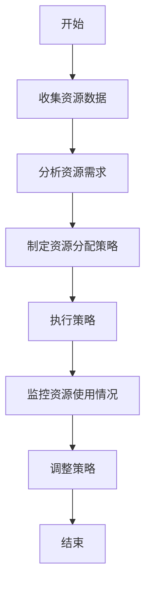
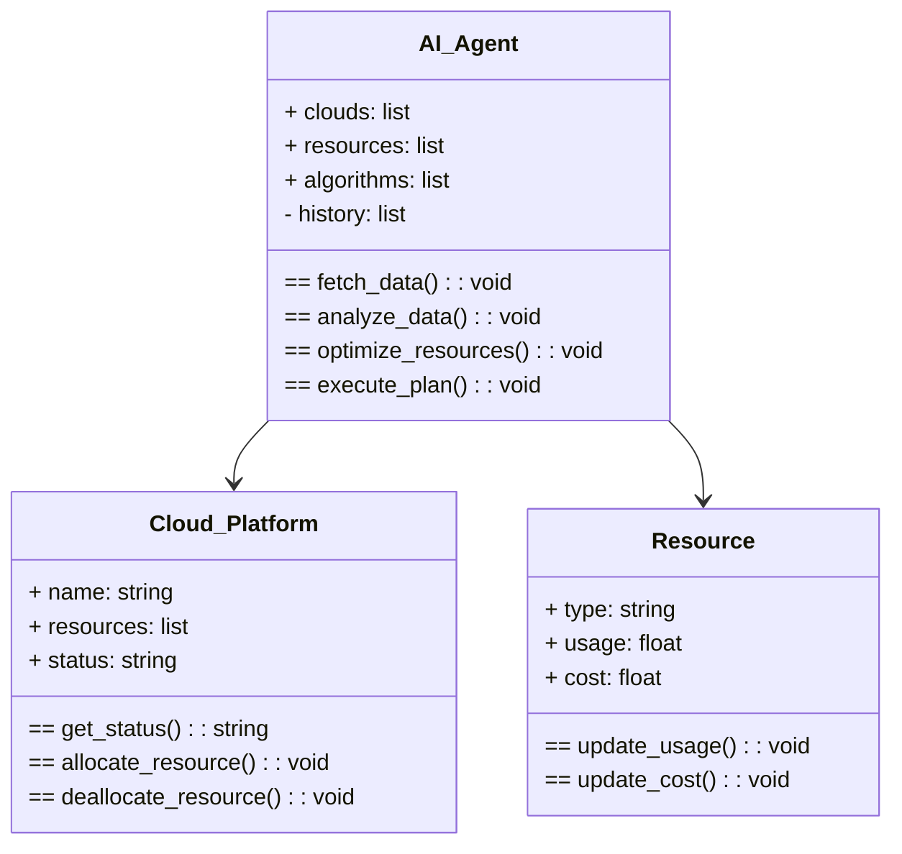
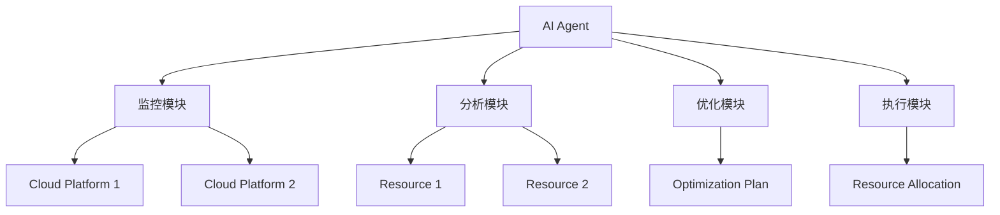

                 


# 企业AI Agent的多云环境管理策略

## 关键词：企业AI Agent、多云环境、资源管理、算法原理、系统架构

## 摘要

随着云计算的快速发展，多云环境已成为企业 IT 架构的重要组成部分。企业 AI Agent 在多云环境中的管理策略，通过智能化的资源调度和优化，帮助企业实现高效、可靠、安全的云资源管理。本文将从背景、概念、算法、系统设计、实战到总结，全面阐述企业 AI Agent 在多云环境管理中的策略和实践。

---

# 目录

1. 企业AI Agent与多云环境管理概述
   1.1 问题背景与描述
   1.2 问题解决与边界
2. AI Agent的核心概念与原理
   2.1 核心概念
   2.2 核心概念对比
   2.3 算法原理
3. 系统分析与架构设计
   3.1 问题场景介绍
   3.2 系统功能设计
   3.3 系统架构设计
4. 项目实战
   4.1 环境安装
   4.2 系统核心实现
   4.3 实际案例分析
5. 总结与展望
   5.1 最佳实践
   5.2 项目小结
   5.3 拓展阅读

---

## 第1章: 企业AI Agent与多云环境管理概述

### 1.1 问题背景与描述

随着企业数字化转型的推进，云计算已成为企业 IT 架构的核心。然而，单一云服务提供商的服务可能无法满足企业的所有需求，多云环境应运而生。多云环境通过整合多个云平台资源，为企业提供更高的灵活性、可靠性和成本效益。然而，多云环境的复杂性也带来了管理上的挑战，包括资源分配不均、成本高昂、安全风险等问题。AI Agent作为一种智能化的管理工具，能够通过学习和优化算法，有效解决多云环境中的这些问题。

### 1.2 问题解决与边界

AI Agent 在多云环境中的应用，主要解决以下问题：
1. **资源分配不均**：AI Agent 可以根据实时负载和资源需求，动态优化资源分配，避免资源浪费和性能瓶颈。
2. **成本高昂**：通过智能成本预测和预算优化，AI Agent 帮助企业在多云环境中实现成本最小化。
3. **安全性与合规性**：AI Agent 可以监控和管理多云环境中的安全风险，确保符合企业安全策略和合规要求。

AI Agent 的边界包括：仅限于多云环境的资源管理，不涉及单云环境或其他类型的 IT 资源管理。

---

## 第2章: AI Agent的核心概念与原理

### 2.1 核心概念

1. **AI Agent**：一种能够感知环境、做出决策并执行操作的智能代理。在多云环境中，AI Agent 可以通过机器学习算法，实时监控资源使用情况，并根据预设策略进行资源调度。
2. **多云环境**：指企业同时使用多个云服务提供商（如 AWS、Azure、Google Cloud 等）构建 IT 架构。多云环境能够提供更高的灵活性和容错能力，但也增加了管理复杂性。
3. **资源调度算法**：AI Agent 使用的算法，用于在多云环境中优化资源分配。常见的算法包括遗传算法、模拟退火、强化学习等。

### 2.2 核心概念对比

以下是 AI Agent 与传统代理、多云环境与单云环境的对比：

| 对比维度       | AI Agent                              | 传统代理                              | 多云环境                              | 单云环境                              |
|----------------|---------------------------------------|---------------------------------------|---------------------------------------|---------------------------------------|
| 智能性         | 高，基于机器学习和深度学习            | 低，基于规则和脚本                   | 高，依赖多个云平台的协同                | 低，依赖单一云平台                    |
| 管理范围       | 跨多云平台                            | 单一云平台或系统                      | 多个云平台                            | 单一云平台                            |
| 可扩展性       | 高，能够处理复杂的多云环境             | 中，受限于单一云平台                  | 高，依赖多个云平台的扩展能力          | 低，受限于单一云平台                  |
| 自适应性       | 高，能够动态调整策略                   | 低，策略固定                          | 高，依赖多云环境的动态调整            | 低，策略固定                          |

### 2.3 算法原理

AI Agent 的资源调度算法通常基于以下步骤：

1. **数据收集**：从多云环境中收集资源使用情况（如 CPU 使用率、内存占用、网络流量等）。
2. **数据分析**：通过机器学习模型，分析数据并预测未来的资源需求。
3. **策略制定**：根据预测结果，制定资源分配策略，优化资源利用率和成本。
4. **执行与监控**：执行资源调度策略，并实时监控资源使用情况，动态调整策略。

以下是一个简单的资源调度算法示例：



算法的数学模型可以表示为：

$$ \text{目标函数：} \min \sum_{i} c_i x_i $$
$$ \text{约束条件：} \sum_{i} x_i \geq D $$

其中，\( c_i \) 是资源 \( i \) 的成本，\( x_i \) 是资源 \( i \) 的分配量，\( D \) 是总需求。

---

## 第3章: 系统分析与架构设计

### 3.1 问题场景介绍

在多云环境中，企业需要管理多个云平台的资源，包括计算资源、存储资源、网络资源等。AI Agent 需要实时监控这些资源的使用情况，并根据需求动态调整资源分配。例如，当某个云平台的负载过高时，AI Agent 可以将部分任务迁移到其他云平台，以避免性能瓶颈。

### 3.2 系统功能设计

以下是系统功能设计的领域模型：



### 3.3 系统架构设计

以下是系统的架构设计：



---

## 第4章: 项目实战

### 4.1 环境安装

为了运行 AI Agent，需要以下环境：

1. Python 3.8+
2. 安装必要的库：numpy、pandas、scikit-learn、matplotlib

### 4.2 系统核心实现

以下是资源调度算法的核心代码：

```python
def fetch_data():
    # 获取多云环境数据
    pass

def analyze_data(data):
    # 数据分析和预测
    pass

def optimize_resources(data):
    # 资源优化算法
    pass

def execute_plan(plan):
    # 执行资源分配计划
    pass

def main():
    data = fetch_data()
    plan = optimize_resources(data)
    execute_plan(plan)

if __name__ == "__main__":
    main()
```

### 4.3 实际案例分析

假设某企业使用 AWS、Azure 和 Google Cloud 三个云平台。AI Agent 需要根据实时负载动态调整资源分配。通过分析历史数据，AI Agent 预测未来资源需求，并制定最优的资源分配策略。

---

## 第5章: 总结与展望

### 5.1 最佳实践

1. **数据驱动**：AI Agent 的决策应基于实时数据，确保资源调度的准确性。
2. **持续优化**：定期更新机器学习模型，以适应多云环境的变化。
3. **安全性**：确保 AI Agent 的决策不会引入安全风险，符合企业安全策略。

### 5.2 项目小结

本文详细探讨了企业 AI Agent 在多云环境管理中的策略和实践。通过智能化的资源调度算法和系统架构设计，AI Agent 能够有效解决多云环境中的资源分配、成本优化和安全性问题。

### 5.3 拓展阅读

1.《Multi-cloud Resource Orchestration Using AI Agents》
2.《Cloud Computing and Big Data: Opportunities and Challenges》
3.《Machine Learning for Cloud Resource Management》

---

## 作者

作者：AI天才研究院/AI Genius Institute & 禅与计算机程序设计艺术 /Zen And The Art of Computer Programming

---

希望这篇文章能够为企业在多云环境中的 AI Agent 管理提供有价值的参考和指导。

