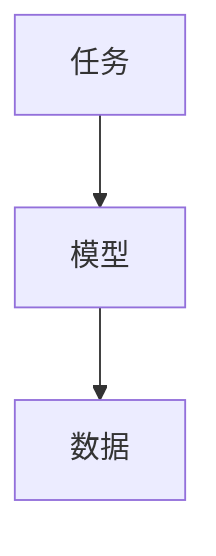
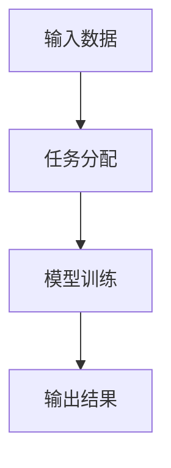
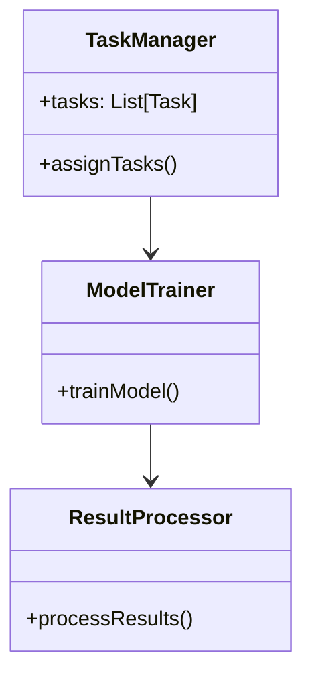
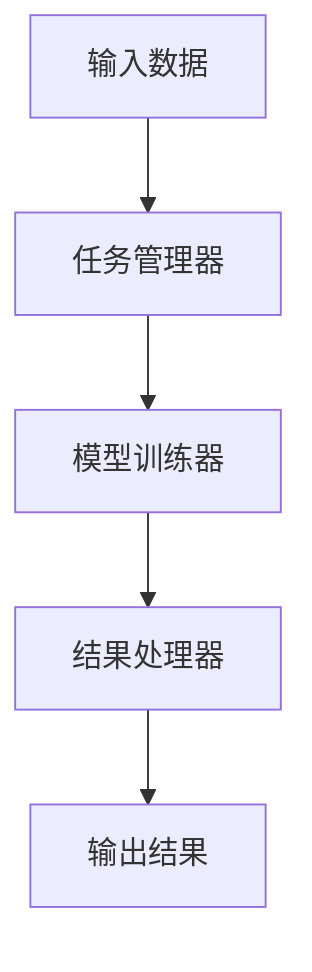
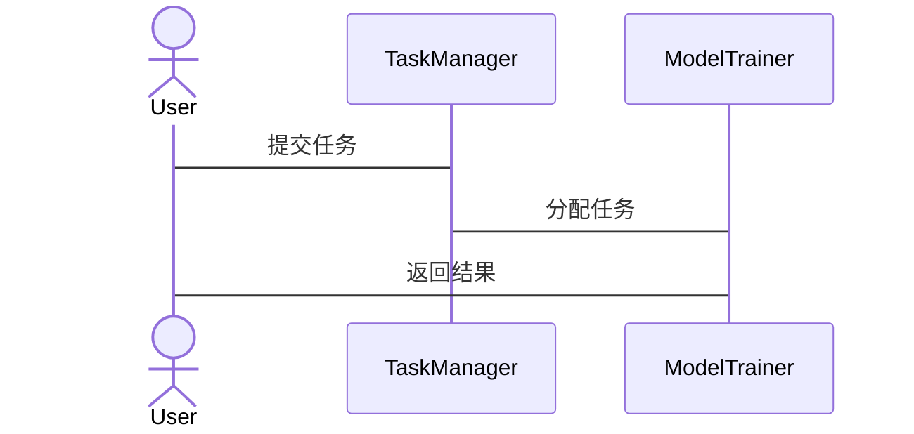

                 


# 企业AI Agent的多任务学习框架：提升模型通用性与迁移能力

> 关键词：企业AI Agent，多任务学习，模型通用性，迁移能力，深度学习，任务分配，模型共享

> 摘要：本文详细探讨了企业AI Agent的多任务学习框架，分析了其在提升模型通用性和迁移能力方面的重要作用。通过系统化的结构设计和算法优化，展示了如何在实际企业场景中应用多任务学习框架，以实现更高效的模型训练和更高的任务执行能力。

---

# 第一部分: 企业AI Agent的多任务学习框架概述

## 第1章: 多任务学习的基本概念与背景

### 1.1 问题背景

#### 1.1.1 企业AI Agent的核心需求
企业AI Agent（Artificial Intelligence Agent）是指在企业环境中执行多种任务的智能实体，通常需要处理复杂的业务逻辑和多样化的需求。为了提高效率和降低成本，企业AI Agent需要具备处理多种任务的能力，例如自然语言处理、数据分析、决策支持等。

#### 1.1.2 单任务学习的局限性
传统的单任务学习（Single-Task Learning, STL）方法在处理单一任务时表现出色，但在面对多种任务时，模型的泛化能力和迁移能力较弱。例如，一个模型经过训练后只能完成特定的任务，无法直接应用于其他任务，导致企业在部署AI Agent时需要反复训练不同的模型，增加了开发和维护成本。

#### 1.1.3 多任务学习的提出与意义
多任务学习（Multi-Task Learning, MTL）是一种机器学习方法，旨在通过同时学习多个任务来提高模型的通用性和迁移能力。MTL的核心思想是利用任务之间的共享特征，避免了传统单任务学习中对每个任务单独建模的高成本，从而提高了模型的效率和性能。

### 1.2 多任务学习的定义与特点

#### 1.2.1 多任务学习的定义
多任务学习是指在同一个模型中同时学习多个任务，使得模型能够同时完成多个相关或不相关的任务。通过共享模型参数，多任务学习可以利用任务之间的相似性，提高模型的泛化能力和适应性。

#### 1.2.2 多任务学习的核心特点
- **共享参数**：多个任务共享部分模型参数，降低模型的复杂性和训练成本。
- **任务关联性**：任务之间存在一定的关联性，可以通过共享特征进行优化。
- **联合训练**：模型在训练过程中同时优化多个任务的损失函数，实现任务间的相互促进。

#### 1.2.3 多任务学习与单任务学习的对比
| 对比维度 | 单任务学习 | 多任务学习 |
|----------|------------|------------|
| 模型复杂性 | 单一任务优化，模型简单 | 多任务共享，模型复杂 |
| 训练成本 | 每个任务单独训练 | 一次性训练多个任务 |
| 泛化能力 | 任务特化，泛化能力弱 | 任务通用化，泛化能力强 |

### 1.3 企业AI Agent的多任务学习框架

#### 1.3.1 企业AI Agent的定义
企业AI Agent是一种能够在企业环境中执行多种任务的智能实体，通常结合了自然语言处理、计算机视觉、机器学习等多种技术，能够为企业提供智能化的解决方案。

#### 1.3.2 多任务学习在企业AI Agent中的应用
在企业AI Agent中，多任务学习框架可以用于同时处理多种任务，例如：
- 自然语言理解与生成（NLU & NLG）
- 数据分析与预测
- 个性化推荐
- 人机交互

#### 1.3.3 框架的目标与优势
- **目标**：通过多任务学习框架，提高企业AI Agent的通用性和迁移能力，降低模型的训练成本，提升任务执行效率。
- **优势**：
  - 提高模型的泛化能力
  - 减少模型部署和维护的成本
  - 提升企业的智能化水平

---

## 第2章: 多任务学习的核心概念与联系

### 2.1 核心概念原理

#### 2.1.1 任务之间的关系
多任务学习的核心在于任务之间的关系。任务可以分为相关任务和不相关任务，相关任务之间存在共享特征，而不相关任务则没有明显的关联性。

#### 2.1.2 任务分配策略
任务分配策略是多任务学习中的一个重要环节，决定了任务如何分配给模型的不同部分。常见的任务分配策略包括：
- **随机分配**：随机分配任务到模型的不同部分。
- **层次化分配**：根据任务的层次关系进行分配。
- **基于特征的分配**：根据任务的特征相似性进行分配。

#### 2.1.3 模型共享机制
模型共享机制是多任务学习中的关键部分，决定了任务之间的共享方式。常见的模型共享机制包括：
- **参数共享**：共享模型的某些参数。
- **模块共享**：共享模型的某些模块。
- **特征共享**：共享模型的某些特征。

### 2.2 任务属性对比表

| 任务类型 | 输入 | 输出 | 目标 |
|----------|------|------|------|
| 任务1    | 文本数据 | 文本生成 | 自然语言生成 |
| 任务2    | 结构化数据 | 预测结果 | 数据分析与预测 |

### 2.3 ER实体关系图



---

## 第3章: 多任务学习的算法原理

### 3.1 算法流程图



### 3.2 数学模型与公式

#### 3.2.1 损失函数
$$L = \sum_{i=1}^{n} \lambda_i L_i$$
其中，$\lambda_i$ 是任务i的权重，$L_i$ 是任务i的损失函数。

#### 3.2.2 参数共享
$$\theta = \{ \theta_1, \theta_2, ..., \theta_n \}$$
其中，$\theta_i$ 是任务i的模型参数。

---

## 第4章: 企业AI Agent的系统架构设计

### 4.1 问题场景介绍

企业AI Agent需要在复杂的企业环境中执行多种任务，例如：
- 自然语言处理
- 数据分析与预测
- 个性化推荐
- 人机交互

### 4.2 系统功能设计

#### 4.2.1 领域模型



#### 4.2.2 系统架构设计



### 4.3 系统接口设计

- **输入接口**：接收多种类型的数据输入，例如文本、结构化数据等。
- **输出接口**：输出任务执行结果，例如生成文本、预测结果等。
- **任务管理接口**：管理任务的分配和执行。

### 4.4 系统交互设计



---

## 第5章: 项目实战

### 5.1 环境安装

```bash
pip install numpy
pip install tensorflow
pip install matplotlib
```

### 5.2 核心代码实现

```python
import numpy as np
import tensorflow as tf

# 定义任务
class Task:
    def __init__(self, name, input, output):
        self.name = name
        self.input = input
        self.output = output

# 多任务学习模型
class MultiTaskModel:
    def __init__(self, tasks):
        self.tasks = tasks
        self.model = self.build_model()

    def build_model(self):
        inputs = tf.keras.Input(shape=(input_dim,))
        x = tf.keras.layers.Dense(64, activation='relu')(inputs)
        outputs = {}
        for task in self.tasks:
            outputs[task.name] = tf.keras.layers.Dense(1, name=task.name)(x)
        return tf.keras.Model(inputs=inputs, outputs=outputs)

    def train(self, data, epochs=100):
        self.model.compile(optimizer='adam', loss={name: 'binary_crossentropy' for name in self.model.output_names})
        self.model.fit(data, epochs=epochs)

# 使用示例
task1 = Task('Task1', input_dim=64, output_dim=1)
task2 = Task('Task2', input_dim=64, output_dim=1)
model = MultiTaskModel([task1, task2])
model.train(data)
```

### 5.3 实际案例分析

假设我们有一个企业AI Agent需要同时处理自然语言理解与生成任务，我们可以使用上述代码实现多任务学习模型。首先定义两个任务，然后构建模型并进行训练。

---

## 第6章: 最佳实践

### 6.1 小结

通过本文的介绍，我们了解了企业AI Agent的多任务学习框架的基本概念、核心原理和实际应用。多任务学习框架能够有效提升模型的通用性和迁移能力，降低企业的开发和维护成本。

### 6.2 注意事项

- 在实际应用中，需要根据具体任务需求选择合适的多任务学习框架。
- 多任务学习可能会增加模型的复杂性，需要注意模型的训练和调优。

### 6.3 未来发展方向

未来，多任务学习在企业AI Agent中的应用将会更加广泛，例如：
- 更复杂的任务组合与分配策略
- 更高效的模型共享机制
- 更智能的任务动态调整能力

---

# 作者：AI天才研究院/AI Genius Institute & 禅与计算机程序设计艺术 /Zen And The Art of Computer Programming

