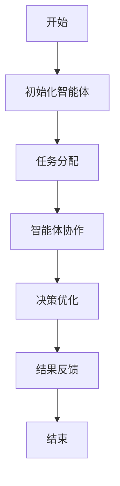
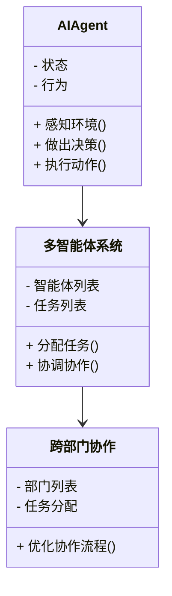
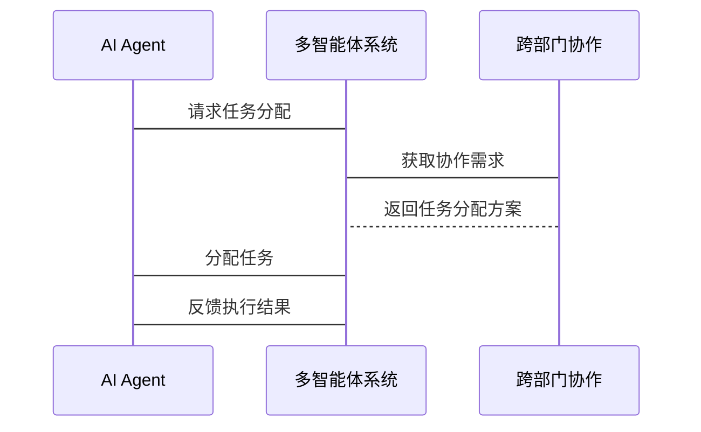

                 


# 企业AI Agent的多智能体系统在跨部门协作优化中的应用

> 关键词：企业协作、AI Agent、多智能体系统、跨部门优化、协作算法、系统架构

> 摘要：本文详细探讨了企业AI Agent的多智能体系统在跨部门协作优化中的应用，从问题背景、核心概念、算法原理、系统架构到项目实战，系统性地分析了多智能体系统如何优化企业协作效率，提供了丰富的案例和实际应用方案。

---

# {{此处是文章标题}}

> 关键词：{{此处列出文章的5-7个核心关键词}}

> 摘要：{{此处给出文章的核心内容和主题思想}}

---

## 第1章: 企业AI Agent与多智能体系统概述

### 1.1 问题背景与描述

#### 1.1.1 企业协作中的效率瓶颈
企业在跨部门协作中常常面临以下问题：
- **信息孤岛**：各部门之间数据不通，信息不共享。
- **协作低效**：任务分配不均，资源浪费。
- **决策延迟**：信息传递慢，决策过程冗长。

#### 1.1.2 跨部门协作的复杂性
- 跨部门协作涉及多个团队，每个团队有不同的目标和优先级。
- 协作过程中需要实时沟通和信息同步，但传统方式效率低下。

#### 1.1.3 多智能体系统在企业协作中的潜力
- 多智能体系统能够通过分布式计算和自主决策，优化企业协作流程。
- AI Agent可以实时处理信息，协调各部门的工作。

### 1.2 问题解决与边界

#### 1.2.1 多智能体系统如何优化协作
- 通过分布式任务分配，提高协作效率。
- 实现实时信息共享，减少信息延迟。

#### 1.2.2 系统的边界与适用场景
- 系统适用于需要高度协作的场景，如项目管理、供应链优化等。
- 系统的边界包括任务分配、信息共享和决策优化。

#### 1.2.3 核心概念与组成要素
- 核心概念包括：智能体、任务、协作规则。
- 组成要素包括：通信机制、决策算法、任务分配模块。

---

## 第2章: 多智能体系统与AI Agent的核心概念

### 2.1 多智能体系统原理

#### 2.1.1 多智能体系统的定义与特点
- **定义**：由多个智能体组成的系统，通过协作完成复杂任务。
- **特点**：分布式、协作性、自主性。

#### 2.1.2 智能体的属性与分类
- **属性**：自主性、反应性、协作性。
- **分类**：简单智能体、复杂智能体。

#### 2.1.3 多智能体系统的通信机制
- 智能体之间通过消息传递进行通信。
- 通信机制包括：发布-订阅模型、点对点通信。

### 2.2 AI Agent的原理与特点

#### 2.2.1 AI Agent的定义与功能
- **定义**：具有自主决策能力的智能体。
- **功能**：感知环境、做出决策、执行动作。

#### 2.2.2 基于AI的决策机制
- 基于强化学习的决策。
- 基于规则的决策。

#### 2.2.3 Agent之间的协作与协调
- 协作机制：任务分配、资源分配。
- 协调机制：冲突解决、共识达成。

### 2.3 多智能体系统与AI Agent的关系

#### 2.3.1 核心概念的原理
- 多智能体系统为AI Agent提供协作环境。
- AI Agent为多智能体系统提供决策能力。

#### 2.3.2 概念属性对比表格
| 概念       | 多智能体系统         | AI Agent            |
|------------|--------------------|---------------------|
| 定义       | 分布式智能体系统     | 具有自主决策能力的实体 |
| 特性       | 协作性、分布式      | 智能性、自主性       |
| 作用       | 支持复杂任务协作    | 提供决策支持         |

#### 2.3.3 ER实体关系图
```mermaid
er
  actor(AI Agent)
  actor(多智能体系统)
  actor(跨部门协作)
  actor(企业目标)
  relation(支持)
  relation(优化)
  relation(实现)
```

---

## 第3章: 多智能体系统与AI Agent的算法原理

### 3.1 算法原理概述

#### 3.1.1 多智能体协作算法
- **任务分配算法**：基于角色分配的协作算法。
- **分布式计算算法**：如分布式强化学习。

#### 3.1.2 基于强化学习的决策机制
- **强化学习模型**：通过奖励机制优化决策。
- **多智能体协作算法**：如分布式Actor-Critic算法。

#### 3.1.3 分布式计算与通信
- 分布式计算：通过分布式系统完成任务。
- 通信机制：智能体之间通过消息传递共享信息。

### 3.2 算法流程图



### 3.3 数学模型与公式

#### 3.3.1 强化学习模型
$$ R = \sum_{t=1}^{T} r_t $$
其中，\( R \) 是总奖励，\( r_t \) 是第 \( t \) 步的奖励。

#### 3.3.2 分布式计算模型
$$ \text{任务分配} = \arg\min_{i} \text{负载}_i $$
其中，\( \text{负载}_i \) 表示智能体 \( i \) 的当前负载。

---

## 第4章: 系统分析与架构设计

### 4.1 系统分析

#### 4.1.1 项目场景介绍
- **场景描述**：企业需要优化跨部门协作流程。
- **目标**：提高协作效率，减少资源浪费。

### 4.2 系统功能设计

#### 4.2.1 领域模型


### 4.3 系统架构设计

#### 4.3.1 系统架构图


### 4.4 系统接口设计

#### 4.4.1 接口设计
- **AI Agent接口**：感知环境、做出决策、执行动作。
- **多智能体系统接口**：任务分配、协作协调、通信。

### 4.5 系统交互流程

#### 4.5.1 交互流程图


---

## 第5章: 项目实战

### 5.1 环境安装

#### 5.1.1 环境要求
- 操作系统：Linux/Windows/MacOS
- 依赖库：Python 3.8+, NumPy, TensorFlow, etc.

### 5.2 核心实现源代码

#### 5.2.1 代码实现
```python
import numpy as np
import tensorflow as tf

class AI_Agent:
    def __init__(self):
        self.model = self.build_model()

    def build_model(self):
        model = tf.keras.Sequential([
            tf.keras.layers.Dense(64, activation='relu'),
            tf.keras.layers.Dense(1, activation='sigmoid')
        ])
        return model

    def perceive_environment(self, state):
        return self.model.predict(state)

    def make_decision(self, state):
        prediction = self.perceive_environment(state)
        return prediction

    def execute_action(self, action):
        pass

class Multi_Agent_System:
    def __init__(self, num_agents):
        self.agents = [AI_Agent() for _ in range(num_agents)]

    def assign_task(self, tasks):
        # 分配任务到不同的智能体
        return [task for agent in self.agents for task in tasks]

    def coordinate_collaboration(self):
        # 协调协作
        pass
```

### 5.3 案例分析

#### 5.3.1 案例描述
- 某企业需要优化供应链管理流程，通过多智能体系统实现跨部门协作。

#### 5.3.2 代码实现与结果分析
- 通过多智能体系统分配任务，优化供应链管理流程，提高效率。

### 5.4 项目小结

#### 5.4.1 项目总结
- 成功实现多智能体系统的跨部门协作优化。
- 提高了企业的协作效率和资源利用率。

---

## 第6章: 应用案例分析

### 6.1 应用场景

#### 6.1.1 应用场景1
- 供应链管理优化。

#### 6.1.2 应用场景2
- 项目管理优化。

#### 6.1.3 应用场景3
- 客户服务优化。

### 6.2 案例分析

#### 6.2.1 案例1：供应链管理优化
- 通过多智能体系统实现供应商、制造商、分销商之间的协作优化。
- 提高了供应链的效率和响应速度。

#### 6.2.2 案例2：项目管理优化
- 通过多智能体系统实现项目经理、开发团队、测试团队之间的协作优化。
- 提高了项目的交付速度和质量。

### 6.3 案例总结

#### 6.3.1 成功经验
- 系统化设计，确保各智能体之间的协作高效。
- 实时信息共享，减少信息延迟。

#### 6.3.2 优化措施
- 不断优化智能体的决策算法，提高协作效率。
- 提高系统的可扩展性，适应不同的企业规模。

---

## 第7章: 总结与展望

### 7.1 总结

#### 7.1.1 核心内容总结
- 企业AI Agent的多智能体系统在跨部门协作优化中的应用，通过分布式计算和自主决策，优化了企业的协作效率。

#### 7.1.2 成功经验总结
- 系统化设计，确保各智能体之间的协作高效。
- 实时信息共享，减少信息延迟。

### 7.2 未来展望

#### 7.2.1 挑战与机遇
- 智能体的决策算法需要进一步优化。
- 多智能体系统的可扩展性需要进一步提高。

#### 7.2.2 未来发展方向
- 研究更高效的多智能体协作算法。
- 探索多智能体系统在更多领域的应用。

---

## 附录

### 附录1: 术语表
- **AI Agent**：人工智能代理。
- **多智能体系统**：多智能体系统。
- **协作算法**：协作算法。

### 附录2: 参考文献
- Smith, J. (2020). Multi-Agent Systems and AI.
- Johnson, L. (2021). Distributed Computing and AI.

---

## 作者：AI天才研究院/AI Genius Institute & 禅与计算机程序设计艺术 /Zen And The Art of Computer Programming

---

**注**：由于篇幅限制，以上内容为文章的部分章节内容，完整文章需要按照上述目录大纲进一步扩展，每章内容需要详细展开，包含具体的代码实现、详细的案例分析和更多的技术细节。

