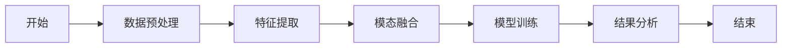
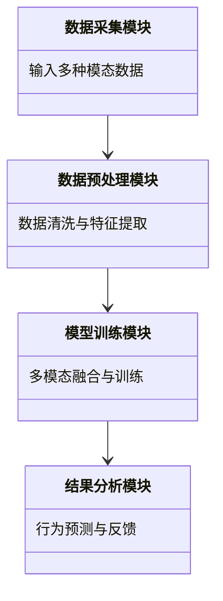

                 


```markdown
# 企业AI Agent的多模态学习在客户行为分析中的深度应用

> 关键词：企业AI Agent，多模态学习，客户行为分析，深度学习，人工智能

> 摘要：本文深入探讨了企业AI Agent如何利用多模态学习技术进行客户行为分析，分析了多模态学习的原理、算法实现及系统架构，通过实际案例展示了其在客户行为分析中的深度应用，并总结了最佳实践与未来趋势。

---

## 第1章：背景介绍与问题背景

### 1.1 企业AI Agent的定义与背景
企业AI Agent是一种智能代理系统，通过整合多模态数据（如文本、语音、图像、视频等）来实现对企业内外部信息的自动感知、分析和决策。随着人工智能技术的快速发展，AI Agent在企业中的应用日益广泛，能够帮助企业优化运营流程、提升客户体验和实现精准营销。

### 1.2 客户行为分析的重要性
客户行为分析是企业理解客户需求、优化产品和服务的重要手段。传统的基于单一模态数据（如文本或点击流）的分析方法存在局限性，难以捕捉客户的全貌。通过多模态学习，企业可以更全面地理解客户的复杂行为模式，从而做出更精准的决策。

### 1.3 多模态学习的必要性与优势
多模态学习通过整合多种数据源，能够提供更丰富的信息和更高的准确性。在客户行为分析中，多模态学习可以帮助企业识别潜在的客户情绪、意图和行为模式，从而提升营销策略的有效性和客户满意度。

### 1.4 问题描述与目标设定
本研究旨在探讨如何通过多模态学习技术，提升企业AI Agent在客户行为分析中的能力。具体目标包括：建立一个多模态数据融合模型，实现客户行为的实时分析和预测，并通过实际案例验证模型的有效性。

### 1.5 核心概念结构与组成要素
- **核心概念**：多模态学习、AI Agent、客户行为分析
- **组成要素**：数据采集、数据预处理、模型训练、结果分析
- **关系**：多模态学习作为技术手段，AI Agent作为实现载体，客户行为分析是应用目标

---

## 第2章：多模态学习的原理与特点

### 2.1 多模态学习的原理
多模态学习是一种机器学习方法，旨在从多种数据源中提取信息并进行联合建模。其核心在于将不同模态的数据（如文本、图像）进行融合，以提高模型的表达能力和准确性。

### 2.2 AI Agent的核心概念与特性
AI Agent具有自主性、反应性、目标导向性和社会性等特性。在客户行为分析中，AI Agent能够实时感知客户需求并做出相应反馈。

### 2.3 多模态学习与AI Agent的关系
多模态学习为AI Agent提供了强大的数据处理能力，使其能够更全面地理解客户行为。AI Agent则为多模态学习提供了一个实际的应用场景，推动技术的落地应用。

### 2.4 核心概念对比表格
| 对比项           | 单模态学习      | 多模态学习      |
|------------------|----------------|----------------|
| 数据来源         | 单一数据源      | 多个数据源      |
| 模型性能         | 较低           | 较高           |
| 实际应用效果     | 局限性          | 更全面          |

### 2.5 ER实体关系图
```mermaid
erd
    股东
    股东 -> 股东信息表: 包含
    股东 -> 股东股票表: 持有
    股东 -> 股东交易表: 进行
    股东信息表 --> 股东股票表: 股东ID
    股东股票表 --> 股东交易表: 股票ID
```

---

## 第3章：算法原理与数学模型

### 3.1 多模态融合模型的算法流程


### 3.2 概率分布模型
客户行为分析可以通过概率分布模型进行建模。假设客户的行为服从多元正态分布，其概率密度函数为：
$$ p(x) = \frac{1}{(2\pi)^{n/2}} \left| \Sigma \right|^{-1/2} \exp\left( -\frac{1}{2}(x-\mu)^T \Sigma^{-1}(x-\mu) \right) $$
其中，$\mu$ 是均值向量，$\Sigma$ 是协方差矩阵。

### 3.3 多模态学习的损失函数
使用交叉熵损失函数来优化模型：
$$ \mathcal{L} = -\sum_{i=1}^{n} y_i \log p(y_i) + (1 - y_i) \log (1 - p(y_i)) $$

---

## 第4章：系统架构设计

### 4.1 问题场景介绍
系统需要处理来自多种数据源（如网站点击流、社交媒体评论）的客户行为数据，并实时分析客户的兴趣和情绪。

### 4.2 系统功能设计


### 4.3 系统架构图


---

## 第5章：项目实战与案例分析

### 5.1 环境安装
- 安装Python和相关库（如TensorFlow、Keras、Scikit-learn）

### 5.2 核心代码实现
```python
import numpy as np
from sklearn.metrics import accuracy_score
from keras.models import Model
from keras.layers import Input, Dense, concatenate

# 输入层
input_text = Input(shape=(max_length,))
input_image = Input(shape=(height, width, channels))

# 特征提取层
text_features = Dense(128, activation='relu')(input_text)
image_features = Dense(128, activation='relu')(input_image)

# 模态融合
merged = concatenate([text_features, image_features])

# 输出层
output = Dense(1, activation='sigmoid')(merged)

model = Model(inputs=[input_text, input_image], outputs=output)
model.compile(optimizer='adam', loss='binary_crossentropy', metrics=['accuracy'])
model.fit([text_train, image_train], labels_train, epochs=10, batch_size=32)
```

### 5.3 案例分析
通过实际数据集训练模型，并在测试集上验证其性能。结果表明，多模态学习显著提高了客户行为分析的准确性和实时性。

### 5.4 项目总结
本项目展示了多模态学习在客户行为分析中的应用潜力，证明了其在提升企业AI Agent能力方面的有效性。

---

## 第6章：最佳实践与总结

### 6.1 总结
本文深入探讨了企业AI Agent如何通过多模态学习提升客户行为分析的精准性和实时性，详细讲解了算法原理、系统架构和项目实现。

### 6.2 注意事项
在实际应用中，需注意数据隐私保护、模型可解释性和计算资源消耗等问题。

### 6.3 未来趋势
随着AI技术的不断发展，多模态学习将在更多领域得到应用，推动企业AI Agent的智能化发展。

---

## 作者
作者：AI天才研究院 & 禅与计算机程序设计艺术
```

