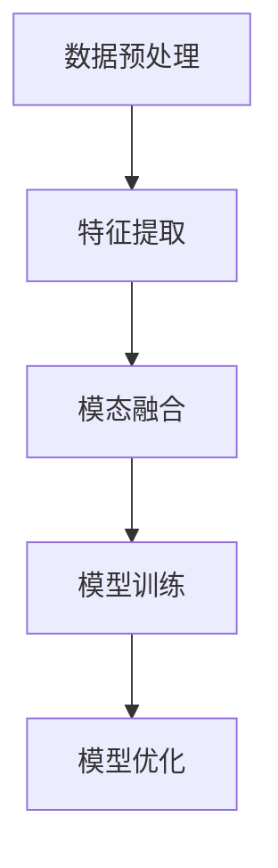

                 


# 企业AI Agent的多模态学习在用户体验优化中的创新应用

> 关键词：企业AI Agent，多模态学习，用户体验优化，人工智能，系统架构设计

> 摘要：本文探讨了企业AI Agent在多模态学习中的创新应用，重点分析了多模态学习在用户体验优化中的原理、算法、系统架构设计及项目实战。文章通过详细的技术分析和案例解读，展示了多模态学习如何提升企业AI Agent的智能化水平，从而优化用户体验。

---

# 第一部分: 企业AI Agent的多模态学习背景与概念

## 第1章: 企业AI Agent与多模态学习概述

### 1.1 企业AI Agent的定义与特点
企业AI Agent是一种能够自主感知环境、执行任务并优化决策的智能实体。它具备以下特点：
- **自主性**：能够在无外部干预的情况下独立运作。
- **反应性**：能够实时感知环境变化并做出响应。
- **学习性**：通过数据和经验不断优化自身行为。

### 1.2 多模态学习的定义与应用
多模态学习是指通过整合多种数据形式（如文本、图像、语音等）来提升模型理解和决策能力的技术。其核心应用包括：
- **跨模态理解**：通过整合不同模态的数据，提升模型对复杂场景的理解能力。
- **多任务学习**：在同一模型中处理多种任务，提高效率。

### 1.3 企业AI Agent与用户体验优化的结合
企业AI Agent通过多模态学习，能够更好地理解用户需求，从而提供更个性化的服务。例如，在客服系统中，AI Agent可以通过整合用户的文本、语音和行为数据，提供更精准的解决方案。

---

# 第二部分: 多模态学习的核心概念与原理

## 第2章: 多模态学习的核心概念与联系

### 2.1 多模态学习的核心原理
多模态学习通过融合多种数据形式，提升模型的泛化能力和准确性。其核心步骤包括：
1. **数据预处理**：对不同模态的数据进行标准化处理。
2. **特征提取**：从各模态数据中提取有意义的特征。
3. **融合策略**：将不同模态的特征进行融合，生成综合特征。

### 2.2 多模态学习与企业AI Agent的关系
企业AI Agent通过多模态学习，能够更全面地理解用户需求，从而提供更智能的服务。例如，在智能音箱中，AI Agent可以通过整合用户的语音指令和历史行为数据，提供更个性化的推荐。

### 2.3 多模态学习的核心要素对比
以下表格对比了不同模态数据的特征：

| 模态类型 | 特征描述 |
|----------|----------|
| 文本      | 高维性、语义性 |
| 图像      | 高维性、空间性 |
| 语音      | 时间性、情感性 |

### 2.4 多模态学习的ER实体关系图
```mermaid
er
    entity(用户) {
        用户ID
        用户特征
    }
    entity(数据模态) {
        模态ID
        模态类型
    }
    entity(学习模型) {
        模型ID
        模型结构
    }
    entity(用户体验) {
        体验ID
        体验指标
    }
    relation(用户-数据模态) {
        用户ID
        模态ID
    }
    relation(数据模态-学习模型) {
        模态ID
        模型ID
    }
    relation(学习模型-用户体验) {
        模型ID
        体验ID
    }
```

---

# 第三部分: 多模态学习的算法原理与数学模型

## 第3章: 多模态学习的算法原理

### 3.1 多模态学习的算法原理
多模态学习的算法主要包括以下几个步骤：
1. **数据预处理**：对不同模态的数据进行归一化处理。
2. **特征提取**：使用深度学习模型提取各模态的特征。
3. **模态融合**：将不同模态的特征进行融合，生成综合特征。
4. **模型训练**：基于融合特征进行模型训练，优化模型参数。

### 3.2 多模态学习的数学模型
多模态学习的融合函数可以表示为：
$$ y = f(x_1, x_2, ..., x_n) $$
其中，$x_i$表示第$i$种模态的特征，$f$是融合函数。

以下是一个简单的融合函数示例：
$$ y = \text{Concat}(x_1, x_2) $$

### 3.3 多模态学习的算法流程图


---

## 第4章: 企业AI Agent的系统架构设计

### 4.1 问题场景介绍
以智能客服系统为例，企业AI Agent需要整合用户的文本、语音和行为数据，提供个性化的服务。

### 4.2 系统功能设计
系统功能包括：
1. **数据采集**：收集用户的行为、文本和语音数据。
2. **数据处理**：对数据进行清洗和标准化处理。
3. **模型训练**：基于多模态数据训练AI Agent模型。
4. **服务提供**：根据模型输出结果为用户提供服务。

### 4.3 系统架构设计


---

## 第5章: 项目实战

### 5.1 环境安装
安装Python和相关库：
```bash
pip install numpy
pip install tensorflow
pip install matplotlib
```

### 5.2 核心代码实现
以下是多模态学习的Python代码示例：
```python
import numpy as np
import tensorflow as tf

# 加载数据
x1 = np.random.randn(100, 10)
x2 = np.random.randn(100, 10)

# 模态融合
x = tf.concat([x1, x2], axis=1)

# 模型训练
model = tf.keras.Sequential([
    tf.keras.layers.Dense(20, activation='relu'),
    tf.keras.layers.Dense(1, activation='sigmoid')
])
model.compile(optimizer='adam', loss='binary_crossentropy')
model.fit(x, y, epochs=10)
```

### 5.3 案例分析
以智能音箱为例，AI Agent可以通过整合用户的语音指令和历史行为数据，提供更精准的推荐。

### 5.4 项目小结
通过实战可以发现，多模态学习能够显著提升企业AI Agent的智能化水平，从而优化用户体验。

---

## 第6章: 总结与展望

### 6.1 最佳实践 tips
- 数据预处理是关键，需确保数据质量。
- 模态融合需根据具体场景选择合适的方法。

### 6.2 小结
本文详细探讨了企业AI Agent的多模态学习在用户体验优化中的创新应用，分析了其核心原理、系统架构设计及项目实战。

### 6.3 注意事项
- 模型训练需注意过拟合问题。
- 数据隐私保护需引起重视。

### 6.4 拓展阅读
- 《Deep Learning》
- 《Multi-modal Learning: A Survey》

---

作者：AI天才研究院/AI Genius Institute & 禅与计算机程序设计艺术 /Zen And The Art of Computer Programming

