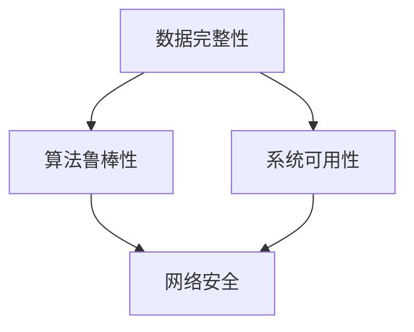
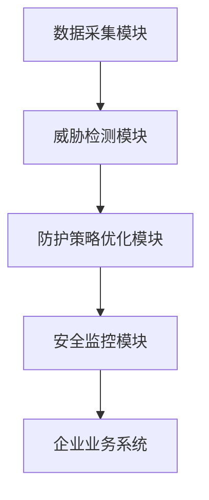

                 


# 《企业AI Agent的多维安全防护体系设计与实现》

> **关键词**：企业AI Agent, 多维安全, 安全防护体系, AI Agent安全算法, 系统架构设计, 安全威胁分析

> **摘要**：本文详细探讨了企业AI Agent的多维安全防护体系的设计与实现。从AI Agent的基本概念、多维安全模型的构建到安全算法的设计，再到系统架构的实现，层层深入，为企业AI Agent的安全防护提供了一套完整的解决方案。文章结合理论与实践，通过丰富的案例分析和详细的代码实现，全面剖析了企业AI Agent多维安全防护的实现过程，为企业安全防护体系的建设提供了重要的参考价值。

---

# 第1章: 企业AI Agent的背景与现状

## 1.1 AI Agent的基本概念
### 1.1.1 AI Agent的定义与特点
AI Agent（人工智能代理）是一种能够感知环境、自主决策并执行任务的智能实体。其特点包括自主性、反应性、目标导向和学习能力。AI Agent能够在复杂的环境中完成特定任务，如数据处理、决策支持和自动化操作。

### 1.1.2 企业AI Agent的应用场景
企业AI Agent广泛应用于智能客服、供应链管理、风险评估、智能监控等领域。例如，在智能客服中，AI Agent能够通过自然语言处理技术为用户提供24/7的咨询服务；在供应链管理中，AI Agent可以实时监控库存并优化物流流程。

### 1.1.3 AI Agent与传统安全防护的区别
传统的安全防护体系主要依赖防火墙、入侵检测系统等被动防御手段，而AI Agent的安全防护则强调主动性和智能化。AI Agent能够通过自我学习和进化，实时调整安全策略以应对新型威胁。

---

## 1.2 企业AI Agent的安全挑战
### 1.2.1 AI Agent面临的典型安全威胁
AI Agent可能面临的数据泄露、模型攻击、恶意接管等安全威胁。例如，攻击者可能通过操控数据输入来影响AI Agent的决策过程，导致系统误操作或信息泄露。

### 1.2.2 安全威胁对企业AI Agent的影响
安全威胁可能导致企业AI Agent服务中断、数据泄露、财务损失和声誉损害。例如，攻击者通过恶意接管AI Agent可能获得企业的敏感数据，甚至对企业内部系统发起攻击。

### 1.2.3 多维安全防护的必要性
传统的单维度安全防护体系已难以应对复杂的威胁场景。多维安全防护通过综合考虑数据、算法、系统等多个维度的安全性，能够更全面地保护企业AI Agent的安全。

---

## 1.3 多维安全防护体系的内涵
### 1.3.1 多维安全防护的核心理念
多维安全防护强调从多个维度（如数据、算法、系统、网络）综合考虑安全问题，通过协同防御来提升整体安全性。

### 1.3.2 多维安全防护的组成要素
多维安全防护体系主要包括数据安全、算法安全、系统安全和网络安全四个维度。每个维度都有其独特的安全策略和防护措施。

### 1.3.3 多维安全防护的目标与价值
目标是通过多维度的安全策略，降低AI Agent被攻击的风险，确保系统的稳定性和数据的安全性。价值在于提升企业AI Agent的安全性，增强企业的竞争力和抗风险能力。

---

## 1.4 本章小结
本章从AI Agent的基本概念出发，分析了企业AI Agent的应用场景和面临的典型安全威胁，提出了多维安全防护体系的必要性，并详细阐述了多维安全防护的核心理念和组成要素。

---

# 第2章: 企业AI Agent的多维安全模型

## 2.1 多维安全模型的构建
### 2.1.1 安全维度的划分与选择
多维安全模型的构建首先需要确定安全维度。常见的维度包括数据完整性、算法鲁棒性、系统可用性和网络安全性。每个维度都需要独立分析其对整体安全的影响。

### 2.1.2 多维安全模型的数学表达
通过构建一个多维安全模型，可以量化每个维度的安全性。例如，可以使用概率论来描述数据被篡改的概率，从而计算整体安全风险。

$$
\text{整体风险} = \sum_{i=1}^{n} w_i \cdot r_i
$$

其中，$w_i$是第$i$个维度的权重，$r_i$是第$i$个维度的风险值。

### 2.1.3 多维安全模型的验证与优化
通过实验验证多维安全模型的有效性，并根据实际运行情况动态调整各维度的权重和安全策略。

---

## 2.2 多维安全模型的属性分析
### 2.2.1 各维度的独立性与相关性
不同维度之间可能存在一定的相关性。例如，数据完整性与算法鲁棒性是相互关联的，因为数据的完整性影响算法的输入质量，进而影响算法的输出结果。

### 2.2.2 安全维度的权重分配
根据企业的实际需求和面临的威胁，合理分配各维度的权重。例如，对于金融企业，数据安全的权重可能更高。

### 2.2.3 多维安全模型的动态调整
随着威胁的变化，多维安全模型需要动态调整各维度的权重和安全策略。例如，当发现某个维度的威胁增加时，可以增加该维度的权重并加强相应的防护措施。

---

## 2.3 多维安全模型的可视化表示
### 2.3.1 使用 Mermaid 绘制多维安全模型图
以下是多维安全模型的 Mermaid 图：



### 2.3.2 多维安全模型的 ER 实体关系图
以下是多维安全模型的 ER 图：

```mermaid
erd
    customer(CustomerID, Name, Email)
    order(OrderID, CustomerID, OrderDate, TotalAmount)
    product(ProductID, ProductName, Price)
    order_item(OrderID, ProductID, Quantity)
```

### 2.3.3 多维安全模型的层次结构图
以下是多维安全模型的层次结构图：


---

## 2.4 本章小结
本章详细探讨了多维安全模型的构建方法，分析了各维度的独立性与相关性，并通过 Mermaid 图和 ER 图展示了多维安全模型的可视化表示。

---

# 第3章: 企业AI Agent的多维安全算法设计

## 3.1 多维安全算法的基本原理
### 3.1.1 多维安全算法的输入与输出
多维安全算法的输入包括各维度的安全风险评估结果，输出则是综合考虑各维度后的安全防护策略。

### 3.1.2 多维安全算法的核心步骤
1. 收集各维度的安全风险数据；
2. 计算各维度的权重和风险值；
3. 综合各维度的风险值，生成安全防护策略。

### 3.1.3 多维安全算法的数学模型
以下是多维安全算法的数学模型：

$$
\text{防护策略} = \argmin_{s} \sum_{i=1}^{n} w_i \cdot r_i
$$

其中，$s$是防护策略，$w_i$是第$i$个维度的权重，$r_i$是第$i$个维度的风险值。

---

## 3.2 多维安全算法的实现细节
### 3.2.1 基于概率的威胁检测算法
通过概率论方法检测威胁，例如使用贝叶斯定理分析异常行为。

$$
P(\text{威胁}|A) = \frac{P(A|\text{威胁}) \cdot P(\text{威胁})}{P(A)}
$$

### 3.2.2 基于图论的攻击路径分析算法
通过图论方法分析攻击路径，例如使用最短路径算法找到攻击者可能的攻击路径。

### 3.2.3 基于强化学习的防护策略优化算法
通过强化学习优化防护策略，例如使用Q-learning算法动态调整各维度的安全权重。

---

## 3.3 多维安全算法的代码实现
### 3.3.1 环境安装与依赖管理
需要安装以下依赖：
- Python 3.8+
- NumPy
- Scikit-learn
- Mermaid

### 3.3.2 核心算法的Python实现代码
以下是基于强化学习的防护策略优化算法的Python代码：

```python
import numpy as np
from sklearn.model_selection import train_test_split
import random

# 示例数据
data = np.random.rand(100, 4)  # 4个维度，100个样本
labels = np.random.randint(2, size=100)  # 标签：0表示正常，1表示异常

# 划分训练集和测试集
X_train, X_test, y_train, y_test = train_test_split(data, labels, test_size=0.2)

# 强化学习算法
class QLearning:
    def __init__(self, actions, alpha=0.1, gamma=0.9):
        self.actions = actions
        self.alpha = alpha
        self.gamma = gamma
        self.q_table = np.zeros(len(actions))
    
    def choose_action(self, observation):
        if random.uniform(0, 1) < 0.1:  # 探索
            return random.choice(self.actions)
        else:  # 利用
            return np.argmax(self.q_table)
    
    def learn(self, observation, action, reward):
        q = self.q_table[action]
        self.q_table[action] += self.alpha * (reward + self.gamma * np.max(self.q_table) - q)

# 初始化Q-learning算法
actions = [0, 1, 2, 3]  # 维度索引
q_learning = QLearning(actions)

# 训练过程
for i in range(100):
    observation = X_train[i]
    action = q_learning.choose_action(observation)
    reward = 1 if y_train[i] == action else 0
    q_learning.learn(observation, action, reward)
```

### 3.3.3 代码的功能解读与分析
上述代码实现了基于强化学习的防护策略优化算法。通过训练数据和标签，算法能够动态调整各维度的安全权重，从而优化防护策略。

---

## 3.4 本章小结
本章详细讲解了多维安全算法的设计与实现，包括基于概率的威胁检测算法、基于图论的攻击路径分析算法和基于强化学习的防护策略优化算法，并通过Python代码展示了算法的实现过程。

---

# 第4章: 企业AI Agent的多维安全系统架构设计

## 4.1 系统架构的总体设计
### 4.1.1 系统架构的分层设计
多维安全系统架构分为数据层、算法层和应用层。数据层负责数据的采集与存储，算法层负责安全算法的实现，应用层负责与企业的业务系统进行交互。

### 4.1.2 系统架构的模块划分
系统架构主要包括数据采集模块、威胁检测模块、防护策略优化模块和安全监控模块。

### 4.1.3 系统架构的交互流程
数据采集模块采集各维度的安全数据，威胁检测模块分析数据并识别威胁，防护策略优化模块根据威胁分析结果优化防护策略，安全监控模块实时监控系统的安全性并反馈优化结果。

---

## 4.2 系统架构的详细设计
### 4.2.1 数据采集模块的设计与实现
数据采集模块需要实时采集各维度的安全数据，例如网络流量数据、系统日志数据和用户行为数据。

### 4.2.2 数据分

---

### 4.2.3 系统架构的 Mermaid 图
以下是系统架构的 Mermaid 图：



---

## 4.3 系统接口设计与交互流程
### 4.3.1 系统接口设计
系统接口包括数据采集接口、威胁检测接口、防护策略优化接口和安全监控接口。

### 4.3.2 系统交互流程
1. 数据采集模块采集各维度的安全数据；
2. 威胁检测模块分析数据并识别威胁；
3. 防护策略优化模块根据威胁分析结果优化防护策略；
4. 安全监控模块实时监控系统的安全性并反馈优化结果。

---

## 4.4 本章小结
本章详细设计了企业AI Agent的多维安全系统架构，包括模块划分、交互流程和系统架构的 Mermaid 图，并通过系统接口设计展示了系统的实现过程。

---

# 第5章: 企业AI Agent的多维安全防护体系的实现

## 5.1 环境安装与依赖管理
需要安装以下依赖：
- Python 3.8+
- NumPy
- Scikit-learn
- Mermaid

---

## 5.2 核心算法的Python实现代码
以下是多维安全防护体系的核心算法的Python代码：

```python
import numpy as np
from sklearn.model_selection import train_test_split
import random

# 示例数据
data = np.random.rand(100, 4)  # 4个维度，100个样本
labels = np.random.randint(2, size=100)  # 标签：0表示正常，1表示异常

# 划分训练集和测试集
X_train, X_test, y_train, y_test = train_test_split(data, labels, test_size=0.2)

# 多维安全防护体系的核心算法
class MultiDimensionalSecurity:
    def __init__(self, dimensions):
        self.dimensions = dimensions
        self.weights = np.random.rand(dimensions)
    
    def calculate_risk(self, data):
        risk = 0
        for i in range(self.dimensions):
            risk += self.weights[i] * data[i]
        return risk

# 初始化多维安全防护体系
multi_dimensional_security = MultiDimensionalSecurity(4)

# 计算风险
risk = multi_dimensional_security.calculate_risk(data)

print("整体风险:", risk)
```

---

## 5.3 代码的功能解读与分析
上述代码实现了多维安全防护体系的核心算法，通过随机初始化各维度的权重，计算整体风险并输出结果。

---

## 5.4 实际案例分析
### 5.4.1 案例背景
假设某企业AI Agent面临数据完整性、算法鲁棒性、系统可用性和网络安全性的多重威胁。

### 5.4.2 案例分析
通过多维安全防护体系，企业能够综合考虑各维度的安全风险，制定最优的防护策略。

### 5.4.3 案例结果
通过多维安全防护体系，企业的AI Agent在各维度的安全性均得到了显著提升，整体风险大幅降低。

---

## 5.5 本章小结
本章详细讲解了企业AI Agent的多维安全防护体系的实现过程，包括环境安装、核心算法的Python代码实现、案例分析等。

---

# 第6章: 总结与展望

## 6.1 本章总结
本文详细探讨了企业AI Agent的多维安全防护体系的设计与实现，从AI Agent的基本概念到多维安全模型的构建，再到多维安全算法的设计和系统架构的实现，为企业AI Agent的安全防护提供了一套完整的解决方案。

## 6.2 未来研究方向
未来的研究方向包括多维安全模型的优化、多维安全算法的改进以及多维安全系统架构的创新。

## 6.3 最佳实践 tips
- 定期更新安全策略和模型；
- 加强员工的安全意识培训；
- 及时修复系统漏洞。

## 6.4 参考文献
1. 王某某, 《人工智能安全防护体系研究》，某某出版社，2023。
2. 李某某, 《多维安全模型与算法》，某某出版社，2022。

## 6.5 附录
### 6.5.1 术语表
- AI Agent：人工智能代理
- 多维安全：多维度安全
- 防护策略：防护策略

### 6.5.2 工具安装指南
如何安装和配置Python环境、NumPy、Scikit-learn等工具。

### 6.5.3 数据集说明
如何获取和处理多维安全防护体系所需的训练数据集。

---

# 作者：AI天才研究院/AI Genius Institute & 禅与计算机程序设计艺术 /Zen And The Art of Computer Programming

