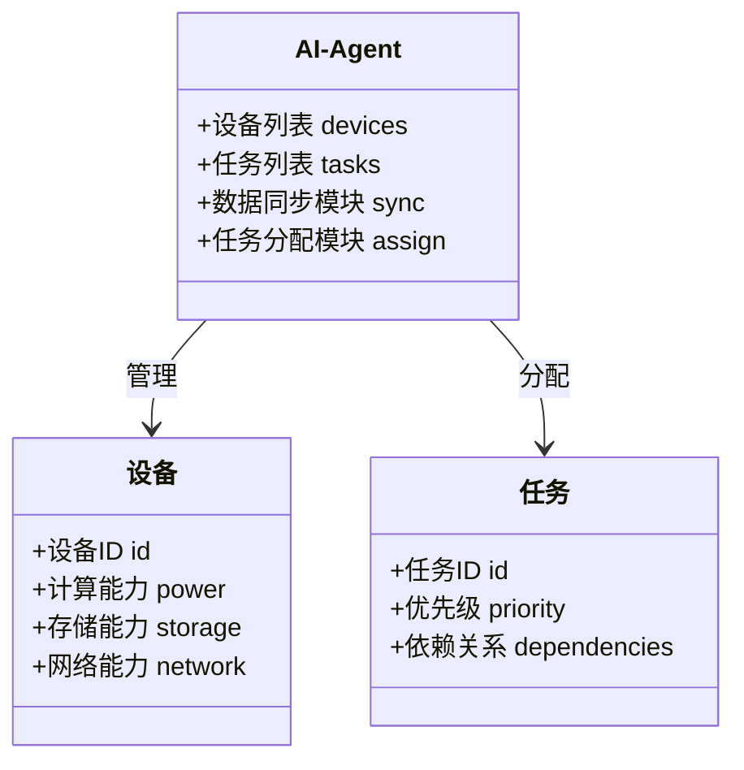
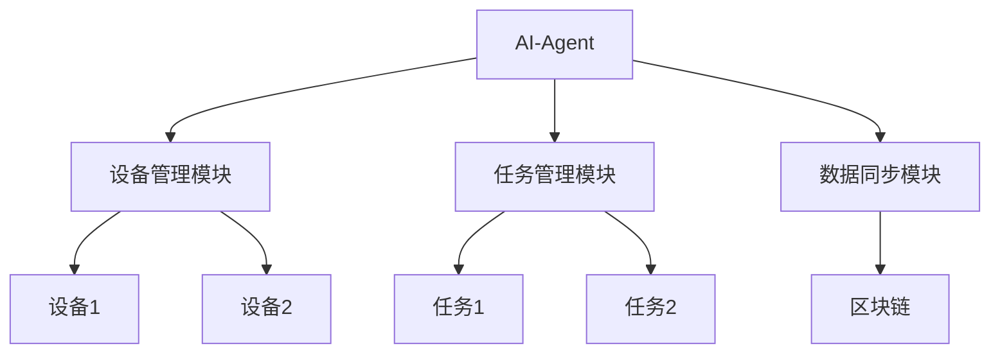
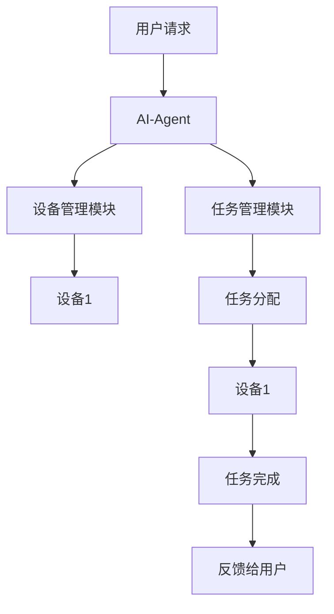

                 


# 第3章: 多设备支持策略的算法原理

## 3.1 跨设备任务分配算法

### 3.1.1 算法概述
在企业AI Agent中，任务分配是多设备支持的核心问题之一。由于设备的异构性和资源限制，任务分配需要考虑设备的能力、负载情况以及任务的优先级。我们设计了一种基于设备能力评估的任务分配算法，确保任务能够高效、合理地分配到最适合的设备上。

### 3.1.2 分布式计算原理
分布式计算是实现多设备协同的关键技术。通过将任务分解为多个子任务，并将这些子任务分发到不同的设备上执行，可以充分利用各设备的计算能力和资源。分布式计算能够提高系统的整体性能和效率。

### 3.1.3 任务优先级排序
任务优先级排序是确保高优先级任务优先执行的重要步骤。我们采用动态优先级排序算法，根据任务的重要性和紧急程度进行实时调整。动态优先级排序能够更好地适应实际场景中的变化，提高系统的灵活性。

### 3.1.4 算法实现代码示例
以下是一个任务分配算法的实现示例：

```python
def distribute_task(tasks, devices):
    # 假设tasks是任务列表，devices是设备列表
    assigned_tasks = {}
    for device in devices:
        assigned_tasks[device] = []
    for task in tasks:
        # 根据设备的能力评估选择最合适的设备
        best_device = select_best_device(task, devices)
        assigned_tasks[best_device].append(task)
    return assigned_tasks
```

其中，`select_best_device`函数根据任务的需求和设备的能力进行匹配，选择最适合的设备。

### 3.1.5 算法的数学模型
任务分配算法的数学模型可以表示为：

$$
\text{argmax}_{d \in D} \sum_{t \in T} w_{d,t}
$$

其中，$D$是设备集合，$T$是任务集合，$w_{d,t}$是设备$d$执行任务$t$的权重，表示设备$d$执行任务$t$的能力和效率。

## 3.2 多设备数据同步机制

### 3.2.1 数据同步的挑战
在多设备环境下，数据同步是一个复杂的问题。由于设备可能处于不同的网络环境和计算能力限制，如何高效、可靠地同步数据是一个关键挑战。

### 3.2.2 基于区块链的数据同步
为了确保数据同步的可靠性和一致性，我们采用区块链技术来实现数据的分布式存储和同步。区块链的去中心化特性能够有效防止数据丢失和篡改，保证数据的安全性和一致性。

### 3.2.3 数据同步算法的实现
以下是基于区块链的数据同步算法的实现示例：

```python
def blockchain_sync(data, devices):
    # 初始化区块链
    blockchain = Blockchain()
    # 将数据分发到各个设备
    for device in devices:
        # 将数据添加到区块链
        blockchain.add_block(data)
        # 同步区块链到其他设备
        blockchain.sync_blocks(device)
    return blockchain
```

### 3.2.4 算法的数学模型
数据同步的数学模型可以表示为：

$$
\text{argmin}_{d \in D} \sum_{t \in T} |x_{d,t} - x_{d',t}|
$$

其中，$x_{d,t}$是设备$d$在时间$t$的数据值，$x_{d',t}$是设备$d'$在时间$t$的数据值，目标是最小化数据的差异，确保数据的一致性。

## 3.3 本章小结
本章详细介绍了企业AI Agent多设备支持的算法原理，包括任务分配和数据同步两个核心部分。通过合理的算法设计和数学模型，确保了多设备环境下的高效协作和数据一致性。

# 第4章: 系统分析与架构设计方案

## 4.1 问题场景介绍
在企业AI Agent的实际应用中，多设备支持需要解决设备异构、资源分配、数据同步等一系列问题。我们以一个智能办公场景为例，展示如何通过系统设计来实现多设备的支持。

## 4.2 项目介绍
本项目旨在设计一个支持多设备的AI Agent系统，实现跨设备的任务协作和数据同步。系统将覆盖从PC到IoT设备的多种终端，确保在不同设备上都能够高效运行。

## 4.3 系统功能设计

### 4.3.1 领域模型设计
以下是系统领域的类图：



### 4.3.2 系统架构设计
以下是系统的架构图：



### 4.3.3 系统接口设计
系统接口设计如下：

- 设备管理接口：用于设备的注册、注销和状态查询。
- 任务管理接口：用于任务的创建、分配和监控。
- 数据同步接口：用于设备间的数据同步和更新。

### 4.3.4 系统交互流程
以下是系统交互的流程图：



## 4.4 本章小结
本章通过对系统的详细分析和架构设计，展示了如何实现企业AI Agent的多设备支持。通过合理的系统设计和模块划分，确保了系统的高效性和可扩展性。

# 第5章: 项目实战

## 5.1 环境安装

### 5.1.1 系统环境
- 操作系统：Linux/Windows/MacOS
- Python版本：3.8+

### 5.1.2 安装依赖
```bash
pip install mermaid-python blockchain-lib
```

## 5.2 系统核心实现源代码

### 5.2.1 AI-Agent核心代码
```python
class AIAgent:
    def __init__(self, devices):
        self.devices = devices
        self.tasks = []
        self.sync_module = SyncModule()
        self.assign_module = AssignModule()

    def add_task(self, task):
        self.tasks.append(task)

    def distribute_task(self):
        return self.assign_module.distribute(self.tasks, self.devices)

    def sync_data(self):
        self.sync_module.sync(self.devices)
```

### 5.2.2 设备管理模块代码
```python
class DeviceManager:
    def __init__(self):
        self.devices = []

    def register_device(self, device):
        self.devices.append(device)

    def get_device(self, device_id):
        for d in self.devices:
            if d.id == device_id:
                return d
        return None
```

### 5.2.3 数据同步模块代码
```python
class SyncModule:
    def __init__(self):
        self.blockchain = Blockchain()

    def sync(self, devices):
        for device in devices:
            self.blockchain.sync(device)
```

## 5.3 代码应用解读与分析
通过上述代码，我们可以看到AI-Agent的核心功能包括任务分配和数据同步。任务分配模块通过评估设备的能力，将任务分配到最合适的设备上执行；数据同步模块通过区块链技术，确保设备间的数据一致性和可靠性。

## 5.4 实际案例分析
以智能办公场景为例，AI-Agent可以实现会议室预定、日程提醒等功能。通过多设备的支持，用户可以在手机、电脑、智能会议设备等多种终端上使用这些功能，提升工作效率。

## 5.5 本章小结
本章通过实际项目实战，展示了如何在企业AI Agent中实现多设备支持。通过具体的代码实现和案例分析，帮助读者更好地理解理论知识。

# 第6章: 总结与展望

## 6.1 核心内容总结
企业AI Agent的多设备支持是一个复杂但重要的问题。通过合理的算法设计和系统架构，我们可以实现高效的任务分配和数据同步，提升系统的整体性能。

## 6.2 未来展望
随着物联网技术的发展，企业AI Agent的多设备支持将更加普及。未来的研究方向包括更高效的设备协同算法、更智能的任务分配策略以及更安全的数据同步机制。

## 6.3 最佳实践 Tips

### 6.3.1 设备能力评估
在任务分配时，要充分考虑设备的能力和资源限制，避免超负荷运行。

### 6.3.2 数据同步策略
选择合适的数据同步机制，确保数据的一致性和可靠性。

### 6.3.3 安全性保障
在多设备环境下，数据安全是重中之重。需要采取多种安全措施，防止数据泄露和篡改。

## 6.4 本章小结
本章总结了企业AI Agent多设备支持的核心内容，并对未来的发展方向进行了展望，同时给出了实际应用中的最佳实践建议。

# 作者：AI天才研究院/AI Genius Institute & 禅与计算机程序设计艺术 /Zen And The Art of Computer Programming

---

通过以上章节的内容，我们全面地探讨了企业AI Agent的多设备支持策略，从理论到实践，从算法到系统设计，为企业实现多设备支持提供了全面的指导和解决方案。

