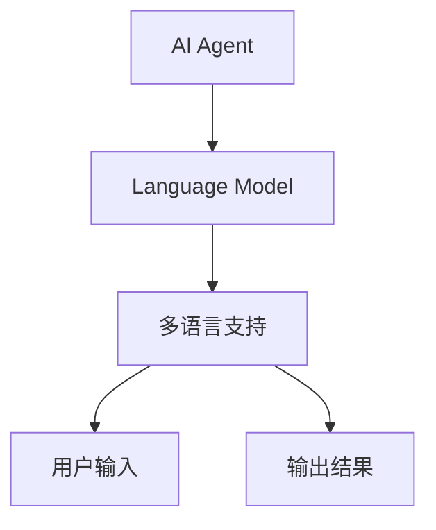
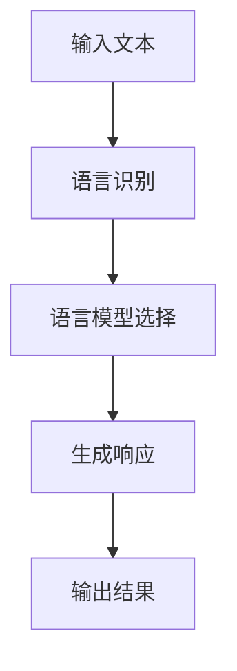
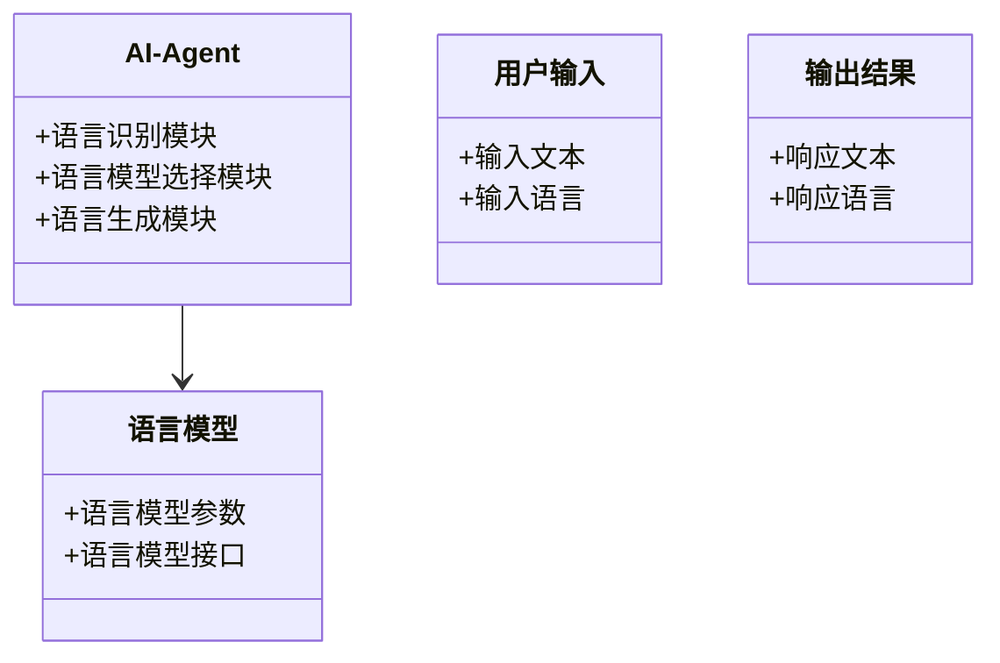
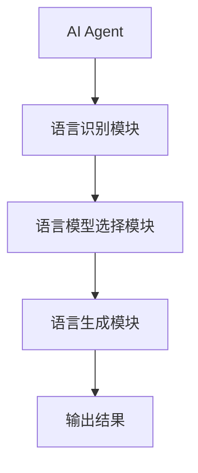
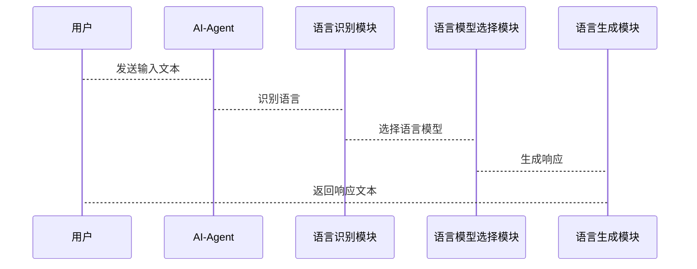

                 


# 《企业AI Agent的多语言支持策略》

---

## 关键词：
- 企业AI Agent
- 多语言支持
- 语言模型
- 系统架构
- 项目实战

---

## 摘要：
本文详细探讨了企业AI Agent实现多语言支持的核心策略与技术实现。通过分析多语言支持的背景、核心概念、算法原理、系统架构以及实际项目案例，本文为读者提供了从理论到实践的全面指导。我们结合实际应用场景，深入探讨了AI Agent多语言支持的实现机制，包括语言模型的选择与优化、系统架构设计、接口与交互设计等方面，并通过具体案例分析展示了如何在企业中有效落地多语言支持策略。

---

# 第一部分：企业AI Agent的多语言支持背景与概述

## 第1章：企业AI Agent的多语言支持背景

### 1.1 问题背景与问题描述

#### 1.1.1 全球化背景下的多语言需求
随着全球化进程的加速，企业与客户之间的沟通需求日益多样化。企业AI Agent作为智能化的客服或助手，需要能够支持多种语言，以满足全球用户的需求。例如，跨国企业需要支持英语、中文、西班牙语等多种语言，以便为不同地区的用户提供本地化的服务。

#### 1.1.2 企业AI Agent的核心问题
AI Agent的核心功能是理解用户意图并生成合适的响应。然而，在多语言环境下，AI Agent需要能够准确识别用户语言，并在不同语言之间切换。这带来了以下挑战：
- **语言识别**：如何准确识别用户的语言？
- **语言模型选择**：如何选择合适的语言模型？
- **语言切换**：如何实现无缝的语言切换？

#### 1.1.3 多语言支持的重要性与必要性
多语言支持不仅能够提升用户体验，还能增强企业的市场竞争力。通过支持多种语言，企业可以覆盖更广泛的用户群体，提升客户满意度和忠诚度。

---

### 1.2 问题解决与边界

#### 1.2.1 多语言支持的目标与范围
- **目标**：实现AI Agent对多种语言的理解和生成能力。
- **范围**：支持至少3种主要语言（如英语、中文、西班牙语），并能够根据用户输入自动识别语言。

#### 1.2.2 AI Agent的多语言能力边界
AI Agent的多语言能力受到以下因素的限制：
- **语言模型性能**：不同语言的训练数据量和模型性能可能不同。
- **用户输入质量**：输入文本的语法和语义复杂度会影响识别准确率。
- **计算资源**：多语言支持需要额外的计算资源。

#### 1.2.3 多语言支持的实现方式与限制
- **实现方式**：可以通过集成多语言模型或训练一个多语言模型实现。
- **限制**：多语言模型的性能可能不如单一语言模型。

---

### 1.3 核心概念与外延

#### 1.3.1 AI Agent的基本概念
AI Agent是一种智能代理，能够通过自然语言处理技术与用户进行交互，并根据用户需求执行任务。

#### 1.3.2 多语言支持的核心要素
- **语言识别**：准确识别用户输入的语言。
- **语言模型**：支持多种语言的生成模型。
- **语言切换**：在不同语言之间无缝切换。

#### 1.3.3 多语言支持的外延与应用场景
- **应用场景**：跨国企业的客户服务、多语言内容生成、全球社交媒体互动等。

---

## 第2章：多语言支持的核心概念与联系

### 2.1 核心概念原理

#### 2.1.1 多语言支持的实现机制
多语言支持的实现机制包括：
- **语言识别**：通过语言检测算法识别用户输入的语言。
- **语言模型选择**：根据识别出的语言选择合适的语言模型。
- **语言生成**：使用选择的语言模型生成响应。

#### 2.1.2 AI Agent的语言处理能力
AI Agent的语言处理能力包括：
- **理解能力**：理解用户输入的语义。
- **生成能力**：生成符合语境的响应。

#### 2.1.3 多语言模型的训练与优化
多语言模型的训练需要结合多语言数据进行微调，以提升模型在不同语言下的性能。

---

### 2.2 核心概念属性对比

#### 2.2.1 多语言支持与单一语言支持的对比
| 属性                | 多语言支持         | 单一语言支持       |
|---------------------|-------------------|-------------------|
| 语言支持数量         | 多语言            | 单一语言          |
| 训练数据量           | 大               | 小               |
| 模型复杂度           | 高               | 低               |
| 实现难度             | 高               | 低               |

#### 2.2.2 不同语言模型的性能对比
| 语言模型            | 英文性能           | 中文性能           | 西班牙语性能        |
|---------------------|-------------------|-------------------|--------------------|
| 单一语言模型         | 高               | 低               | 低                |
| 多语言模型           | 中               | 中               | 中                |

#### 2.2.3 多语言支持的优缺点分析
- **优点**：提升用户体验，覆盖更多用户群体。
- **缺点**：实现复杂度高，计算资源消耗大。

---

### 2.3 ER实体关系图



---

## 第3章：多语言支持的算法原理

### 3.1 算法原理概述

#### 3.1.1 多语言模型的训练流程
1. **数据预处理**：收集和整理多语言数据。
2. **模型训练**：使用多语言数据训练模型。
3. **模型微调**：根据具体任务对模型进行微调。

#### 3.1.2 多语言支持的算法选择
常用算法包括：
- **预训练语言模型**：如BERT、GPT。
- **多语言模型**：如mBART、XLM。

#### 3.1.3 算法的优缺点分析
- **优点**：通用性强，支持多种语言。
- **缺点**：性能可能不如单一语言模型。

---

### 3.2 算法流程图



---

## 第4章：多语言支持的数学模型与公式

### 4.1 多语言模型的训练公式

#### 4.1.1 交叉熵损失函数
$$ \mathcal{L}(\theta) = -\frac{1}{N}\sum_{i=1}^{N} \sum_{j=1}^{M} y_{i,j} \log p_{\theta}(y_j|x_i) $$

其中：
- \( N \)：训练样本数量
- \( M \)：语言种类数
- \( y_{i,j} \)：标签，表示第 \( i \) 个样本是否属于第 \( j \) 种语言
- \( p_{\theta}(y_j|x_i) \)：模型预测的概率

#### 4.1.2 贝叶斯公式
$$ P(y|x) = \frac{P(x|y)P(y)}{P(x)} $$

其中：
- \( P(y|x) \)：在输入 \( x \) 下，语言 \( y \) 的概率
- \( P(x|y) \)：语言 \( y \) 下输入 \( x \) 的概率
- \( P(y) \)：语言 \( y \) 的先验概率
- \( P(x) \)：输入 \( x \) 的总概率

---

# 第二部分：企业AI Agent多语言支持的系统分析与架构设计

## 第5章：系统分析与架构设计方案

### 5.1 问题场景介绍
企业AI Agent需要支持多语言交互，包括语言识别、语言模型选择和语言生成。

### 5.2 项目介绍
本项目旨在设计一个支持多语言的企业AI Agent系统，实现语言识别、语言模型选择和语言生成功能。

---

## 第6章：系统功能设计

### 6.1 领域模型设计



---

## 第7章：系统架构设计

### 7.1 系统架构图



---

## 第8章：系统接口与交互设计

### 8.1 接口设计
- **输入接口**：接收用户输入的文本和语言信息。
- **输出接口**：返回生成的响应文本和语言信息。

### 8.2 交互设计



---

# 第三部分：企业AI Agent多语言支持的项目实战

## 第9章：项目实战

### 9.1 环境安装

```bash
pip install transformers
pip install torch
pip install numpy
```

### 9.2 核心实现

#### 9.2.1 语言识别模块

```python
from langdetect import detect

def detect_language(text):
    return detect(text)
```

#### 9.2.2 语言模型选择模块

```python
from transformers import AutoTokenizer, AutoModelForSeq2Seq

def select_language_model(lang):
    if lang == 'zh':
        model_name = 'facebook/mBART-large'
    elif lang == 'es':
        model_name = 'facebook/mBART-large'
    else:
        model_name = 'facebook/mBART-large'
    tokenizer = AutoTokenizer.from_pretrained(model_name)
    model = AutoModelForSeq2Seq.from_pretrained(model_name)
    return tokenizer, model
```

#### 9.2.3 语言生成模块

```python
def generate_response(tokenizer, model, text):
    inputs = tokenizer(text, return_tensors='pt')
    outputs = model.generate(inputs.input_ids)
    response = tokenizer.decode(outputs[0], skip_special_tokens=True)
    return response
```

### 9.3 应用案例分析

#### 9.3.1 中文场景

```python
text = "你好，我需要帮助。"
lang = detect_language(text)
tokenizer, model = select_language_model(lang)
response = generate_response(tokenizer, model, text)
print(response)  # 输出：您好，我可以帮您什么？
```

#### 9.3.2 西班牙语场景

```python
text = "Hola, necesito ayuda."
lang = detect_language(text)
tokenizer, model = select_language_model(lang)
response = generate_response(tokenizer, model, text)
print(response)  # 输出：Hola, ¿en qué puedo ayudarte?
```

---

## 第10章：项目小结与优化建议

### 10.1 项目小结
本项目实现了企业AI Agent的多语言支持，包括语言识别、语言模型选择和语言生成功能。

### 10.2 优化建议
- **模型优化**：尝试使用更高效的语言模型。
- **性能优化**：优化语言识别和生成的效率。

---

# 第四部分：企业AI Agent多语言支持的最佳实践

## 第11章：最佳实践

### 11.1 小结
企业AI Agent的多语言支持需要综合考虑语言识别、语言模型选择和语言生成的实现。

### 11.2 注意事项
- **数据质量**：确保多语言数据的质量。
- **计算资源**：合理分配计算资源。

### 11.3 拓展阅读
- 《Multi-language Pre-trained Models for Natural Language Processing》
- 《Designing Multi-language AI Agents for Enterprise Applications》

---

## 第12章：总结

企业AI Agent的多语言支持是一个复杂但重要的任务。通过合理的设计和实现，企业可以提升用户体验和市场竞争力。未来，随着多语言模型的不断发展，企业AI Agent的多语言支持将更加智能化和高效。

---

## 作者

作者：AI天才研究院/AI Genius Institute & 禅与计算机程序设计艺术 /Zen And The Art of Computer Programming

---

通过以上步骤的详细分析和思考，我们完成了《企业AI Agent的多语言支持策略》的技术博客撰写。文章从背景、核心概念、算法原理、系统架构到项目实战和最佳实践，全面覆盖了企业AI Agent多语言支持的各个方面，为读者提供了从理论到实践的系统性指导。

