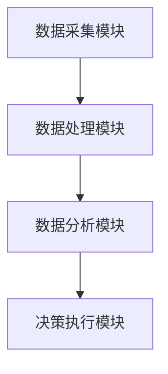

                 


# 企业AI Agent的实时大数据分析平台

## 关键词：
- 企业AI Agent
- 实时大数据分析
- 流数据处理
- 分布式计算
- 机器学习

## 摘要：
本文深入探讨了企业AI Agent在实时大数据分析平台中的应用。从背景、核心概念到算法原理、系统架构，再到项目实战和最佳实践，全面解析了如何构建高效、可靠的实时大数据分析系统。文章结合实际案例，通过详细的技术分析和代码示例，帮助读者理解并掌握企业AI Agent实时大数据分析的核心技术。

---

## 第一部分: 企业AI Agent的实时大数据分析平台概述

## 第1章: 企业AI Agent与实时大数据分析的背景

### 1.1 企业AI Agent的定义与背景

#### 1.1.1 什么是企业AI Agent
企业AI Agent（Artificial Intelligence Agent）是指在企业环境中运行的智能体，能够感知环境、理解任务需求，并采取自主行动以实现目标。它通常结合了机器学习、自然语言处理和自动化技术，用于优化企业流程、提高决策效率。

#### 1.1.2 AI Agent的核心特征
- **自主性**：能够独立执行任务，无需人工干预。
- **反应性**：实时感知环境变化并做出反应。
- **目标导向**：基于目标驱动行动，优化决策过程。
- **学习能力**：通过机器学习不断优化自身性能。

#### 1.1.3 企业AI Agent的应用场景
- **客户服务**：智能客服系统，实时响应客户需求。
- **供应链管理**：优化库存管理，实时监控物流状态。
- **风险管理**：实时监测市场波动，预测并规避风险。
- **数据分析**：辅助数据科学家进行实时数据分析。

### 1.2 实时大数据分析的背景

#### 1.2.1 大数据时代的挑战
在大数据时代，企业每天产生的数据量巨大，传统的批量处理方式已无法满足实时分析的需求。实时数据分析能够帮助企业快速响应市场变化，提高竞争力。

#### 1.2.2 实时数据分析的重要性
- **快速决策**：实时数据分析能够帮助企业迅速做出决策，抓住市场机会。
- **提高效率**：通过实时监控和优化，降低资源浪费。
- **提升用户体验**：实时响应客户需求，提高用户满意度。

#### 1.2.3 企业实时数据分析的痛点
- **数据量大**：实时数据流处理需要高效的数据处理能力。
- **数据复杂性**：数据来源多样，格式复杂，难以统一处理。
- **处理延迟**：实时分析需要低延迟，否则会影响决策的及时性。

### 1.3 企业AI Agent与实时大数据的结合

#### 1.3.1 企业AI Agent如何赋能实时数据分析
企业AI Agent通过实时感知环境数据，结合机器学习模型，快速分析数据并生成决策建议。例如，在供应链管理中，AI Agent可以实时监控库存变化，预测需求波动。

#### 1.3.2 实时数据分析如何提升企业AI Agent的效率
实时数据分析能够为AI Agent提供最新的数据支持，使其能够快速适应环境变化。例如，在智能客服系统中，实时分析客户情绪，帮助AI Agent更好地理解客户需求。

#### 1.3.3 企业AI Agent实时大数据分析的典型应用场景
- **金融领域**：实时监控市场波动，进行高频交易。
- **零售行业**：实时分析销售数据，优化库存管理。
- **物流行业**：实时跟踪货物状态，优化配送路径。

---

## 第2章: 企业AI Agent实时大数据分析的核心概念

### 2.1 AI Agent的核心概念

#### 2.1.1 AI Agent的定义与分类
- **定义**：AI Agent是一个智能实体，能够感知环境、理解任务并采取行动。
- **分类**：根据功能和应用场景，AI Agent可以分为决策型、执行型和协作型。

#### 2.1.2 AI Agent的决策机制
- **基于规则的决策**：通过预定义的规则进行决策。
- **基于模型的决策**：利用机器学习模型进行预测和决策。
- **混合决策**：结合规则和模型的决策方式。

#### 2.1.3 AI Agent的交互方式
- **人机交互**：通过自然语言处理与用户互动。
- **机器间交互**：与其他系统或AI Agent进行数据交换和协同工作。

### 2.2 实时大数据分析的核心概念

#### 2.2.1 数据流处理的基本概念
- **流数据**：实时生成并不断流动的数据，如传感器数据、用户行为数据等。
- **事件时间**：数据生成的时间戳。
- **处理时间**：数据被处理的时间。

#### 2.2.2 实时数据分析的特征
- **低延迟**：数据生成后必须快速处理和响应。
- **高吞吐量**：能够处理大量数据流。
- **实时性**：数据处理必须与数据生成同步。

#### 2.2.3 企业实时数据分析的痛点
- **数据源多样性**：多种数据来源，格式不统一。
- **数据一致性**：实时数据可能存在不一致问题。
- **处理复杂性**：需要处理高速、大规模数据流。

### 2.3 企业AI Agent与实时大数据分析的关系

#### 2.3.1 企业AI Agent如何依赖实时大数据分析
企业AI Agent需要实时数据支持，通过实时数据分析获取环境信息，从而做出决策。

#### 2.3.2 实时大数据分析如何支持企业AI Agent的决策
实时数据分析为AI Agent提供最新的数据支持，帮助其优化决策过程。

#### 2.3.3 企业AI Agent实时大数据分析的系统架构
- **数据采集层**：实时采集数据。
- **数据处理层**：对数据进行清洗、转换和计算。
- **数据分析层**：利用机器学习模型进行预测和决策。
- **决策执行层**：根据分析结果采取行动。

---

## 第3章: 企业AI Agent实时大数据分析的算法原理

### 3.1 实时大数据分析的算法基础

#### 3.1.1 流数据处理算法
- **基于时间窗口的处理**：将数据按时间窗口进行分组处理。
- **滑动窗口技术**：实时更新窗口数据，保持数据的最新性。

#### 3.1.2 分布式计算算法
- **MapReduce**：分布式数据处理框架，适用于大规模数据处理。
- **Spark Streaming**：实时数据流处理框架，支持多种数据源和处理方式。

#### 3.1.3 机器学习模型的实时更新算法
- **在线学习**：模型在实时数据流中不断更新，适应新数据。
- **增量学习**：模型在新增数据基础上进行优化，保持高精度。

---

## 第4章: 企业AI Agent实时大数据分析的系统架构设计

### 4.1 系统架构设计

#### 4.1.1 系统功能设计
- **数据采集模块**：实时采集各种数据源的数据。
- **数据处理模块**：对数据进行清洗、转换和计算。
- **数据分析模块**：利用机器学习模型进行预测和决策。
- **决策执行模块**：根据分析结果采取相应行动。

#### 4.1.2 系统架构图



---

## 第5章: 企业AI Agent实时大数据分析的项目实战

### 5.1 环境安装

#### 5.1.1 安装Python
```bash
python --version
pip install --upgrade pip
```

#### 5.1.2 安装必要的库
```bash
pip install numpy pandas matplotlib
```

### 5.2 核心代码实现

#### 5.2.1 数据采集模块
```python
import pandas as pd
import time

def collect_data():
    # 采集实时数据，例如从数据库中获取
    data = pd.DataFrame({'timestamp': [time.time()], 'value': [100]})
    return data
```

#### 5.2.2 数据处理模块
```python
import pandas as pd
from datetime import datetime

def process_data(data):
    # 数据清洗和转换
    data['timestamp'] = data['timestamp'].apply(lambda x: datetime.fromtimestamp(x))
    return data
```

#### 5.2.3 数据分析模块
```python
import pandas as pd
from sklearn.linear_model import LinearRegression

def analyze_data(data):
    # 使用线性回归模型进行预测
    model = LinearRegression()
    model.fit(data[['timestamp']], data['value'])
    return model.predict(data[['timestamp']])
```

#### 5.2.4 决策执行模块
```python
import pandas as pd

def execute_decision(prediction):
    # 根据预测结果采取行动
    if prediction > 100:
        print("采取行动")
    else:
        print("不采取行动")
```

### 5.3 代码解读与分析

#### 5.3.1 数据采集模块
- 该模块负责从数据库或其他数据源采集实时数据，生成包含时间戳和数值的数据框。

#### 5.3.2 数据处理模块
- 对采集到的数据进行清洗和转换，例如将时间戳转换为可读格式。

#### 5.3.3 数据分析模块
- 使用机器学习模型对数据进行分析和预测，例如使用线性回归模型预测未来值。

#### 5.3.4 决策执行模块
- 根据分析结果采取相应行动，例如根据预测值是否超过阈值决定是否采取行动。

### 5.4 案例分析

#### 5.4.1 实际案例
假设我们正在分析一个电商平台的实时销售数据，使用上述模块进行数据采集、处理、分析和决策。

#### 5.4.2 案例分析
- 数据采集模块实时采集销售数据。
- 数据处理模块清洗数据，转换时间戳。
- 数据分析模块使用线性回归模型预测未来销售情况。
- 决策执行模块根据预测结果决定是否调整库存。

### 5.5 小结

---

## 第6章: 企业AI Agent实时大数据分析的最佳实践

### 6.1 注意事项

#### 6.1.1 数据一致性
- 确保实时数据处理过程中数据一致性，避免数据丢失或重复。

#### 6.1.2 系统性能优化
- 优化数据处理流程，减少处理时间，提高系统吞吐量。

#### 6.1.3 安全性
- 确保数据安全，防止数据泄露和攻击。

### 6.2 小结

### 6.3 扩展阅读
- 推荐阅读《实时大数据分析技术》和《企业AI Agent开发指南》。

---

## 作者信息

作者：AI天才研究院/AI Genius Institute & 禅与计算机程序设计艺术 /Zen And The Art of Computer Programming

