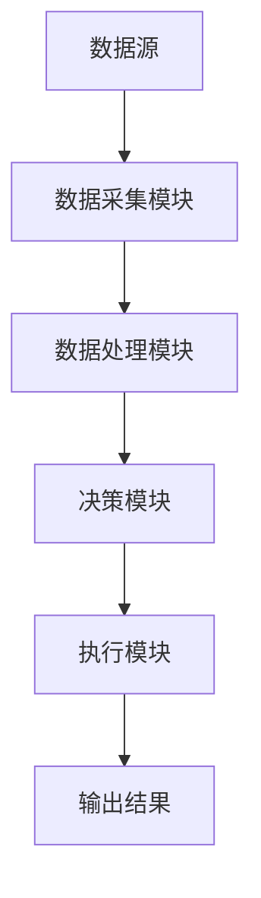

                 


# 企业AI Agent的实时大数据处理架构

> 关键词：企业AI Agent、实时大数据处理、系统架构、算法原理、大数据分析

> 摘要：本文深入探讨了企业AI Agent在实时大数据处理中的架构设计与实现，从核心概念、算法原理到系统架构，再到项目实战，详细分析了企业AI Agent如何高效处理实时大数据。文章结合实际案例，为企业AI Agent的实时大数据处理提供了理论支持和实践指导。

---

# 第一部分：企业AI Agent与实时大数据处理概述

## 第1章：企业AI Agent的背景与概念

### 1.1 AI Agent的基本概念

AI Agent（人工智能代理）是指能够感知环境、自主决策并执行任务的智能体。它能够通过传感器获取信息，利用算法进行分析和决策，并通过执行器与环境交互。AI Agent的核心目标是通过自动化的方式完成特定任务，提高效率和准确性。

在企业环境中，AI Agent的应用场景广泛，例如智能客服、供应链优化、风险预测、实时监控等。企业AI Agent通过实时数据处理，能够快速响应环境变化，做出最优决策。

### 1.2 企业AI Agent的核心特点

企业AI Agent具有以下核心特点：

1. **实时性**：能够实时感知环境变化，并迅速做出响应。
2. **自主性**：能够在没有人工干预的情况下自主决策。
3. **智能性**：能够通过学习和推理，不断优化自身的决策能力。
4. **适应性**：能够根据环境变化调整自身的行为策略。
5. **可扩展性**：能够通过模块化设计，适应不同的业务场景。

### 1.3 实时大数据处理的定义与重要性

实时大数据处理是指对实时生成的数据流进行快速处理和分析，以支持决策的过程。实时大数据处理的核心目标是快速响应数据变化，提高数据处理的效率和准确性。

在企业AI Agent中，实时大数据处理是其核心能力之一。通过实时数据处理，AI Agent能够快速获取环境信息，做出最优决策，并执行相应的动作。实时大数据处理的实现依赖于高效的算法和优化的系统架构。

---

## 第2章：企业AI Agent与实时大数据处理的关联

### 2.1 企业AI Agent的场景与应用

企业AI Agent的应用场景多样，以下是一些典型场景：

1. **智能客服**：通过自然语言处理技术，实现与客户的智能交互，快速解决问题。
2. **供应链优化**：通过实时数据分析，优化供应链的运作效率，降低成本。
3. **风险预测**：通过实时数据分析，预测潜在风险，并制定应对策略。
4. **实时监控**：通过实时数据流处理，监控系统运行状态，及时发现异常。

### 2.2 实时大数据处理对企业AI Agent的影响

实时大数据处理对企业AI Agent的影响主要体现在以下几个方面：

1. **提升决策效率**：通过实时数据处理，AI Agent能够快速获取环境信息，做出最优决策。
2. **增强响应能力**：实时数据处理使得AI Agent能够快速响应环境变化，提高系统的实时性。
3. **优化系统性能**：通过实时数据处理，企业AI Agent能够优化系统性能，提高数据处理的效率和准确性。

### 2.3 企业AI Agent的实时大数据处理架构

企业AI Agent的实时大数据处理架构通常包括以下几个部分：

1. **数据采集层**：负责从各种数据源采集实时数据，例如传感器、数据库、API等。
2. **数据处理层**：负责对采集到的数据进行预处理、分析和计算，例如数据清洗、特征提取、模型推理等。
3. **决策层**：负责根据处理后的数据，制定决策策略，并输出执行指令。
4. **执行层**：负责根据决策层的指令，执行相应的动作，例如发送通知、调整系统参数等。

---

## 第3章：企业AI Agent的实时大数据处理架构设计

### 3.1 系统架构设计原则

企业AI Agent的实时大数据处理架构设计需要遵循以下原则：

1. **高可用性**：确保系统能够7×24小时稳定运行，支持实时数据处理。
2. **可扩展性**：能够根据业务需求，灵活扩展系统容量。
3. **实时性**：确保数据处理的延迟尽可能低，满足实时响应的需求。
4. **可维护性**：系统设计易于维护和升级，支持模块化开发。

### 3.2 系统功能模块设计

企业AI Agent的实时大数据处理架构通常包括以下几个功能模块：

1. **数据采集模块**：负责从各种数据源采集实时数据，例如传感器、数据库、API等。
2. **数据处理模块**：负责对采集到的数据进行预处理、分析和计算，例如数据清洗、特征提取、模型推理等。
3. **决策模块**：负责根据处理后的数据，制定决策策略，并输出执行指令。
4. **执行模块**：负责根据决策模块的指令，执行相应的动作，例如发送通知、调整系统参数等。

### 3.3 系统架构图

以下是企业AI Agent的实时大数据处理架构的系统架构图：



---

## 第4章：企业AI Agent的实时大数据处理算法实现

### 4.1 数据流处理算法

企业AI Agent的实时大数据处理通常涉及数据流处理算法。以下是一些常用的算法：

1. **滑动窗口算法**：用于处理时间窗口内的数据，例如计算过去一分钟的平均值。
2. **队列处理算法**：用于处理实时数据流的队列，例如FIFO队列。
3. **流式计算算法**：用于实时数据流的分布式计算，例如Apache Flink。

### 4.2 数据流处理流程

以下是数据流处理的流程图：


---

## 第5章：企业AI Agent的实时大数据处理实战

### 5.1 项目背景

假设我们是一家电商公司，希望通过企业AI Agent实现实时库存监控。当库存量低于某个阈值时，系统会自动触发补货通知。

### 5.2 项目实现

以下是项目的实现步骤：

1. **数据采集**：从库存数据库中采集实时库存数据。
2. **数据处理**：计算库存量，并与阈值进行比较。
3. **决策制定**：如果库存量低于阈值，触发补货通知。
4. **执行动作**：通过API调用补货系统，执行补货操作。

### 5.3 核心代码实现

以下是数据处理模块的核心代码：

```python
import time

def process_data(data):
    threshold = 100
    if data < threshold:
        return True
    else:
        return False

# 示例数据
data = 80
result = process_data(data)
print(result)  # 输出：True
```

### 5.4 代码解读

上述代码实现了库存数据的处理逻辑。当库存数据低于阈值时，返回True，表示需要触发补货通知。否则，返回False。

---

## 第6章：企业AI Agent的实时大数据处理优化与扩展

### 6.1 系统优化

1. **性能优化**：通过并行计算和分布式处理，提高数据处理的效率。
2. **算法优化**：通过优化算法，降低数据处理的延迟。
3. **系统扩展**：通过增加节点和扩展集群，提高系统的处理能力。

### 6.2 系统扩展

1. **多数据源支持**：支持多种数据源，例如数据库、传感器、API等。
2. **多任务处理**：支持同时处理多个任务，例如库存监控、订单处理、风险预测等。
3. **高可用性设计**：通过冗余设计，提高系统的可用性。

---

## 第7章：企业AI Agent的实时大数据处理总结与展望

### 7.1 本章总结

本文深入探讨了企业AI Agent在实时大数据处理中的架构设计与实现。从核心概念、算法原理到系统架构，再到项目实战，详细分析了企业AI Agent如何高效处理实时大数据。文章结合实际案例，为企业AI Agent的实时大数据处理提供了理论支持和实践指导。

### 7.2 未来展望

未来，企业AI Agent的实时大数据处理将更加智能化和自动化。随着技术的发展，企业AI Agent将能够处理更复杂的数据流，支持更复杂的决策逻辑，为企业带来更大的价值。

---

作者：AI天才研究院 & 禅与计算机程序设计艺术

