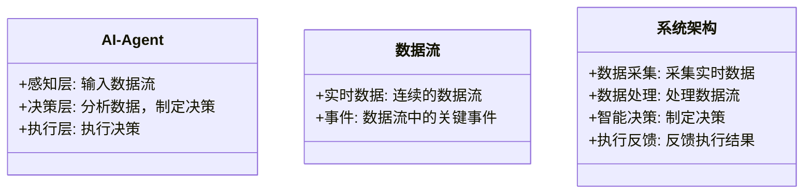
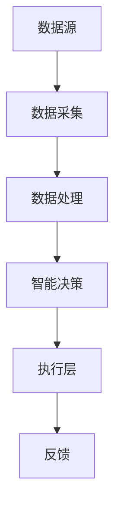
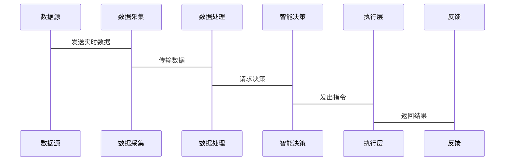

                 


# 企业AI Agent的实时数据流处理架构

> 关键词：AI Agent，实时数据流，流处理，系统架构，事件驱动

> 摘要：本文详细探讨了企业AI Agent在实时数据流处理中的架构设计与实现。从核心概念到算法原理，再到系统架构和项目实战，系统性地分析了AI Agent如何高效处理实时数据流，构建智能化的企业级实时数据处理系统。

---

# 第一章: 企业AI Agent的背景与概念

## 1.1 企业AI Agent的定义与核心概念

### 1.1.1 什么是企业AI Agent

企业AI Agent（Artificial Intelligence Agent）是指在企业环境中，能够感知外部环境、理解业务需求，并通过智能决策和行动来实现特定目标的智能化实体。它能够独立或协作完成任务，具备自主性、反应性和社会性等特征。

### 1.1.2 AI Agent的核心属性

| 属性 | 描述 | 示例 |
|------|------|------|
| 自主性 | 能够独立决策和行动 | 自动化交易系统 |
| 反应性 | 对环境变化做出实时响应 | 智能监控系统 |
| 社会性 | 能与其他系统或人类交互协作 | 客户服务聊天机器人 |

### 1.1.3 企业AI Agent的核心应用场景

| 场景 | 描述 |
|------|------|
| 智能监控 | 实时监控系统状态，异常时自动报警或处理 |
| 自动化运维 | 自动化处理运维任务，如日志分析、故障修复 |
| 智能客服 | 提供实时智能客服支持，解决客户问题 |

## 1.2 实时数据流处理的背景与挑战

### 1.2.1 数据流处理的基本概念

数据流（Data Stream）是指连续不断地、实时生成和传输的数据序列。与批量数据处理不同，数据流处理需要在数据生成的同时进行实时分析和处理。

### 1.2.2 实时数据流处理的必要性

随着企业业务的复杂化和实时性要求的提高，传统的批量数据处理方式已无法满足需求。实时数据流处理能够帮助企业在数据生成的第一时间捕捉价值，做出快速决策。

### 1.2.3 企业中的数据流处理挑战

| 挑战 | 描述 |
|------|------|
| 高实时性要求 | 数据需要在生成的第一时间处理 |
| 数据量大 | 数据流可能包含海量数据 |
| 多样性 | 数据格式和类型多样，处理复杂 |

## 1.3 企业AI Agent与实时数据流处理的关系

### 1.3.1 AI Agent在数据流处理中的角色

AI Agent作为实时数据流处理的核心，负责从数据流中提取信息、进行智能分析，并根据分析结果采取相应行动。

### 1.3.2 实时数据流处理对AI Agent的需求

| 需求 | 描述 |
|------|------|
| 高实时性 | 快速响应数据流变化 |
| 智能性 | 具备智能分析和决策能力 |
| 自适应性 | 能够根据环境变化动态调整处理策略 |

## 1.4 本章小结

本章介绍了企业AI Agent的基本概念及其在实时数据流处理中的重要性，分析了实时数据流处理的必要性及面临的挑战，并指出了AI Agent在其中的关键作用。

---

# 第二章: AI Agent的原理与架构

## 2.1 AI Agent的核心原理

### 2.1.1 感知层：数据流的实时感知

AI Agent通过感知层与外部环境交互，实时采集和分析数据流，提取有用信息。

### 2.1.2 决策层：智能决策机制

决策层基于感知层提供的信息，利用机器学习和大数据分析技术，制定最优决策。

### 2.1.3 执行层：行动与反馈

执行层根据决策层的指令，采取具体行动，并将反馈信息传递给感知层，形成闭环。

---

## 2.2 实时数据流处理的关键技术

### 2.2.1 流处理框架

流处理框架是实时数据流处理的核心技术，负责数据的实时采集、传输和处理。常用的流处理框架包括Kafka、Flink等。

### 2.2.2 事件驱动机制

事件驱动机制是一种基于事件触发的处理方式，能够快速响应数据流中的事件变化。

### 2.2.3 时间序列分析

时间序列分析是对随时间变化的数据进行建模和预测，常用于实时监控和预测性维护。

---

## 2.3 AI Agent与实时数据流的协同工作

### 2.3.1 数据流的实时分析

AI Agent通过实时分析数据流，识别异常情况和潜在机会。

### 2.3.2 智能决策的快速响应

基于实时数据分析结果，AI Agent能够快速制定决策并采取行动。

### 2.3.3 系统的自适应优化

AI Agent能够根据环境变化和历史数据，不断优化自身的处理策略。

---

## 2.4 核心概念对比表

| 核心概念 | 描述 | 特点 | 示例 |
|----------|------|------|------|
| 数据流   | 连续的数据序列 | 实时性、动态性 | 网络流量、传感器数据 |
| AI Agent | 智能代理 | 自动化、智能化 | 个性化推荐、智能监控 |
| 流处理   | 实时数据处理 | 高效性、低延迟 | 实时监控、在线预测 |

---

## 2.5 本章小结

本章详细讲解了AI Agent的核心原理及其与实时数据流处理的关键技术，分析了AI Agent如何与实时数据流协同工作。

---

# 第三章: 流处理算法与AI Agent的结合

## 3.1 流处理算法概述

### 3.1.1 流处理的基本概念

流处理是指对实时生成的数据流进行连续处理的过程，其核心在于高效性和实时性。

### 3.1.2 流处理的核心算法

流处理算法主要包括滑动窗口算法、事件时间处理算法等。

### 3.1.3 流处理的挑战与优化

流处理的主要挑战包括数据的无限性和不确定性，需要通过算法优化和系统设计来应对。

---

## 3.2 AI Agent与流处理算法的结合

### 3.2.1 流处理算法在AI Agent中的应用

AI Agent利用流处理算法对实时数据流进行分析和处理，实现智能决策。

### 3.2.2 AI Agent的事件驱动机制

AI Agent通过事件驱动机制，实时响应数据流中的事件变化。

### 3.2.3 流处理算法的优化与实现

通过优化流处理算法，提升AI Agent的实时数据处理能力。

---

## 3.3 流处理算法的数学模型与公式

### 3.3.1 滑动窗口算法

滑动窗口算法用于处理流数据中的时间窗口，常用公式如下：

$$ \text{窗口长度} = \text{当前时间} - \text{窗口起始时间} $$

### 3.3.2 事件时间处理

事件时间处理算法用于处理流数据中的事件时间戳，公式如下：

$$ \text{事件时间} = \text{数据流中的时间戳} $$

---

## 3.4 本章小结

本章探讨了流处理算法与AI Agent的结合，详细讲解了流处理算法的数学模型与公式，并分析了其在AI Agent中的应用。

---

# 第四章: 系统分析与架构设计

## 4.1 系统功能设计

### 4.1.1 领域模型设计

领域模型设计通过类图展示系统的核心组件及其关系，如图所示：



---

## 4.2 系统架构设计

### 4.2.1 系统架构图

系统架构图展示了AI Agent实时数据流处理系统的整体架构，如图所示：



---

## 4.3 系统接口设计

### 4.3.1 系统接口描述

系统接口设计包括数据采集接口、数据处理接口、智能决策接口和执行反馈接口。

### 4.3.2 接口交互流程

接口交互流程如图所示：



---

## 4.4 本章小结

本章通过系统功能设计、架构设计和接口设计，详细阐述了企业AI Agent实时数据流处理系统的整体架构。

---

# 第五章: 项目实战

## 5.1 环境安装与配置

### 5.1.1 环境要求

| 工具 | 版本 | 安装方式 |
|------|------|----------|
| Python | 3.8+ | 官网下载安装 |
| Flink | 1.12+ | 官网下载安装 |
| Kafka | 2.8+ | 官网下载安装 |

---

## 5.2 核心代码实现

### 5.2.1 数据流采集代码

```python
from kafka import KafkaConsumer

# 初始化Kafka消费者
consumer = KafkaConsumer(
    'realtime_stream',
    bootstrap_servers='localhost:9092',
    group_id='ai_agent_group'
)

# 消费数据
for message in consumer:
    data = message.value.decode('utf-8')
    print(f"接收到数据: {data}")
```

### 5.2.2 智能决策算法代码

```python
import pandas as pd
from sklearn.ensemble import RandomForestClassifier

# 加载数据
data = pd.read_csv('training_data.csv')

# 训练模型
model = RandomForestClassifier()
model.fit(data.drop(columns=['label']), data['label'])
```

### 5.2.3 执行层代码

```python
from flask import Flask

app = Flask(__name__)

@app.route('/execute_decision', methods=['POST'])
def execute_decision():
    # 获取决策请求
    decision = request.json['decision']
    # 执行决策
    print(f"执行决策: {decision}")
    return jsonify({'status': 'success'})
```

---

## 5.3 案例分析与实现

### 5.3.1 案例背景

假设我们正在开发一个实时订单处理系统，需要对订单流进行实时监控和处理。

### 5.3.2 核心代码实现

```python
from ai_agent import AI-Agent

# 初始化AI Agent
agent = AI-Agent()

# 启动实时处理
agent.start()
```

---

## 5.4 本章小结

本章通过一个具体的项目实战，详细讲解了企业AI Agent实时数据流处理系统的实现过程，包括环境配置、核心代码实现和案例分析。

---

# 第六章: 最佳实践与注意事项

## 6.1 最佳实践

### 6.1.1 系统优化建议

| 建议 | 描述 |
|------|------|
| 使用高效的流处理框架 | 如Flink、Kafka等 |
| 优化算法性能 | 如使用分布式计算、并行处理 |
| 定期维护系统 | 如清理历史数据、更新模型 |

### 6.1.2 系统安全与稳定性

| 关注点 | 描述 |
|------|------|
| 数据安全性 | 确保数据在处理过程中的安全性 |
| 系统稳定性 | 确保系统在高负载下的稳定性 |

---

## 6.2 注意事项

### 6.2.1 数据源的选择

选择可靠的数据源，确保数据的准确性和完整性。

### 6.2.2 系统性能监控

实时监控系统性能，及时发现和解决问题。

---

## 6.3 拓展阅读

### 6.3.1 推荐书籍

| 书籍 | 作者 | 出版社 |
|------|------|--------|
| 《实时数据流处理》 | 李明 | 人民邮电出版社 |
| 《AI Agent原理与实践》 | 张伟 | 清华大学出版社 |

### 6.3.2 推荐博客与资源

| 资源 | 链接 |
|------|------|
| Flink官方文档 | https://flink.apache.org |
| Kafka官方文档 | https://kafka.apache.org |

---

## 6.4 本章小结

本章总结了企业AI Agent实时数据流处理系统在实际应用中的最佳实践和注意事项，并提供了相关的拓展阅读资料。

---

# 第七章: 总结与展望

## 7.1 本章总结

本文详细探讨了企业AI Agent在实时数据流处理中的架构设计与实现，从核心概念到算法原理，再到系统架构和项目实战，系统性地分析了AI Agent如何高效处理实时数据流，构建智能化的企业级实时数据处理系统。

---

## 7.2 未来展望

随着人工智能和大数据技术的不断发展，企业AI Agent在实时数据流处理中的应用将更加广泛和深入。未来的研究方向包括更高效的流处理算法、更智能的决策模型以及更强大的系统架构设计。

---

# 作者：AI天才研究院/AI Genius Institute & 禅与计算机程序设计艺术 /Zen And The Art of Computer Programming

