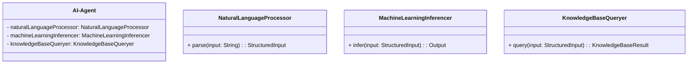
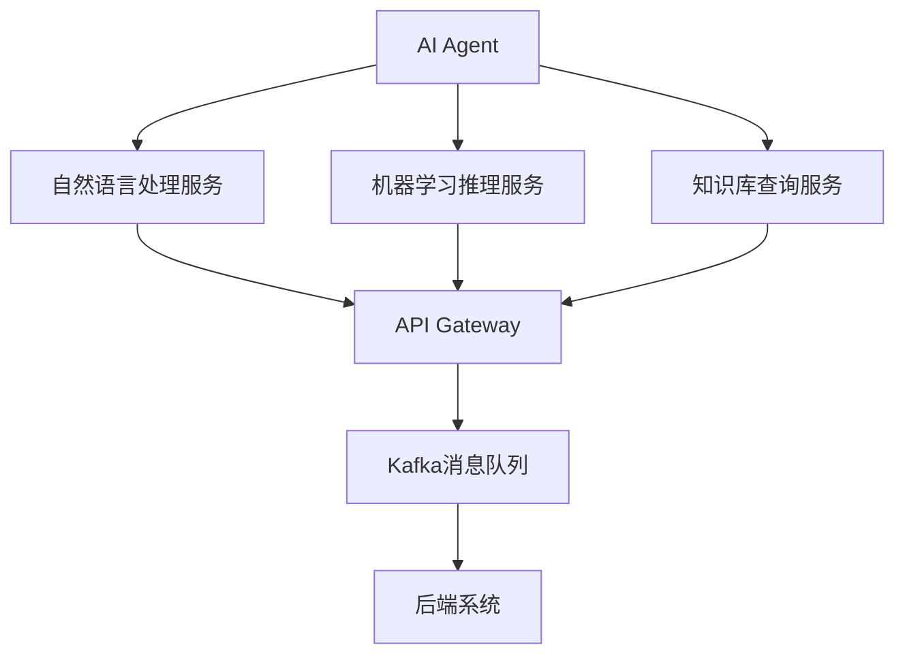
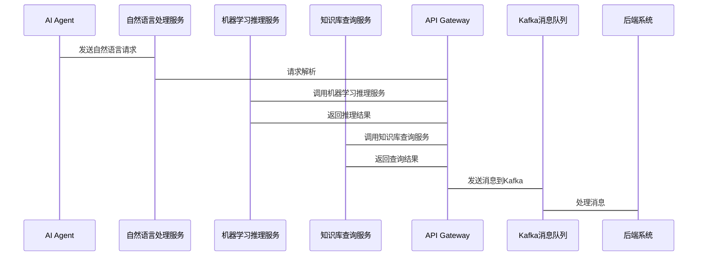

                 


# 《企业AI Agent的容器化微服务部署策略》

---

## 关键词：企业AI Agent、容器化、微服务、部署策略、Kubernetes、Docker、微服务架构

---

## 摘要：

随着人工智能技术的快速发展，企业AI Agent（人工智能代理）在各个行业的应用越来越广泛。AI Agent能够通过自然语言处理、机器学习等技术，为企业提供智能化的决策支持和自动化服务。然而，AI Agent的高效部署和管理对企业提出了新的挑战。为了应对这些挑战，容器化和微服务架构成为了企业AI Agent部署的首选策略。本文将从背景、核心概念、算法原理、系统架构设计、项目实战等方面，详细探讨企业AI Agent的容器化微服务部署策略。

---

# 第一部分：企业AI Agent的容器化微服务部署背景

## 第1章：企业AI Agent的背景与需求

### 1.1 AI Agent的基本概念

AI Agent（人工智能代理）是一种能够感知环境并采取行动以实现目标的智能实体。它通常具备以下核心功能：

- **感知能力**：通过传感器、API等手段获取环境信息。
- **决策能力**：基于获取的信息，利用机器学习模型进行分析和决策。
- **执行能力**：通过与外部系统（如数据库、API等）交互，执行具体的任务。

AI Agent在企业中的应用场景非常广泛，例如：
- **智能客服**：通过自然语言处理技术，为用户提供24小时在线的智能咨询服务。
- **自动化运维**：通过监控系统日志，自动发现并修复问题。
- **智能调度**：通过机器学习模型，优化企业资源的分配。

### 1.2 容器化技术的背景与优势

容器化技术是一种轻量级的虚拟化技术，通过容器运行时环境（如Docker）将应用程序及其依赖打包成一个独立的容器，确保应用程序在不同的环境中一致运行。

容器化技术的核心优势包括：
- **轻量级隔离**：相比于虚拟机，容器的资源占用更少，启动速度更快。
- **一致性**：容器化确保了应用程序在开发、测试和生产环境中的运行一致性。
- **可扩展性**：容器化技术支持快速部署和弹性扩展。

### 1.3 微服务架构的背景与优势

微服务架构是一种将应用程序分解为多个小型、独立服务的设计理念。每个服务都可以独立开发、测试和部署，且服务之间通过HTTP、RPC等协议进行通信。

微服务架构的核心优势包括：
- **松耦合**：微服务之间通过定义明确的接口进行通信，降低了服务之间的耦合度。
- **可扩展性**：每个服务可以根据需求独立扩展。
- **技术多样性**：每个服务可以选择不同的技术栈，灵活应对不同的业务需求。

### 1.4 企业AI Agent的容器化部署需求

为了满足企业AI Agent的高效部署和管理需求，容器化和微服务架构的结合变得尤为重要。容器化技术能够确保AI Agent在不同环境中的一致性运行，而微服务架构则能够提高系统的灵活性和可扩展性。此外，容器化和微服务架构的结合还能够实现AI Agent的快速迭代和高效运维。

---

## 第2章：企业AI Agent容器化微服务部署的核心概念

### 2.1 容器化部署的基本原理

容器化部署的核心是通过容器运行时环境（如Docker）将应用程序打包成一个独立的容器。容器包含了应用程序运行所需的依赖和配置，确保应用程序在任何环境中都能一致运行。

#### 2.1.1 容器运行时环境

容器运行时环境是容器化部署的基础，常见的容器运行时包括Docker、Containerd和CRIU等。Docker是最常用的容器运行时，它通过Linux容器技术实现轻量级虚拟化。

#### 2.1.2 容器编排工具

容器编排工具（如Kubernetes）用于管理和编排多个容器，确保应用程序的高效运行和容错性。Kubernetes提供了容器编排、服务发现、负载均衡、自动扩缩容等功能，是企业AI Agent容器化部署的核心工具。

#### 2.1.3 容器镜像管理

容器镜像是容器化部署的核心资产，通过Dockerfile构建容器镜像，并通过容器镜像仓库（如Docker Hub）进行管理和分发。

### 2.2 微服务架构下的AI Agent部署

微服务架构将AI Agent分解为多个小型服务，每个服务负责特定的功能。例如：
- **自然语言处理服务**：负责解析用户的自然语言输入。
- **机器学习推理服务**：负责基于解析后的请求进行预测和决策。
- **知识库查询服务**：负责从知识库中获取相关信息。

#### 2.2.1 微服务架构与AI Agent的结合

微服务架构的灵活性和可扩展性非常适合AI Agent的部署。通过将AI Agent分解为多个微服务，企业可以灵活调整各服务的资源分配，实现高效的资源利用。

#### 2.2.2 微服务间通信机制

微服务之间的通信可以通过以下几种方式实现：
- **HTTP RESTful API**：通过HTTP协议进行服务之间的通信。
- **RPC（远程过程调用）**：通过gRPC等RPC协议实现服务之间的通信。
- **消息队列（如Kafka、RabbitMQ）**：通过消息队列实现异步通信。

#### 2.2.3 微服务的容错与自愈机制

微服务架构需要具备容错和自愈能力，以确保系统的高可用性。通过容器编排工具（如Kubernetes），可以实现服务的自动重启、自动扩展和自动恢复。

### 2.3 容器化与微服务的结合

容器化和微服务的结合能够充分发挥两者的各自优势。容器化提供了一致性和轻量级隔离，而微服务架构提供了灵活性和可扩展性。

#### 2.3.1 容器化如何支持微服务架构

容器化通过将每个微服务打包成一个独立的容器，确保每个微服务的独立运行和资源隔离。

#### 2.3.2 微服务架构如何提升容器化部署效率

微服务架构通过将应用程序分解为多个小型服务，能够灵活调整容器的资源分配和扩展策略。

#### 2.3.3 容器化与微服务的协同优化

通过容器编排工具（如Kubernetes），可以实现微服务的自动扩缩容、负载均衡和服务发现，从而提高系统的整体效率。

---

## 第3章：企业AI Agent容器化微服务部署的算法原理

### 3.1 容器编排算法原理

容器编排算法的核心是通过算法实现容器的高效调度和资源分配。

#### 3.1.1 负载均衡算法

负载均衡算法用于将请求均匀分配到多个服务实例上，常见的负载均衡算法包括：
- **轮询法**：依次将请求分配到每个服务实例。
- **加权轮询法**：根据服务实例的权重分配请求。
- **随机法**：随机选择一个服务实例进行请求分配。

#### 3.1.2 容器调度算法

容器调度算法用于在多个节点上选择最优的节点来运行容器。常见的容器调度算法包括：
- **最短剩余时间优先（Shortest Remaining Time First, SRTF）**：优先选择剩余运行时间最短的任务。
- **最长剩余时间优先（Longest Remaining Time First, LRTF）**：优先选择剩余运行时间最长的任务。

#### 3.1.3 容器资源分配算法

容器资源分配算法用于在多个容器之间分配有限的资源（如CPU、内存）。常见的资源分配算法包括：
- **比例分配算法**：根据容器的需求比例分配资源。
- **公平分配算法**：确保每个容器都能公平地获得资源。

### 3.2 微服务通信机制

微服务之间的通信机制需要考虑性能、可靠性和安全性。

#### 3.2.1 HTTP通信协议

HTTP通信协议通过RESTful API实现微服务之间的通信。HTTP通信协议的优势是简单易用，但可能存在性能瓶颈。

#### 3.2.2 RPC通信协议

RPC通信协议（如gRPC）通过HTTP/2实现更高效的通信。RPC通信协议的优势是性能高，但实现复杂。

#### 3.2.3 消息队列机制

消息队列机制（如Kafka、RabbitMQ）通过异步通信实现微服务之间的高效通信。消息队列机制的优势是能够处理大量的异步请求，但实现复杂度较高。

### 3.3 算法原理的数学模型与公式

#### 3.3.1 负载均衡算法的数学模型

轮询法的数学模型可以表示为：
$$
\text{选择下一个服务实例} = (i + 1) \mod n
$$
其中，i是当前请求的序号，n是服务实例的数量。

#### 3.3.2 容器调度算法的数学模型

SRTF算法的数学模型可以表示为：
$$
\text{选择剩余运行时间最短的任务} = \argmin_{j=1}^{n} (T_j - t)
$$
其中，T_j是任务j的完成时间，t是当前时间。

#### 3.3.3 微服务通信机制的数学模型

HTTP通信的延迟可以通过以下公式近似计算：
$$
\text{延迟} = \frac{\text{请求数}}{\text{带宽}}
$$
其中，带宽是网络的传输带宽，请求数是单位时间内发送的请求数。

---

## 第4章：企业AI Agent容器化微服务部署的系统架构设计

### 4.1 系统功能设计

企业AI Agent的容器化微服务部署系统需要实现以下功能：
- **服务发现**：通过服务注册与发现实现微服务之间的通信。
- **负载均衡**：通过负载均衡算法实现请求的均匀分配。
- **容错与自愈**：通过容器编排工具实现服务的自动重启和扩展。

#### 4.1.1 领域模型类图

以下是企业AI Agent的领域模型类图：



#### 4.1.2 系统架构图

以下是企业AI Agent容器化微服务部署的系统架构图：



#### 4.1.3 系统交互序列图

以下是企业AI Agent容器化微服务部署的系统交互序列图：



### 4.2 项目实战

#### 4.2.1 环境安装

以下是项目实战的环境安装步骤：

1. **安装Docker**：
   ```bash
   # 在Ubuntu上安装Docker
   sudo apt-get update
   sudo apt-get install docker.io
   ```

2. **安装Kubernetes**：
   ```bash
   # 使用kubeadm安装Kubernetes
   sudo apt-get install kubeadm kubectl
   ```

3. **安装gRPC和golang**：
   ```bash
   # 安装golang
   sudo apt-get install golang
   ```

#### 4.2.2 核心代码实现

以下是核心代码实现的示例：

1. **自然语言处理服务（Python）**：
   ```python
   from flask import Flask, request

   app = Flask(__name__)

   @app.route('/parse', methods=['POST'])
   def parse():
       input = request.json['input']
       # 解析自然语言输入
       structured_input = parse_natural_language(input)
       return {'status': 'success', 'result': structured_input}

   def parse_natural_language(input):
       # 示例解析逻辑
       return {'intent': 'query', 'entities': {'name': 'John'}}
   ```

2. **机器学习推理服务（TensorFlow）**：
   ```python
   import tensorflow as tf
   from flask import Flask, request

   app = Flask(__name__)

   # 加载机器学习模型
   model = tf.keras.models.load_model('model.h5')

   @app.route('/infer', methods=['POST'])
   def infer():
       input = request.json['input']
       # 进行机器学习推理
       prediction = model.predict(input)
       return {'status': 'success', 'result': prediction.tolist()}

   if __name__ == '__main__':
       app.run()
   ```

3. **知识库查询服务（PostgreSQL）**：
   ```python
   import psycopg2
   from flask import Flask, request

   app = Flask(__name__)

   # 连接PostgreSQL数据库
   conn = psycopg2.connect(
       host='localhost',
       database='knowledge_base',
       user='postgres',
       password='password'
   )

   @app.route('/query', methods=['POST'])
   def query():
       input = request.json['input']
       # 执行数据库查询
       cursor = conn.cursor()
       cursor.execute("SELECT * FROM knowledge WHERE id = %s", (input,))
       result = cursor.fetchall()
       return {'status': 'success', 'result': result}

   if __name__ == '__main__':
       app.run()
   ```

#### 4.2.3 代码解读与分析

以上代码实现了三个微服务：
- **自然语言处理服务**：通过Flask框架提供自然语言解析功能。
- **机器学习推理服务**：基于TensorFlow框架提供机器学习推理功能。
- **知识库查询服务**：通过PostgreSQL数据库提供知识库查询功能。

每个服务都通过HTTP API进行通信，并通过Kubernetes进行容器编排和负载均衡。

#### 4.2.4 案例分析与详细讲解

以一个简单的智能客服系统为例，展示如何通过企业AI Agent的容器化微服务部署策略实现系统的高效运行。

1. **用户请求**：
   用户通过智能客服系统发送一条自然语言请求：“查询John的订单状态。”

2. **自然语言处理服务**：
   自然语言处理服务解析用户的请求，生成结构化的输入：“intent: query，entities: {name: John}。”

3. **机器学习推理服务**：
   机器学习推理服务根据结构化的输入，生成对应的查询请求：“查询John的订单状态。”

4. **知识库查询服务**：
   知识库查询服务通过PostgreSQL数据库查询John的订单信息，并返回结果。

5. **结果返回**：
   API Gateway将结果返回给用户。

通过以上步骤，用户能够快速获得订单状态，整个过程高效且可靠。

---

## 第5章：企业AI Agent容器化微服务部署的最佳实践

### 5.1 最佳实践

1. **服务粒度的划分**：
   - 服务粒度要足够细，确保每个服务的功能单一且明确。
   - 避免服务粒度过粗，导致服务之间的耦合度过高。

2. **容器资源分配**：
   - 根据服务的需求动态分配资源，确保资源的高效利用。
   - 使用Kubernetes的资源配额和限制（如Requests和Limits）进行资源管理。

3. **监控与日志**：
   - 使用Prometheus和Grafana进行容器和微服务的监控。
   - 使用ELK（Elasticsearch、Logstash、Kibana）进行日志的收集和分析。

4. **安全性**：
   - 使用API Gateway进行统一的认证和授权。
   - 在容器之间使用Service Mesh（如Istio）实现安全的通信。

5. **可扩展性**：
   - 使用Kubernetes的自动扩缩容功能，根据负载动态调整容器的数量。
   - 使用弹性负载均衡（ELB）实现流量的自动分配。

### 5.2 小结

企业AI Agent的容器化微服务部署策略通过容器化和微服务架构的结合，能够实现系统的高效运行和灵活扩展。通过合理的服务粒度划分、资源分配和监控管理，企业可以充分发挥容器化和微服务架构的优势，构建高效、可靠、安全的AI Agent系统。

---

## 第6章：总结与展望

### 6.1 总结

本文详细探讨了企业AI Agent的容器化微服务部署策略，从背景、核心概念、算法原理、系统架构设计、项目实战到最佳实践，全面分析了企业AI Agent容器化微服务部署的关键点。通过本文的讲解，读者可以深入了解企业AI Agent的容器化微服务部署的理论基础和实践方法。

### 6.2 展望

未来，随着人工智能技术的不断发展，企业AI Agent的容器化微服务部署将面临更多的挑战和机遇。容器化和微服务架构的结合将继续优化企业的AI Agent系统，同时，随着边缘计算、Serverless等技术的发展，企业AI Agent的容器化微服务部署也将朝着更加智能化、高效化的方向发展。

---

## 作者：AI天才研究院/AI Genius Institute & 禅与计算机程序设计艺术 /Zen And The Art of Computer Programming

---

**摘要：** 本文系统地探讨了企业AI Agent的容器化微服务部署策略，从背景、核心概念、算法原理、系统架构设计、项目实战到最佳实践，全面分析了企业AI Agent容器化微服务部署的关键点。通过本文的讲解，读者可以深入了解企业AI Agent的容器化微服务部署的理论基础和实践方法。

