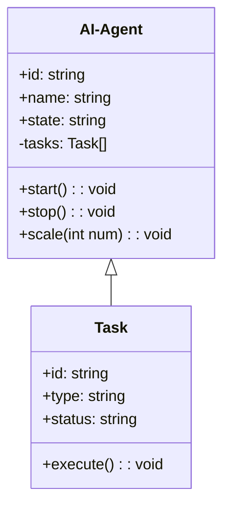
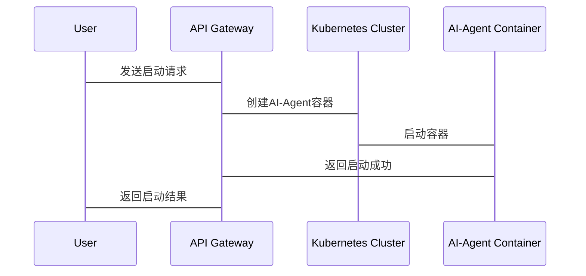

                 


# 企业AI Agent的容器化部署策略

> 关键词：企业AI Agent，容器化部署，Docker，Kubernetes，AI应用

> 摘要：本文深入探讨了企业AI Agent的容器化部署策略，从背景概念、核心技术到算法原理、系统架构设计、项目实战以及最佳实践等方面进行详细分析，为企业在AI Agent的容器化部署中提供有价值的指导。

---

## 第1章 企业AI Agent概述

### 1.1 AI Agent的基本概念

#### 1.1.1 AI Agent的定义与分类
AI Agent（人工智能代理）是指能够感知环境、自主决策并执行任务的智能实体。根据功能和应用场景的不同，AI Agent可以分为**简单反射型代理**、**基于模型的反射型代理**、**目标驱动型代理**和**效用驱动型代理**。这些代理在企业中承担着自动化决策、数据处理、客户交互等多种任务。

#### 1.1.2 企业级AI Agent的特点
企业级AI Agent通常具备以下特点：
- **高可用性**：确保在复杂的企业环境中稳定运行。
- **可扩展性**：能够根据负载自动扩展资源。
- **智能化**：具备自主学习和决策能力。
- **安全性**：保护企业数据和系统的安全。

#### 1.1.3 AI Agent在企业中的应用场景
AI Agent在企业中的应用场景广泛，主要包括：
- **自动化运维**：监控系统状态，自动修复问题。
- **智能客服**：通过自然语言处理提供客户服务。
- **数据分析与决策**：协助企业做出数据驱动的决策。

### 1.2 容器化技术概述

#### 1.2.1 容器化技术的基本概念
容器化是一种轻量级虚拟化技术，通过将应用程序及其依赖项打包成一个可执行文件（镜像），实现环境无关的运行。容器运行时需要宿主机的操作系统内核支持。

#### 1.2.2 容器化与虚拟化的区别
容器化与虚拟化的主要区别如下：

| 特性       | 容器化                     | 虚拟化                     |
|------------|--------------------------|--------------------------|
| 资源消耗     | 较低，共享宿主内核         | 较高，每个虚拟机独立内核    |
| 启动速度     | 快，秒级启动              | 较慢，分钟级启动            |
| 隔离性       | 较弱，共享宿主资源        | 较强，独立资源              |

#### 1.2.3 容器化技术的优势
容器化技术的优势主要体现在：
- **轻量化**：资源占用低，启动速度快。
- **一致性**：保证开发、测试和生产环境一致。
- **可扩展性**：支持快速部署和弹性伸缩。

### 1.3 企业AI Agent与容器化部署的结合

#### 1.3.1 企业AI Agent的容器化需求
企业AI Agent的容器化需求主要体现在：
- **快速部署**：通过容器化实现快速交付。
- **弹性扩展**：根据负载自动调整资源。
- **环境一致性**：确保不同环境下的运行一致性。

#### 1.3.2 容器化部署对企业AI Agent的意义
容器化部署为企业AI Agent提供了以下优势：
- **提升效率**：简化部署流程，降低运维成本。
- **增强弹性**：应对高负载和流量波动。
- **加速创新**：快速迭代和发布新功能。

#### 1.3.3 企业AI Agent容器化部署的挑战
企业AI Agent容器化部署面临的主要挑战包括：
- **资源管理**：高效分配和回收资源。
- **安全性**：确保容器间隔离和数据安全。
- **复杂性**：处理多组件协同和依赖管理。

---

## 第2章 容器化部署的核心技术

### 2.1 Docker容器技术

#### 2.1.1 Docker容器的基本原理
Docker容器通过**cgroups**和**namespaces**实现进程隔离，每个容器运行在一个独立的沙箱环境中。Docker镜像由文件系统、元数据和运行时配置组成，支持快速构建和分发。

#### 2.1.2 Docker镜像的构建与管理
构建Docker镜像的基本步骤如下：
1. 编写Dockerfile，定义基础镜像、安装依赖和构建应用。
2. 使用`docker build`命令构建镜像。
3. 通过`docker push`将镜像推送到镜像仓库。
4. 使用`docker run`命令启动容器。

#### 2.1.3 Docker容器的生命周期
Docker容器的生命周期包括：
1. **创建**：通过镜像创建容器。
2. **启动**：执行容器内的进程。
3. **停止**：终止容器内的进程。
4. **删除**：清理容器及其资源。

### 2.2 容器编排技术

#### 2.2.1 Kubernetes的基本概念
Kubernetes是一个开源的容器编排平台，支持自动化部署、扩展和自愈。其核心组件包括**apiserver**、**controller-manager**、**scheduler**和**kubelet**。

#### 2.2.2 Kubernetes的组件与功能
Kubernetes的组件及其功能如下：

| 组件             | 功能描述                                       |
|------------------|---------------------------------------------|
| API Server       | 提供REST API接口，管理集群状态。           |
| Controller Manager| 监控节点状态，确保Pod运行在正确的节点。     |
| Scheduler          | 调度Pod到合适的节点。                       |
| Kubelet           | 节点的运行时管理器，负责Pod的生命周期管理。  |

#### 2.2.3 容器编排的常见策略
容器编排的常见策略包括：
- **滚动更新**：逐步替换旧容器。
- **蓝绿部署**：通过两组相同的环境进行部署。
- ** Canary部署**：部分用户先体验新版本。

### 2.3 容器网络与存储

#### 2.3.1 容器网络的实现原理
容器网络通过**网桥**和**iptables**实现网络隔离，每个容器拥有独立的网络栈。常见的容器网络方案包括Docker的桥接模式和-overlay网络。

#### 2.3.2 容器存储的管理策略
容器存储管理策略包括：
- **持久化存储**：使用块设备或文件存储，确保数据不丢失。
- **临时存储**：使用内存存储，适用于临时数据。

#### 2.3.3 容器安全的注意事项
容器安全需要注意以下几点：
- **镜像安全**：确保镜像来源可靠。
- **权限管理**：严格控制容器内的权限。
- **网络隔离**：防止容器间的未授权访问。

---

## 第3章 核心概念与联系

### 3.1 容器化部署的原理

#### 3.1.1 容器化部署的流程
容器化部署的典型流程如下：
1. **构建镜像**：编写Dockerfile并构建镜像。
2. **部署到集群**：使用Kubernetes进行部署。
3. **自动扩缩容**：根据负载自动调整副本数。
4. **监控与自愈**：实时监控状态，自动修复异常容器。

#### 3.1.2 容器编排算法
Kubernetes的调度算法主要基于**反亲和性和亲和性**规则，通过计算节点的负载和资源使用情况，选择最优的节点部署Pod。

#### 3.1.3 容器编排的数学模型
容器编排的数学模型可以表示为：
$$
\text{优化目标} = \sum_{i=1}^{n} w_i x_i \\
\text{约束条件} = \{c_1, c_2, \dots, c_m\}
$$
其中，\( w_i \) 是权重，\( x_i \) 是决策变量，\( c_j \) 是约束条件。

---

## 第4章 系统分析与架构设计

### 4.1 问题场景介绍

#### 4.1.1 系统需求分析
企业AI Agent的系统需求包括：
- **高可用性**：确保系统稳定运行。
- **弹性扩展**：应对负载波动。
- **安全性**：保护数据和系统安全。

### 4.2 系统功能设计

#### 4.2.1 领域模型类图
领域模型类图如下：



### 4.3 系统架构设计

#### 4.3.1 系统架构图
系统架构图如下：

```mermaid
graph TD
    API Gateway --> Kubernetes Cluster
    Kubernetes Cluster --> Worker Nodes
    Worker Nodes --> AI-Agent Containers
    AI-Agent Containers --> Task Queues
    Task Queues --> Task Processors
```

### 4.4 系统接口设计

#### 4.4.1 接口设计
主要接口包括：
- **API Gateway**：接收外部请求并路由到AI Agent。
- **Kubernetes API**：管理容器的生命周期。
- **Task Queue**：处理任务队列，实现任务分发。

### 4.5 系统交互序列图

#### 4.5.1 启动流程
启动流程如下：



---

## 第5章 项目实战

### 5.1 环境安装

#### 5.1.1 安装Docker
在Linux系统中，安装Docker的步骤如下：
```bash
sudo apt-get update
sudo apt-get install docker.io
sudo systemctl start docker
sudo systemctl enable docker
```

#### 5.1.2 安装Kubernetes
安装Kubernetes需要配置Docker作为默认容器运行时，并安装Kubeadm：
```bash
sudo apt-get install kubeadm kubelet kubectl
sudo systemctl start kubelet
sudo systemctl enable kubelet
```

### 5.2 核心代码实现

#### 5.2.1 AI Agent的Python代码
```python
class AI-Agent:
    def __init__(self):
        self.id = ""
        self.name = ""
        self.state = "idle"
        self.tasks = []

    def start(self):
        self.state = "running"
        print(f"AI Agent {self.name} 已启动")

    def stop(self):
        self.state = "stopped"
        print(f"AI Agent {self.name} 已停止")

    def scale(self, num):
        # 调整副本数量
        print(f"AI Agent {self.name} 调整副本数量为 {num}")

class Task:
    def __init__(self):
        self.id = ""
        self.type = ""
        self.status = "pending"

    def execute(self):
        self.status = "executing"
        print(f"任务 {self.id} 正在执行")
```

#### 5.2.2 Kubernetes部署配置
Kubernetes部署配置文件（deployment.yml）：
```yaml
apiVersion: apps/v1
kind: Deployment
metadata:
  name: aientity-deployment
spec:
  replicas: 3
  selector:
    matchLabels:
      app: aientity
  template:
    metadata:
      labels:
        app: aientity
    spec:
      containers:
      - name: aientity-container
        image: aientity-agent:v1
        ports:
        - containerPort: 8080
```

### 5.3 案例分析

#### 5.3.1 部署与验证
使用以下命令部署AI Agent：
```bash
kubectl apply -f deployment.yml
```
验证部署状态：
```bash
kubectl get pods -l app=aientity
```

#### 5.3.2 扩展与监控
调整副本数量：
```bash
kubectl scale deployment aientity-deployment --replicas=5
```
监控资源使用情况：
```bash
kubectl top pods
```

---

## 第6章 最佳实践与小结

### 6.1 总结
企业AI Agent的容器化部署为企业带来了高效、弹性、一致的运行环境。通过合理选择容器化技术和工具，可以显著提升系统的可维护性和扩展性。

### 6.2 注意事项
在实际部署中，需要注意以下几点：
- **资源分配**：合理规划资源，避免浪费。
- **安全策略**：严格控制容器间的访问权限。
- **监控与日志**：实时监控系统状态，及时发现和解决问题。

### 6.3 小结
本文详细探讨了企业AI Agent的容器化部署策略，从理论到实践，为企业提供了全面的指导。未来，随着技术的发展，容器化部署将更加智能化和自动化。

### 6.4 扩展阅读
建议进一步阅读以下内容：
- Kubernetes官方文档：[https://kubernetes.io/docs/](https://kubernetes.io/docs/)
- Docker官方文档：[https://docs.docker.com/](https://docs.docker.com/)

---

## 作者
作者：AI天才研究院 & 禅与计算机程序设计艺术

---

希望这篇文章能够为企业在AI Agent的容器化部署中提供有价值的参考和指导。

