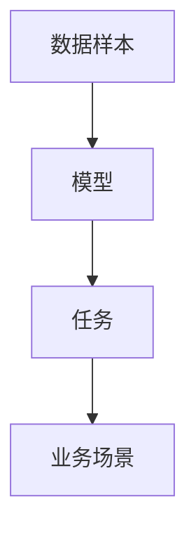
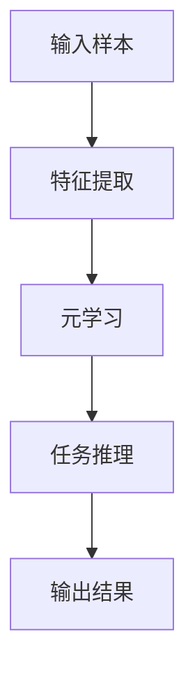
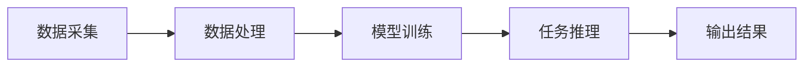
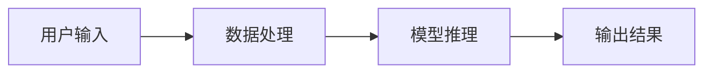

                 


# 企业AI Agent的少样本学习：快速适应新业务场景

> 关键词：企业AI Agent，少样本学习，快速业务适应，数据驱动决策，智能系统设计

> 摘要：本文深入探讨了企业AI Agent在少样本学习中的应用，通过系统化的分析和实践，详细介绍了如何通过少样本学习快速适应新业务场景。文章从背景、核心概念、算法原理、系统架构到项目实战，层层递进，结合具体案例和代码实现，为读者提供了一套完整的解决方案。通过本文，读者将能够理解并掌握少样本学习在企业AI Agent中的核心作用，以及如何在实际业务场景中快速部署和应用。

---

# 第一部分：企业AI Agent的少样本学习基础

## 第1章：企业AI Agent与少样本学习背景介绍

### 1.1 问题背景与问题描述

在企业AI Agent的开发和应用中，数据量的获取往往是一个关键挑战。传统深度学习方法依赖于大量标注数据，这在企业环境中可能难以实现，尤其是在新兴业务场景中，标注数据的获取成本高、效率低。此外，企业环境中的数据分布通常具有领域特异性，这使得通用预训练模型在特定业务场景中的适应性有限。

#### 1.1.1 传统AI Agent的局限性

传统AI Agent的设计依赖于大量的标注数据和固定的训练流程。然而，企业在实际应用中，尤其是在新业务场景中，往往缺乏足够的标注数据，且数据分布可能与训练数据存在显著差异。这种情况下，传统AI Agent的性能和效果难以保证，导致其在实际应用中的适应性不足。

#### 1.1.2 少样本学习的定义与特点

少样本学习（Few-shot Learning）是一种机器学习方法，旨在在仅提供少量标注数据的情况下，通过学习数据的特征和模式，实现对新数据的分类、回归或其他任务。其特点包括：

1. **数据高效性**：在少量数据下实现高性能。
2. **领域适应性**：能够快速适应新的业务场景。
3. **可解释性**：通过元学习等方法，提供可解释的推理过程。

#### 1.1.3 企业AI Agent中的少样本学习需求

在企业环境中，AI Agent需要快速适应新的业务场景，例如客服、数据分析、流程自动化等。少样本学习能够帮助AI Agent在缺乏标注数据的情况下，快速学习并适应新的任务，从而提高企业的效率和竞争力。

### 1.2 少样本学习的核心概念

少样本学习的核心概念包括元学习、相似性学习、迁移学习等。元学习是一种特殊形式的少样本学习，其目标是通过学习如何学习，从而快速适应新的任务。

#### 1.2.1 核心要素组成

少样本学习在企业AI Agent中的核心要素包括：

1. **样本数据**：少量标注数据和大量未标注数据。
2. **学习模型**：支持少样本学习的模型架构。
3. **推理任务**：需要快速适应的新任务。

### 1.3 本章小结

本章介绍了企业AI Agent在少样本学习中的背景和需求，重点阐述了少样本学习的核心概念和特点。通过理解这些内容，读者可以为后续章节的学习打下坚实的基础。

---

## 第2章：少样本学习的核心概念与联系

### 2.1 核心概念原理

少样本学习的原理主要基于元学习和相似性学习。元学习通过在多个任务上进行训练，学习如何快速适应新的任务。相似性学习则通过寻找数据之间的相似性，进行分类或回归。

#### 2.1.1 元学习的定义与原理

元学习是一种通过学习如何学习的方法。其核心思想是，通过在多个任务上进行训练，模型能够学习到一种“元知识”，从而快速适应新的任务。

#### 2.1.2 少样本学习的分类与特点

少样本学习可以分为基于特征的方法和基于模型的方法。基于特征的方法通过提取数据的特征，进行分类或回归；基于模型的方法则通过构建支持少样本学习的模型架构，实现任务的快速适应。

### 2.2 核心概念对比分析

#### 2.2.1 少样本学习与传统深度学习的对比

| 特性                | 少样本学习                      | 传统深度学习                  |
|---------------------|---------------------------------|-----------------------------|
| 数据需求            | 需要少量标注数据                | 需要大量标注数据              |
| 适应性              | 能够快速适应新任务              | 需要重新训练                 |
| 计算资源            | 对计算资源需求较低              | 对计算资源需求较高            |

#### 2.2.2 不同少样本学习方法的优缺点分析

| 方法                | 优点                              | 缺点                              |
|---------------------|---------------------------------|---------------------------------|
| 元学习              | 能够快速适应新任务              | 对模型结构要求较高              |
| 相似性学习          | 简单易实现                       | 性能受限                        |
| 基于模型的方法      | 性能优异                         | 训练复杂                        |

### 2.3 实体关系图



### 2.4 本章小结

本章详细介绍了少样本学习的核心概念和原理，并通过对比分析和实体关系图，帮助读者理解其在企业AI Agent中的应用。

---

## 第3章：少样本学习算法原理

### 3.1 算法原理概述

少样本学习的典型算法包括元学习算法和相似性学习算法。元学习算法通过在多个任务上进行训练，学习如何快速适应新任务；相似性学习算法则通过寻找数据之间的相似性，进行分类或回归。

#### 3.1.1 元学习的数学模型

元学习的数学模型可以表示为：

$$ \theta = \arg \min_{\theta} \sum_{i=1}^{N} L_{i}(\theta) $$

其中，$\theta$ 是模型参数，$L_i$ 是第i个任务的损失函数，$N$ 是任务的数量。

#### 3.1.2 少样本学习的典型算法

1. **Meta-Learner**：通过元学习算法，快速适应新任务。
2. **Siamese Network**：通过相似性学习，进行分类或回归。

### 3.2 算法流程图



### 3.3 算法实现代码

```python
import torch
class MetaLearner(torch.nn.Module):
    def __init__(self, input_dim, hidden_dim):
        super(MetaLearner, self).__init__()
        self.fc1 = torch.nn.Linear(input_dim, hidden_dim)
        self.fc2 = torch.nn.Linear(hidden_dim, 1)  # 假设输出为二分类
    def forward(self, x):
        x = torch.relu(self.fc1(x))
        x = self.fc2(x)
        return x
```

### 3.4 本章小结

本章通过数学模型和算法流程图，详细介绍了少样本学习的算法原理，并通过代码实现，帮助读者理解其具体应用。

---

## 第4章：企业AI Agent的系统分析与架构设计

### 4.1 问题场景介绍

在企业环境中，AI Agent需要快速适应新的业务场景，例如客服对话、数据分析、流程自动化等。少样本学习能够帮助AI Agent在缺乏标注数据的情况下，快速学习并适应新的任务。

#### 4.1.1 项目介绍

本项目旨在通过少样本学习，设计一个能够快速适应新业务场景的企业AI Agent系统。

#### 4.1.2 系统功能设计

1. **数据采集与处理**：采集少量标注数据和大量未标注数据。
2. **模型训练**：通过少样本学习算法，训练模型。
3. **任务推理**：快速适应新任务。

#### 4.1.3 系统架构图



### 4.2 系统接口设计

系统接口包括数据输入接口、模型训练接口和任务推理接口。

### 4.3 系统交互流程图



### 4.4 本章小结

本章通过系统分析和架构设计，详细介绍了企业AI Agent的实现过程，并通过流程图展示了系统的交互过程。

---

## 第5章：项目实战与经验总结

### 5.1 环境安装与配置

1. **安装Python**：确保安装了最新版本的Python。
2. **安装依赖库**：安装PyTorch、numpy等依赖库。

```bash
pip install torch numpy
```

### 5.2 系统核心代码实现

```python
import torch
import torch.nn as nn
import torch.optim as optim

class MetaLearner(nn.Module):
    def __init__(self, input_dim, hidden_dim):
        super(MetaLearner, self).__init__()
        self.fc1 = nn.Linear(input_dim, hidden_dim)
        self.fc2 = nn.Linear(hidden_dim, 1)
    
    def forward(self, x):
        x = torch.relu(self.fc1(x))
        x = self.fc2(x)
        return x

def train_model(model, optimizer, criterion, train_loader, epochs=10):
    for epoch in range(epochs):
        for inputs, labels in train_loader:
            outputs = model(inputs)
            loss = criterion(outputs, labels)
            optimizer.zero_grad()
            loss.backward()
            optimizer.step()
    return model

# 示例数据
train_loader = torch.utils.data.DataLoader(
    torch.utils.data.TensorDataset(torch.randn(100, input_dim), torch.zeros(100, 1)),
    batch_size=32, shuffle=True
)

model = MetaLearner(input_dim=10, hidden_dim=5)
optimizer = optim.SGD(model.parameters(), lr=0.01)
criterion = nn.MSELoss()

model = train_model(model, optimizer, criterion, train_loader, epochs=10)
```

### 5.3 代码实现解读与分析

1. **模型定义**：MetaLearner类定义了一个简单的元学习模型，包含两个全连接层。
2. **训练函数**：train_model函数定义了模型的训练过程，包括前向传播、计算损失、反向传播和优化。

### 5.4 实际案例分析

假设我们需要设计一个客服对话系统，通过少量的客服对话数据，快速训练模型，实现对新问题的自动回复。

### 5.5 经验总结与问题思考

1. **数据质量**：少量数据的质量对模型性能影响较大。
2. **任务复杂性**：任务的复杂性影响模型的适应能力。
3. **模型选择**：不同任务需要选择合适的少样本学习算法。

### 5.6 本章小结

本章通过实际项目实战，详细介绍了少样本学习在企业AI Agent中的具体实现过程，并总结了相关经验。

---

## 第6章：总结与展望

### 6.1 本章小结

本文深入探讨了企业AI Agent的少样本学习方法，通过系统分析和实际案例，详细介绍了其在新业务场景中的快速适应能力。

### 6.2 未来展望

随着人工智能技术的不断发展，少样本学习将在企业AI Agent中发挥越来越重要的作用。未来的研究方向包括更高效的模型架构、更强大的数据处理能力以及更广泛的应用场景。

---

## 作者：AI天才研究院/AI Genius Institute & 禅与计算机程序设计艺术 /Zen And The Art of Computer Programming

---

通过本文，读者可以全面了解企业AI Agent的少样本学习方法，掌握其在新业务场景中的快速适应能力，并为后续的研究和实践提供有价值的参考。

