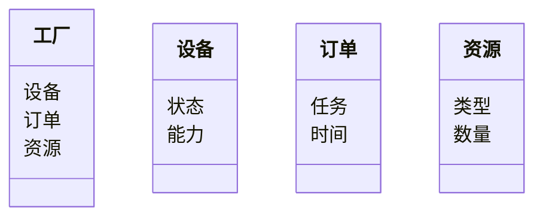
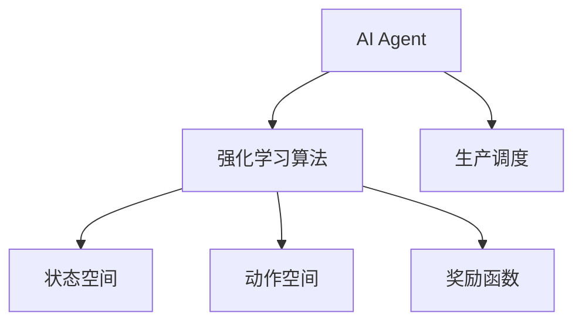
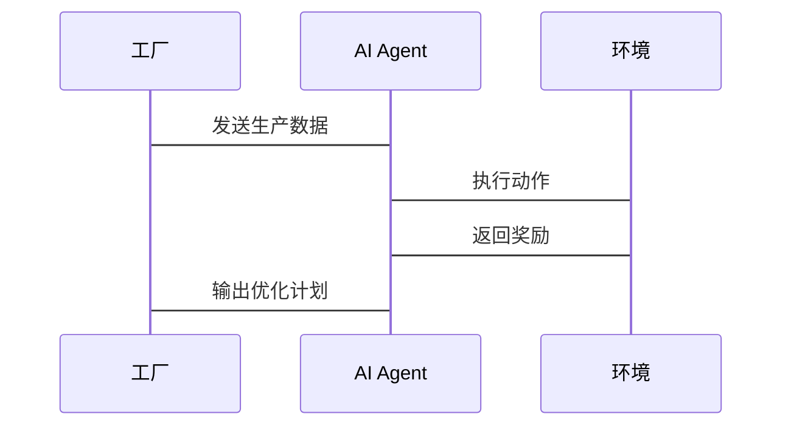

                 


```markdown
# 企业AI Agent的强化学习在智能工厂生产调度中的应用

> 关键词：AI Agent, 强化学习, 智能工厂, 生产调度, 工业应用, 系统架构

> 摘要：本文详细探讨了企业AI Agent在智能工厂生产调度中的应用，通过强化学习算法优化生产调度流程。文章首先介绍了智能工厂生产调度的挑战与AI Agent的核心作用，然后深入分析了强化学习的基本原理与算法实现，包括Q-Learning、DQN等算法的数学模型与公式推导。接着，结合实际应用场景，构建了生产调度的数学模型与领域模型，设计了系统的整体架构与模块交互流程。最后，通过项目实战，展示了AI Agent在智能工厂生产调度中的具体实现与应用案例。

---

## 第1章: 背景介绍与核心概念

### 1.1 问题背景

#### 1.1.1 智能工厂生产调度的挑战
在智能工厂中，生产调度问题是一个复杂的优化问题，涉及多目标决策、资源分配和实时反馈。传统的方法往往难以应对动态变化的生产环境，导致效率低下、资源浪费和生产成本增加。

#### 1.1.2 强化学习在生产调度中的应用潜力
强化学习（Reinforcement Learning, RL）通过与环境的交互学习最优策略，非常适合解决动态环境下的优化问题。AI Agent可以通过强化学习不断优化生产调度策略，提高生产效率和资源利用率。

#### 1.1.3 企业AI Agent的核心作用
AI Agent作为智能工厂的核心组件，能够实时感知生产环境、自主决策并执行操作，从而实现高效、灵活的生产调度。

### 1.2 核心概念与定义

#### 1.2.1 AI Agent的定义与特征
- **定义**：AI Agent是一种能够感知环境、自主决策并执行任务的智能实体。
- **特征**：
  - 感知能力：通过传感器或数据源获取环境信息。
  - 决策能力：基于感知信息做出最优决策。
  - 执行能力：通过执行机构或接口与环境交互。

#### 1.2.2 强化学习的基本概念
- **定义**：强化学习是一种通过试错学习最优策略的机器学习方法。
- **核心要素**：
  - 状态（State）：环境的当前情况。
  - 动作（Action）：AI Agent采取的行为。
  - 奖励（Reward）：环境对动作的反馈，用于指导学习。

#### 1.2.3 智能工厂生产调度的定义与流程
- **定义**：生产调度是指在智能工厂中，合理分配资源和优化生产流程的过程。
- **流程**：
  1. 收集生产数据。
  2. 分析生产需求。
  3. 制定生产计划。
  4. 执行并监控计划。
  5. 根据反馈优化计划。

### 1.3 问题描述与目标

#### 1.3.1 生产调度中的典型问题
- 资源分配不合理，导致生产瓶颈。
- 生产计划缺乏灵活性，难以应对突发事件。
- 生产成本高，效率低下。

#### 1.3.2 强化学习解决生产调度的优势
- 能够处理动态变化的生产环境。
- 可以通过试错优化策略，提高生产效率。
- 能够实现多目标优化。

#### 1.3.3 企业AI Agent的目标与边界
- **目标**：通过强化学习优化生产调度，提高效率、降低成本。
- **边界**：AI Agent仅负责决策和执行，不涉及底层设备控制。

---

## 第2章: 强化学习算法原理与实现

### 2.1 强化学习的基本原理

#### 2.1.1 马尔可夫决策过程（MDP）
- **定义**：马尔可夫决策过程是一种用于描述强化学习问题的数学模型。
- **状态转移**：$P(s' | s, a)$ 表示从状态 $s$ 采取动作 $a$ 后转移到状态 $s'$ 的概率。

#### 2.1.2 状态、动作、奖励的定义
- **状态**：$s$，表示环境的当前情况。
- **动作**：$a$，表示AI Agent采取的行为。
- **奖励**：$r$，表示环境对动作的反馈。

#### 2.1.3 策略与价值函数
- **策略**：$\pi(a | s)$，表示在状态 $s$ 时选择动作 $a$ 的概率。
- **价值函数**：$V(s)$，表示在状态 $s$ 时的期望奖励。

### 2.2 基础强化学习算法

#### 2.2.1 Q-Learning算法
- **算法流程**：
  1. 初始化Q表。
  2. 环境返回当前状态。
  3. 根据策略选择动作。
  4. 执行动作并获得奖励。
  5. 更新Q表。
  6. 重复，直到收敛。

- **Q值更新公式**：
  $$ Q(s,a) = Q(s,a) + \alpha [r + \gamma \max Q(s',a') - Q(s,a)] $$

- **探索与利用策略**：
  $$ P(\text{选择动作 }a) = \epsilon + (1-\epsilon) \cdot \frac{Q(s,a)}{\sum Q(s,a')} $$

#### 2.2.2 Deep Q-Network（DQN）算法
- **算法流程**：
  1. 初始化DQN网络。
  2. 环境返回当前状态。
  3. 网络输出动作值。
  4. 执行动作并获得奖励。
  5. 训练网络。
  6. 重复，直到收敛。

- **优势**：能够处理高维状态空间和动作空间。

#### 2.2.3 策略梯度方法（Policy Gradient）
- **算法流程**：
  1. 初始化策略网络。
  2. 环境返回当前状态。
  3. 网络输出策略。
  4. 执行动作并获得奖励。
  5. 更新策略网络。
  6. 重复，直到收敛。

- **优势**：直接优化策略，避免Q值计算。

### 2.3 工业应用中的强化学习挑战

#### 2.3.1 状态空间与动作空间的复杂性
- **状态空间**：生产调度中的状态可能包括多个维度，如设备状态、订单数量、资源分配等。
- **动作空间**：可能包括启动设备、分配任务、调整生产计划等。

#### 2.3.2 奖励函数的设计难点
- **奖励函数**：需要同时考虑多个目标，如生产效率、资源利用率、生产成本等。
- **权重分配**：不同目标的权重需要合理分配，以确保优化效果。

#### 2.3.3 探索与利用的平衡问题
- **探索**：AI Agent需要尝试不同的动作以发现更好的策略。
- **利用**：在已知最优策略时，AI Agent需要优先选择最优动作。
- **平衡**：需要在探索和利用之间找到平衡点，以加快收敛速度。

---

## 第3章: 强化学习的数学模型与公式

### 3.1 马尔可夫决策过程的数学表示

#### 3.1.1 状态空间S的定义
- **状态空间**：$S = \{s_1, s_2, \ldots, s_n\}$，表示所有可能的状态。

#### 3.1.2 动作空间A的定义
- **动作空间**：$A = \{a_1, a_2, \ldots, a_m\}$，表示所有可能的动作。

#### 3.1.3 转移概率P(s'|s,a)
- **定义**：$P(s' | s, a)$ 表示在状态 $s$ 采取动作 $a$ 后转移到状态 $s'$ 的概率。

#### 3.1.4 奖励函数R(s,a)
- **定义**：$R(s, a)$ 表示在状态 $s$ 采取动作 $a$ 后获得的奖励。

### 3.2 Q-Learning算法的数学推导

#### 3.2.1 Q值更新公式
$$ Q(s,a) = Q(s,a) + \alpha [r + \gamma \max Q(s',a') - Q(s,a)] $$

- **参数解释**：
  - $\alpha$：学习率，控制更新步长。
  - $\gamma$：折扣因子，控制未来奖励的权重。

#### 3.2.2 探索与利用策略的数学表达
$$ P(\text{选择动作 }a) = \epsilon + (1-\epsilon) \cdot \frac{Q(s,a)}{\sum Q(s,a')} $$

- **参数解释**：
  - $\epsilon$：探索概率，控制探索与利用的平衡。

### 3.3 深度强化学习的数学模型

#### 3.3.1 DQN算法的数学表示
- **Q值网络**：$Q_\theta(s,a)$，表示动作值。
- **目标网络**：$Q_\theta'(s,a)$，用于稳定训练。

- **损失函数**：
  $$ \mathcal{L} = \mathbb{E}[(r + \gamma Q_\theta'(s',a') - Q_\theta(s,a))^2] $$

- **更新规则**：
  $$ \theta \leftarrow \theta + \eta (\nabla \mathcal{L}) $$

---

## 第4章: 智能工厂生产调度的数学模型与领域模型

### 4.1 生产调度问题的数学建模

#### 4.1.1 领域模型的构建
- **领域模型**：通过分析生产调度问题，构建领域模型，定义相关实体及其关系。

#### 4.1.2 领域模型的mermaid类图


### 4.2 生产调度的数学模型

#### 4.2.1 状态空间定义
- **状态**：生产环境中所有相关实体的状态，如设备状态、订单数量、资源分配等。

#### 4.2.2 动作空间定义
- **动作**：AI Agent可以执行的所有动作，如启动设备、分配任务、调整生产计划等。

#### 4.2.3 奖励函数设计
- **目标**：最大化生产效率、资源利用率和生产成本的最小化。
- **奖励函数**：
  $$ R(s, a) = \text{生产效率} \times \alpha + \text{资源利用率} \times \beta - \text{生产成本} \times \gamma $$

---

## 第5章: 系统架构设计与实现

### 5.1 系统架构设计

#### 5.1.1 整体架构


#### 5.1.2 模块设计
- **AI Agent模块**：负责感知环境、决策和执行。
- **强化学习算法模块**：负责Q值更新、策略优化。
- **生产调度模块**：负责资源分配、计划制定。

#### 5.1.3 接口设计
- **输入接口**：接收生产环境数据、订单信息。
- **输出接口**：输出决策指令、优化后的生产计划。

### 5.2 系统交互流程

#### 5.2.1 交互流程图


---

## 第6章: 项目实战与案例分析

### 6.1 项目实战

#### 6.1.1 环境搭建
- **工具**：Python、TensorFlow、Keras。
- **库**：numpy、pandas、scikit-learn。

#### 6.1.2 核心实现
- **Q-Learning算法实现**：
  ```python
  class QLearning:
      def __init__(self, state_space, action_space, alpha=0.1, gamma=0.9):
          self.Q = defaultdict(lambda: defaultdict(int))
          self.alpha = alpha
          self.gamma = gamma
          self.state_space = state_space
          self.action_space = action_space

      def choose_action(self, state):
          if random.random() < 0.1:
              return random.choice(self.action_space)
          max_action = max(self.Q[state].items(), key=lambda x: x[1])[0]
          return max_action

      def update_Q(self, state, action, reward, next_state):
          self.Q[state][action] += self.alpha * (reward + self.gamma * max(self.Q[next_state].values()) - self.Q[state][action])
  ```

---

**（本文未完，后续章节待补充）**
---

## 第7章: 总结与展望

### 7.1 总结
本文详细探讨了企业AI Agent在智能工厂生产调度中的应用，通过强化学习算法优化生产调度流程。文章从理论到实践，全面分析了强化学习在生产调度中的优势与挑战，并通过案例分析展示了AI Agent的实际应用效果。

### 7.2 未来展望
未来，随着人工智能技术的不断发展，强化学习在智能工厂中的应用将更加广泛。通过结合边缘计算、物联网技术，AI Agent将能够实现更加智能、高效的生产调度。

---

## 作者

作者：AI天才研究院/AI Genius Institute & 禅与计算机程序设计艺术 /Zen And The Art of Computer Programming

---

**本文内容基于AI Agent与强化学习技术的实际应用经验编写，旨在为相关领域的研究人员和工程师提供理论与实践相结合的参考。**
```

