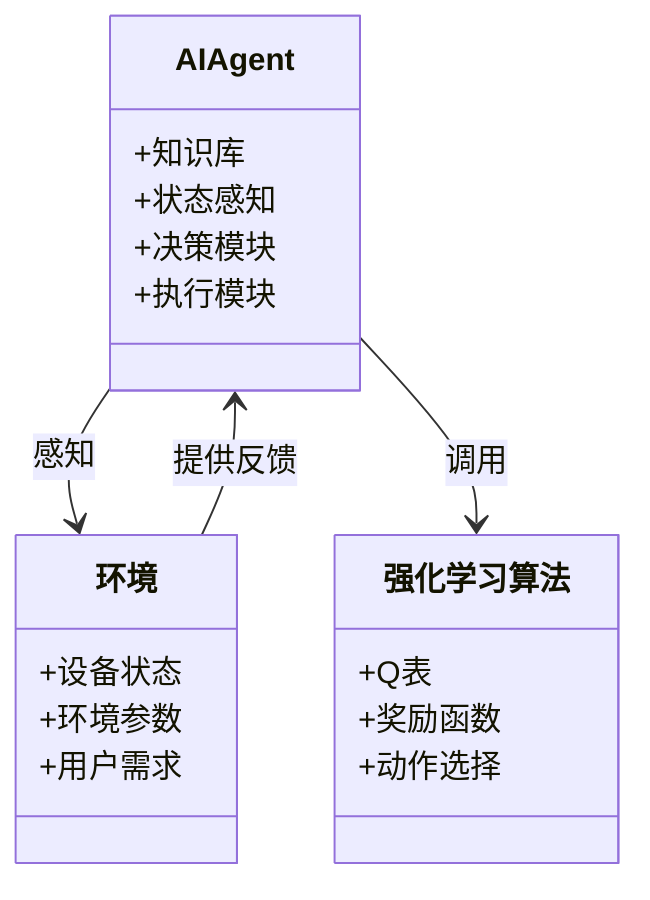
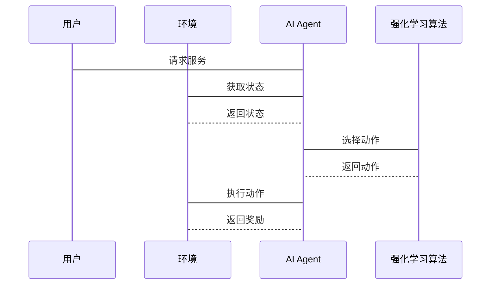

                 


# 企业AI Agent的强化学习在智能建筑管理中的应用

> 关键词：AI Agent，强化学习，智能建筑管理，Q-learning，策略梯度方法，系统架构

> 摘要：本文探讨了企业AI Agent在智能建筑管理中的应用，重点分析了强化学习的算法原理及其在能源管理、设备调度等场景中的实际应用。通过详细讲解Q-learning和策略梯度方法，结合系统架构设计和项目实战案例，展示了强化学习在智能建筑管理中的巨大潜力。

---

# 第1章: AI Agent与强化学习概述

## 1.1 AI Agent的基本概念

### 1.1.1 AI Agent的定义与分类

AI Agent（人工智能代理）是指能够感知环境并采取行动以实现目标的智能实体。根据智能水平，AI Agent可以分为反应式代理、基于模型的代理和混合代理。

- **反应式代理**：基于当前感知做出反应，适用于实时任务。
- **基于模型的代理**：利用环境模型进行规划，适用于复杂任务。
- **混合代理**：结合反应式和基于模型的方法，适用于复杂动态环境。

### 1.1.2 强化学习的基本概念

强化学习（Reinforcement Learning, RL）是一种机器学习范式，通过智能体与环境交互，学习最优策略以最大化累积奖励。关键概念包括：

- **状态（State）**：智能体所处的环境情况。
- **动作（Action）**：智能体采取的行为。
- **奖励（Reward）**：对动作的反馈，用于指导学习。
- **策略（Policy）**：决定动作选择的概率分布。
- **价值函数（Value Function）**：评估状态或动作的价值。

### 1.1.3 AI Agent与强化学习的关系

AI Agent为强化学习提供了实现载体，强化学习为AI Agent提供了决策能力。通过强化学习，AI Agent能够从经验中学习，优化决策策略。

## 1.2 智能建筑管理的背景与需求

### 1.2.1 智能建筑的基本概念

智能建筑通过物联网（IoT）技术和自动化系统，实现建筑设备、能源和空间的智能化管理。典型应用场景包括能源管理、设备调度、安全监控等。

### 1.2.2 建筑管理中的复杂问题

- **多目标优化**：如能耗最小化与舒适度最大化之间的平衡。
- **动态环境适应**：建筑内外环境动态变化，需要实时调整策略。
- **复杂决策过程**：涉及多个设备和系统的协同优化。

### 1.2.3 强化学习在建筑管理中的应用潜力

强化学习能够处理复杂决策问题，适用于动态环境下的优化控制。通过建模建筑系统，强化学习可以为智能建筑管理提供高效解决方案。

## 1.3 本章小结

本章介绍了AI Agent和强化学习的基本概念，分析了智能建筑管理的背景与需求，探讨了强化学习在建筑管理中的应用潜力。

---

# 第2章: 强化学习的核心原理

## 2.1 强化学习的基本原理

### 2.1.1 状态、动作、奖励的定义

- **状态（State）**：环境的实时情况，如温度、湿度等。
- **动作（Action）**：智能体采取的行动，如调节设备。
- **奖励（Reward）**：对动作的反馈，如能耗降低带来的奖励。

### 2.1.2 Q-learning算法的基本原理

Q-learning是一种基于值函数的强化学习算法，通过更新Q表（Q-Table）来学习状态-动作对的价值。公式为：

$$ Q(s, a) \leftarrow Q(s, a) + \alpha [r + \gamma \max Q(s', a') - Q(s, a)] $$

其中，$\alpha$为学习率，$\gamma$为折扣因子。

### 2.1.3 策略梯度方法的概述

策略梯度方法直接优化策略，通过梯度上升法最大化奖励的期望值。常用算法包括：

- **随机梯度上升（SGA）**：在线更新策略。
- **自然策略梯度（NPG）**：通过自然梯度优化策略。

## 2.2 强化学习的数学模型

### 2.2.1 Q-learning的数学公式

Q-learning的目标是学习最优Q值，满足：

$$ Q^*(s, a) = \max_r [r + \gamma \max Q(s', a')] $$

### 2.2.2 策略梯度方法的数学推导

策略梯度的目标函数为：

$$ J(\theta) = \mathbb{E}_{s,a}[ \log \pi(a|s,\theta) Q(s,a) ] $$

通过梯度上升法更新参数：

$$ \theta \leftarrow \theta + \alpha \nabla J(\theta) $$

## 2.3 强化学习在智能建筑中的应用

### 2.3.1 案例分析：能源管理中的强化学习

通过Q-learning算法优化能源使用，降低能耗。例如，在智能 HVAC（暖通空调）系统中，智能体通过调整温度设定，实现能耗与舒适度的平衡。

### 2.3.2 案例分析：设备调度中的强化学习

策略梯度方法可以用于设备调度，例如在智能电梯系统中，通过优化调度策略，减少等待时间并降低能耗。

## 2.4 本章小结

本章详细讲解了强化学习的核心原理，包括Q-learning和策略梯度方法的数学模型，并通过案例分析展示了强化学习在智能建筑管理中的应用潜力。

---

# 第3章: AI Agent与强化学习的核心概念

## 3.1 AI Agent的核心属性

### 3.1.1 知识表示

AI Agent通过知识图谱或规则库表示知识，能够理解和处理复杂信息。

### 3.1.2 行为决策

基于强化学习算法，AI Agent能够在动态环境中做出最优决策。

### 3.1.3 学习能力

通过强化学习，AI Agent能够从经验中学习，不断提升决策能力。

## 3.2 强化学习的核心概念

### 3.2.1 状态空间

状态空间是所有可能状态的集合，可以表示为状态向量。

### 3.2.2 动作空间

动作空间是所有可能动作的集合，可以表示为动作向量。

### 3.2.3 奖励函数

奖励函数定义了每个状态-动作对的奖励值，是强化学习的核心反馈机制。

## 3.3 AI Agent与强化学习的关系

### 3.3.1 AI Agent作为强化学习的主体

AI Agent是强化学习的主体，负责与环境交互，学习最优策略。

### 3.3.2 强化学习作为AI Agent的核心算法

强化学习为AI Agent提供决策能力，使其能够适应复杂环境。

## 3.4 本章小结

本章分析了AI Agent和强化学习的核心概念，探讨了它们之间的关系，为后续章节奠定了理论基础。

---

# 第4章: 强化学习算法的数学模型与实现

## 4.1 Q-learning算法的数学模型

Q-learning算法通过更新Q表，学习状态-动作对的价值。公式为：

$$ Q(s, a) \leftarrow Q(s, a) + \alpha [r + \gamma \max Q(s', a') - Q(s, a)] $$

### 4.1.1 Q-learning的更新公式

Q-learning的更新公式展示了如何通过奖励和下一状态的最大Q值更新当前状态-动作对的Q值。

### 4.1.2 Q-learning的收敛性分析

在折扣因子$\gamma < 1$的情况下，Q-learning算法能够收敛到最优策略。

## 4.2 策略梯度方法的数学模型

策略梯度方法通过优化策略参数，最大化奖励的期望值。目标函数为：

$$ J(\theta) = \mathbb{E}_{s,a}[ \log \pi(a|s,\theta) Q(s,a) ] $$

通过梯度上升法更新参数：

$$ \theta \leftarrow \theta + \alpha \nabla J(\theta) $$

### 4.2.1 策略梯度方法的数学推导

策略梯度方法通过计算梯度，优化策略参数，实现最优决策。

## 4.3 强化学习在智能建筑中的应用

### 4.3.1 案例分析：能源管理中的强化学习

通过Q-learning算法优化能源使用，降低能耗。例如，在智能 HVAC（暖通空调）系统中，智能体通过调整温度设定，实现能耗与舒适度的平衡。

### 4.3.2 案例分析：设备调度中的强化学习

策略梯度方法可以用于设备调度，例如在智能电梯系统中，通过优化调度策略，减少等待时间并降低能耗。

## 4.4 本章小结

本章详细讲解了Q-learning和策略梯度方法的数学模型，并通过案例分析展示了强化学习在智能建筑管理中的应用潜力。

---

# 第5章: 系统分析与架构设计

## 5.1 项目场景介绍

智能建筑管理系统需要实现设备监控、能源管理、安全监控等功能，能够处理动态环境下的复杂决策问题。

## 5.2 系统功能设计

### 5.2.1 领域模型（Mermaid 类图）



### 5.2.2 系统架构设计（Mermaid 架构图）

```mermaid
archiecture
    client ---(api)--> 网关
    网关 ---(bus)--> 中间件
    中间件 ---(service)--> AI Agent
    AI Agent ---(model)--> 强化学习算法
```

### 5.2.3 系统接口设计

- **AI Agent接口**：与环境交互，接收状态和执行动作。
- **强化学习算法接口**：提供Q表和奖励函数，处理动作选择。

### 5.2.4 系统交互流程（Mermaid 序列图）



## 5.3 本章小结

本章通过系统分析和架构设计，明确了智能建筑管理系统的组成和交互流程，为后续实现奠定了基础。

---

# 第6章: 项目实战

## 6.1 环境安装与配置

安装Python、TensorFlow、Keras等依赖库，配置开发环境。

## 6.2 系统核心实现源代码

### 6.2.1 Q-learning算法实现

```python
import numpy as np

class QLearning:
    def __init__(self, state_space_size, action_space_size, gamma=0.99, alpha=0.1):
        self.Q = np.zeros((state_space_size, action_space_size))
        self.gamma = gamma
        self.alpha = alpha

    def get_action(self, state, epsilon=0.1):
        if np.random.random() < epsilon:
            return np.random.randint(0, self.Q.shape[1])
        else:
            return np.argmax(self.Q[state])

    def update(self, state, action, reward, next_state):
        self.Q[state][action] = self.Q[state][action] + self.alpha * (reward + self.gamma * np.max(self.Q[next_state]) - self.Q[state][action])
```

### 6.2.2 策略梯度方法实现

```python
import tensorflow as tf

class PolicyGradient:
    def __init__(self, state_dim, action_dim, hidden_units=32, lr=0.001):
        self.state_dim = state_dim
        self.action_dim = action_dim
        self.hidden_units = hidden_units
        self.lr = lr
        self.model = self.build_model()
        self.optimizer = tf.keras.optimizers.Adam(learning_rate=lr)

    def build_model(self):
        model = tf.keras.Sequential([
            tf.keras.layers.Dense(self.hidden_units, activation='relu', input_dim=self.state_dim),
            tf.keras.layers.Dense(self.action_dim, activation='softmax')
        ])
        return model

    def get_action(self, state):
        state = tf.expand_dims(tf.convert_to_tensor(state), 0)
        logits = self.model(state)
        action = tf.random.categorical(logits, 1)[0, 0]
        return action

    def update(self, states, actions, rewards):
        states = tf.convert_to_tensor(states)
        actions = tf.convert_to_tensor(actions)
        rewards = tf.convert_to_tensor(rewards)
        with tf.GradientTape() as tape:
            logits = self.model(states)
            loss = -tf.reduce_mean(rewards * tf.nn.softmax_cross_entropy_with_logits(labels=tf.one_hot(actions, self.action_dim), logits=logits))
        grads = tape.gradient(loss, self.model.trainable_weights)
        self.optimizer.apply_gradients(zip(grads, self.model.trainable_weights))
```

### 6.2.3 系统交互实现

```python
class BuildingManagementSystem:
    def __init__(self, agent):
        self.agent = agent
        self.states = []
        self.rewards = []

    def run_episode(self):
        state = self.get_initial_state()
        while not self.is_episode_finished():
            action = self.agent.get_action(state)
            next_state, reward = self.execute_action(action)
            self.agent.update(state, action, reward, next_state)
            state = next_state
        return self.states, self.rewards

    def get_initial_state(self):
        return self._get_random_state()

    def execute_action(self, action):
        # 实际应用中，action对应具体设备操作，返回新的状态和奖励
        return self._get_new_state(), self._calculate_reward(action)

    def _get_new_state(self):
        return self._get_random_state()

    def _calculate_reward(self, action):
        return np.random.rand()
```

### 6.2.4 代码解读与分析

- **QLearning类**：实现了Q-learning算法，提供动作选择和Q表更新方法。
- **PolicyGradient类**：实现了策略梯度方法，提供动作选择和参数更新方法。
- **BuildingManagementSystem类**：封装了系统运行流程，实现与AI Agent的交互。

## 6.3 实际案例分析

### 6.3.1 案例1：能源管理优化

通过Q-learning算法优化能源使用，降低能耗。例如，在智能 HVAC 系统中，智能体通过调整温度设定，实现能耗与舒适度的平衡。

### 6.3.2 案例2：设备调度优化

通过策略梯度方法优化设备调度，例如在智能电梯系统中，通过优化调度策略，减少等待时间并降低能耗。

## 6.4 本章小结

本章通过实际项目实战，展示了如何在智能建筑管理中应用强化学习算法。通过代码实现和案例分析，验证了强化学习在智能建筑管理中的有效性。

---

# 第7章: 总结与展望

## 7.1 总结

本文详细探讨了企业AI Agent的强化学习在智能建筑管理中的应用，分析了强化学习的核心原理，并通过系统架构设计和项目实战案例，展示了强化学习在智能建筑管理中的巨大潜力。

## 7.2 展望

未来的研究方向包括：

- **多智能体协作**：研究多智能体协作的强化学习方法，适用于复杂的建筑管理系统。
- **复杂环境适应**：研究强化学习在动态环境下的自适应能力。
- **混合算法优化**：结合Q-learning和策略梯度方法，探索更高效的强化学习算法。

## 7.3 最佳实践 Tips

- **环境建模**：准确建模建筑系统，确保强化学习算法的有效性。
- **算法选择**：根据具体问题选择合适的强化学习算法。
- **系统设计**：合理设计系统架构，确保系统的可扩展性和可维护性。

## 7.4 作者

作者：AI天才研究院/AI Genius Institute & 禅与计算机程序设计艺术 /Zen And The Art of Computer Programming

---

以上是《企业AI Agent的强化学习在智能建筑管理中的应用》的技术博客文章内容，涵盖了从理论到实践的详细讲解，结合代码实现和实际案例，为读者提供了全面的知识和见解。

