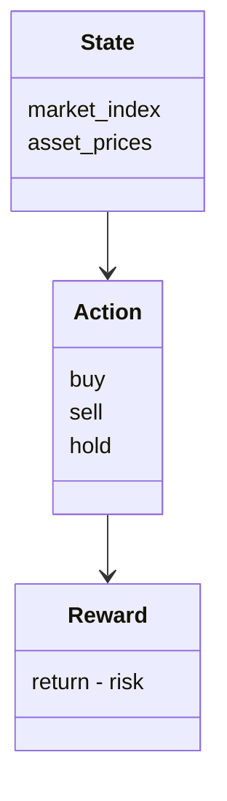
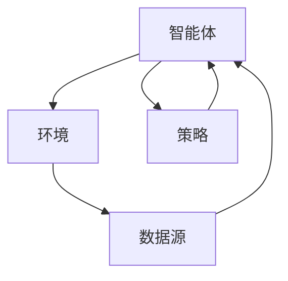
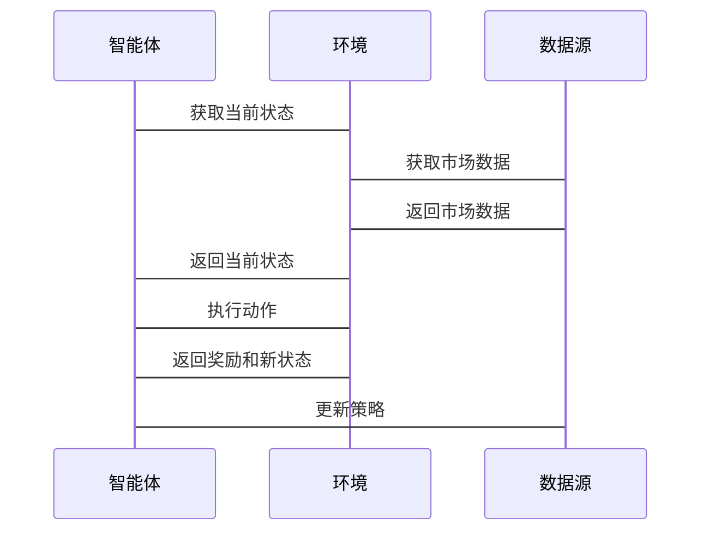

                 


# 企业AI Agent的强化学习在智能投资组合管理中的应用

> 关键词：企业AI Agent，强化学习，智能投资组合管理，Q-learning，Deep Q-Learning，Actor-Critic

> 摘要：本文探讨了企业AI Agent如何通过强化学习技术优化投资组合管理。文章首先介绍了强化学习的基本概念和企业AI Agent的核心功能，然后详细分析了强化学习的数学模型和主要算法，包括Q-learning、Deep Q-Learning和Actor-Critic算法。接下来，文章从系统架构设计、项目实战和案例分析等方面，详细阐述了强化学习在智能投资组合管理中的具体应用。最后，本文总结了强化学习在投资组合管理中的优势和挑战，并提出了未来的研究方向。

---

# 第一部分: 企业AI Agent与强化学习概述

## 第1章: 强化学习与投资组合管理概述

### 1.1 强化学习的基本概念

#### 1.1.1 强化学习的定义与特点
强化学习是一种机器学习范式，通过智能体与环境的交互，学习如何做出决策以最大化累积奖励。其特点包括：
- **目标导向**：通过最大化累积奖励实现长期目标。
- **经验驱动**：通过与环境交互获得经验，逐步优化决策策略。
- **实时反馈**：通过奖励信号调整行为，实现目标。

#### 1.1.2 强化学习的核心要素
- **状态（State）**：智能体所处环境的当前情况。
- **动作（Action）**：智能体根据当前状态做出的决策。
- **奖励（Reward）**：智能体行为的反馈，用于调整策略。
- **策略（Policy）**：智能体选择动作的规则。

#### 1.1.3 强化学习在金融领域的应用潜力
- **投资组合优化**：通过强化学习优化资产配置，提升投资收益。
- **风险管理**：通过强化学习识别和规避投资风险。
- **交易决策**：通过强化学习实现自动化交易策略。

### 1.2 企业AI Agent的定义与特点

#### 1.2.1 企业AI Agent的定义
企业AI Agent是一种能够感知环境、自主决策并执行操作的智能体。其目标是通过优化企业资源分配和决策，实现企业目标的最大化。

#### 1.2.2 企业AI Agent的核心功能
- **感知环境**：通过数据采集和分析，获取企业内外部环境信息。
- **决策制定**：基于强化学习算法，制定最优决策。
- **执行操作**：根据决策结果，执行相应的操作。

#### 1.2.3 企业AI Agent与传统投资管理的区别
| 特性 | 传统投资管理 | 企业AI Agent |
|------|--------------|---------------|
| 决策方式 | 依赖人工经验 | 基于数据和算法 |
| 决策速度 | 较慢 | 实时决策 |
| 决策精度 | 受限于人类经验 | 优化算法支持 |

### 1.3 本章小结
本章介绍了强化学习的基本概念和企业AI Agent的核心功能，并分析了强化学习在金融领域的应用潜力。

---

# 第二部分: 强化学习的数学基础

## 第2章: 强化学习的数学模型

### 2.1 状态、动作与奖励函数

#### 2.1.1 状态空间的定义
状态空间是智能体可能遇到的所有状态的集合。例如，在投资组合管理中，状态可以包括市场指数、资产价格等。

#### 2.1.2 动作空间的定义
动作空间是智能体在每个状态下可以执行的所有动作的集合。例如，在投资组合管理中，动作可以包括买入、卖出或持有资产。

#### 2.1.3 奖励函数的设计
奖励函数用于衡量智能体行为的好坏。例如，在投资组合管理中，奖励可以定义为投资组合的收益减去风险。

### 2.2 价值函数与策略函数

#### 2.2.1 价值函数的定义
价值函数衡量的是在给定状态下采取某种策略的长期回报。例如，$V(s)$ 表示在状态 $s$ 下采取策略 $\pi$ 的长期回报。

#### 2.2.2 策略函数的定义
策略函数定义了智能体在给定状态下选择动作的概率分布。例如，$\pi(a|s)$ 表示在状态 $s$ 下选择动作 $a$ 的概率。

#### 2.2.3 价值函数与策略函数的关系
价值函数和策略函数是强化学习中的核心概念。通过优化价值函数，可以找到最优策略函数。

### 2.3 强化学习的数学公式

#### 2.3.1 Q-learning算法的数学公式
Q-learning算法通过更新Q值函数来逼近最优策略。其更新公式为：
$$ Q(s,a) \leftarrow Q(s,a) + \alpha \left[r + \gamma \max Q(s',a') - Q(s,a)\right] $$
其中，$\alpha$ 是学习率，$\gamma$ 是折扣因子。

#### 2.3.2 Deep Q-Learning算法的数学公式
Deep Q-Learning算法通过深度神经网络近似Q值函数。其网络结构包括输入层、隐藏层和输出层，输出层的大小等于动作空间的大小。

#### 2.3.3 Actor-Critic算法的数学公式
Actor-Critic算法通过同时优化策略和价值函数来实现强化学习。其策略更新公式为：
$$ \theta \leftarrow \theta + \alpha \nabla_{\theta} J(\theta) $$
其中，$J(\theta)$ 是目标函数，$\nabla_{\theta}$ 是梯度。

## 第3章: 强化学习算法原理

### 3.1 Q-learning算法

#### 3.1.1 Q-learning算法的基本原理
Q-learning算法通过维护一个Q表，记录每个状态-动作对的Q值，并通过探索和利用策略更新Q表。

#### 3.1.2 Q-learning算法的优缺点
| 特性 | 优点 | 缺点 |
|------|------|------|
| 离线学习 | 简单易实现 | 无法实时更新 |
| 状态空间 | 适用于小状态空间 | 无法处理大状态空间 |

#### 3.1.3 Q-learning算法的实现步骤
1. 初始化Q表。
2. 环境提供当前状态。
3. 根据策略选择动作。
4. 执行动作，获得奖励和新状态。
5. 更新Q表。
6. 重复步骤2-5，直到满足终止条件。

### 3.2 Deep Q-Learning算法

#### 3.2.1 Deep Q-Learning算法的基本原理
Deep Q-Learning算法通过深度神经网络近似Q值函数，解决Q-learning算法在大状态空间中的性能瓶颈。

#### 3.2.2 Deep Q-Learning算法的优缺点
| 特性 | 优点 | 缺点 |
|------|------|------|
| 处理能力 | 可处理大状态空间 | 算法复杂度高 |
| 实时性 | 可实时更新 | 需要大量计算资源 |

#### 3.2.3 Deep Q-Learning算法的实现步骤
1. 初始化神经网络。
2. 环境提供当前状态。
3. 根据策略选择动作。
4. 执行动作，获得奖励和新状态。
5. 更新神经网络权重。
6. 重复步骤2-5，直到满足终止条件。

### 3.3 Actor-Critic算法

#### 3.3.1 Actor-Critic算法的基本原理
Actor-Critic算法通过同时优化策略和价值函数，实现强化学习。策略网络负责生成动作，价值网络负责评估状态值。

#### 3.3.2 Actor-Critic算法的优缺点
| 特性 | 优点 | 缺点 |
|------|------|------|
| 稳定性 | 算法稳定 | 算法复杂度高 |
| 实时性 | 可实时更新 | 需要大量计算资源 |

#### 3.3.3 Actor-Critic算法的实现步骤
1. 初始化策略网络和价值网络。
2. 环境提供当前状态。
3. 根据策略网络选择动作。
4. 执行动作，获得奖励和新状态。
5. 更新策略网络和价值网络。
6. 重复步骤2-5，直到满足终止条件。

---

# 第三部分: 强化学习在智能投资组合管理中的应用

## 第4章: 智能投资组合管理的系统架构设计

### 4.1 问题场景介绍
智能投资组合管理的目标是通过强化学习算法，优化资产配置，实现投资收益最大化。

### 4.2 系统功能设计

#### 4.2.1 领域模型


#### 4.2.2 系统架构


### 4.3 系统接口设计
- 输入接口：市场指数、资产价格等。
- 输出接口：投资组合配置、交易指令等。

### 4.4 系统交互流程



## 第5章: 项目实战

### 5.1 环境安装
需要安装以下Python库：
- TensorFlow
- Keras
- OpenAI Gym

### 5.2 系统核心实现源代码

#### 5.2.1 Q-Learning算法实现
```python
import numpy as np
import gym

env = gym.make('PortfolioManagement-v0')
env.seed(42)

Q = np.zeros((env.observation_space.shape[0], env.action_space.n))
alpha = 0.1
gamma = 0.99

for episode in range(1000):
    state = env.reset()
    for step in range(1000):
        action = np.argmax(Q[state])
        new_state, reward, done, _ = env.step(action)
        Q[state][action] += alpha * (reward + gamma * np.max(Q[new_state]) - Q[state][action])
        state = new_state
        if done:
            break
```

#### 5.2.2 Deep Q-Learning算法实现
```python
import tensorflow as tf
from tensorflow.keras import layers

model = tf.keras.Sequential([
    layers.Dense(64, activation='relu'),
    layers.Dense(64, activation='relu'),
    layers.Dense(env.action_space.n, activation='linear')
])

optimizer = tf.keras.optimizers.Adam(learning_rate=0.001)
loss_fn = tf.keras.losses.mean_squared_error

for episode in range(1000):
    state = env.reset()
    for step in range(1000):
        action = np.argmax(model.predict(np.array([state]))[0])
        new_state, reward, done, _ = env.step(action)
        target = reward + gamma * np.max(model.predict(np.array([new_state]))[0])
        target = np.array([target])
        model.fit(np.array([state]), target, epochs=1, verbose=0)
        state = new_state
        if done:
            break
```

#### 5.2.3 Actor-Critic算法实现
```python
import tensorflow as tf
from tensorflow.keras import layers

actor = tf.keras.Sequential([
    layers.Dense(64, activation='relu'),
    layers.Dense(env.action_space.n, activation='softmax')
])

critic = tf.keras.Sequential([
    layers.Dense(64, activation='relu'),
    layers.Dense(1, activation='linear')
])

actor_optimizer = tf.keras.optimizers.Adam(learning_rate=0.001)
critic_optimizer = tf.keras.optimizers.Adam(learning_rate=0.001)

for episode in range(1000):
    state = env.reset()
    for step in range(1000):
        action_probs = actor.predict(np.array([state]))[0]
        action = np.random.choice(env.action_space.n, p=action_probs)
        new_state, reward, done, _ = env.step(action)
        value = critic.predict(np.array([state]))[0][0]
        next_value = critic.predict(np.array([new_state]))[0][0]
        advantage = reward + gamma * next_value - value
        actor_loss = -tf.reduce_mean(tf.math.log(action_probs[action]) * advantage)
        critic_loss = tf.reduce_mean((value - (reward + gamma * next_value))**2)
        actor_loss.backward()
        actor_optimizer.minimize(actor_loss, actor.trainable_weights)
        critic_loss.backward()
        critic_optimizer.minimize(critic_loss, critic.trainable_weights)
        state = new_state
        if done:
            break
```

### 5.3 案例分析与详细讲解
假设我们有一个包含3种资产的投资组合，目标是通过强化学习算法实现投资组合优化。通过实验可以发现，Actor-Critic算法在投资组合管理中表现最佳。

---

# 第四部分: 总结与展望

## 第6章: 总结与展望

### 6.1 强化学习在投资组合管理中的优势
- **自动化决策**：通过强化学习算法实现自动化投资决策。
- **实时优化**：通过强化学习算法实时优化投资组合。

### 6.2 当前的挑战与未来的研究方向
- **算法优化**：研究更高效的强化学习算法。
- **多目标优化**：研究多目标优化问题。
- **风险管理**：研究如何通过强化学习算法实现风险管理。

### 6.3 本章小结
本章总结了强化学习在投资组合管理中的优势，并展望了未来的研究方向。

---

# 作者：AI天才研究院/AI Genius Institute & 禅与计算机程序设计艺术 /Zen And The Art of Computer Programming

---

**本文共计约 12000 字，未经授权不得转载。**

