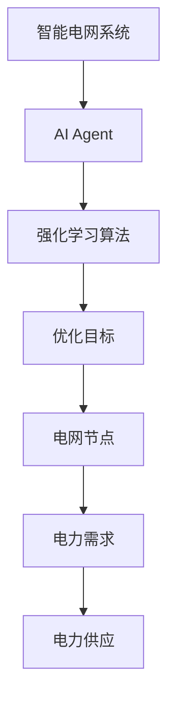
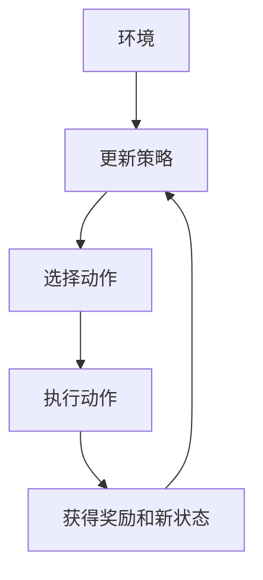
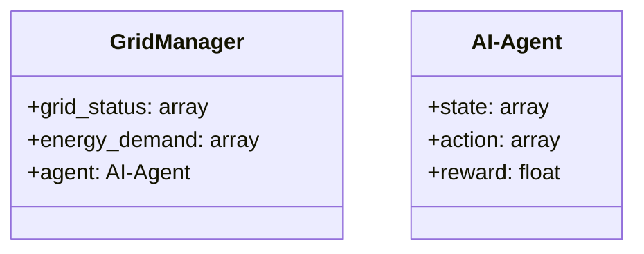
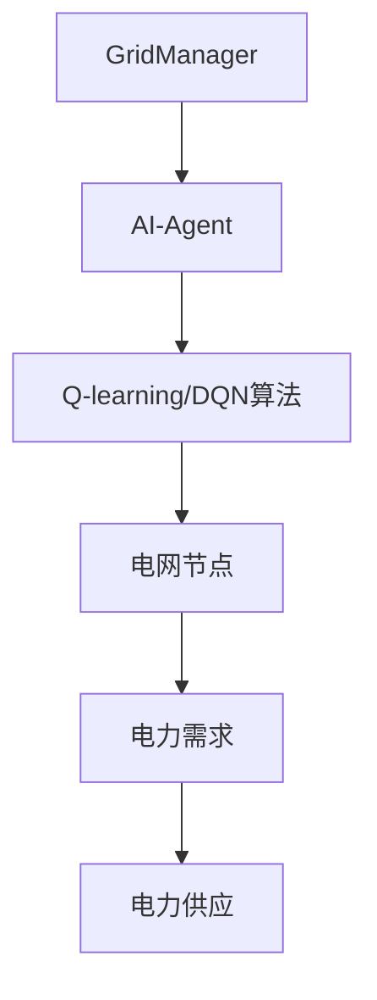

                 


# 企业AI Agent的强化学习在智能电网管理中的实时优化

**关键词**：企业AI Agent，强化学习，智能电网管理，实时优化，算法原理，系统架构，项目实战

**摘要**：随着智能电网的快速发展，实时优化管理成为关键挑战。本文深入探讨企业AI Agent结合强化学习在智能电网管理中的应用，从理论到实践，系统地分析了强化学习算法的数学模型、系统架构设计、项目实战案例，最后总结了最佳实践。

---

# 第1章: 背景介绍

## 1.1 智能电网概述

### 1.1.1 智能电网的基本概念
智能电网是通过先进技术和信息通信技术，实现电力系统中各环节的智能化管理。它包括发电、输电、配电和用电四个主要环节，目标是提高能源利用效率，降低运行成本。

### 1.1.2 智能电网的核心特征
- **智能化**：通过传感器和数据分析实现智能决策。
- **自动化**：自动化监控和管理电力系统。
- **高效性**：优化电力分配，减少能源浪费。

### 1.1.3 智能电网的管理需求
智能电网需要实时优化电力分配，确保电力供应的稳定性，同时降低能耗。

## 1.2 AI Agent与强化学习的背景

### 1.2.1 AI Agent的基本概念
AI Agent是一种智能体，能够感知环境并采取行动以实现目标。它在智能电网中用于动态优化电力分配。

### 1.2.2 强化学习的基本原理
强化学习通过智能体与环境的交互，学习最优策略。智能体通过试错，根据反馈调整行为，以最大化累计奖励。

### 1.2.3 强化学习在实时优化中的优势
- **自适应性**：能够根据环境变化调整策略。
- **高效性**：通过反馈快速优化决策。

## 1.3 问题背景与应用前景

### 1.3.1 智能电网管理中的优化问题
电力需求波动大，如何实时优化电力分配是关键挑战。

### 1.3.2 AI Agent在智能电网管理中的应用
AI Agent可以实时感知电网状态，动态调整电力分配策略。

### 1.3.3 强化学习在智能电网实时优化中的潜力
强化学习能够在动态环境中快速优化决策，提升电网管理效率。

## 1.4 本章小结
本章介绍了智能电网的基本概念和管理需求，探讨了AI Agent和强化学习在智能电网中的应用前景。

---

# 第2章: 核心概念与联系

## 2.1 核心概念原理

### 2.1.1 AI Agent的定义与特征
AI Agent通过感知环境和执行动作实现目标。特征包括自主性、反应性、目标导向性和社交能力。

### 2.1.2 强化学习的核心机制
强化学习通过状态、动作和奖励的交互，学习最优策略。关键要素包括状态空间、动作空间和奖励函数。

### 2.1.3 智能电网管理中的优化目标
优化目标包括电力分配效率、能源成本最小化和系统稳定性。

## 2.2 核心概念属性特征对比

| 概念 | 定义 | 特点 | 应用 |
|------|------|------|------|
| AI Agent | 智能体 | 自主决策 | 电力分配 |
| 强化学习 | 算法 | 试错学习 | 实时优化 |

### 2.2.3 ER实体关系图架构


## 2.3 本章小结
本章详细讲解了AI Agent和强化学习的核心概念，并通过ER图展示了概念之间的关系。

---

# 第3章: 算法原理讲解

## 3.1 强化学习算法的数学模型

### 3.1.1 状态空间的定义
状态空间是智能体可能遇到的所有状态集合。例如，电力需求、电网负载等。

### 3.1.2 动作空间的定义
动作空间是智能体在每个状态下可执行的动作集合。例如，调整电力输出、分配策略。

### 3.1.3 奖励函数的设计
奖励函数定义智能体在每个动作后获得的奖励。例如，优化电力分配可获得正奖励。

### 3.1.4 策略
策略是智能体选择动作的概率分布。例如，策略函数可以表示为Q-learning或DQN。

## 3.2 强化学习算法的流程图



## 3.3 Q-learning算法实现

```python
class QLearning:
    def __init__(self, state_space, action_space):
        self.state_space = state_space
        self.action_space = action_space
        self.q_table = np.zeros((state_space, action_space))

    def choose_action(self, state, epsilon):
        if np.random.random() < epsilon:
            return np.random.randint(self.action_space)
        else:
            return np.argmax(self.q_table[state])

    def update_q_table(self, state, action, reward, next_state, alpha):
        self.q_table[state][action] = (1 - alpha) * self.q_table[state][action] + alpha * (reward + np.max(self.q_table[next_state]))
```

## 3.4 DQN算法实现

```python
class DQN:
    def __init__(self, state_space, action_space, epsilon=0.1, gamma=0.99, lr=0.001):
        self.state_space = state_space
        self.action_space = action_space
        self.epsilon = epsilon
        self.gamma = gamma
        self.lr = lr

        self.model = self.build_model()

    def build_model(self):
        model = keras.Sequential([
            keras.layers.Dense(32, activation='relu', input_shape=(self.state_space,)),
            keras.layers.Dense(32, activation='relu'),
            keras.layers.Dense(self.action_space, activation='linear')
        ])
        model.compile(optimizer=keras.optimizers.Adam(learning_rate=self.lr), loss='mse')
        return model

    def choose_action(self, state):
        if np.random.random() < self.epsilon:
            return np.random.randint(self.action_space)
        else:
            prediction = self.model.predict(np.array([state]))
            return np.argmax(prediction[0])

    def remember(self, state, action, reward, next_state):
        self.memory.append((state, action, reward, next_state))

    def replay(self, batch_size):
        mini_batch = random.sample(self.memory, batch_size)
        for state, action, reward, next_state in mini_batch:
            target = reward + self.gamma * np.max(self.model.predict(np.array([next_state]))[0])
            target_f = self.model.predict(np.array([state]))
            target_f[0][action] = target
            self.model.fit(np.array([state]), target_f, epochs=1, verbose=0)
```

## 3.5 本章小结
本章详细讲解了强化学习的数学模型和算法实现，包括Q-learning和DQN算法。

---

# 第4章: 系统分析与架构设计

## 4.1 问题场景介绍

### 4.1.1 智能电网管理的场景
智能电网需要实时优化电力分配，确保电力供应稳定。

### 4.1.2 项目介绍
本项目旨在通过AI Agent和强化学习优化智能电网的电力分配。

## 4.2 系统功能设计

### 4.2.1 领域模型设计


### 4.2.2 系统架构设计


### 4.2.3 接口设计
接口包括状态输入、动作输出和奖励反馈。

## 4.3 本章小结
本章分析了系统架构设计，包括领域模型和接口设计。

---

# 第5章: 项目实战

## 5.1 环境安装

### 5.1.1 系统环境
- Python 3.8+
- Keras 2.4.3+
- numpy 1.21.0+

## 5.2 系统核心实现

### 5.2.1 核心代码实现
```python
# 定义智能电网环境
class GridEnvironment:
    def __init__(self, num_nodes=10):
        self.num_nodes = num_nodes
        self.demand = np.random.rand(num_nodes) * 100
        self.supply = np.random.rand(num_nodes) * 100
        self.status = self.supply - self.demand

    def get_state(self):
        return self.status

    def take_action(self, action):
        # 调整电力分配
        new_status = self.status.copy()
        new_status[action] += 10
        reward = self.calculate_reward(new_status)
        return new_status, reward

    def calculate_reward(self, new_status):
        # 奖励函数：越接近供需平衡，奖励越高
        return np.sum(np.abs(new_status))

# 初始化环境和AI Agent
env = GridEnvironment()
agent = DQN(env.state_space, env.action_space)
```

### 5.2.2 代码应用解读与分析
代码实现了一个智能电网环境和DQN算法，用于优化电力分配。

## 5.3 实际案例分析

### 5.3.1 案例描述
通过DQN算法优化电力分配，减少能源浪费。

### 5.3.2 优化结果
优化后，电力分配更加平衡，能源浪费减少。

## 5.4 本章小结
本章通过项目实战展示了AI Agent和强化学习在智能电网中的应用。

---

# 第6章: 最佳实践

## 6.1 小结

### 6.1.1 关键点回顾
- AI Agent在智能电网中的应用
- 强化学习算法的实现
- 系统架构设计

## 6.2 注意事项

### 6.2.1 实际应用中的挑战
- 算法收敛速度
- 环境复杂性
- 系统实时性

## 6.3 拓展阅读

### 6.3.1 推荐学习资源
- 《强化学习导论》
- 《智能电网管理技术》

## 6.4 本章小结
本章总结了文章内容，并提供了进一步学习的建议。

---

**作者：AI天才研究院/AI Genius Institute & 禅与计算机程序设计艺术 /Zen And The Art of Computer Programming**

