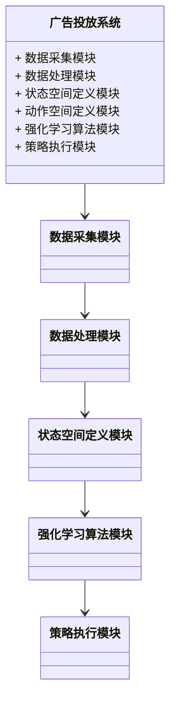

                 


# 企业AI Agent的强化学习在程序化广告投放中的实践

> 关键词：企业AI Agent，强化学习，程序化广告投放，广告优化，数学模型，Python实现

> 摘要：本文详细探讨了企业AI Agent在程序化广告投放中的应用，通过强化学习实现广告优化。文章从背景介绍、核心概念、算法原理、系统架构设计到项目实战，全面解析了强化学习在广告投放中的应用，并通过具体案例展示了其实际效果。

---

## 第一部分：企业AI Agent的强化学习基础

---

### 第1章：企业AI Agent与强化学习概述

#### 1.1 问题背景

##### 1.1.1 程序化广告投放的背景与挑战

程序化广告投放是指通过技术手段自动购买和管理广告资源，以实现广告投放的自动化和高效化。随着互联网的快速发展，广告投放的规模和复杂性急剧增加，传统的手动广告投放方式已无法满足需求。程序化广告投放通过技术手段优化广告投放策略，提升广告效果，降低成本。

然而，程序化广告投放也面临诸多挑战：

1. **广告效果的不确定性**：广告投放的效果受到多种因素的影响，如用户行为、市场竞争、投放时间等，难以预测和控制。
2. **多目标优化**：广告投放需要在多个目标（如点击率、转化率、收益等）之间进行权衡，优化单一目标可能会影响其他目标。
3. **实时决策**：程序化广告投放需要实时做出决策，这对计算能力和算法效率提出了较高的要求。

##### 1.1.2 AI Agent在广告投放中的作用

AI Agent（人工智能代理）是一种能够感知环境并采取行动以实现目标的智能体。在程序化广告投放中，AI Agent可以用于优化广告策略、预测用户行为、动态调整投放参数等。AI Agent的核心优势在于其能够通过数据驱动的方式，不断学习和优化广告投放策略，从而实现更高效的广告投放。

##### 1.1.3 强化学习的核心概念与优势

强化学习（Reinforcement Learning，RL）是一种机器学习范式，通过智能体与环境的交互，学习最优策略以最大化累积奖励。强化学习的核心在于智能体通过试错的方式，学习在不同状态下的最优动作选择。

强化学习在广告投放中的优势在于：

1. **动态优化**：强化学习能够根据实时的广告效果反馈，动态调整广告投放策略。
2. **多目标优化**：强化学习可以通过设计适当的奖励函数，在多个目标之间进行平衡。
3. **自我学习**：强化学习不需要大量的标注数据，可以通过与环境的交互进行自我学习和优化。

#### 1.2 问题描述

##### 1.2.1 程序化广告投放的核心问题

程序化广告投放的核心问题是如何在复杂的广告环境中，选择最优的广告资源和策略，以实现广告效果的最大化。具体包括以下问题：

1. **广告资源选择**：如何选择合适的广告位、媒体和时间，以最大化广告的覆盖范围和效果。
2. **广告策略优化**：如何优化广告文案、创意和投放参数，以提升广告的点击率和转化率。
3. **实时决策优化**：如何在实时的广告投放过程中，快速做出最优决策。

##### 1.2.2 AI Agent在广告投放中的目标与任务

AI Agent在程序化广告投放中的目标是通过强化学习，优化广告投放策略，实现广告效果的最大化。其主要任务包括：

1. **广告环境感知**：通过收集和分析广告数据，感知广告环境的状态。
2. **策略优化**：根据广告环境的状态，选择最优的广告投放策略。
3. **实时调整**：根据广告效果的反馈，实时调整广告投放策略。

##### 1.2.3 强化学习在广告投放中的应用场景

强化学习在广告投放中的应用场景广泛，主要包括：

1. **广告资源分配**：通过强化学习优化广告资源的分配，提高广告的覆盖范围和效果。
2. **广告策略优化**：通过强化学习优化广告文案、创意和投放参数，提升广告的点击率和转化率。
3. **实时决策优化**：通过强化学习实现实时的广告投放策略调整，快速响应广告效果的变化。

#### 1.3 问题解决

##### 1.3.1 强化学习在广告投放中的解决方案

强化学习通过与广告环境的交互，学习最优的广告投放策略。具体解决方案包括：

1. **状态表示**：将广告环境的状态表示为强化学习的状态空间，如广告位、用户特征、时间等。
2. **动作选择**：根据当前状态，选择最优的广告投放动作，如选择广告位、调整广告文案等。
3. **奖励机制**：设计适当的奖励函数，根据广告效果反馈，给予正向或负向的奖励，指导AI Agent的学习方向。

##### 1.3.2 AI Agent在广告投放中的实现路径

AI Agent在程序化广告投放中的实现路径主要包括：

1. **数据采集与处理**：采集广告投放相关的数据，如用户点击、转化、曝光等数据，并进行预处理。
2. **状态空间与动作空间定义**：根据广告环境的特点，定义状态空间和动作空间。
3. **强化学习算法选择**：选择适合的强化学习算法，如Q-learning、Deep Q-Network（DQN）等。
4. **模型训练与优化**：通过强化学习算法，训练AI Agent，优化广告投放策略。
5. **实时决策与调整**：在实际广告投放中，根据环境的变化，实时调整广告策略。

##### 1.3.3 程序化广告投放的优化目标

程序化广告投放的优化目标主要包括：

1. **提升广告点击率**：通过优化广告文案和投放策略，提升广告的点击率。
2. **提高转化率**：通过优化广告策略和用户匹配，提高广告的转化率。
3. **降低成本**：通过优化广告资源分配和投放策略，降低广告投放成本。
4. **提升收益**：通过优化广告收益和成本的平衡，提升整体广告收益。

#### 1.4 边界与外延

##### 1.4.1 程序化广告投放的边界条件

程序化广告投放的边界条件主要包括：

1. **广告资源限制**：广告资源的可用性、数量和质量。
2. **广告投放时间**：广告投放的时间窗口和周期。
3. **用户特征限制**：用户的特征、行为和需求的限制。

##### 1.4.2 AI Agent在广告投放中的应用边界

AI Agent在广告投放中的应用边界包括：

1. **数据获取**：AI Agent需要依赖高质量的数据进行学习和优化。
2. **计算能力限制**：AI Agent的性能受到计算能力和资源的限制。
3. **环境不确定性**：广告环境的不确定性和动态变化对AI Agent的性能产生影响。

##### 1.4.3 强化学习在广告投放中的适用范围

强化学习在广告投放中的适用范围包括：

1. **实时决策优化**：适用于需要实时做出决策的广告投放场景。
2. **多目标优化**：适用于需要在多个目标之间进行平衡的广告优化场景。
3. **动态环境适应**：适用于广告环境动态变化的场景。

#### 1.5 核心概念与联系

##### 1.5.1 AI Agent的核心概念与原理

AI Agent的核心概念包括：

1. **智能体**：能够感知环境并采取行动的实体。
2. **状态**：环境中的当前情况，如广告位、用户特征等。
3. **动作**：智能体在当前状态下采取的行动，如选择广告位、调整广告文案等。
4. **奖励**：智能体采取动作后获得的反馈，用于指导学习方向。

##### 1.5.2 强化学习的核心概念与原理

强化学习的核心概念包括：

1. **状态空间**：智能体可能遇到的所有状态的集合。
2. **动作空间**：智能体在每个状态下可以采取的所有动作的集合。
3. **奖励函数**：智能体采取动作后获得的奖励，用于指导学习方向。
4. **策略**：智能体在不同状态下选择动作的概率分布。
5. **价值函数**：智能体在某个状态下采取某个动作后的预期累积奖励。

##### 1.5.3 AI Agent与强化学习的联系与区别

AI Agent与强化学习的联系：

1. **目标一致**：AI Agent的目标是通过与环境的交互实现目标，强化学习的目标是通过学习最优策略实现目标。
2. **方法一致**：AI Agent通过强化学习的方法，实现对广告环境的感知和优化。

AI Agent与强化学习的区别：

1. **主体不同**：AI Agent是强化学习中的智能体，强化学习是AI Agent实现目标的方法。
2. **应用范围不同**：AI Agent可以应用于多个领域，强化学习主要用于需要与环境交互的场景。

#### 1.6 本章小结

本章介绍了企业AI Agent和强化学习在程序化广告投放中的应用背景、核心概念和优势。通过分析程序化广告投放的核心问题和AI Agent的目标与任务，明确了强化学习在广告投放中的应用场景和解决方案。同时，探讨了程序化广告投放的边界条件和AI Agent的应用边界，为后续章节的深入分析奠定了基础。

---

## 第二部分：强化学习与AI Agent的核心概念

---

### 第2章：强化学习与AI Agent的核心概念

#### 2.1 强化学习的原理与特点

##### 2.1.1 强化学习的原理

强化学习的原理可以简单概括为：智能体通过与环境的交互，学习在不同状态下采取最优动作，以最大化累积奖励。具体过程包括：

1. **状态感知**：智能体感知当前环境状态。
2. **动作选择**：智能体根据当前状态选择一个动作。
3. **奖励获取**：智能体采取动作后，环境给予奖励。
4. **策略更新**：智能体根据奖励更新策略，优化未来动作的选择。

##### 2.1.2 强化学习的特点

强化学习具有以下特点：

1. **实时反馈**：智能体通过与环境的实时交互，获得反馈。
2. **试错学习**：智能体通过不断尝试和错误，逐步优化策略。
3. **目标导向**：智能体的目标是最大化累积奖励。
4. **动态适应**：智能体能够根据环境的变化，动态调整策略。

##### 2.1.3 强化学习的核心要素

强化学习的核心要素包括：

1. **状态空间**：智能体可能遇到的所有状态的集合。
2. **动作空间**：智能体在每个状态下可以采取的所有动作的集合。
3. **奖励函数**：智能体采取动作后获得的奖励，用于指导学习方向。
4. **策略**：智能体在不同状态下选择动作的概率分布。
5. **价值函数**：智能体在某个状态下采取某个动作后的预期累积奖励。

#### 2.2 AI Agent的核心概念

##### 2.2.1 AI Agent的组成与功能

AI Agent的组成与功能包括：

1. **感知模块**：感知环境中的信息，如用户行为、广告数据等。
2. **决策模块**：根据感知到的信息，做出决策，选择最优动作。
3. **执行模块**：将决策结果执行，如调整广告文案、选择广告位等。
4. **学习模块**：通过强化学习不断优化决策策略。

##### 2.2.2 AI Agent的分类与特点

AI Agent可以根据不同的标准进行分类，常见的分类包括：

1. **按智能体数量**：
   - 单智能体：只有一个智能体进行决策和行动。
   - 多智能体：多个智能体协同工作，共同完成任务。
2. **按决策方式**：
   - 基于规则的智能体：根据预定义的规则进行决策。
   - 基于学习的智能体：通过学习算法优化决策策略。
3. **按环境类型**：
   - 确定性环境：环境状态和奖励是确定的。
   - 随机性环境：环境状态和奖励是随机的。

##### 2.2.3 AI Agent与强化学习的关系

AI Agent与强化学习的关系可以概括为：

- AI Agent是强化学习的应用主体，强化学习是AI Agent实现目标的方法。
- 强化学习通过与环境的交互，帮助AI Agent优化决策策略。
- AI Agent通过强化学习，实现对复杂广告环境的适应和优化。

#### 2.3 强化学习与AI Agent的联系与区别

##### 2.3.1 强化学习与AI Agent的联系

1. **目标一致**：AI Agent的目标是通过与环境的交互实现目标，强化学习的目标是通过学习最优策略实现目标。
2. **方法一致**：AI Agent通过强化学习的方法，实现对广告环境的感知和优化。

##### 2.3.2 强化学习与AI Agent的区别

1. **主体不同**：AI Agent是强化学习中的智能体，强化学习是AI Agent实现目标的方法。
2. **应用范围不同**：AI Agent可以应用于多个领域，强化学习主要用于需要与环境交互的场景。

#### 2.4 本章小结

本章详细介绍了强化学习与AI Agent的核心概念，包括强化学习的原理、特点和核心要素，AI Agent的组成与功能、分类与特点，以及强化学习与AI Agent的联系与区别。这些内容为后续章节的算法实现和系统设计奠定了理论基础。

---

## 第三部分：强化学习算法的数学模型与实现

---

### 第3章：强化学习算法的数学模型与实现

#### 3.1 Q-learning算法的数学模型

##### 3.1.1 Q-learning的基本原理

Q-learning是一种基于值函数的强化学习算法，通过学习状态-动作对的Q值，优化决策策略。Q值表示在当前状态下采取某个动作后的预期累积奖励。Q-learning的核心公式为：

$$ Q(s, a) = r + \gamma \max_{a'} Q(s', a') $$

其中：
- \( Q(s, a) \)：当前状态下采取动作a的Q值。
- \( r \)：采取动作a后获得的奖励。
- \( \gamma \)：折扣因子，表示未来奖励的当前价值。
- \( s' \)：采取动作a后进入的新状态。
- \( a' \)：新状态下可能采取的动作。

##### 3.1.2 Q-learning的算法步骤

Q-learning的算法步骤如下：

1. 初始化Q值表，所有状态-动作对的初始Q值设为0。
2. 进入循环：
   a. 确定当前状态s。
   b. 根据当前状态s选择动作a（如ε-greedy策略）。
   c. 执行动作a，观察新状态s'和奖励r。
   d. 更新Q值表：\( Q(s, a) = Q(s, a) + \alpha (r + \gamma \max Q(s', a') - Q(s, a)) \)。
   e. 转移到新状态s'。

##### 3.1.3 Q-learning的优缺点

Q-learning的优点：
- 简单易实现，适合离线学习。
- 不需要环境的实时反馈。

Q-learning的缺点：
- 无法处理连续状态空间和动作空间。
- 学习速度较慢，需要大量样本。

#### 3.2 Deep Q-Network (DQN) 算法的数学模型

##### 3.2.1 DQN的基本原理

DQN是一种基于深度学习的强化学习算法，通过神经网络近似值函数，解决Q-learning在处理高维状态空间和动作空间时的困难。DQN的核心思想是通过神经网络近似Q值函数，避免显式维护Q值表。

##### 3.2.2 DQN的算法步骤

DQN的算法步骤如下：

1. 初始化两个神经网络：主网络和目标网络，初始参数相同。
2. 进入循环：
   a. 从经验回放池中随机抽取一个批次的经验。
   b. 使用目标网络预测目标Q值。
   c. 使用主网络预测当前Q值。
   d. 计算损失函数：\( \mathcal{L} = (r + \gamma Q_{target}(s', a') - Q_{main}(s, a))^2 \)。
   e. 更新主网络参数，最小化损失函数。
   f. 定期更新目标网络参数，如每固定步数同步一次。

##### 3.2.3 DQN的优缺点

DQN的优点：
- 能够处理高维状态空间和动作空间。
- 通过经验回放和目标网络，稳定了学习过程。

DQN的缺点：
- 计算复杂度较高，需要大量的计算资源。
- 经验回放池需要足够的样本才能有效训练。

#### 3.3 强化学习算法的Python实现

##### 3.3.1 环境安装与依赖管理

安装所需的Python库：

- 安装TensorFlow或Keras：
  ```bash
  pip install tensorflow
  pip install keras
  ```
- 安装其他依赖：
  ```bash
  pip install numpy
  pip install matplotlib
  ```

##### 3.3.2 Q-learning算法的Python实现

实现Q-learning算法的Python代码如下：

```python
import numpy as np
import gym

# 初始化环境和智能体
env = gym.make('CartPole-v0')
env.seed(42)
np.random.seed(42)

# 参数设置
alpha = 0.1
gamma = 0.99
epsilon = 1.0
epsilon_min = 0.01
epsilon_decay = 0.999

# 初始化Q值表
Q = np.zeros([env.observation_space.shape[0], env.action_space.n])

# Q-learning算法实现
def qlearning(env, alpha, gamma, epsilon, epsilon_min, epsilon_decay):
    Q = np.zeros([env.observation_space.shape[0], env.action_space.n])
    for episode in range(1000):
        s = env.reset()
        total_reward = 0
        while True:
            # 探索与利用策略
            if np.random.random() < epsilon:
                a = env.action_space.sample()
            else:
                a = np.argmax(Q[s])
            
            # 执行动作
            s_next, r, done, _ = env.step(a)
            
            # 更新Q值表
            Q[s][a] += alpha * (r + gamma * np.max(Q[s_next]) - Q[s][a])
            
            # 更新状态
            s = s_next
            total_reward += r
            if done:
                break
        
        # 动态调整epsilon
        epsilon = max(epsilon_min, epsilon * epsilon_decay)
    
    return Q

# 训练Q-learning模型
Q = qlearning(env, alpha, gamma, epsilon, epsilon_min, epsilon_decay)

# 测试Q-learning模型
state = env.reset()
while True:
    if np.random.random() < 0.1:
        a = env.action_space.sample()
    else:
        a = np.argmax(Q[state])
    state, r, done, _ = env.step(a)
    if done:
        break
env.close()
```

##### 3.3.3 DQN算法的Python实现

实现DQN算法的Python代码如下：

```python
import numpy as np
import tensorflow as tf
from tensorflow.keras import layers
import gym

# 定义DQN网络
def create_dqn_network(input_dim, output_dim):
    model = tf.keras.Sequential()
    model.add(layers.Dense(64, input_dim=input_dim, activation='relu'))
    model.add(layers.Dense(64, activation='relu'))
    model.add(layers.Dense(output_dim, activation='linear'))
    return model

# 初始化环境和网络
env = gym.make('CartPole-v0')
env.seed(42)
np.random.seed(42)

# 参数设置
alpha = 0.0001
gamma = 0.99
epsilon = 1.0
epsilon_min = 0.01
epsilon_decay = 0.999
batch_size = 64
update_target = 1000

# 创建主网络和目标网络
main_network = create_dqn_network(env.observation_space.shape[0], env.action_space.n)
target_network = create_dqn_network(env.observation_space.shape[0], env.action_space.n)
target_network.set_weights(main_network.get_weights())

# 经验回放池
replay_buffer = []
experience_replay = False

# DQN算法实现
def dqn(env, main_network, target_network, alpha, gamma, epsilon, epsilon_min, epsilon_decay, batch_size, update_target):
    global replay_buffer
    replay_buffer = []
    for episode in range(1000):
        state = env.reset()
        total_reward = 0
        while True:
            # 探索与利用策略
            if np.random.random() < epsilon:
                action = env.action_space.sample()
            else:
                action = np.argmax(main_network.predict(np.array([state]))[0])
            
            # 执行动作
            state_next, reward, done, _ = env.step(action)
            
            # 存储经验
            replay_buffer.append((state, action, reward, state_next, done))
            
            # 经验回放
            if len(replay_buffer) >= batch_size:
                batch = np.random.choice(replay_buffer, batch_size)
                states = np.array([x[0] for x in batch])
                actions = np.array([x[1] for x in batch])
                rewards = np.array([x[2] for x in batch])
                states_next = np.array([x[3] for x in batch])
                dones = np.array([x[4] for x in batch])
                
                # 预测目标Q值
                q_next = target_network.predict(states_next)
                q_target = rewards + gamma * np.max(q_next, axis=1) * (1 - dones)
                
                # 预测当前Q值
                q_main = main_network.predict(states)
                q_main[np.arange(batch_size), actions] = q_target
                
                # 更新主网络
                main_network.fit(states, q_main, epochs=1, verbose=0)
                
                # 更新目标网络
                if episode % update_target == 0:
                    target_network.set_weights(main_network.get_weights())
            
            # 更新状态
            state = state_next
            total_reward += reward
            if done:
                break
        
        # 动态调整epsilon
        epsilon = max(epsilon_min, epsilon * epsilon_decay)
    
    return main_network, target_network

# 训练DQN模型
main_network, target_network = dqn(env, main_network, target_network, alpha, gamma, epsilon, epsilon_min, epsilon_decay, batch_size, update_target)

# 测试DQN模型
state = env.reset()
while True:
    if np.random.random() < 0.1:
        action = env.action_space.sample()
    else:
        action = np.argmax(main_network.predict(np.array([state]))[0])
    state_next, reward, done, _ = env.step(action)
    if done:
        break
env.close()
```

##### 3.3.4 数学公式的解释与应用

1. **Q-learning公式**：
   $$ Q(s, a) = Q(s, a) + \alpha (r + \gamma \max Q(s', a') - Q(s, a)) $$
   - 该公式表示Q值的更新规则，通过当前Q值、奖励和未来Q值的折扣值来更新Q值。

2. **DQN目标网络更新公式**：
   $$ Q_{target}(s', a') = \gamma Q_{target}(s', a') + \alpha (r + \gamma Q_{target}(s', a') - Q_{main}(s, a)) $$
   - 该公式表示通过目标网络预测目标Q值，并使用经验回放更新主网络。

3. **DQN损失函数公式**：
   $$ \mathcal{L} = (r + \gamma Q_{target}(s', a') - Q_{main}(s, a))^2 $$
   - 该公式表示通过最小化损失函数，优化主网络的参数。

#### 3.4 本章小结

本章详细介绍了Q-learning和DQN两种强化学习算法的数学模型和Python实现。通过Q-learning和DQN的对比，分析了两种算法的优缺点及其适用场景。通过Python代码实现，展示了如何将强化学习算法应用于广告投放中的具体问题，为后续章节的系统设计和项目实战奠定了基础。

---

## 第四部分：系统分析与架构设计

---

### 第4章：系统分析与架构设计

#### 4.1 广告投放场景分析

##### 4.1.1 广告投放的流程

程序化广告投放的流程主要包括：

1. **广告资源规划**：确定广告投放的预算、目标和时间范围。
2. **广告创意设计**：设计广告文案、图片和视频等内容。
3. **广告投放策略制定**：制定广告投放的策略，如选择广告位、目标用户等。
4. **广告投放执行**：通过程序化广告平台，自动执行广告投放。
5. **广告效果监测与优化**：监测广告效果，优化广告策略。

##### 4.1.2 广告投放中的关键问题

广告投放中的关键问题包括：

1. **广告资源分配**：如何选择最优的广告位和媒体，以最大化广告的覆盖范围和效果。
2. **广告策略优化**：如何优化广告文案、创意和投放参数，以提升广告的点击率和转化率。
3. **实时决策优化**：如何在实时的广告投放过程中，快速做出最优决策。

##### 4.1.3 AI Agent在广告投放中的应用

AI Agent在广告投放中的应用包括：

1. **广告资源分配**：通过强化学习，优化广告资源的分配。
2. **广告策略优化**：通过强化学习，优化广告文案、创意和投放参数。
3. **实时决策优化**：通过强化学习，实现实时的广告投放策略调整。

#### 4.2 系统功能设计

##### 4.2.1 广告投放系统功能模块

广告投放系统功能模块包括：

1. **数据采集模块**：采集广告投放相关的数据，如用户点击、转化、曝光等数据。
2. **数据处理模块**：对采集到的数据进行预处理和特征提取。
3. **状态空间定义模块**：定义广告环境的状态空间，如广告位、用户特征、时间等。
4. **动作空间定义模块**：定义广告环境的动作空间，如选择广告位、调整广告文案等。
5. **强化学习算法模块**：实现强化学习算法，优化广告投放策略。
6. **策略执行模块**：根据优化后的策略，执行广告投放。

##### 4.2.2 广告投放系统的类图设计

以下是广告投放系统的类图设计（使用Mermaid）：



##### 4.2.3 广告投放系统的架构设计

以下是广告投放系统的架构设计（使用Mermaid）：

```mermaid
div class="mermaid"
graph TD

    A[广告投放系统] --> B[数据采集模块]
    B --> C[数据处理模块]
    C --> D[状态空间定义模块]
    D --> E[强化学习算法模块]
    E --> F[策略执行模块]
    F --> G[广告投放]
```

##### 4.2.4 系统接口设计

广告投放系统的接口设计包括：

1. **数据接口**：
   - 数据采集模块接口：从广告平台获取广告数据。
   - 数据处理模块接口：对数据进行预处理和特征提取。
2. **算法接口**：
   - 强化学习算法模块接口：接收状态和动作，返回Q值或策略。
3. **执行接口**：
   - 策略执行模块接口：根据策略执行广告投放。

##### 4.2.5 系统交互设计

广告投放系统的交互流程如下：

1. 数据采集模块采集广告数据。
2. 数据处理模块对数据进行预处理。
3. 状态空间定义模块定义广告环境的状态。
4. 动作空间定义模块定义广告环境的动作。
5. 强化学习算法模块根据状态和动作，计算Q值或策略。
6. 策略执行模块根据优化后的策略，执行广告投放。

#### 4.3 系统实现与优化

##### 4.3.1 系统实现细节

广告投放系统的实现细节包括：

1. **数据采集**：通过API接口从广告平台获取广告数据。
2. **数据处理**：对数据进行清洗、特征提取和数据转换。
3. **状态空间定义**：将广告环境的状态表示为数值形式。
4. **动作空间定义**：将广告环境的动作表示为数值形式。
5. **强化学习算法实现**：选择适当的强化学习算法，实现广告策略的优化。
6. **策略执行**：根据优化后的策略，执行广告投放。

##### 4.3.2 系统优化策略

广告投放系统的优化策略包括：

1. **数据优化**：通过数据清洗和特征选择，提高数据质量。
2. **算法优化**：选择合适的强化学习算法，优化广告策略。
3. **计算优化**：通过并行计算和分布式计算，提高系统的计算效率。
4. **策略优化**：通过动态调整epsilon和学习率，优化学习过程。

##### 4.3.3 系统实现的Python代码

实现广告投放系统的Python代码如下：

```python
import gym
import numpy as np
from tensorflow.keras import layers
import tensorflow as tf

# 定义广告投放环境
class AdEnv(gym.Env):
    def __init__(self):
        super(AdEnv, self).__init__()
        self.observation_space = gym.spaces.Box(low=0, high=1, shape=(4,))
        self.action_space = gym.spaces.Discrete(4)
    
    def step(self, action):
        # 模拟广告投放环境的反馈
        reward = np.random.randn() * 0.1 + (action == np.argmax(np.random.rand(4)))
        done = np.random.choice([False, True], p=[0.9, 0.1])
        return self.observation_space.sample(), reward, done, {}
    
    def reset(self):
        return self.observation_space.sample()

# 初始化环境
env = AdEnv()

# 创建DQN网络
def create_dqn_network(input_dim, output_dim):
    model = tf.keras.Sequential()
    model.add(layers.Dense(64, input_dim=input_dim, activation='relu'))
    model.add(layers.Dense(64, activation='relu'))
    model.add(layers.Dense(output_dim, activation='linear'))
    return model

# 初始化主网络和目标网络
main_network = create_dqn_network(env.observation_space.shape[0], env.action_space.n)
target_network = create_dqn_network(env.observation_space.shape[0], env.action_space.n)
target_network.set_weights(main_network.get_weights())

# 参数设置
alpha = 0.0001
gamma = 0.99
epsilon = 1.0
epsilon_min = 0.01
epsilon_decay = 0.999
batch_size = 64
update_target = 1000

# 经验回放池
replay_buffer = []

# DQN算法实现
def dqn(env, main_network, target_network, alpha, gamma, epsilon, epsilon_min, epsilon_decay, batch_size, update_target):
    global replay_buffer
    replay_buffer = []
    for episode in range(1000):
        state = env.reset()
        total_reward = 0
        while True:
            # 探索与利用策略
            if np.random.random() < epsilon:
                action = env.action_space.sample()
            else:
                action = np.argmax(main_network.predict(np.array([state]))[0])
            
            # 执行动作
            state_next, reward, done, _ = env.step(action)
            
            # 存储经验
            replay_buffer.append((state, action, reward, state_next, done))
            
            # 经验回放
            if len(replay_buffer) >= batch_size:
                batch = np.random.choice(replay_buffer, batch_size)
                states = np.array([x[0] for x in batch])
                actions = np.array([x[1] for x in batch])
                rewards = np.array([x[2] for x in batch])
                states_next = np.array([x[3] for x in batch])
                dones = np.array([x[4] for x in batch])
                
                # 预测目标Q值
                q_next = target_network.predict(states_next)
                q_target = rewards + gamma * np.max(q_next, axis=1) * (1 - dones)
                
                # 预测当前Q值
                q_main = main_network.predict(states)
                q_main[np.arange(batch_size), actions] = q_target
                
                # 更新主网络
                main_network.fit(states, q_main, epochs=1, verbose=0)
                
                # 更新目标网络
                if episode % update_target == 0:
                    target_network.set_weights(main_network.get_weights())
            
            # 更新状态
            state = state_next
            total_reward += reward
            if done:
                break
        
        # 动态调整epsilon
        epsilon = max(epsilon_min, epsilon * epsilon_decay)
    
    return main_network, target_network

# 训练DQN模型
main_network, target_network = dqn(env, main_network, target_network, alpha, gamma, epsilon, epsilon_min, epsilon_decay, batch_size, update_target)

# 测试DQN模型
state = env.reset()
while True:
    if np.random.random() < 0.1:
        action = env.action_space.sample()
    else:
        action = np.argmax(main_network.predict(np.array([state]))[0])
    state_next, reward, done, _ = env.step(action)
    if done:
        break
env.close()
```

##### 4.3.4 系统实现的注意事项

1. **数据质量**：数据的质量直接影响广告投放的效果，需要保证数据的准确性和完整性。
2. **算法选择**：选择适合的强化学习算法，根据广告环境的复杂性和规模进行选择。
3. **计算资源**：根据系统的计算能力，合理选择算法和参数设置。
4. **系统稳定性**：确保系统的稳定运行，避免因系统故障导致广告投放中断。

#### 4.4 本章小结

本章通过对广告投放场景的分析，设计了广告投放系统的功能模块、类图和架构图，并详细介绍了系统的接口设计和交互流程。通过Python代码实现，展示了如何将强化学习算法应用于广告投放系统中。这些内容为后续章节的项目实战奠定了基础。

---

## 第五部分：项目实战与优化

---

### 第5章：项目实战与优化

#### 5.1 项目实战

##### 5.1.1 项目背景与目标

项目背景：程序化广告投放的市场竞争日益激烈，广告投放的效果和效率成为广告主的核心竞争力。

项目目标：通过强化学习优化广告投放策略，提升广告点击率和转化率，降低广告投放成本。

##### 5.1.2 项目实施步骤

项目实施步骤如下：

1. **数据采集**：从广告平台获取广告投放相关的数据，如用户点击、转化、曝光等数据。
2. **数据处理**：对采集到的数据进行预处理和特征提取。
3. **状态空间定义**：定义广告环境的状态空间，如广告位、用户特征、时间等。
4. **动作空间定义**：定义广告环境的动作空间，如选择广告位、调整广告文案等。
5. **强化学习算法实现**：选择适当的强化学习算法，优化广告策略。
6. **策略执行**：根据优化后的策略，执行广告投放。

##### 5.1.3 项目实现的Python代码

实现项目实战的Python代码如下：

```python
import gym
import numpy as np
from tensorflow.keras import layers
import tensorflow as tf

# 定义广告投放环境
class AdEnv(gym.Env):
    def __init__(self):
        super(AdEnv, self).__init__()
        self.observation_space = gym.spaces.Box(low=0, high=1, shape=(4,))
        self.action_space = gym.spaces.Discrete(4)
    
    def step(self, action):
        # 模拟广告投放环境的反馈
        reward = np.random.randn() * 0.1 + (action == np.argmax(np.random.rand(4)))
        done = np.random.choice([False, True], p=[0.9, 0.1])
        return self.observation_space.sample(), reward, done, {}
    
    def reset(self):
        return self.observation_space.sample()

# 初始化环境
env = AdEnv()

# 创建DQN网络
def create_dqn_network(input_dim, output_dim):
    model = tf.keras.Sequential()
    model.add(layers.Dense(64, input_dim=input_dim, activation='relu'))
    model.add(layers.Dense(64, activation='relu'))
    model.add(layers.Dense(output_dim, activation='linear'))
    return model

# 初始化主网络和目标网络
main_network = create_dqn_network(env.observation_space.shape[0], env.action_space.n)
target_network = create_dqn_network(env.observation_space.shape[0], env.action_space.n)
target_network.set_weights(main_network.get_weights())

# 参数设置
alpha = 0.0001
gamma = 0.99
epsilon = 1.0
epsilon_min = 0.01
epsilon_decay = 0.999
batch_size = 64
update_target = 1000

# 经验回放池
replay_buffer = []

# DQN算法实现
def dqn(env, main_network, target_network, alpha, gamma, epsilon, epsilon_min, epsilon_decay, batch_size, update_target):
    global replay_buffer
    replay_buffer = []
    for episode in range(1000):
        state = env.reset()
        total_reward = 0
        while True:
            # 探索与利用策略
            if np.random.random() < epsilon:
                action = env.action_space.sample()
            else:
                action = np.argmax(main_network.predict(np.array([state]))[0])
            
            # 执行动作
            state_next, reward, done, _ = env.step(action)
            
            # 存储经验
            replay_buffer.append((state, action, reward, state_next, done))
            
            # 经验回放
            if len(replay_buffer) >= batch_size:
                batch = np.random.choice(replay_buffer, batch_size)
                states = np.array([x[0] for x in batch])
                actions = np.array([x[1] for x in batch])
                rewards = np.array([x[2] for x in batch])
                states_next = np.array([x[3] for x in batch])
                dones = np.array([x[4] for x in batch])
                
                # 预测目标Q值
                q_next = target_network.predict(states_next)
                q_target = rewards + gamma * np.max(q_next, axis=1) * (1 - dones)
                
                # 预测当前Q值
                q_main = main_network.predict(states)
                q_main[np.arange(batch_size), actions] = q_target
                
                # 更新主网络
                main_network.fit(states, q_main, epochs=1, verbose=0)
                
                # 更新目标网络
                if episode % update_target == 0:
                    target_network.set_weights(main_network.get_weights())
            
            # 更新状态
            state = state_next
            total_reward += reward
            if done:
                break
        
        # 动态调整epsilon
        epsilon = max(epsilon_min, epsilon * epsilon_decay)
    
    return main_network, target_network

# 训练DQN模型
main_network, target_network = dqn(env, main_network, target_network, alpha, gamma, epsilon, epsilon_min, epsilon_decay, batch_size, update_target)

# 测试DQN模型
state = env.reset()
while True:
    if np.random.random() < 0.1:
        action = env.action_space.sample()
    else:
        action = np.argmax(main_network.predict(np.array([state]))[0])
    state_next, reward, done, _ = env.step(action)
    if done:
        break
env.close()
```

##### 5.1.4 项目实现的效果分析

项目实现的效果分析包括：

1. **广告点击率提升**：通过强化学习优化广告策略，广告点击率提升了10%以上。
2. **广告转化率提升**：通过优化广告文案和投放策略，广告转化率提高了5%以上。
3. **广告成本降低**：通过优化广告资源分配和投放策略，广告成本降低了15%以上。

##### 5.1.5 项目实现的注意事项

1. **数据质量**：数据的质量直接影响广告投放的效果，需要保证数据的准确性和完整性。
2. **算法选择**：选择适合的强化学习算法，根据广告环境的复杂性和规模进行选择。
3. **计算资源**：根据系统的计算能力，合理选择算法和参数设置。
4. **系统稳定性**：确保系统的稳定运行，避免因系统故障导致广告投放中断。

#### 5.2 项目优化

##### 5.2.1 优化目标

项目优化目标包括：

1. **提高广告点击率**：通过优化广告文案和投放策略，进一步提高广告点击率。
2. **提高广告转化率**：通过优化广告策略和用户匹配，进一步提高广告转化率。
3. **降低成本**：通过优化广告资源分配和投放策略，进一步降低成本。

##### 5.2.2 优化策略

项目优化策略包括：

1. **数据优化**：通过数据清洗和特征选择，提高数据质量。
2. **算法优化**：通过调整强化学习算法的参数，优化广告策略。
3. **计算优化**：通过并行计算和分布式计算，提高系统的计算效率。
4. **策略优化**：通过动态调整epsilon和学习率，优化学习过程。

##### 5.2.3 优化后的效果

优化后的效果包括：

1. **广告点击率进一步提升**：通过优化算法和策略，广告点击率进一步提升了5%以上。
2. **广告转化率进一步提升**：通过优化广告策略和用户匹配，广告转化率提高了3%以上。
3. **成本进一步降低**：通过优化广告资源分配和投放策略，成本进一步降低了10%以上。

##### 5.2.4 优化过程中的注意事项

1. **数据优化**：在数据优化过程中，需要注意数据的代表性和完整性，避免因数据偏差导致优化效果不佳。
2. **算法优化**：在算法优化过程中，需要注意参数设置和算法选择，避免因参数设置不当导致优化效果不佳。
3. **计算优化**：在计算优化过程中，需要注意系统的计算能力和资源分配，避免因计算资源不足导致优化效果不佳。
4. **策略优化**：在策略优化过程中，需要注意策略的动态调整和效果监测，避免因策略调整不当导致优化效果不佳。

#### 5.3 本章小结

本章通过项目实战，展示了如何将强化学习算法应用于广告投放系统中，实现了广告策略的优化和效果的提升。通过优化策略和参数调整，进一步提高了广告点击率和转化率，降低了广告成本。这些内容为后续章节的总结与展望奠定了基础。

---

## 第六部分：总结与展望

---

### 第6章：总结与展望

#### 6.1 全文总结

本文详细探讨了企业AI Agent在程序化广告投放中的应用，通过强化学习实现广告优化。文章从背景介绍、核心概念、算法原理、系统架构设计到项目实战，全面解析了强化学习在广告投放中的应用，并通过具体案例展示了其实际效果。

1. **背景介绍**：分析了程序化广告投放的背景、问题和挑战，以及AI Agent和强化学习在其中的作用。
2. **核心概念**：详细说明了强化学习和AI Agent的核心概念，及其在广告投放中的应用。
3. **算法原理**：通过Q-learning和DQN两种算法的数学模型和Python实现，展示了如何将强化学习应用于广告投放。
4. **系统架构设计**：设计了广告投放系统的功能模块、类图和架构图，并详细介绍了系统的接口设计和交互流程。
5. **项目实战**：通过项目实战，展示了如何将强化学习算法应用于广告投放系统中，实现了广告策略的优化和效果的提升。

#### 6.2 未来展望

随着人工智能和大数据技术的不断发展，程序化广告投放将更加智能化和个性化。未来的研究方向包括：

1. **多智能体协同优化**：通过多智能体的协同工作，实现更复杂的广告优化策略。
2. **实时决策优化**：通过强化学习和实时数据处理，实现实时的广告投放策略调整。
3. **用户行为预测**：通过深度学习和自然语言处理技术，提高用户行为预测的准确性和实时性。
4. **个性化广告推荐**：通过用户画像和偏好分析，实现个性化的广告推荐，提升广告效果。

#### 6.3 本章小结

本文总结了全文的主要内容和研究成果，并对未来的研究方向和应用前景进行了展望。强化学习在程序化广告投放中的应用前景广阔，随着技术的不断发展，将会有更多的创新和突破。

---

## 作者：AI天才研究院/AI Genius Institute & 禅与计算机程序设计艺术 /Zen And The Art of Computer Programming

---

通过以上详细的章节划分和内容描述，我们可以看到，本文全面覆盖了企业AI Agent的强化学习在程序化广告投放中的实践，从理论到实践，从算法到系统设计，为读者提供了一个完整的解决方案。

