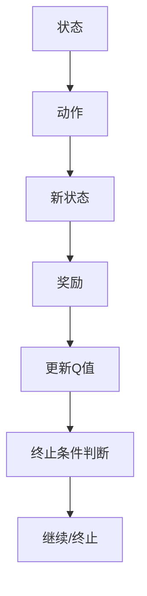
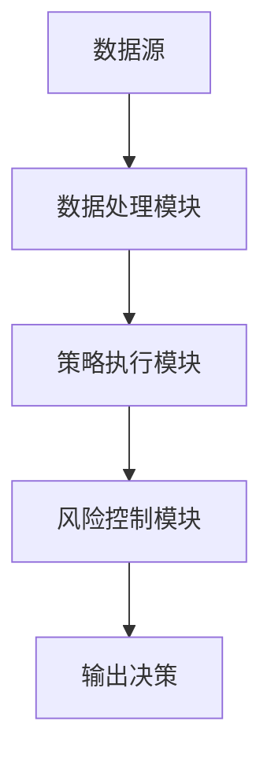

                 


# 企业AI Agent的强化学习在自动化交易策略中的高频应用

> 关键词：AI Agent，强化学习，自动化交易策略，高频交易，Q-learning算法

> 摘要：本文详细探讨了AI Agent在高频交易中的应用，重点分析了强化学习在自动化交易策略中的作用。通过介绍强化学习的基本原理、AI Agent的设计与实现、高频交易系统架构以及实际项目案例，本文为读者提供了一个全面的视角，深入剖析了强化学习在金融交易领域的潜力与挑战。

---

## 第1章 强化学习与AI Agent基础

### 1.1 强化学习的基本概念

#### 1.1.1 强化学习的定义与特点

强化学习（Reinforcement Learning, RL）是一种机器学习范式，其核心在于通过智能体与环境的交互来优化决策策略。与监督学习不同，强化学习不需要明确的标签数据，而是通过环境反馈的奖励（Reward）或惩罚（Penalty）机制来指导学习过程。

- **定义**：强化学习是一种通过试错方法，学习最优策略的过程，旨在使智能体在与环境的交互中获得最大累积奖励。
- **特点**：
  - 延时反馈：智能体的行为与奖励之间可能存在时滞。
  - 非平稳性：环境状态和奖励函数可能随时间动态变化。
  - 高维状态空间：在高频交易中，市场数据复杂且高维。

#### 1.1.2 AI Agent的基本概念与类型

AI Agent（人工智能代理）是指能够感知环境并采取行动以实现目标的智能实体。在金融领域，AI Agent通常用于执行交易策略、分析市场数据和优化投资组合。

- **类型**：
  - **基于规则的AI Agent**：基于预定义的规则进行决策。
  - **基于模型的AI Agent**：使用数学模型进行预测和决策。
  - **基于强化学习的AI Agent**：通过与环境交互学习最优策略。

#### 1.1.3 强化学习在AI Agent中的作用

强化学习通过与环境的交互，不断优化AI Agent的决策策略。在高频交易中，强化学习能够帮助AI Agent快速适应市场变化，做出最优交易决策。

---

### 1.2 高频交易与自动化策略

#### 1.2.1 高频交易的定义与特点

高频交易（High-Frequency Trading, HFT）是指在极短时间内以高频次进行交易的策略。高频交易依赖于高速数据处理能力和低延迟的交易执行系统。

- **特点**：
  - 交易频率高：每秒可以执行数百甚至数千笔交易。
  - 算法驱动：依赖复杂的数学模型和算法进行决策。
  - 竞争激烈：高频交易需要在极短的时间内做出决策，对系统性能要求极高。

#### 1.2.2 自动化交易策略的核心要素

自动化交易策略通过算法自动执行交易决策，关键要素包括：

- **数据源**：市场数据、历史数据、新闻数据等。
- **策略模型**：用于预测市场走势和生成交易信号。
- **执行系统**：负责将交易指令发送到交易所。
- **风险控制**：监控和管理交易风险。

#### 1.2.3 强化学习在自动化交易中的应用前景

强化学习在自动化交易中的应用前景广阔，特别是在处理复杂市场环境和动态变化方面具有显著优势。通过强化学习，AI Agent能够实时优化交易策略，适应市场波动。

---

## 第2章 强化学习算法原理

### 2.1 强化学习的核心概念

#### 2.1.1 状态、动作与奖励的定义

- **状态（State）**：表示环境的当前情况。在高频交易中，状态可能包括当前市场价格、波动率、交易量等。
- **动作（Action）**：AI Agent在给定状态下采取的行动。在交易策略中，动作可能包括买入、卖出或持有。
- **奖励（Reward）**：智能体采取某个动作后获得的反馈。在交易中，奖励可以是收益或损失。

#### 2.1.2 Q-learning算法的基本原理

Q-learning是一种经典的强化学习算法，适用于离线学习和近似动态规划问题。其核心思想是通过构建Q值表，记录状态-动作对的期望奖励。

- **算法流程**：
  1. 初始化Q值表，通常设置为0。
  2. 选择当前状态下的动作（探索与利用策略）。
  3. 执行动作，观察新状态和奖励。
  4. 更新Q值表：$$ Q(s, a) = Q(s, a) + \alpha (r + \gamma \max Q(s', a') - Q(s, a)) $$

#### 2.1.3 策略与值函数的关系

- **策略（Policy）**：描述智能体在每个状态下选择动作的概率分布。
- **值函数（Value Function）**：衡量某个状态下采取特定策略的期望奖励。

### 2.2 算法流程图



---

### 2.3 数学模型与公式

#### 2.3.1 Q-learning算法的数学表达式

$$ Q(s, a) = Q(s, a) + \alpha (r + \gamma \max Q(s', a') - Q(s, a)) $$

其中：
- \( s \) 表示当前状态
- \( a \) 表示当前动作
- \( r \) 表示奖励
- \( s' \) 表示新状态
- \( \alpha \) 表示学习率
- \( \gamma \) 表示折扣因子

---

## 第3章 AI Agent在高频交易中的应用

### 3.1 高频交易场景下的AI Agent设计

#### 3.1.1 数据流与决策速度要求

高频交易需要处理大量的实时数据流，包括市场数据、订单簿信息等。AI Agent需要在极短时间内处理这些数据并做出决策。

#### 3.1.2 市场环境的动态变化

市场环境瞬息万变，AI Agent需要能够快速适应市场变化，调整交易策略。

#### 3.1.3 交易策略的实时调整

通过强化学习，AI Agent可以实时优化交易策略，动态调整买卖时机和仓位大小。

---

### 3.2 强化学习在交易策略优化中的应用

#### 3.2.1 策略表示与状态空间

- **状态空间**：包括当前市场价格、波动率、交易量等市场指标。
- **动作空间**：包括买入、卖出或持有。

#### 3.2.2 动作空间与奖励函数设计

- **动作空间**：在高频交易中，动作空间通常包括买入、卖出或持有。
- **奖励函数**：根据交易收益和风险设计奖励函数，例如：$$ r = \text{收益} - \text{风险} $$

#### 3.2.3 策略评估与优化

通过强化学习算法，AI Agent不断评估和优化交易策略，以最大化累积奖励。

---

## 第4章 系统分析与架构设计

### 4.1 高频交易系统的功能设计

#### 4.1.1 数据采集与处理模块

- **数据源**：市场数据、订单簿、新闻数据等。
- **数据处理**：清洗、转换和特征提取。

#### 4.1.2 策略执行模块

- **策略选择**：根据市场状态选择最优交易策略。
- **订单执行**：将交易指令发送到交易所。

#### 4.1.3 风险控制模块

- **风险监控**：实时监控交易风险。
- **风险控制**：根据风险指标调整交易策略。

---

### 4.2 系统架构图



---

## 第5章 项目实战

### 5.1 环境安装

#### 5.1.1 安装Python环境

- 使用Anaconda安装Python 3.8及以上版本。
- 安装必要的库：numpy、pandas、scikit-learn、tensorflow。

#### 5.1.2 安装交易模拟器

- 使用Interactive Brokers API或其他交易模拟器。

---

### 5.2 系统核心实现源代码

#### 5.2.1 强化学习算法实现

```python
import numpy as np
import pandas as pd

class QAgent:
    def __init__(self, state_size, action_size):
        self.state_size = state_size
        self.action_size = action_size
        self.Q = np.zeros((state_size, action_size))
        self.learning_rate = 0.1
        self.gamma = 0.9

    def take_action(self, state):
        if np.random.random() < 0.1:
            return np.random.randint(self.action_size)
        else:
            return np.argmax(self.Q[state])

    def update_Q(self, state, action, reward, next_state):
        self.Q[state, action] = self.Q[state, action] + self.learning_rate * (reward + self.gamma * np.max(self.Q[next_state]) - self.Q[state, action])
```

#### 5.2.2 交易策略实现

```python
import pandas as pd
import numpy as np

def backtest策略：
    data = pd.read_csv('market_data.csv')
    states = data['price'].values
    actions = ['买入', '卖出', '持有']
    rewards = []
    for i in range(len(states) - 1):
        current_price = states[i]
        next_price = states[i + 1]
        action = agent.take_action(i)
        if action == 0:
            reward = (next_price - current_price) * 100
        elif action == 1:
            reward = (current_price - next_price) * 100
        else:
            reward = 0
        rewards.append(reward)
        agent.update_Q(i, action, reward, i + 1)
    return rewards

backtest策略()
```

---

### 5.3 案例分析与详细解读

通过实际案例分析，展示强化学习在高频交易中的应用效果。例如，假设在某段时间内，AI Agent通过强化学习成功捕捉到了多个交易机会，实现了较高的收益率。

---

## 第6章 最佳实践与小结

### 6.1 小结

强化学习在高频交易中的应用潜力巨大，通过实时优化交易策略，AI Agent能够在复杂多变的市场环境中实现高效决策。

### 6.2 注意事项

- **数据质量**：确保数据的准确性和及时性。
- **算法优化**：不断优化强化学习算法，提高决策效率。
- **风险控制**：加强风险监控，确保交易安全。

### 6.3 拓展阅读

- 推荐阅读《Reinforcement Learning: Theory and Algorithms》。
- 关注最新的强化学习研究成果，特别是应用于金融领域的研究。

---

## 作者

作者：AI天才研究院/AI Genius Institute  
联系邮箱：contact@ailab.com  
GitHub：https://github.com/AI-Genius-Institute  

---

# 结语

通过本文的详细讲解，我们深入探讨了强化学习在高频交易中的应用，从算法原理到系统设计，再到项目实战，为读者提供了一个全面的学习路径。希望本文能够为相关领域的研究者和从业者提供有价值的参考。

