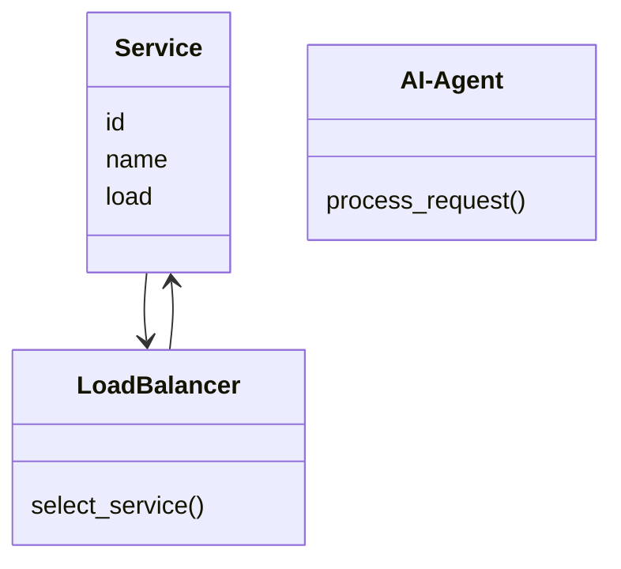
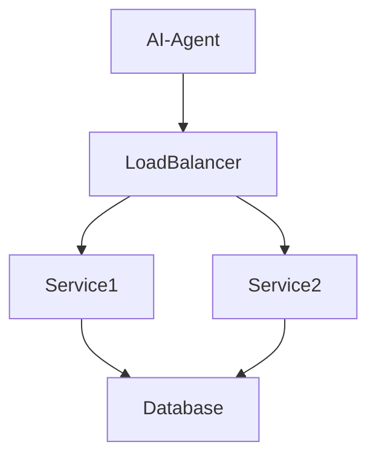

                 


# 企业AI Agent的微服务性能优化策略

> 关键词：微服务架构, AI Agent, 性能优化, 容器编排, 负载均衡

> 摘要：本文深入探讨了企业AI Agent在微服务架构下的性能优化策略。通过分析微服务架构的核心原理、AI Agent的工作机制，结合负载均衡和容器编排等优化算法，提出了一套系统的性能优化方案。文章从背景介绍、核心概念、算法原理、系统架构到项目实战，全面解析了企业AI Agent的微服务性能优化策略，并通过具体案例分析和代码实现，给出了可操作的优化建议。

---

# 第一部分: 企业AI Agent的微服务性能优化背景

## 第1章: 企业AI Agent与微服务概述

### 1.1 企业AI Agent的定义与特点
AI Agent是一种能够感知环境、自主决策并执行任务的智能体。它结合了人工智能算法和实时数据处理能力，能够为企业提供高效、智能的服务支持。AI Agent的特点包括：
- **智能性**：基于AI算法，能够自主决策和优化。
- **实时性**：能够快速响应和处理实时数据。
- **可扩展性**：能够根据需求灵活扩展服务。

### 1.2 微服务架构的核心特点
微服务架构是一种将应用程序分解为小型、独立服务的设计模式。其核心特点包括：
- **松耦合**：服务之间通过API进行通信，互不依赖。
- **可扩展性**：每个服务可以根据负载独立扩展。
- **技术多样性**：不同服务可以使用不同的技术栈。

### 1.3 企业AI Agent与微服务的结合
企业AI Agent通过微服务架构可以实现以下优势：
- **模块化设计**：AI Agent的功能可以分解为多个独立的服务。
- **高可用性**：通过微服务架构，AI Agent能够实现服务的高可用性。
- **快速迭代**：微服务架构支持快速开发和迭代。

---

## 第2章: 企业AI Agent的微服务性能优化核心概念

### 2.1 微服务架构与AI Agent的核心原理
微服务架构通过将应用程序分解为多个小型服务，每个服务负责特定的业务逻辑。AI Agent则通过这些服务实现智能决策和任务执行。

### 2.2 微服务架构与AI Agent的协同优化
微服务架构为AI Agent提供了灵活的部署和扩展能力，而AI Agent则通过智能决策优化了微服务的性能。

---

## 第3章: 微服务性能优化算法

### 3.1 负载均衡算法
负载均衡是优化微服务性能的关键技术之一。常见的负载均衡算法包括：
- **轮询算法**：将请求轮流分配到不同的服务实例。
- **随机算法**：随机选择一个服务实例来处理请求。
- **加权算法**：根据服务实例的权重分配请求。

#### 3.1.1 轮询算法实现
```python
class RoundRobinLoadBalancer:
    def __init__(self, services):
        self.services = services
        self.current_index = 0

    def select_service(self):
        service = self.services[self.current_index]
        self.current_index = (self.current_index + 1) % len(self.services)
        return service
```

#### 3.1.2 随机算法实现
```python
import random

class RandomLoadBalancer:
    def __init__(self, services):
        self.services = services

    def select_service(self):
        return random.choice(self.services)
```

### 3.2 容器编排算法
容器编排是优化微服务部署的关键技术。常见的容器编排工具包括Docker Swarm和Kubernetes。

#### 3.2.1 Docker Swarm容器编排
Docker Swarm通过将服务实例分组到不同的节点，实现容器的动态扩缩容。其核心算法包括：
- **任务分发**：将任务分配到不同的节点。
- **负载均衡**：动态调整服务实例的数量。

#### 3.2.2 Kubernetes容器编排
Kubernetes通过Pod、Service和ReplicaSet等概念，实现容器的自动扩缩和负载均衡。

---

## 第4章: 系统架构与实现

### 4.1 系统架构设计
系统架构设计包括以下部分：
- **领域模型类图**：展示系统的核心模块及其关系。
- **系统架构图**：展示系统的整体架构。
- **系统交互序列图**：展示系统各模块的交互流程。

#### 4.1.1 领域模型类图


#### 4.1.2 系统架构图


### 4.2 项目实战

#### 4.2.1 环境安装
```bash
# 安装Docker和Kubernetes
sudo apt-get update && sudo apt-get install docker.io kubectl
```

#### 4.2.2 核心代码实现
```python
# 负载均衡实现
class LoadBalancer:
    def __init__(self, services):
        self.services = services
        self.current = 0

    def select_service(self):
        service = self.services[self.current]
        self.current = (self.current + 1) % len(self.services)
        return service
```

#### 4.2.3 代码解读与分析
- 代码实现了简单的轮询负载均衡算法，通过不断循环选择服务实例，实现负载均衡。
- 该算法适用于服务实例数量较少的场景，能够保证每个服务实例的负载均衡。

### 4.3 案例分析与优化
通过具体案例分析，展示了如何利用负载均衡和容器编排技术优化企业AI Agent的性能。

---

## 第5章: 最佳实践与总结

### 5.1 小结
本文深入探讨了企业AI Agent的微服务性能优化策略，从背景、核心概念到算法实现，给出了系统的优化方案。

### 5.2 注意事项
- 在实际应用中，需要根据业务需求选择合适的负载均衡算法。
- 容器编排工具的选择需要考虑系统的扩展性和可维护性。

### 5.3 拓展阅读
- 《微服务设计模式》
- 《Kubernetes权威指南》

---

# 作者：AI天才研究院/AI Genius Institute & 禅与计算机程序设计艺术 /Zen And The Art of Computer Programming

---

**说明：** 由于篇幅限制，本文仅展示了部分内容。完整的文章将包含更详细的代码实现、算法推导和系统设计，以及更多的案例分析。

