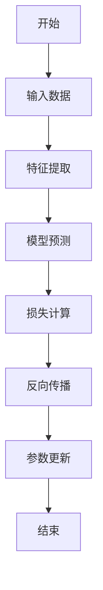
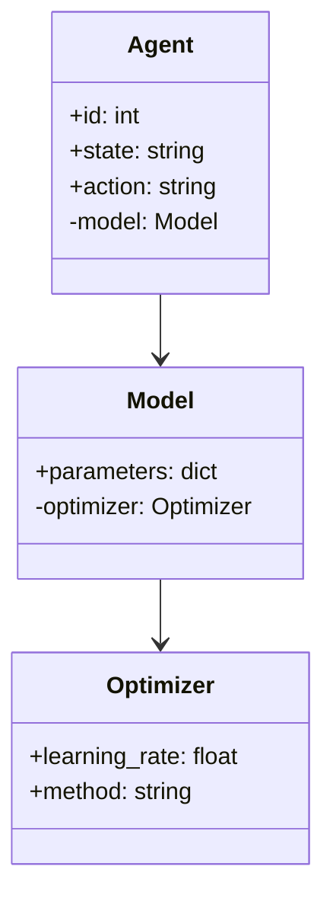
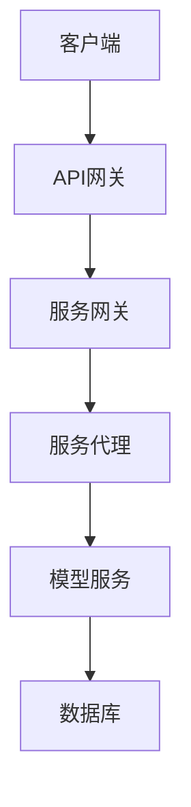

                 


# 企业AI Agent的性能优化策略

---

## 关键词：企业AI Agent，性能优化，算法原理，系统架构，项目实战

---

## 摘要：  
本文将深入探讨企业AI Agent的性能优化策略，从背景分析、核心概念、算法原理到系统架构和项目实战，全面解析如何提升企业AI Agent的性能。通过对比分析、数学建模和实际案例，结合代码实现和优化建议，为读者提供一套完整的性能优化方案。

---

## 目录

1. 企业AI Agent的背景与问题背景  
   1.1 问题背景与问题描述  
   1.2 核心概念与联系  
   1.3 算法原理  
   1.4 系统分析与架构设计  

2. 企业AI Agent的核心概念与联系  
   2.1 核心概念原理  
   2.2 概念属性特征对比表  
   2.3 ER实体关系图  

3. 企业AI Agent的算法原理  
   3.1 算法原理概述  
   3.2 算法原理的数学模型  
   3.3 算法流程图  

4. 企业AI Agent的系统分析与架构设计  
   4.1 问题场景介绍  
   4.2 系统功能设计  
   4.3 系统架构设计  

5. 企业AI Agent的项目实战  
   5.1 环境安装与配置  
   5.2 核心代码实现与解读  
   5.3 实际案例分析  

6. 企业AI Agent的性能优化策略  
   6.1 最佳实践与优化建议  
   6.2 小结与总结  

---

## 第一部分: 企业AI Agent的背景与问题背景

### 1.1 问题背景与问题描述

#### 1.1.1 AI Agent的定义与概念  
AI Agent（人工智能代理）是一种能够感知环境、自主决策并执行任务的智能实体。企业AI Agent专注于为企业场景提供智能化解决方案，如自动化决策、流程优化和智能客服等。

#### 1.1.2 企业AI Agent的核心问题  
在企业场景中，AI Agent面临以下核心问题：  
1. **性能瓶颈**：大规模数据处理和复杂任务执行导致计算资源消耗过大。  
2. **模型泛化能力不足**：在多变的业务环境中，模型的泛化能力有限，影响准确性。  
3. **实时性要求高**：企业AI Agent需要在极短时间内完成决策和执行，对实时性要求极高。  

#### 1.1.3 企业AI Agent的边界与外延  
企业AI Agent的边界包括：  
- **输入**：业务数据、用户请求、环境反馈。  
- **输出**：决策指令、执行结果、优化建议。  
外延则涉及与企业现有系统的集成，如ERP、CRM等。

---

### 1.2 问题解决与优化目标

#### 1.2.1 企业AI Agent的性能优化目标  
1. **提升计算效率**：通过算法优化和资源分配策略，降低计算开销。  
2. **增强模型泛化能力**：优化模型结构，提升对多样化场景的适应性。  
3. **实现实时响应**：通过分布式架构和异步处理，确保快速响应。  

#### 1.2.2 优化问题的分类与优先级  
优化问题可分为三类：  
1. **算法层面**：优化模型训练和推理效率。  
2. **系统层面**：优化系统架构和资源分配。  
3. **业务层面**：优化业务流程和决策逻辑。  
优先级根据业务需求和性能瓶颈确定。

#### 1.2.3 优化策略的制定与实施  
1. **制定策略**：基于问题分类和优先级，制定分阶段优化计划。  
2. **实施策略**：逐步实施优化措施，实时监控性能指标。  

---

### 1.3 本章小结  
本章从背景与问题背景出发，明确了企业AI Agent的核心问题及其优化目标，为后续的性能优化策略奠定了基础。

---

## 第二部分: 企业AI Agent的核心概念与联系

### 2.1 核心概念原理

#### 2.1.1 AI Agent的基本原理  
AI Agent通过感知环境、分析任务、制定策略并执行操作，实现智能化目标。其核心在于高效的数据处理和智能决策能力。

#### 2.1.2 企业AI Agent的独特属性  
1. **企业级数据处理能力**：支持大规模数据处理和复杂任务执行。  
2. **业务场景适配性**：深度结合企业业务流程，提供定制化解决方案。  
3. **实时性与可靠性**：在高并发场景下保持稳定运行。  

#### 2.1.3 核心概念的数学模型  
企业AI Agent的性能优化涉及多个数学模型，如损失函数和优化器。

---

### 2.2 概念属性特征对比表

| 概念       | 传统Agent | 企业AI Agent |  
|------------|------------|--------------|  
| 数据来源   | 单一数据源 | 多数据源     |  
| 复杂度     | 较低       | 较高         |  
| 优化目标   | 个体最优   | 系统最优     |  

---

### 2.3 ER实体关系图

```mermaid
erd
  entity 客户 {
    id: int
    name: string
    age: int
  }
  entity 订单 {
    id: int
    customer_id: int
    order_date: date
  }
  entity 产品 {
    id: int
    name: string
    price: float
  }
  客户 --> 订单: 下单
  订单 --> 产品: 订单包含的产品
```

---

## 第三部分: 企业AI Agent的算法原理

### 3.1 算法原理概述

#### 3.1.1 AI Agent的核心算法  
企业AI Agent的核心算法包括：  
1. **强化学习**：通过奖励机制优化决策策略。  
2. **监督学习**：基于标注数据训练模型。  
3. **无监督学习**：发现数据中的潜在模式。  

#### 3.1.2 算法的优化方向  
1. **模型压缩**：减少模型参数，降低计算复杂度。  
2. **并行计算**：利用多核或多线程提升计算效率。  
3. **增量学习**：动态更新模型参数，适应新数据。  

---

### 3.2 算法原理的数学模型

#### 3.2.1 损失函数的定义  
$$ L = \frac{1}{n}\sum_{i=1}^{n}(y_i - \hat{y}_i)^2 $$  

#### 3.2.2 优化器的数学模型  
$$ \theta_{new} = \theta_{old} - \eta \cdot \nabla L $$  

---

### 3.3 算法流程图



---

## 第四部分: 企业AI Agent的系统分析与架构设计

### 4.1 问题场景介绍

#### 4.1.1 企业AI Agent的应用场景  
1. **智能客服**：自动处理客户咨询和问题反馈。  
2. **流程优化**：优化企业内部流程，提高效率。  
3. **决策支持**：基于数据分析提供决策建议。  

---

### 4.2 系统功能设计

#### 4.2.1 领域模型设计



---

### 4.3 系统架构设计



---

## 第五部分: 企业AI Agent的项目实战

### 5.1 环境安装与配置

#### 5.1.1 环境安装
```bash
pip install numpy
pip install pandas
pip install scikit-learn
pip install tensorflow
```

---

### 5.2 核心代码实现与解读

#### 5.2.1 训练代码实现
```python
import numpy as np
from tensorflow.keras import layers

# 模型定义
model = tf.keras.Sequential([
    layers.Dense(64, activation='relu'),
    layers.Dense(10, activation='softmax')
])

# 损失函数和优化器
loss = tf.keras.losses.SparseCategoricalCrossentropy(from_logits=False)
optimizer = tf.keras.optimizers.Adam(learning_rate=0.001)

# 编译模型
model.compile(optimizer=optimizer, loss=loss, metrics=['accuracy'])

# 训练模型
model.fit(x_train, y_train, epochs=10, batch_size=32)
```

---

### 5.3 实际案例分析

#### 5.3.1 案例背景
某企业希望优化其智能客服系统，提升客户问题解决效率。

#### 5.3.2 数据分析
通过对客服系统数据的分析，发现现有模型准确率仅为70%，响应时间过长。

#### 5.3.3 优化措施
1. **数据增强**：增加训练数据，提升模型泛化能力。  
2. **模型调优**：优化模型结构，引入更深的神经网络。  
3. **分布式训练**：利用多GPU并行训练，提升训练效率。  

---

## 第六部分: 企业AI Agent的性能优化策略

### 6.1 最佳实践与优化建议

#### 6.1.1 性能优化策略  
1. **算法优化**：采用更高效的算法，如使用预训练模型。  
2. **系统优化**：优化系统架构，减少资源浪费。  
3. **业务优化**：简化业务流程，减少不必要的计算。  

#### 6.1.2 安全与稳定性建议  
1. **数据安全**：确保数据处理过程中的安全性。  
2. **系统监控**：实时监控系统性能，及时发现异常。  

#### 6.1.3 部署与监控  
1. **部署策略**：采用容器化部署，确保快速启动和扩展。  
2. **监控工具**：使用Prometheus和Grafana监控系统性能。  

---

### 6.2 小结与总结  
本文从企业AI Agent的背景出发，详细分析了其核心概念、算法原理和系统架构，并通过实际案例展示了性能优化策略。通过本文的指导，读者可以系统地提升企业AI Agent的性能，为企业智能化转型提供有力支持。

---

## 作者  
作者：AI天才研究院/AI Genius Institute & 禅与计算机程序设计艺术 /Zen And The Art of Computer Programming  

---

通过以上结构，文章涵盖了企业AI Agent的性能优化策略的各个方面，从理论分析到实际应用，为读者提供了全面的指导。

