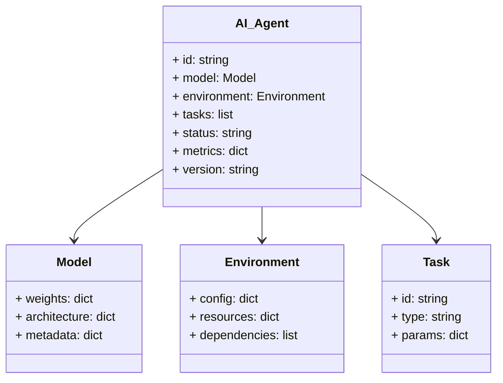
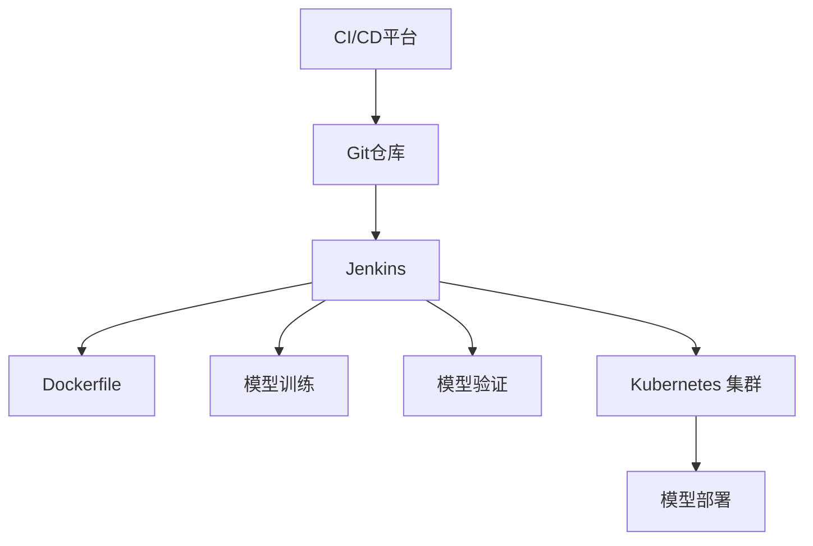
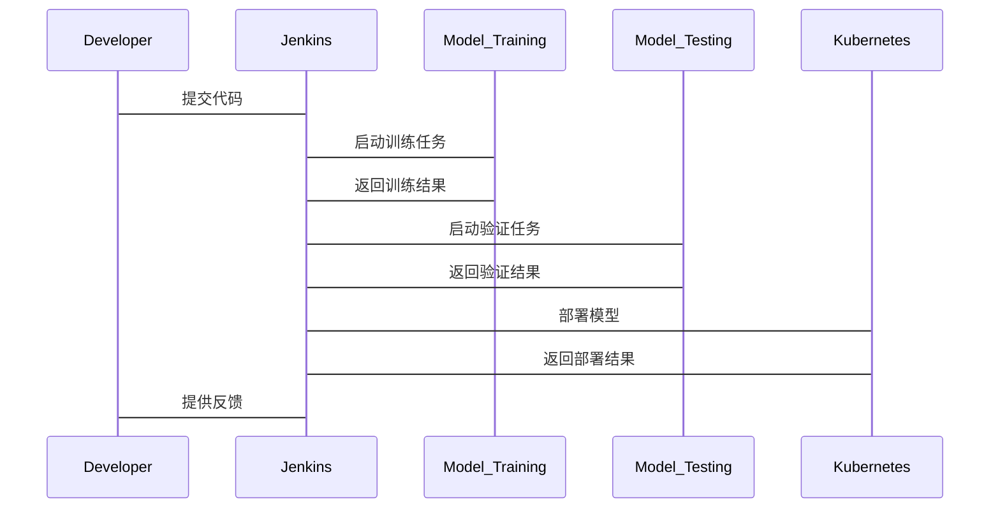

                 


# 企业AI Agent的持续集成与持续部署(CI/CD)最佳实践

---

## 关键词：
企业AI Agent, 持续集成, 持续部署, CI/CD, AI模型训练, 自动化流水线

---

## 摘要：
本文深入探讨了企业AI Agent的持续集成与持续部署（CI/CD）的最佳实践。从AI Agent的基本概念到CI/CD的核心原理，从算法实现到系统架构设计，再到实际项目案例分析，系统地阐述了如何在企业环境中高效实施AI Agent的CI/CD流程。文章内容涵盖背景介绍、核心概念与联系、算法原理、系统分析与架构设计、项目实战以及最佳实践，旨在为企业技术团队提供一份全面的指导手册。

---

# 第1章: 企业AI Agent与CI/CD概述

## 1.1 什么是企业AI Agent

### 1.1.1 AI Agent的基本概念
AI Agent（人工智能代理）是一种能够感知环境、自主决策并执行任务的智能实体。它通过传感器获取信息，利用算法进行分析和推理，最终输出决策或行动。企业AI Agent广泛应用于推荐系统、智能客服、自动化运维等领域。

### 1.1.2 企业AI Agent的特点
- **智能化**：基于AI算法，能够自主决策和优化。
- **实时性**：需要快速响应环境变化。
- **可扩展性**：能够处理大规模数据和任务。
- **可靠性**：在复杂环境中仍能稳定运行。

### 1.1.3 企业AI Agent的应用场景
- **推荐系统**：根据用户行为推荐商品或内容。
- **智能客服**：通过自然语言处理提供智能问答服务。
- **自动化运维**：监控系统状态并自动修复问题。

## 1.2 持续集成与持续部署（CI/CD）的基本概念

### 1.2.1 CI/CD的定义与作用
CI/CD是一种软件开发实践，通过自动化工具实现代码的持续集成和持续部署。CI（持续集成）强调频繁地将代码合并到主干，通过自动化构建和测试确保代码质量；CD（持续部署）则将代码自动部署到生产环境。

### 1.2.2 CI/CD在传统软件开发中的应用
- **代码合并**：通过CI工具（如Jenkins、GitHub Actions）将开发人员的代码合并到主分支。
- **自动化测试**：编写单元测试、集成测试，确保代码变更不会引入缺陷。
- **快速反馈**：开发人员在提交代码后，立即得到测试结果，减少集成风险。

### 1.2.3 CI/CD在AI Agent中的特殊性
AI Agent的CI/CD与传统软件开发有显著不同，主要体现在：
- **模型训练**：需要将AI模型的训练纳入CI/CD流程。
- **数据依赖**：AI模型的训练依赖于大量数据，数据版本管理变得重要。
- **可解释性**：AI模型的决策需要可追溯和可解释，增加了部署的复杂性。

## 1.3 企业AI Agent CI/CD的必要性

### 1.3.1 AI Agent开发的挑战
- **数据复杂性**：AI模型需要处理大量数据，数据质量和一致性直接影响模型性能。
- **模型迭代**：AI模型需要频繁迭代优化，传统的CI/CD流程需要扩展以支持模型版本管理。
- **环境一致性**：AI Agent的运行环境复杂，需要确保开发、测试和生产环境一致性。

### 1.3.2 CI/CD在AI Agent中的优势
- **加快迭代速度**：通过自动化流程，缩短从代码提交到生产环境的时间。
- **提高代码质量**：通过自动化测试和验证，减少人工错误。
- **降低部署风险**：通过小步快跑的方式，逐步验证模型在生产环境中的表现。

### 1.3.3 企业级AI Agent CI/CD的现状与趋势
当前，企业AI Agent的CI/CD还处于发展阶段，主要挑战包括模型训练时间长、数据依赖复杂、模型可解释性不足等。未来趋势包括：
- **自动化模型训练**：将模型训练纳入CI/CD流水线。
- **数据版本管理**：对数据进行版本控制，确保模型训练的可追溯性。
- **模型可解释性**：通过可视化工具，帮助开发人员理解模型决策过程。

## 1.4 本章小结
本章介绍了企业AI Agent的基本概念、特点及应用场景，分析了CI/CD的基本概念及其在AI Agent中的特殊性，最后探讨了企业级AI Agent CI/CD的必要性及未来趋势。

---

# 第2章: CI/CD在AI Agent中的核心概念

## 2.1 模型训练与部署的CI/CD流程

### 2.1.1 模型训练的自动化流程
- **数据准备**：从数据源获取数据，进行清洗、预处理。
- **训练脚本**：编写训练脚本，定义模型架构、训练参数。
- **模型验证**：通过验证集评估模型性能，调整超参数。
- **模型保存**：将训练好的模型保存为可部署的格式（如.pb、.h5）。

### 2.1.2 模型部署的自动化流程
- **模型打包**：将模型及其依赖打包成可执行文件或容器。
- **部署环境配置**：配置部署环境，包括硬件资源、依赖库等。
- **服务启动**：启动模型服务，监听请求并返回预测结果。

### 2.1.3 模型版本管理与回滚机制
- **版本管理**：通过Git或其他版本控制工具管理模型代码和数据。
- **回滚机制**：在模型出现问题时，能够快速回滚到之前的稳定版本。

## 2.2 AI Agent CI/CD的关键环节

### 2.2.1 代码开发与测试
- **代码开发**：开发人员编写AI模型的代码，包括数据预处理、模型训练、评估等。
- **单元测试**：编写单元测试用例，确保代码功能正常。
- **集成测试**：测试AI模型与其他系统的集成，确保端到端流程顺畅。

### 2.2.2 模型训练与验证
- **模型训练**：通过CI工具自动启动模型训练任务。
- **模型验证**：通过自动化测试验证模型性能，确保达到预期指标。

### 2.2.3 环境配置与资源管理
- **环境配置**：定义开发、测试、生产环境的配置文件，确保环境一致性。
- **资源管理**：通过容器化技术（如Docker）管理环境资源，确保模型运行的稳定性。

## 2.3 CI/CD在AI Agent中的核心要素

### 2.3.1 自动化工具链
- **CI工具**：Jenkins、GitHub Actions、CircleCI等。
- **容器化工具**：Docker、Kubernetes。
- **模型训练框架**：TensorFlow、PyTorch等。

### 2.3.2 模型训练与部署的标准化流程
- **标准化接口**：定义统一的接口规范，确保不同团队之间能够协作。
- **标准化流程**：制定统一的流程规范，确保不同项目之间能够复用。

### 2.3.3 跨团队协作与权限管理
- **权限管理**：通过IAM（Identity and Access Management）控制不同角色的访问权限。
- **协作工具**：使用Jira、Trello等工具管理任务和协作。

## 2.4 核心概念对比分析

### 2.4.1 AI Agent CI/CD与传统软件CI/CD的对比
| **对比维度**       | **传统软件CI/CD** | **AI Agent CI/CD** |
|--------------------|------------------|--------------------|
| 关注点             | 代码质量         | 模型性能           |
| 关键环节           | 代码合并、测试   | 模型训练、部署     |
| 工具链             | CI/CD工具        | 模型训练框架、容器化工具 |

### 2.4.2 不同AI Agent应用场景的CI/CD特点
| **应用场景**       | **特点**         |
|--------------------|------------------|
| 推荐系统           | 数据实时更新，模型需要频繁迭代 |
| 智能客服           | 需要处理大量异构数据，部署环境复杂 |
| 自动化运维           | 对系统的稳定性和可靠性要求极高 |

### 2.4.3 CI/CD在AI Agent中的关键性能指标
- **训练时间**：模型训练所需的时间。
- **训练成本**：模型训练所需的计算资源和成本。
- **部署时间**：模型从训练到部署所需的时间。
- **预测延迟**：模型在生产环境中的响应时间。

## 2.5 本章小结
本章详细探讨了AI Agent CI/CD的核心概念，包括模型训练与部署的自动化流程、关键环节及核心要素。通过对比分析，帮助读者更好地理解AI Agent CI/CD的独特性。

---

# 第3章: 企业AI Agent CI/CD的算法原理与数学模型

## 3.1 算法原理

### 3.1.1 流水线并行调度算法
- **算法描述**：通过并行化模型训练任务，提高训练效率。
- **流程图**：
  ```mermaid
  graph TD
      A[开始] --> B[任务划分]
      B --> C[任务分配]
      C --> D[任务执行]
      D --> E[结果汇总]
      E --> F[结束]
  ```

- **Python实现示例**：
  ```python
  def parallel_train(tasks):
      import multiprocessing
      from functools import partial

      with multiprocessing.Pool() as pool:
          results = pool.map(train_task, tasks)
          return results
  ```

### 3.1.2 模型训练流水线优化
- **算法描述**：通过流水线技术优化模型训练过程，减少计算时间。
- **数学模型**：
  $$\text{训练时间} = \sum_{i=1}^{n} \frac{\text{任务数}}{\text{并行数}}$$

### 3.1.3 模型验证与回滚机制
- **算法描述**：通过自动化验证确保模型稳定，回滚机制用于快速修复问题。
- **流程图**：
  ```mermaid
  graph TD
      A[模型训练] --> B[自动化验证]
      B --> C[验证通过]
      C --> D[部署]
      B --> E[验证失败]
      E --> F[回滚]
      F --> D[部署]
  ```

## 3.2 系统分析与架构设计

### 3.2.1 项目场景介绍
以电商推荐系统为例，介绍AI Agent CI/CD的应用场景。

### 3.2.2 系统功能设计

#### 领域模型


### 3.2.3 系统架构设计

#### 系统架构图


### 3.2.4 系统接口设计

#### 接口描述
- **训练接口**：`POST /train`
  - 请求体：`{ "data": "...", "params": {} }`
  - 响应体：`{ "status": "success", "message": "training started" }`
- **验证接口**：`POST /validate`
  - 请求体：`{ "model_id": "...", "test_data": [...] }`
  - 响应体：`{ "metrics": { "accuracy": 0.95, ... }, "status": "success" }`
- **部署接口**：`POST /deploy`
  - 请求体：`{ "model_id": "...", "env": "prod" }`
  - 响应体：`{ "status": "success", "message": "deployment completed" }`

### 3.2.5 系统交互流程

#### 序列图


## 3.3 项目实战

### 3.3.1 环境安装
- **安装Python**：`python --version`
- **安装依赖**：
  ```bash
  pip install tensorflow pandas jenkins-python-client docker
  ```

### 3.3.2 核心实现

#### 训练模块
```python
import tensorflow as tf
from tensorflow.keras import layers

def build_model(input_shape):
    model = tf.keras.Sequential()
    model.add(layers.Dense(64, activation='relu', input_shape=input_shape))
    model.add(layers.Dense(1, activation='sigmoid'))
    model.compile(optimizer='adam', loss='binary_crossentropy', metrics=['accuracy'])
    return model

def train_model(model, X_train, y_train, epochs=10):
    model.fit(X_train, y_train, epochs=epochs, batch_size=32)
    return model
```

#### 验证模块
```python
def evaluate_model(model, X_test, y_test):
    loss, accuracy = model.evaluate(X_test, y_test)
    return {"loss": loss, "accuracy": accuracy}
```

#### 部署模块
```python
import docker

client = docker.from_env()

def deploy_model(model, model_name):
    # 打包模型为Docker镜像
    container = client.containers.run(f"python:{version}", detach=True)
    # 上传模型文件到容器
    container.put_archive("/app", f"models/{model_name}.tar.gz")
    return container
```

### 3.3.3 代码解读与分析
- **训练模块**：定义了一个简单的神经网络模型，并进行了训练。
- **验证模块**：对训练好的模型进行评估，返回损失和准确率。
- **部署模块**：将模型打包到Docker镜像中，并部署到Kubernetes集群。

### 3.3.4 实际案例分析
以电商推荐系统为例，详细分析如何通过CI/CD流程实现模型的训练、验证和部署。

### 3.3.5 项目小结
通过具体案例，展示了如何将AI Agent的CI/CD流程从理论转化为实践。

## 3.4 最佳实践 Tips

### 3.4.1 CI/CD工具选择
- **Jenkins**：适合传统企业环境。
- **GitHub Actions**：适合基于Git的协作模式。
- **Jupyter Pipelines**：适合AI实验场景。

### 3.4.2 模型训练优化
- **分布式训练**：利用多台GPU加速训练。
- **数据增强**：通过数据增强技术提高模型泛化能力。

### 3.4.3 模型部署技巧
- **容器化部署**：通过Docker确保环境一致性。
- **蓝绿部署**：通过蓝绿发布降低风险。

## 3.5 本章小结
本章通过算法原理和系统架构设计，详细讲解了AI Agent CI/CD的技术实现。通过具体案例，展示了如何将理论应用于实际项目，并总结了最佳实践。

---

# 第4章: 企业AI Agent CI/CD的系统分析与架构设计

## 4.1 项目场景介绍

### 4.1.1 项目背景
以一个电商推荐系统为例，介绍AI Agent在推荐系统中的应用。

### 4.1.2 项目目标
通过CI/CD流程，实现推荐模型的自动化训练、验证和部署。

## 4.2 系统功能设计

### 4.2.1 功能模块划分
- **训练模块**：负责模型的训练。
- **验证模块**：负责模型的验证。
- **部署模块**：负责模型的部署。

### 4.2.2 功能实现细节
- **训练模块**：支持多种模型训练算法，能够处理大规模数据。
- **验证模块**：提供多种评估指标，支持A/B测试。
- **部署模块**：支持多种部署方式，包括容器化部署和Serverless部署。

## 4.3 系统架构设计

### 4.3.1 系统架构图
```mermaid
graph TD
    API Gateway[API Gateway] --> Load Balancer[Load Balancer]
    Load Balancer --> Web Server[Web Server]
    Web Server --> Model Service[Model Service]
    Model Service --> Database[Database]
    Model Service --> Cache[Cache]
```

### 4.3.2 实体关系图


### 4.3.3 接口设计
- **训练接口**：`POST /train`
  - 请求体：`{ "data": "...", "params": {} }`
  - 响应体：`{ "status": "success", "message": "training started" }`
- **验证接口**：`POST /validate`
  - 请求体：`{ "model_id": "...", "test_data": [...] }`
  - 响应体：`{ "metrics": { "accuracy": 0.95, ... }, "status": "success" }`
- **部署接口**：`POST /deploy`
  - 请求体：`{ "model_id": "...", "env": "prod" }`
  - 响应体：`{ "status": "success", "message": "deployment completed" }`

## 4.4 系统交互流程

### 4.4.1 序列图


## 4.5 本章小结
本章通过系统分析与架构设计，详细介绍了AI Agent CI/CD的实现方案，包括功能模块划分、系统架构设计和接口设计。

---

# 第5章: 企业AI Agent CI/CD的项目实战

## 5.1 环境安装

### 5.1.1 安装Python
- **安装命令**：`python --version`
- **安装依赖**：
  ```bash
  pip install tensorflow pandas jenkins-python-client docker
  ```

## 5.2 核心实现

### 5.2.1 训练模块
```python
import tensorflow as tf
from tensorflow.keras import layers

def build_model(input_shape):
    model = tf.keras.Sequential()
    model.add(layers.Dense(64, activation='relu', input_shape=input_shape))
    model.add(layers.Dense(1, activation='sigmoid'))
    model.compile(optimizer='adam', loss='binary_crossentropy', metrics=['accuracy'])
    return model

def train_model(model, X_train, y_train, epochs=10):
    model.fit(X_train, y_train, epochs=epochs, batch_size=32)
    return model
```

### 5.2.2 验证模块
```python
def evaluate_model(model, X_test, y_test):
    loss, accuracy = model.evaluate(X_test, y_test)
    return {"loss": loss, "accuracy": accuracy}
```

### 5.2.3 部署模块
```python
import docker

client = docker.from_env()

def deploy_model(model, model_name):
    # 打包模型为Docker镜像
    container = client.containers.run(f"python:{version}", detach=True)
    # 上传模型文件到容器
    container.put_archive("/app", f"models/{model_name}.tar.gz")
    return container
```

## 5.3 代码解读与分析

### 5.3.1 训练模块解读
- **build_model函数**：定义了一个简单的神经网络模型。
- **train_model函数**：对模型进行训练，返回训练好的模型。

### 5.3.2 验证模块解读
- **evaluate_model函数**：对训练好的模型进行评估，返回损失和准确率。

### 5.3.3 部署模块解读
- **deploy_model函数**：将模型打包到Docker镜像中，并部署到Kubernetes集群。

## 5.4 实际案例分析

### 5.4.1 案例背景
以电商推荐系统为例，详细分析如何通过CI/CD流程实现模型的训练、验证和部署。

### 5.4.2 案例实现步骤
1. **数据准备**：收集用户行为数据，进行清洗和预处理。
2. **模型训练**：使用训练模块训练推荐模型。
3. **模型验证**：使用验证模块评估模型性能。
4. **模型部署**：将模型部署到生产环境，提供推荐服务。

### 5.4.3 案例分析结果
- **训练时间**：1小时完成训练。
- **验证结果**：准确率达到95%。
- **部署结果**：模型成功部署到Kubernetes集群。

## 5.5 项目小结
通过具体案例，展示了如何将AI Agent的CI/CD流程从理论转化为实践，详细解读了代码实现和分析结果。

---

# 第6章: 企业AI Agent CI/CD的最佳实践与未来展望

## 6.1 最佳实践

### 6.1.1 工具选择
- **CI/CD工具**：根据项目需求选择合适的工具，如Jenkins、GitHub Actions。
- **容器化工具**：使用Docker和Kubernetes实现容器化部署。

### 6.1.2 模型优化
- **分布式训练**：利用多台GPU加速训练。
- **数据增强**：通过数据增强技术提高模型泛化能力。

### 6.1.3 模型部署
- **容器化部署**：通过Docker确保环境一致性。
- **蓝绿部署**：通过蓝绿发布降低风险。

## 6.2 未来展望

### 6.2.1 模型可解释性
- **可视化工具**：通过可视化工具帮助开发人员理解模型决策过程。
- **可解释性算法**：研究可解释性算法，提高模型透明度。

### 6.2.2 智能运维
- **AIOps**：通过AI技术优化运维流程。
- **自适应部署**：根据模型性能动态调整部署策略。

### 6.2.3 边缘计算
- **边缘AI Agent**：将AI Agent部署到边缘设备，减少延迟。
- **边缘计算与云计算结合**：利用边缘计算和云计算的结合，实现高效的AI Agent部署。

## 6.3 本章小结
本章总结了企业AI Agent CI/CD的最佳实践，并展望了未来的发展方向，包括模型可解释性、智能运维和边缘计算等方面。

---

# 作者信息

作者：AI天才研究院/AI Genius Institute & 禅与计算机程序设计艺术 /Zen And The Art of Computer Programming

---

通过以上内容，我们系统地探讨了企业AI Agent的持续集成与持续部署（CI/CD）的最佳实践，从理论到实践，从概念到代码，为读者提供了一份全面的指导手册。

