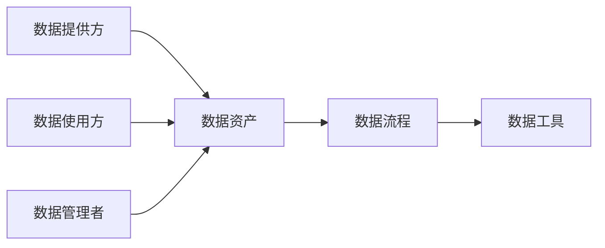
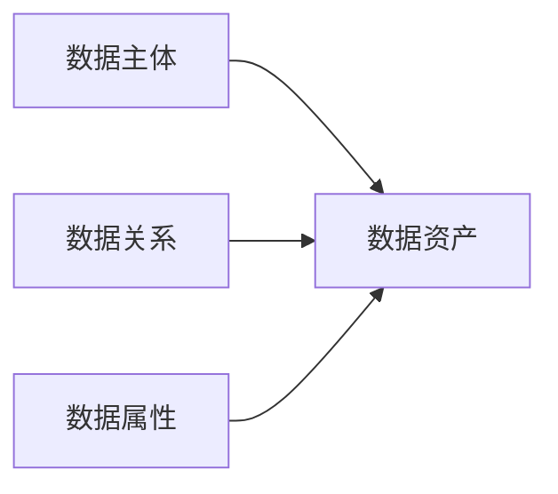
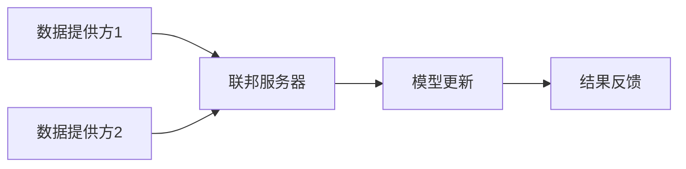
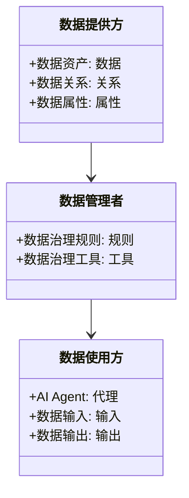
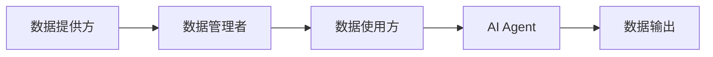
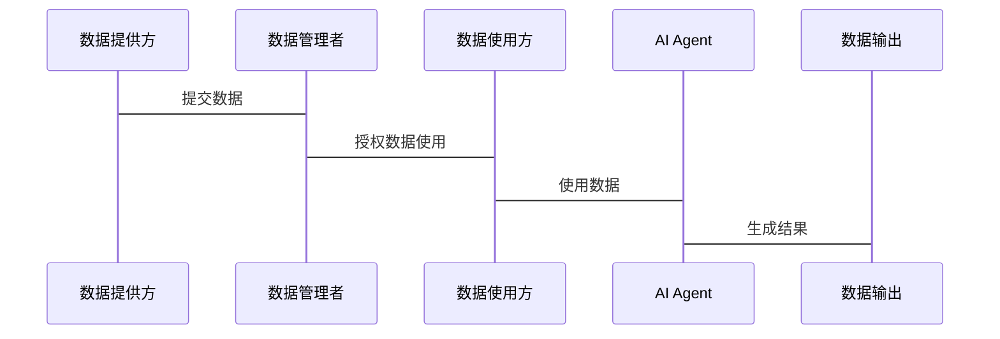

                 


# 企业AI Agent的数据治理框架

> 关键词：企业AI Agent，数据治理框架，联邦学习，数据安全，系统架构，数据隐私

> 摘要：随着企业智能化转型的深入推进，AI Agent（人工智能代理）在企业中的应用日益广泛。然而，AI Agent的高效运行离不开高质量的数据治理。本文将从企业AI Agent的定义与背景出发，系统阐述数据治理的核心概念、算法原理及系统架构，重点分析联邦学习在数据治理中的应用，并通过实际案例展示如何构建企业级AI Agent数据治理框架。文章末尾还将总结数据治理的最佳实践，为企业AI Agent的落地提供参考。

---

# 第一部分: 企业AI Agent与数据治理概述

# 第1章: 企业AI Agent与数据治理概述

## 1.1 企业AI Agent的定义与背景

### 1.1.1 AI Agent的基本概念

AI Agent（人工智能代理）是一种能够感知环境、自主决策并执行任务的智能体。在企业场景中，AI Agent通常表现为软件程序或系统，能够通过数据驱动的方式完成特定任务。例如，企业AI Agent可以用于客户关系管理、供应链优化、智能客服等领域。

$$\text{AI Agent的核心特征包括：自主性、反应性、目标导向和社交能力。}$$

### 1.1.2 企业AI Agent的独特性

企业AI Agent相较于通用AI，具有以下独特性：
- **目标明确性**：企业AI Agent的设计目标是解决特定的业务问题。
- **数据依赖性**：企业AI Agent的性能高度依赖于数据质量和数量。
- **合规性要求**：企业AI Agent需要符合行业监管要求，如GDPR、 HIPAA等。

### 1.1.3 数据治理在企业AI Agent中的作用

数据治理是确保数据质量、安全性和合规性的过程。在企业AI Agent中，数据治理的作用尤为关键：
- **数据质量保障**：确保AI Agent使用的数据准确、完整。
- **数据安全保护**：防止数据泄露、篡改等安全问题。
- **数据合规性**：确保AI Agent的运行符合法律法规要求。

## 1.2 数据治理的核心概念

### 1.2.1 数据治理的定义与目标

数据治理是通过制定政策、流程和工具，确保数据的正确性、安全性、一致性和可用性的过程。其目标包括：
- **数据质量管理**：确保数据准确、完整、一致。
- **数据安全管理**：保护数据不被未经授权的访问、泄露或篡改。
- **数据合规性**：确保数据使用符合法律法规和企业政策。

### 1.2.2 数据治理的主要原则

数据治理需要遵循以下原则：
- **最小权限原则**：仅授予数据使用所需的最小权限。
- **数据隐私保护**：确保个人隐私数据不被滥用。
- **数据透明性**：数据的来源、使用方式和目的需要透明。

### 1.2.3 数据治理的关键挑战

数据治理在企业中面临以下挑战：
- **数据孤岛问题**：企业内部数据分散在不同系统中，难以统一治理。
- **数据安全风险**：数据泄露、网络攻击等安全威胁不断增加。
- **数据隐私合规**：随着GDPR等法规的实施，数据隐私保护要求日益严格。

## 1.3 企业AI Agent与数据治理的关系

### 1.3.1 AI Agent对数据治理的需求

企业AI Agent对数据治理的需求主要体现在以下方面：
- **数据输入质量**：AI Agent的性能依赖于输入数据的质量。
- **数据使用权限**：AI Agent需要合法获取和使用数据。
- **数据输出合规性**：AI Agent生成的结果需要符合数据治理要求。

### 1.3.2 数据治理对AI Agent的影响

数据治理对AI Agent的影响包括：
- **提升AI Agent的可信度**：通过数据治理确保AI Agent输出的可靠性和可解释性。
- **降低AI Agent的风险**：通过数据治理减少数据滥用、隐私泄露等风险。
- **增强AI Agent的合规性**：通过数据治理确保AI Agent的运行符合法律法规要求。

### 1.3.3 企业AI Agent数据治理的边界与外延

企业AI Agent数据治理的边界包括：
- **数据范围**：仅涉及AI Agent使用的数据，不包括其他业务数据。
- **治理范围**：仅涉及AI Agent相关的数据生命周期管理。
- **责任范围**：仅涉及数据提供方、AI Agent开发者和数据使用方的责任划分。

数据治理的外延包括：
- **数据共享**：在数据治理框架下，推动数据共享，提升AI Agent的效率。
- **数据创新**：通过数据治理促进数据的创新应用，推动企业智能化转型。

## 1.4 本章小结

本章从企业AI Agent的定义与背景出发，详细阐述了数据治理的核心概念及其在企业AI Agent中的作用。同时，分析了企业AI Agent与数据治理的关系，明确了数据治理的边界与外延。

---

# 第二部分: 企业AI Agent数据治理的核心概念与联系

# 第2章: 数据治理框架的结构与要素

## 2.1 数据治理框架的组成

### 2.1.1 数据治理的主体

数据治理的主体包括：
- **数据提供方**：数据的原始提供者，如业务部门、数据录入人员。
- **数据使用方**：数据的消费者，如AI Agent、数据分析师。
- **数据管理者**：负责数据治理的人员或团队，如数据管理员、IT部门。

### 2.1.2 数据治理的客体

数据治理的客体包括：
- **数据资产**：企业中的结构化数据、非结构化数据。
- **数据流程**：数据的采集、存储、处理、分析、输出等流程。
- **数据工具**：数据治理相关的工具和技术，如数据清洗工具、数据加密工具。

### 2.1.3 数据治理的目标

数据治理的目标包括：
- **数据质量管理**：确保数据的准确性、完整性、一致性。
- **数据安全管理**：防止数据泄露、篡改、未经授权的访问。
- **数据合规性**：确保数据的使用符合法律法规和企业政策。

## 2.2 核心概念的属性对比

### 2.2.1 数据治理与数据管理的对比

| 属性 | 数据治理 | 数据管理 |
|------|----------|----------|
| 定义 | 数据治理是确保数据的正确性、安全性、合规性的过程。 | 数据管理是数据的采集、存储、处理、分析、输出的过程。 |
| 目标 | 数据质量、数据安全、数据合规。 | 数据的全生命周期管理。 |
| 主体 | 数据提供方、数据使用方、数据管理者。 | 数据提供方、数据使用方、数据管理者。 |
| 工具 | 数据治理工具，如数据清洗工具、数据加密工具。 | 数据管理工具，如数据库管理系统、数据集成工具。 |

### 2.2.2 AI Agent与传统数据治理的差异

| 属性 | AI Agent数据治理 | 传统数据治理 |
|------|-----------------|---------------|
| 依赖性 | 高度依赖数据质量和数量。 | 数据质量要求相对较低。 |
| 目标 | 提升AI Agent的性能和可靠性。 | 确保数据的正确性、安全性、合规性。 |
| 技术复杂性 | 涉及机器学习、联邦学习等技术。 | 主要涉及数据清洗、数据存储等技术。 |

### 2.2.3 数据治理框架的实体关系图

以下是数据治理框架的实体关系图：



## 2.3 数据治理的ER实体关系图

以下是数据治理的ER实体关系图：



## 2.4 本章小结

本章详细分析了数据治理框架的组成，包括数据治理的主体、客体和目标。通过对比数据治理与数据管理、AI Agent与传统数据治理的差异，明确了数据治理的核心概念及其在企业AI Agent中的应用。

---

# 第三部分: 企业AI Agent数据治理的算法原理

# 第3章: 数据治理算法的核心原理

## 3.1 数据治理算法的分类

### 3.1.1 基于规则的治理算法

基于规则的治理算法通过预定义的规则对数据进行治理。例如，数据清洗规则、数据加密规则等。

### 3.1.2 基于机器学习的治理算法

基于机器学习的治理算法通过训练模型对数据进行分类、聚类、预测等任务。例如，使用机器学习模型对数据进行去重、识别异常值等。

### 3.1.3 基于区块链的治理算法

基于区块链的治理算法通过区块链技术实现数据的分布式存储和不可篡改性。例如，使用区块链技术确保数据的完整性和可追溯性。

## 3.2 联邦学习算法在数据治理中的应用

### 3.2.1 联邦学习的基本原理

联邦学习是一种分布式机器学习技术，允许多个参与方在不共享原始数据的前提下，共同训练模型。其基本原理如下：

1. 数据提供方将数据保留在本地，仅上传模型参数或中间结果。
2. 数据管理者协调各方的模型训练过程。
3. 数据使用方通过联邦学习获得模型，用于数据治理任务。

### 3.2.2 联邦学习的流程图

以下是联邦学习的流程图：



### 3.2.3 联邦学习的Python实现

以下是联邦学习的Python实现示例：

```python
import numpy as np
from sklearn.linear_model import LogisticRegression

# 数据生成
X = np.random.rand(100, 2)
y = np.random.randint(2, size=100)

# 模型训练
model = LogisticRegression()
model.fit(X, y)

# 模型预测
new_X = np.random.rand(5, 2)
new_y = model.predict(new_X)

print("预测结果:", new_y)
```

## 3.3 数据治理的数学模型和公式

### 3.3.1 数据质量评估模型

数据质量可以通过以下公式进行评估：

$$
\text{数据质量} = \frac{\text{正确数据的数量}}{\text{总数据的数量}} \times 100\%
$$

### 3.3.2 数据安全风险评估模型

数据安全风险可以通过以下公式进行评估：

$$
\text{数据安全风险} = \text{数据泄露概率} \times \text{数据损失价值}
$$

### 3.3.3 数据隐私保护模型

数据隐私保护可以通过以下公式进行评估：

$$
\text{数据隐私保护} = \frac{\text{匿名化数据的数量}}{\text{总数据的数量}} \times 100\%
$$

## 3.4 本章小结

本章详细分析了数据治理算法的核心原理，重点介绍了联邦学习在数据治理中的应用。通过Python代码和数学公式的结合，展示了如何通过算法实现数据治理的目标。

---

# 第四部分: 企业AI Agent数据治理的系统架构

# 第4章: 系统分析与架构设计

## 4.1 系统功能设计

### 4.1.1 领域模型设计

以下是领域模型设计：



### 4.1.2 系统架构设计

以下是系统架构设计：



### 4.1.3 系统接口设计

以下是系统接口设计：



## 4.2 本章小结

本章通过系统分析与架构设计，展示了如何将数据治理框架应用于企业AI Agent的构建中。通过领域模型设计、系统架构设计和系统接口设计，明确了各组件之间的关系和交互方式。

---

# 第五部分: 项目实战与总结

# 第5章: 项目实战

## 5.1 环境安装

```bash
# 安装依赖
pip install numpy
pip install matplotlib
pip install scikit-learn
```

## 5.2 核心代码实现

```python
import numpy as np
from sklearn.linear_model import LogisticRegression

# 数据生成
X = np.random.rand(100, 2)
y = np.random.randint(2, size=100)

# 模型训练
model = LogisticRegression()
model.fit(X, y)

# 模型预测
new_X = np.random.rand(5, 2)
new_y = model.predict(new_X)

print("预测结果:", new_y)
```

## 5.3 代码应用解读与分析

上述代码实现了基于机器学习的联邦学习算法，用于数据治理中的数据分类任务。通过模型训练和预测，展示了如何通过算法实现数据治理的目标。

## 5.4 实际案例分析

以企业客户关系管理为例，通过联邦学习算法对客户数据进行分类，提升客户满意度和忠诚度。

## 5.5 项目小结

本章通过项目实战，展示了如何将数据治理框架应用于企业AI Agent的构建中。通过环境安装、代码实现、案例分析等步骤，帮助企业实现数据治理的目标。

---

# 第六部分: 总结与展望

## 6.1 数据治理的最佳实践

- **数据质量管理**：确保数据的准确性、完整性、一致性。
- **数据安全管理**：防止数据泄露、篡改、未经授权的访问。
- **数据隐私保护**：确保数据的匿名化和加密存储。
- **数据共享与协作**：通过联邦学习等技术实现数据共享。

## 6.2 小结

本文从企业AI Agent的定义与背景出发，系统阐述了数据治理的核心概念、算法原理及系统架构。通过联邦学习算法的实现，展示了如何通过算法实现数据治理的目标。最后，总结了数据治理的最佳实践，为企业AI Agent的落地提供了参考。

## 6.3 注意事项

- 数据治理需要企业内部的协同合作。
- 数据治理需要符合法律法规要求。
- 数据治理需要结合企业的实际情况，制定合适的策略。

## 6.4 拓展阅读

- 《数据治理：从战略到实践》
- 《联邦学习：分布式机器学习的理论与实践》
- 《企业AI Agent：智能化转型的实践指南》

---

# 结语

企业AI Agent的数据治理框架是企业智能化转型的重要组成部分。通过本文的阐述，读者可以深入了解数据治理的核心概念、算法原理及系统架构。希望本文能够为企业AI Agent的落地提供参考，推动企业智能化转型的深入发展。

---

# 作者：AI天才研究院/AI Genius Institute & 禅与计算机程序设计艺术 /Zen And The Art of Computer Programming

