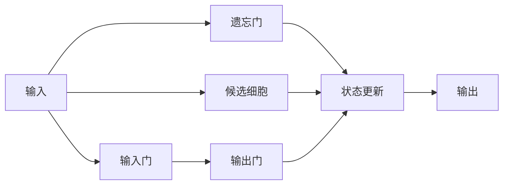
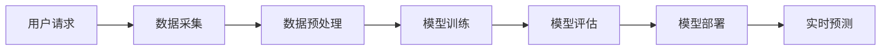
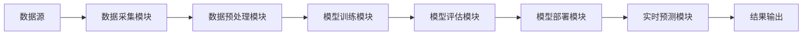

                 


# 企业AI Agent的时序数据预测平台设计

> 关键词：企业AI Agent，时序数据预测，平台设计，算法实现，系统架构

> 摘要：本文深入探讨了企业AI Agent在时序数据预测中的应用，分析了其设计的核心概念、算法原理、系统架构，并通过实际案例展示了如何构建一个高效可靠的时序数据预测平台。文章从问题背景出发，逐步解析了AI Agent与时序数据预测的结合，详细阐述了LSTM和Transformer算法的应用，并通过系统架构设计和项目实战，提供了完整的实现方案。

---

## 第1章: 企业AI Agent与时序数据预测平台的背景介绍

### 1.1 问题背景与定义

#### 1.1.1 企业AI Agent的概念与特点
企业AI Agent是一种智能代理系统，能够感知环境、执行任务并做出决策。其核心特征包括：
- **自主性**：无需人工干预，自动执行任务。
- **反应性**：实时感知环境变化并做出响应。
- **目标导向**：以特定目标为导向，优化决策过程。
- **可扩展性**：能够处理复杂且多样化的企业级任务。

#### 1.1.2 时序数据预测的定义与应用场景
时序数据预测是指基于时间序列数据，利用数学模型和算法预测未来趋势。应用场景包括：
- **销售预测**：预测未来销售额，优化库存管理。
- **设备故障预测**：通过传感器数据预测设备维护时间。
- **金融预测**：预测股票价格波动，辅助投资决策。
- **能源消耗预测**：优化能源使用，降低运营成本。

#### 1.1.3 企业AI Agent与时序数据预测的结合
AI Agent能够实时处理时序数据，利用预测模型做出决策，从而提升企业的运营效率。例如，AI Agent可以实时监控生产线数据，预测设备故障风险，并提前安排维护。

### 1.2 问题描述与解决思路

#### 1.2.1 企业AI Agent的核心任务
- 数据采集与处理：实时采集多源异构数据，并进行清洗和预处理。
- 模型训练与部署：训练时序预测模型，并将其部署到生产环境。
- 决策与执行：基于预测结果，触发相应的业务流程或决策。

#### 1.2.2 时序数据预测的核心问题
- 数据特征：时序数据具有趋势性、周期性和随机性。
- 模型选择：选择适合时序数据的模型，如LSTM和Transformer。
- 数据质量：处理缺失值和异常值，确保模型训练数据的准确性。

#### 1.2.3 企业AI Agent在时序数据预测中的作用
AI Agent通过整合数据、训练模型和执行决策，成为企业时序预测的核心驱动力。它能够实时处理数据，快速做出预测，并根据结果优化企业运营。

### 1.3 问题解决与边界

#### 1.3.1 企业AI Agent解决时序数据预测的思路
1. 数据采集：通过传感器、数据库等多源采集时序数据。
2. 数据预处理：清洗、转换和标准化数据，消除噪声。
3. 模型训练：选择适合的算法，训练预测模型。
4. 模型部署：将模型部署到生产环境，实时预测。

#### 1.3.2 问题的边界与外延
- 数据范围：仅处理企业内部数据，不涉及外部数据。
- 任务范围：仅限于时序预测，不涉及其他类型的数据分析任务。
- 模型范围：仅使用LSTM和Transformer模型，不涉及其他复杂模型。

#### 1.3.3 核心要素与概念结构
核心要素包括：
- 数据源：传感器、数据库等。
- 数据预处理：清洗、转换、标准化。
- 模型训练：LSTM、Transformer等。
- 模型部署：实时预测、结果输出。

---

## 第2章: 企业AI Agent的核心概念与原理

### 2.1 AI Agent的基本原理

#### 2.1.1 AI Agent的定义与分类
AI Agent可以分为简单反射Agent和基于模型的反射Agent。简单反射Agent基于当前感知做出反应，而基于模型的反射Agent则利用内部模型进行推理和规划。

#### 2.1.2 AI Agent的核心特征
- **自主性**：无需外部干预。
- **反应性**：实时感知环境。
- **目标导向**：以目标为导向进行决策。
- **学习能力**：通过经验优化决策。

#### 2.1.3 AI Agent的决策机制
基于模型的决策机制：AI Agent利用内部模型分析环境状态，预测可能的结果，选择最优行动方案。

### 2.2 时序数据预测的核心原理

#### 2.2.1 时序数据的特征与挑战
- **趋势性**：数据呈现上升或下降趋势。
- **周期性**：数据呈现周期性波动。
- **随机性**：数据呈现随机波动。

#### 2.2.2 时序预测的数学模型
- **ARIMA模型**：基于自回归和移动平均的模型。
- **LSTM网络**：适合处理长序列依赖的模型。
- **Transformer模型**：基于注意力机制的模型。

#### 2.2.3 时序预测的主要方法
1. **经典统计方法**：ARIMA、GARCH。
2. **机器学习方法**：随机森林、XGBoost。
3. **深度学习方法**：LSTM、Transformer。

### 2.3 企业AI Agent与时序数据预测的结合

#### 2.3.1 两者的概念对比
| 特性         | AI Agent                     | 时序数据预测               |
|--------------|-----------------------------|---------------------------|
| 核心目标     | 执行任务，优化决策           | 预测未来趋势               |
| 输入数据     | 多源异构数据                 | 时间序列数据               |
| 输出结果     | 行动决策                     | 预测值或概率               |

#### 2.3.2 两者的联系与区别
- **联系**：AI Agent提供决策支持，时序数据预测提供数据支持。
- **区别**：AI Agent是决策者，时序数据预测是数据提供者。

#### 2.3.3 两者的协同工作流程
1. 数据采集：AI Agent采集时序数据。
2. 数据预处理：清洗和标准化数据。
3. 模型训练：训练预测模型。
4. 模型部署：实时预测并触发决策。

### 2.4 本章小结
本章介绍了AI Agent和时序数据预测的核心概念，并分析了两者的结合方式和协同工作流程。

---

## 第3章: 企业AI Agent时序数据预测的算法原理

### 3.1 LSTM算法的原理

#### 3.1.1 LSTM的结构与工作原理
LSTM通过三个门控机制（输入门、遗忘门、输出门）来处理长序列数据。其结构包括：
- **输入门**：控制当前输入的信息。
- **遗忘门**：决定遗忘哪些旧信息。
- **输出门**：生成最终的输出。

#### 3.1.2 LSTM的数学模型
$$ \text{遗忘门} = \sigma(W_f \cdot [h_{t-1}, x_t] + b_f) $$
$$ \text{输入门} = \sigma(W_i \cdot [h_{t-1}, x_t] + b_i) $$
$$ \text{候选细胞} = \tanh(W_c \cdot [h_{t-1}, x_t] + b_c) $$
$$ h_t = \text{遗忘门} \cdot h_{t-1} + \text{输入门} \cdot \text{候选细胞} $$

#### 3.1.3 LSTM的流程图


### 3.2 Transformer算法的原理

#### 3.2.1 Transformer的结构与工作原理
Transformer基于注意力机制，通过自注意力和前馈网络进行处理。其结构包括：
- **自注意力机制**：计算序列中每个位置的权重。
- **前馈网络**：对序列进行变换。

#### 3.2.2 Transformer的数学模型
$$ \text{自注意力} = \text{softmax}(\frac{QK^T}{\sqrt{d_k}}) $$
$$ \text{输出} = \text{前馈网络}(Q, K, V) $$

#### 3.2.3 Transformer的流程图
```mermaid
graph LR
    A[输入] --> B[查询Q]
    A --> C[键K]
    A --> D[值V]
    B, C, D --> E[自注意力机制]
    E --> F[前馈网络]
    F --> G[输出]
```

### 3.3 算法对比与选择

#### 3.3.1 LSTM与Transformer的对比
| 特性       | LSTM               | Transformer          |
|------------|--------------------|---------------------|
| 结构复杂度   | 较低                | 较高                |
| 并行性       | 低                 | 高                 |
| 适用场景     | 长序列依赖         | 多任务处理          |

#### 3.3.2 算法选择的依据
- **数据量**：数据量大时选择Transformer。
- **实时性**：需要实时预测时选择LSTM。
- **任务复杂度**：任务复杂时选择Transformer。

### 3.4 本章小结
本章详细介绍了LSTM和Transformer算法的原理，并分析了它们在企业AI Agent中的适用场景。

---

## 第4章: 企业AI Agent时序数据预测的系统架构设计

### 4.1 系统分析与设计

#### 4.1.1 系统功能需求
- 数据采集：实时采集多源异构数据。
- 数据处理：清洗、转换和标准化数据。
- 模型训练：训练预测模型。
- 模型部署：实时预测并触发决策。

#### 4.1.2 系统功能模块
- 数据采集模块：负责数据的采集和预处理。
- 模型训练模块：负责模型的训练和评估。
- 模型部署模块：负责模型的实时预测和结果输出。

#### 4.1.3 系统功能流程图


### 4.2 系统架构设计

#### 4.2.1 系统架构图


#### 4.2.2 接口设计
- 数据采集接口：接收外部数据源的输入。
- 模型训练接口：接收训练数据和超参数。
- 模型预测接口：接收实时数据并返回预测结果。

#### 4.2.3 系统交互序列图
```mermaid
graph TD
    User -> API: 发起预测请求
    API -> 数据采集模块: 获取实时数据
    数据采集模块 -> 数据预处理模块: 数据预处理
    数据预处理模块 -> 模型训练模块: 训练模型
    模型训练模块 -> 模型部署模块: 部署模型
    模型部署模块 -> 实时预测模块: 预测结果
    实时预测模块 -> API: 返回预测结果
    API -> User: 返回预测结果
```

### 4.3 本章小结
本章详细设计了企业AI Agent时序数据预测平台的系统架构，并通过mermaid图展示了系统的模块划分和交互流程。

---

## 第5章: 企业AI Agent时序数据预测的项目实战

### 5.1 项目环境安装

#### 5.1.1 环境需求
- Python 3.8及以上版本
- PyTorch 1.9及以上版本
- numpy 1.21及以上版本
- pandas 1.3及以上版本
- scikit-learn 0.24及以上版本

#### 5.1.2 安装依赖
```bash
pip install torch numpy pandas scikit-learn
```

### 5.2 核心代码实现

#### 5.2.1 数据预处理代码
```python
import pandas as pd
import numpy as np

def data_preprocessing(data):
    # 去除缺失值
    data.dropna(inplace=True)
    # 标准化数据
    from sklearn.preprocessing import StandardScaler
    scaler = StandardScaler()
    data_scaled = scaler.fit_transform(data)
    return data_scaled
```

#### 5.2.2 LSTM模型实现
```python
import torch
import torch.nn as nn

class LSTMModel(nn.Module):
    def __init__(self, input_size, hidden_size, output_size):
        super(LSTMModel, self).__init__()
        self.lstm = nn.LSTM(input_size, hidden_size, batch_first=True)
        self.fc = nn.Linear(hidden_size, output_size)
    
    def forward(self, x):
        out, _ = self.lstm(x)
        out = self.fc(out[:, -1, :])
        return out
```

#### 5.2.3 Transformer模型实现
```python
class TransformerModel(nn.Module):
    def __init__(self, input_size, d_model, nhead, output_size):
        super(TransformerModel, self).__init__()
        self.transformer = nn.Transformer(d_model=d_model, nhead=nhead)
        self.fc = nn.Linear(d_model, output_size)
    
    def forward(self, x):
        out = self.transformer(x)
        out = self.fc(out[:, -1, :])
        return out
```

### 5.3 代码应用解读与分析

#### 5.3.1 数据预处理解读
数据预处理是模型训练的前提，包括去除缺失值和标准化处理。标准化可以提高模型的训练效率和准确性。

#### 5.3.2 模型训练与评估
```python
# 训练LSTM模型
model = LSTMModel(input_size, hidden_size, output_size)
criterion = nn.MSELoss()
optimizer = torch.optim.Adam(model.parameters(), lr=0.001)

for epoch in range(num_epochs):
    outputs = model(data)
    loss = criterion(outputs, labels)
    optimizer.zero_grad()
    loss.backward()
    optimizer.step()
```

### 5.4 实际案例分析与详细讲解

#### 5.4.1 案例背景
某制造企业需要预测设备的故障时间，以减少停机时间。我们使用LSTM模型进行预测。

#### 5.4.2 数据采集与处理
采集设备的传感器数据，清洗数据并标准化处理。

#### 5.4.3 模型训练与部署
训练LSTM模型，评估模型性能，部署到生产环境，实时监控设备状态。

### 5.5 本章小结
本章通过实际案例展示了如何构建企业AI Agent时序数据预测平台，并提供了完整的代码实现。

---

## 第6章: 企业AI Agent时序数据预测平台的扩展与最佳实践

### 6.1 平台的扩展性设计

#### 6.1.1 模型扩展
支持多种预测模型，如集成学习模型和深度学习模型。

#### 6.1.2 数据源扩展
支持多种数据源，如数据库、文件和API接口。

### 6.2 平台的优化方法

#### 6.2.1 模型优化
使用超参数调优和模型剪枝技术优化模型性能。

#### 6.2.2 系统优化
优化系统架构，提高系统的响应速度和吞吐量。

### 6.3 平台的安全性与可维护性

#### 6.3.1 数据安全
确保数据的安全存储和传输，防止数据泄露。

#### 6.3.2 系统维护
定期更新系统和模型，修复潜在的安全漏洞。

### 6.4 未来的扩展方向

#### 6.4.1 新算法研究
研究新的时序预测算法，如图神经网络和增强学习。

#### 6.4.2 新应用场景
探索新的应用场景，如智能交通和智慧城市。

### 6.5 本章小结
本章讨论了平台的扩展性、优化方法和未来的扩展方向，为读者提供了宝贵的实践经验。

---

## 作者：AI天才研究院/AI Genius Institute & 禅与计算机程序设计艺术 /Zen And The Art of Computer Programming

---

以上就是《企业AI Agent的时序数据预测平台设计》的完整目录大纲和文章内容。

