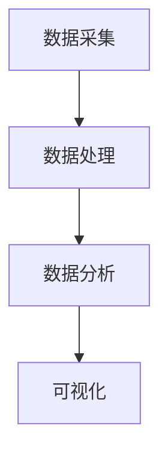
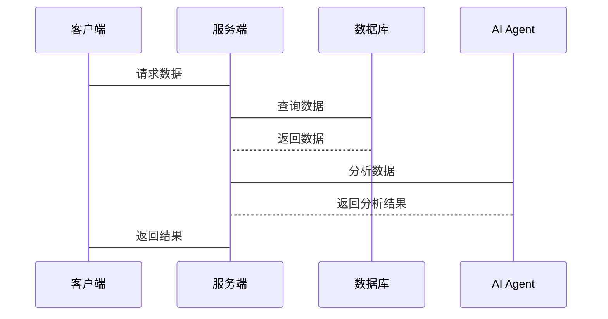

                 


# 企业AI Agent的时空大数据分析平台

## 关键词：企业AI Agent、时空大数据、数据分析平台、算法原理、系统架构

## 摘要：本文系统介绍企业AI Agent在时空大数据分析平台中的应用，涵盖背景、核心概念、算法原理、系统架构设计、项目实战及最佳实践。通过详细分析，帮助读者掌握时空大数据分析的关键技术，及其在企业中的实际应用。

---

# 第1章 企业AI Agent与时空大数据分析平台概述

## 1.1 企业AI Agent的背景与概念

### 1.1.1 问题背景与问题描述

在现代企业环境中，数据的时空维度分析变得日益重要。企业需要处理大量动态变化的空间和时间数据，以支持决策和优化业务流程。然而，传统数据分析方法难以有效处理这些复杂数据，因此引入AI Agent成为必然趋势。

### 1.1.2 企业AI Agent的核心概念与问题解决

AI Agent是一种智能体，能够在复杂环境中自主感知、推理和决策。在企业应用中，AI Agent通过分析时空数据，提供实时反馈和优化建议，解决传统数据分析的滞后性和低效性问题。

### 1.1.3 时空大数据分析平台的边界与外延

时空大数据分析平台整合了空间数据（如地理位置）和时间数据（如时间序列），通过AI技术进行深度分析，为企业提供实时洞察。其边界包括数据采集、处理、分析和可视化，外延则涉及多领域应用。

### 1.1.4 核心概念结构与核心要素组成

核心要素包括：空间数据、时间数据、AI算法、数据分析工具和可视化界面。这些要素协同工作，构成完整的时空大数据分析平台。

## 1.2 时空大数据分析平台的背景与概念

### 1.2.1 时空大数据的定义与特点

时空数据结合了地理位置和时间信息，具有多维性和动态性特点，能够捕捉数据在时间和空间上的变化趋势。

### 1.2.2 时空大数据分析平台的核心概念与问题解决

通过整合AI技术，时空大数据分析平台能够实时处理和分析数据，为企业提供动态决策支持。

### 1.2.3 企业AI Agent与时空大数据分析平台的结合

AI Agent作为平台的核心，负责数据处理、分析和决策，实现智能化的数据管理。

## 1.3 本章小结

本章介绍了企业AI Agent和时空大数据分析平台的基本概念和背景，为后续章节奠定了基础。

---

# 第2章 核心概念与联系

## 2.1 AI Agent的核心概念与原理

### 2.1.1 AI Agent的定义与核心原理

AI Agent是具备感知、推理和行动能力的智能体，通过与环境交互完成任务。

### 2.1.2 AI Agent的核心属性与特征对比

| 属性 | 描述 |
|------|------|
| 感知能力 | 数据采集和处理 |
| 推理能力 | 数据分析和逻辑推理 |
| 决策能力 | 基于分析结果做出决策 |
| 学习能力 | 通过经验优化性能 |

### 2.1.3 AI Agent的ER实体关系图架构

```mermaid
er
actor(AI Agent)
    has role: 负责数据处理和决策
    related to: 数据源、用户、环境
```

## 2.2 时空大数据分析的核心概念与原理

### 2.2.1 时空大数据的定义与特点

时空数据整合了地理位置和时间信息，具有多维性和动态性。

### 2.2.2 时空大数据分析的核心属性与特征对比

| 属性 | 描述 |
|------|------|
| 多维性 | 空间和时间维度 |
| 动态性 | 数据随时间变化 |
| 高量性 | 数据量大，处理复杂 |

### 2.2.3 时空大数据分析的ER实体关系图架构

```mermaid
er
actor(时空大数据分析)
    has role: 数据处理和分析
    related to: 数据源、用户、环境
```

## 2.3 AI Agent与时空大数据分析的联系与协同

### 2.3.1 AI Agent与时空大数据分析的协同关系

AI Agent通过分析时空数据，提供实时反馈和优化建议。

### 2.3.2 AI Agent在时空大数据分析中的作用

AI Agent负责数据处理、分析和决策，提升分析效率和准确性。

### 2.3.3 时空大数据分析对AI Agent的支撑作用

时空数据为AI Agent提供丰富的数据源，支持其智能决策。

## 2.4 本章小结

本章分析了AI Agent和时空大数据分析的核心概念及其相互关系，为后续章节奠定了理论基础。

---

# 第3章 时空大数据分析算法原理

## 3.1 时空数据处理算法

### 3.1.1 空间数据处理算法

#### 3.1.1.1 空间数据的坐标转换算法

坐标转换是将数据从一种坐标系转换到另一种坐标系的过程。常用算法包括：

- **转换公式**：
  $$x' = x \cos \theta - y \sin \theta$$
  $$y' = x \sin \theta + y \cos \theta$$

#### 3.1.1.2 空间数据的距离计算算法

计算两点之间的欧几里得距离：
$$distance = \sqrt{(x2 - x1)^2 + (y2 - y1)^2}$$

### 3.1.2 时间数据处理算法

#### 3.1.2.1 时间序列数据的平滑处理算法

移动平均法用于平滑数据：
$$S_t = \frac{1}{n}\sum_{i=1}^{n} a_{t-i}$$

#### 3.1.2.2 时间序列数据的预测算法

使用ARIMA模型进行预测：
$$ARIMA(p, d, q)$$

## 3.2 AI Agent算法原理

### 3.2.1 基于强化学习的AI Agent算法

#### 3.2.1.1 强化学习的基本原理

通过奖励机制优化决策策略：
$$Q(s, a) = Q(s, a) + \alpha (r + \gamma \max Q(s', a') - Q(s, a))$$

#### 3.2.1.2 基于Q-learning的AI Agent算法实现

```python
import numpy as np

class AI-Agent:
    def __init__(self, state_space, action_space):
        self.q_table = np.zeros((state_space, action_space))
```

### 3.2.2 基于监督学习的AI Agent算法

使用回归算法进行预测：
$$y = \theta X + \beta$$

## 3.3 本章小结

本章详细讲解了时空数据处理和AI Agent算法的原理，为后续系统设计奠定了基础。

---

# 第4章 系统分析与架构设计

## 4.1 问题场景介绍

企业需要实时分析时空数据，优化业务流程。

## 4.2 项目介绍

时空大数据分析平台用于实时处理和分析企业数据。

## 4.3 系统功能设计

### 4.3.1 系统功能模块

- 数据采集模块
- 数据处理模块
- 数据分析模块
- 可视化模块

### 4.3.2 功能模块之间的交互



## 4.4 系统架构设计

### 4.4.1 系统架构图


### 4.4.2 系统接口设计

- API接口定义：
  ```json
  {
    "接口名称": "获取实时数据",
    "接口地址": "/api/data",
    "请求方式": "GET"
  }
  ```

## 4.5 系统交互序列图



## 4.6 本章小结

本章详细设计了系统的架构和交互流程，为实现奠定了基础。

---

# 第5章 项目实战

## 5.1 环境安装与配置

### 5.1.1 安装Python环境

使用Anaconda安装Python 3.8及以上版本。

### 5.1.2 安装依赖库

安装Pandas、NumPy、Matplotlib、Scikit-learn。

## 5.2 系统核心实现源代码

### 5.2.1 数据采集模块

```python
import pandas as pd

def collect_data():
    # 示例代码，从数据库采集数据
    data = pd.read_sql("SELECT * FROM spatial_data", conn)
    return data
```

### 5.2.2 数据分析模块

```python
from sklearn.linear_model import LinearRegression

def analyze_data(data):
    model = LinearRegression()
    model.fit(data[['x', 'y']], data['time'])
    return model.predict(data[['x', 'y']])
```

### 5.2.3 AI Agent实现

```python
class AI-Agent:
    def __init__(self):
        self.model = LinearRegression()
    
    def train(self, data):
        self.model.fit(data[['x', 'y']], data['target'])
    
    def predict(self, data):
        return self.model.predict(data[['x', 'y']])
```

## 5.3 代码应用解读与分析

详细解读代码功能，说明每个模块的作用和交互过程。

## 5.4 实际案例分析与详细讲解

通过具体案例展示平台的应用，分析其对企业决策的支持作用。

## 5.5 项目小结

总结项目实现的关键点和成功经验。

---

# 第6章 最佳实践与注意事项

## 6.1 小结

总结全文内容，强调关键知识点。

## 6.2 注意事项

提醒读者注意数据安全、算法选择和系统优化。

## 6.3 拓展阅读

推荐相关书籍和资源，供进一步学习。

---

# 第7章 总结

## 7.1 本文总结

回顾全文，总结企业AI Agent在时空大数据分析中的应用价值。

## 7.2 展望未来

展望未来发展方向和技术趋势。

---

# 作者：AI天才研究院 & 禅与计算机程序设计艺术

---

本文系统阐述了企业AI Agent在时空大数据分析平台中的应用，从理论到实践，为读者提供了全面的指导。

