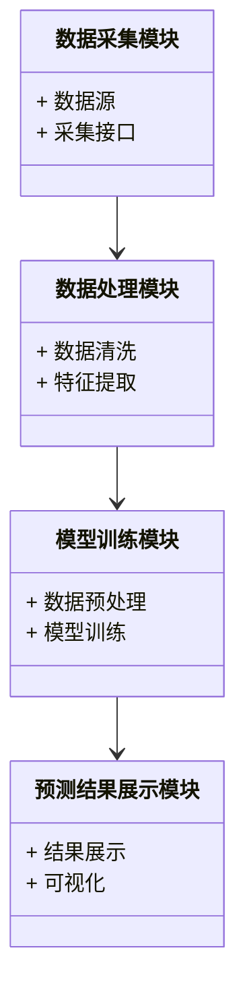
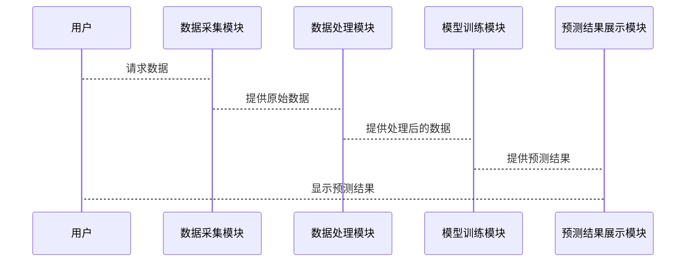

                 


```markdown
# 企业AI Agent的时间序列预测在需求规划中的应用

> 关键词：时间序列预测，AI Agent，需求规划，企业应用，机器学习

> 摘要：本文深入探讨了企业AI Agent如何利用时间序列预测技术优化需求规划。通过分析时间序列预测的核心算法、AI Agent的智能特性以及它们在企业需求规划中的结合，本文为企业提供了从理论到实践的全面指导。文章内容涵盖时间序列预测的数学模型、AI Agent的核心功能、常见算法的选择与优化、系统架构设计、项目实战案例以及最佳实践建议。

---

## 第1章：时间序列预测的背景与应用

### 1.1 时间序列预测的定义与特点

时间序列预测是一种基于历史数据预测未来趋势的统计方法。其核心在于通过分析数据的时序特性，挖掘数据中的模式和规律，从而对未来进行预测。

#### 1.1.1 时间序列预测的定义

时间序列预测是指通过对历史数据的分析，建立数学模型，预测未来某一时间点或时间段的数值。例如，企业可以通过分析过去几年的销售数据，预测未来的销售趋势。

#### 1.1.2 时间序列预测的核心特点

时间序列预测具有以下特点：
- **时序性**：数据是按时间顺序排列的。
- **趋势性**：数据可能呈现上升或下降的趋势。
- **周期性**：数据可能具有一定的周期性，如月度或季度周期。
- **随机性**：数据中可能存在不可预测的随机波动。

#### 1.1.3 时间序列预测的应用领域

时间序列预测广泛应用于多个领域：
- **金融**：股票价格预测、汇率预测。
- **零售**：销售预测、库存管理。
- **能源**：电力需求预测、负荷预测。
- **交通**：客流量预测、交通流量管理。

### 1.2 AI Agent的基本概念

AI Agent（智能体）是指能够感知环境并采取行动以实现目标的实体。在企业需求规划中，AI Agent可以通过时间序列预测提供智能化的支持。

#### 1.2.1 AI Agent的定义

AI Agent是一种能够自主感知环境、做出决策并执行行动的智能实体。它可以是一个软件程序，也可以是一个物理设备。

#### 1.2.2 AI Agent的核心功能

AI Agent的核心功能包括：
- **感知**：通过传感器或数据源获取环境信息。
- **推理**：利用知识库和推理引擎分析信息，做出决策。
- **行动**：根据决策结果执行相应的操作。

#### 1.2.3 AI Agent与传统算法的区别

AI Agent与传统算法的区别在于：
- AI Agent具有自主性和智能性，能够适应环境的变化。
- AI Agent能够通过与环境的交互，不断优化自身的预测能力。
- AI Agent不仅可以进行预测，还可以根据预测结果采取行动。

### 1.3 时间序列预测在企业需求规划中的应用

需求规划是企业运营管理中的重要环节，时间序列预测在其中发挥着关键作用。

#### 1.3.1 需求规划的核心问题

需求规划的核心问题是如何准确预测未来的需求量，以便合理安排生产和采购。预测的准确性直接影响企业的成本和利润。

#### 1.3.2 时间序列预测在需求规划中的作用

时间序列预测可以帮助企业：
- 准确预测未来的需求量。
- 优化库存管理，减少过剩或短缺。
- 支持供应链的高效运作。

#### 1.3.3 企业AI Agent的优势

企业AI Agent的优势在于：
- 具备自主学习和优化能力，能够不断提高预测的准确性。
- 能够实时感知环境变化，快速调整预测模型。
- 可以与其他系统集成，实现预测结果的自动化应用。

---

## 第2章：时间序列预测与AI Agent的核心概念

### 2.1 时间序列预测的数学模型

时间序列预测的数学模型是预测算法的基础。

#### 2.1.1 时间序列的组成要素

时间序列通常由以下几个要素组成：
- **趋势（Trend）**：数据的长期走势。
- **周期性（Seasonality）**：数据在固定周期内的波动。
- **季节性（Cyclic）**：数据在长周期内的波动。
- **随机性（Randomness）**：数据中的不可预测部分。

#### 2.1.2 时间序列预测的数学表达式

时间序列预测的数学表达式可以表示为：
$$
y_t = \alpha y_{t-1} + \beta \epsilon_t
$$
其中，$y_t$ 是预测值，$\alpha$ 是平滑系数，$\epsilon_t$ 是随机误差。

#### 2.1.3 时间序列预测的假设条件

时间序列预测通常假设：
- 数据是平稳的，即均值和方差保持不变。
- 数据的分布服从某种概率分布，如正态分布。

### 2.2 AI Agent的时间序列预测能力

AI Agent的时间序列预测能力是其核心竞争力之一。

#### 2.2.1 AI Agent的感知能力

AI Agent的感知能力包括：
- **数据采集**：通过传感器或API获取实时数据。
- **数据处理**：对数据进行清洗、转换和特征提取。

#### 2.2.2 AI Agent的预测能力

AI Agent的预测能力体现在：
- **模型选择**：根据数据特性选择合适的预测模型。
- **模型训练**：利用历史数据训练模型，优化预测准确性。

#### 2.2.3 AI Agent的自适应能力

AI Agent的自适应能力包括：
- **在线学习**：实时更新模型，适应数据的变化。
- **反馈机制**：根据预测结果和实际值的差异，调整预测模型。

### 2.3 时间序列预测与AI Agent的关系

时间序列预测与AI Agent的关系密不可分。

#### 2.3.1 时间序列预测作为AI Agent的核心能力

时间序列预测是AI Agent的核心能力之一，AI Agent通过预测能力为企业的决策提供支持。

#### 2.3.2 AI Agent如何优化时间序列预测

AI Agent通过以下方式优化时间序列预测：
- **自动化特征工程**：自动提取有用的特征，提高预测精度。
- **自适应模型选择**：根据数据特性动态选择预测模型。
- **在线更新**：实时更新模型参数，适应数据的变化。

#### 2.3.3 时间序列预测在AI Agent中的应用场景

时间序列预测在AI Agent中的应用场景包括：
- **销售预测**：预测未来销售量，优化库存管理。
- **负荷预测**：预测电力需求，优化能源分配。
- **行为预测**：预测用户行为，优化服务策略。

---

## 第3章：时间序列预测的算法原理

### 3.1 常见的时间序列预测算法

时间序列预测算法多种多样，每种算法都有其优缺点。

#### 3.1.1 ARIMA模型

ARIMA模型是一种广泛应用于时间序列预测的统计模型。

##### 3.1.1.1 ARIMA模型的原理

ARIMA模型的全称是自回归积分滑动平均模型，其数学表达式为：
$$
y_t = \phi_1 y_{t-1} + \theta_1 \epsilon_{t-1} + \epsilon_t
$$

##### 3.1.1.2 ARIMA模型的优点

ARIMA模型的优点包括：
- 模型简单，易于实现。
- 能够捕捉数据的趋势和周期性。

##### 3.1.1.3 ARIMA模型的缺点

ARIMA模型的缺点包括：
- 对异常值敏感，需要进行数据清洗。
- 无法处理非线性数据。

#### 3.1.2 LSTM网络

LSTM（长短期记忆网络）是一种基于循环神经网络的时间序列预测模型。

##### 3.1.2.1 LSTM网络的原理

LSTM网络通过引入记忆单元和遗忘门，能够有效捕捉时间序列中的长程依赖关系。

##### 3.1.2.2 LSTM网络的优点

LSTM网络的优点包括：
- 能够处理非线性数据。
- 能够捕捉长程依赖关系。

##### 3.1.2.3 LSTM网络的缺点

LSTM网络的缺点包括：
- 模型复杂，训练时间较长。
- 对超参数敏感，需要进行调参。

#### 3.1.3 Prophet模型

Prophet模型是由Facebook开源的时间序列预测模型。

##### 3.1.3.1 Prophet模型的原理

Prophet模型通过将时间序列分解为趋势、周期性和余项三部分，进行预测。

##### 3.1.3.2 Prophet模型的优点

Prophet模型的优点包括：
- 模型简单，易于实现。
- 对异常值具有一定的鲁棒性。

##### 3.1.3.3 Prophet模型的缺点

Prophet模型的缺点包括：
- 对数据的周期性假设较为严格。
- 预测结果可能不够精确。

### 3.2 AI Agent中的时间序列预测算法选择

在AI Agent中选择合适的时间序列预测算法至关重要。

#### 3.2.1 算法选择的依据

算法选择的依据包括：
- 数据特性：数据是否具有周期性、趋势性等。
- 预测精度要求：对预测精度的要求。
- 计算资源：可用的计算资源情况。

#### 3.2.2 不同算法的优缺点对比

以下是几种常见算法的优缺点对比：

| 算法   | 优点                          | 缺点                          |
|--------|-------------------------------|-------------------------------|
| ARIMA  | 模型简单，易于实现            | 无法处理非线性数据，对异常值敏感 |
| LSTM   | 能够处理非线性数据，捕捉长程依赖 | 模型复杂，训练时间较长          |
| Prophet | 模型简单，对异常值鲁棒        | 对周期性假设严格，预测精度可能不足 |

#### 3.2.3 算法选择的实践建议

根据具体场景选择算法：
- 对于具有明确周期性的数据，建议选择Prophet模型。
- 对于非线性数据，建议选择LSTM网络。
- 对于简单的时间序列数据，可以选择ARIMA模型。

### 3.3 时间序列预测算法的实现

以下是几种常见时间序列预测算法的实现示例。

#### 3.3.1 ARIMA模型的实现

```python
from statsmodels.tsa.arima.model import ARIMA

# 创建数据集
data = [1, 2, 3, 4, 5, 6, 7, 8, 9, 10]

# 训练模型
model = ARIMA(data, order=(1, 1, 1))
model_fit = model.fit()

# 预测下一个值
next_value = model_fit.forecast()[0]
print(next_value)
```

#### 3.3.2 LSTM网络的实现

```python
import numpy as np
from keras.models import Sequential
from keras.layers import LSTM, Dense

# 创建数据集
data = np.random.random((10, 1))

# 构建模型
model = Sequential()
model.add(LSTM(5, input_shape=(1, 1)))
model.add(Dense(1))
model.compile(loss='mean_squared_error', optimizer='adam')

# 训练模型
model.fit(data, data, epochs=100, batch_size=1)

# 预测下一个值
next_value = model.predict(np.array([data[-1]]).reshape(1, 1, 1))
print(next_value)
```

#### 3.3.3 Prophet模型的实现

```python
import prophet

# 创建数据集
data = prophet.load_data('2023-01-01,2023-02-01,2023-03-01,2023-04-01,2023-05-01')
data.columns = ['ds', 'y']

# 初始化模型
model = prophet.Prophet()
model.fit(data)

# 预测未来值
future = model.make_future_dataframe(periods=5)
 forecast = model.predict(future)
print(forecast[['ds', 'yhat']])
```

### 3.4 时间序列预测的优化

为了提高时间序列预测的准确性，可以采取以下优化措施：

#### 3.4.1 数据预处理

数据预处理包括：
- 数据清洗：去除异常值。
- 数据变换：对数据进行标准化或对数变换。
- 特征工程：提取有用的特征。

#### 3.4.2 模型调参

模型调参包括：
- 调整ARIMA模型的参数。
- 调整LSTM网络的超参数，如学习率、批量大小。
- 调整Prophet模型的参数。

#### 3.4.3 模型融合

模型融合包括：
- 将多个模型的预测结果进行加权平均。
- 使用集成学习方法提高预测精度。

---

## 第4章：时间序列预测在企业需求规划中的应用

### 4.1 问题场景介绍

企业需求规划的核心问题是如何准确预测未来的需求量。

#### 4.1.1 需求预测的核心问题

需求预测的核心问题是如何准确预测未来的需求量，以便合理安排生产和采购。

#### 4.1.2 需求预测的挑战

需求预测的挑战包括：
- 数据的不确定性。
- 市场环境的复杂性。
- 数据的稀疏性。

### 4.2 系统功能设计

为了实现时间序列预测在需求规划中的应用，需要设计一个完整的系统。

#### 4.2.1 领域模型设计

领域模型设计包括：
- 数据采集模块：负责采集需求数据。
- 数据处理模块：负责数据清洗和特征提取。
- 模型训练模块：负责训练时间序列预测模型。
- 预测结果展示模块：负责展示预测结果。

##### 4.2.1.1 领域模型的Mermaid类图



#### 4.2.2 系统架构设计

系统架构设计包括：
- 前端界面：用于用户交互。
- 后端服务：负责数据处理和模型训练。
- 数据存储：负责存储数据和模型。

##### 4.2.2.1 系统架构的Mermaid架构图


#### 4.2.3 系统接口设计

系统接口设计包括：
- 数据接口：负责数据的输入和输出。
- 模型接口：负责模型的训练和预测。
- 展示接口：负责结果的展示。

##### 4.2.3.1 系统接口的Mermaid序列图



### 4.3 项目实战

以下是一个具体的项目实战案例。

#### 4.3.1 项目介绍

项目介绍包括：
- 项目目标：实现基于时间序列预测的需求规划系统。
- 项目需求：准确预测未来的需求量，优化库存管理。

#### 4.3.2 项目核心实现

项目核心实现包括：
- 数据采集：通过API接口获取销售数据。
- 数据处理：对数据进行清洗和特征提取。
- 模型训练：选择合适的预测模型进行训练。
- 预测结果展示：将预测结果展示给用户。

##### 4.3.2.1 项目核心实现的代码示例

```python
# 数据采集
import requests

url = 'https://example.com/api/sales'
response = requests.get(url)
data = response.json()

# 数据处理
import pandas as pd

df = pd.DataFrame(data)
df['date'] = pd.to_datetime(df['date'])
df.set_index('date', inplace=True)

# 模型训练
from statsmodels.tsa.arima.model import ARIMA

model = ARIMA(df['sales'], order=(1, 1, 1))
model_fit = model.fit()

# 预测结果展示
import matplotlib.pyplot as plt

df_forecast = model_fit.forecast(steps=5)
df['forecast'].plot(legend=True)
plt.show()
```

#### 4.3.3 项目小结

项目小结包括：
- 项目实现的关键点：数据处理、模型选择、结果展示。
- 项目的价值：提高需求预测的准确性，优化库存管理。

---

## 第5章：时间序列预测的系统实现与优化

### 5.1 系统实现细节

系统实现细节包括：
- 数据预处理：清洗、变换、特征提取。
- 模型选择：根据数据特性选择合适的预测模型。
- 模型优化：调整模型参数，提高预测精度。

#### 5.1.1 数据预处理

数据预处理是提高预测精度的关键步骤。

##### 5.1.1.1 数据清洗

数据清洗包括：
- 去除异常值。
- 填充缺失值。
- 标准化数据。

##### 5.1.1.2 数据变换

数据变换包括：
- 对数变换。
- 标准化变换。
- 差分变换。

##### 5.1.1.3 特征提取

特征提取包括：
- 提取时间特征，如星期、月份。
- 提取趋势特征，如移动平均。
- 提取周期性特征，如傅里叶变换。

#### 5.1.2 模型选择

模型选择需要考虑数据特性、计算资源和预测精度。

##### 5.1.2.1 模型选择的依据

模型选择的依据包括：
- 数据是否具有周期性。
- 数据是否具有趋势性。
- 数据是否具有非线性。

##### 5.1.2.2 模型选择的优化

模型选择的优化包括：
- 使用交叉验证评估模型性能。
- 使用网格搜索调优模型参数。
- 使用集成学习提高预测精度。

#### 5.1.3 模型优化

模型优化是提高预测精度的重要步骤。

##### 5.1.3.1 模型调参

模型调参包括：
- 调整ARIMA模型的参数。
- 调整LSTM网络的超参数。
- 调整Prophet模型的参数。

##### 5.1.3.2 模型融合

模型融合包括：
- 将多个模型的预测结果进行加权平均。
- 使用集成学习方法提高预测精度。

### 5.2 系统优化与性能提升

系统优化与性能提升是确保系统高效运行的关键。

#### 5.2.1 系统优化

系统优化包括：
- 优化数据处理流程，减少数据冗余。
- 优化模型训练流程，提高训练效率。
- 优化结果展示界面，提高用户体验。

#### 5.2.2 性能提升

性能提升包括：
- 使用分布式计算加速模型训练。
- 使用缓存技术减少数据访问时间。
- 使用优化算法提高预测速度。

---

## 第6章：时间序列预测的未来发展趋势与最佳实践

### 6.1 未来发展趋势

时间序列预测的未来发展趋势包括：
- **深度学习的进一步应用**：随着深度学习技术的发展，LSTM和Transformer等模型将在时间序列预测中发挥更大作用。
- **在线预测的普及**：在线预测技术将更加成熟，实时预测将成为可能。
- **多模型融合**：通过融合多种模型的优势，进一步提高预测精度。

### 6.2 最佳实践

为了确保时间序列预测在企业需求规划中的成功应用，建议采取以下最佳实践：

#### 6.2.1 数据质量管理

数据质量是预测精度的基础，建议：
- 建立数据清洗标准，确保数据的准确性。
- 定期更新数据，保持数据的时效性。

#### 6.2.2 模型选择与优化

模型选择与优化是提高预测精度的关键，建议：
- 根据数据特性选择合适的预测模型。
- 定期调优模型参数，保持模型的最优性。

#### 6.2.3 结果分析与反馈

结果分析与反馈是优化预测过程的重要环节，建议：
- 定期分析预测结果与实际值的差异。
- 根据反馈结果调整预测模型。

#### 6.2.4 系统集成与部署

系统集成与部署是确保系统高效运行的基础，建议：
- 采用模块化设计，便于系统的扩展和维护。
- 采用自动化部署工具，确保系统的快速上线。

#### 6.2.5 人员培训与团队协作

人员培训与团队协作是确保系统顺利运行的重要保障，建议：
- 定期对相关人员进行培训，提高技术水平。
- 加强团队协作，确保各环节的无缝衔接。

---

## 第7章：总结与展望

### 7.1 总结

本文深入探讨了企业AI Agent如何利用时间序列预测技术优化需求规划。通过分析时间序列预测的核心算法、AI Agent的智能特性以及它们在企业需求规划中的结合，本文为企业提供了从理论到实践的全面指导。

### 7.2 展望

未来，随着人工智能技术的不断发展，时间序列预测在企业需求规划中的应用将更加广泛和深入。深度学习技术的进一步发展、在线预测技术的普及以及多模型融合的应用将推动时间序列预测技术进入新的发展阶段。

---

## 作者：AI天才研究院 & 禅与计算机程序设计艺术

```

