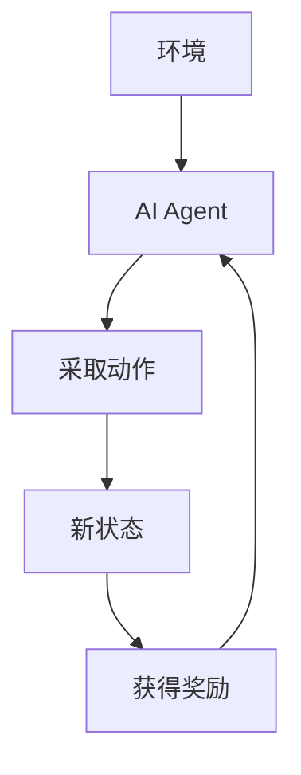
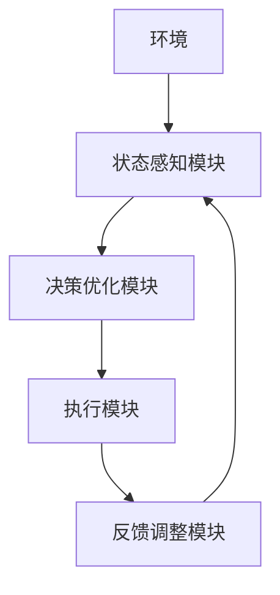
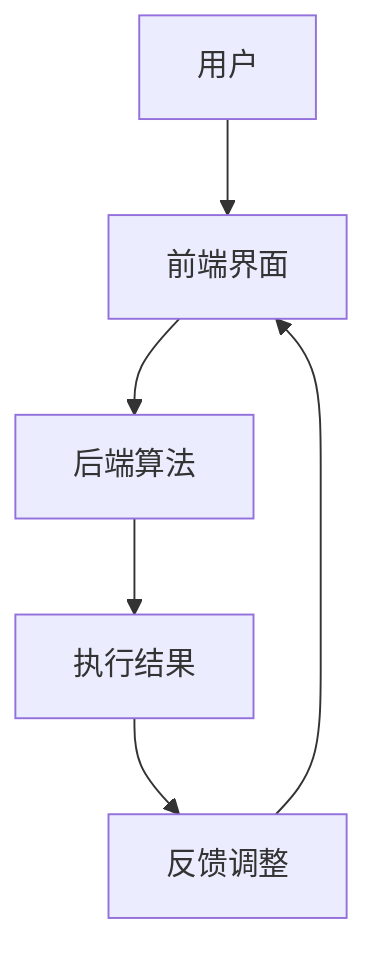

                 

# 企业AI Agent的深度强化学习应用：复杂决策优化

> 关键词：企业AI Agent，深度强化学习，复杂决策优化，DQN算法，强化学习，系统架构设计

> 摘要：本文深入探讨了企业AI Agent在复杂决策优化中的应用，结合深度强化学习的核心原理，分析了其在企业场景中的实际应用价值。通过系统化的理论阐述和案例分析，展示了如何利用深度强化学习算法解决复杂的决策问题，并提供了系统的架构设计和项目实现的详细步骤。

---

# 第一部分: 企业AI Agent与深度强化学习概述

## 第1章: 企业AI Agent与深度强化学习概述

### 1.1 企业AI Agent的背景与概念

#### 1.1.1 AI Agent的基本定义
AI Agent（人工智能代理）是指能够感知环境、自主决策并执行任务的智能体。它能够根据当前状态和历史经验，做出最优决策以实现特定目标。AI Agent的核心特征包括：
- **自主性**：能够自主决策，无需外部干预。
- **反应性**：能够实时感知环境并做出反应。
- **目标导向**：以特定目标为导向，优化决策过程。

#### 1.1.2 企业AI Agent的核心特征
企业AI Agent在传统AI Agent的基础上，结合了企业环境的复杂性和业务目标的多样性，具有以下核心特征：
- **复杂性**：企业环境通常涉及多目标、多利益相关者和复杂的业务流程。
- **动态性**：企业环境不断变化，AI Agent需要能够实时调整决策。
- **决策优化**：通过深度强化学习等技术，实现复杂决策的优化。

#### 1.1.3 企业AI Agent的应用场景
企业AI Agent的应用场景广泛，包括：
- **智能客服**：通过自然语言处理和强化学习优化客户交互流程。
- **供应链优化**：通过预测需求和优化库存管理，降低运营成本。
- **金融投资**：通过市场数据分析和强化学习制定投资策略。

### 1.2 深度强化学习的基本概念

#### 1.2.1 强化学习的定义与特点
强化学习（Reinforcement Learning, RL）是一种机器学习范式，通过智能体与环境的交互，学习最优策略以最大化累积奖励。其特点包括：
- **试错性**：智能体通过试错不断优化决策。
- **延迟反馈**：奖励通常在多个动作之后才会获得。
- **策略优化**：通过策略函数或值函数优化决策过程。

#### 1.2.2 深度强化学习的优势
深度强化学习（Deep Reinforcement Learning, DRL）将深度学习与强化学习结合，具有以下优势：
- **高维状态处理**：深度神经网络能够处理高维状态空间。
- **非线性关系建模**：深度网络能够捕捉复杂的非线性关系。
- **端到端优化**：从原始数据到最终决策的端到端优化能力。

#### 1.2.3 深度强化学习与传统强化学习的区别
以下是深度强化学习与传统强化学习的主要区别：

| 特性               | 传统强化学习            | 深度强化学习            |
|--------------------|-------------------------|-------------------------|
| 状态表示           | 低维特征               | 高维复杂特征           |
| 决策模型           | 线性模型或简单函数     | 深度神经网络           |
| 处理能力           | 有限，难以处理复杂任务 | 强大，适合复杂任务     |
| 应用场景           | 简单任务（如游戏、机器人导航） | 复杂任务（如金融、供应链优化） |

### 1.3 企业AI Agent与深度强化学习的结合

#### 1.3.1 企业决策优化的核心问题
企业决策优化的核心问题包括：
- **多目标冲突**：不同目标之间的权衡（如成本与利润）。
- **动态环境**：市场变化、客户需求波动等。
- **复杂约束**：法律法规、业务流程限制等。

#### 1.3.2 深度强化学习在企业决策中的应用
深度强化学习在企业决策中的应用包括：
- **供应链优化**：通过预测需求和库存管理，优化供应链效率。
- **投资决策**：通过市场数据分析，优化投资组合。
- **智能调度**：优化资源分配和任务调度。

#### 1.3.3 企业AI Agent的复杂决策优化目标
企业AI Agent的复杂决策优化目标是：
- **最大化收益**：通过优化决策，最大化企业利润。
- **最小化成本**：降低运营成本。
- **提高效率**：优化业务流程，提高效率。

---

# 第二部分: 深度强化学习算法原理

## 第2章: 深度强化学习的核心原理

### 2.1 强化学习的基本原理

#### 2.1.1 状态、动作、奖励的定义
- **状态（State）**：智能体所处的环境状态。
- **动作（Action）**：智能体在给定状态下采取的行为。
- **奖励（Reward）**：智能体采取动作后获得的反馈，用于指导决策。

#### 2.1.2 Q-learning算法的数学模型
Q-learning算法的目标是通过更新Q值函数，找到最优策略。其数学模型如下：
$$ Q(s,a) = r + \gamma \max Q(s',a') $$

### 2.2 深度强化学习的算法框架

#### 2.2.1 DQN算法的流程图

### 2.3 深度神经网络在强化学习中的应用

#### 2.3.1 神经网络作为价值函数的近似器
神经网络可以用来近似值函数，将状态映射到价值函数：
$$ Q(s,a) \approx Q_\theta(s,a) $$

#### 2.3.2 策略网络的定义与作用
策略网络直接输出动作的概率分布：
$$ \pi_\theta(a|s) = \text{softmax}(Q(s,a)) $$

#### 2.3.3 算法选择的数学模型
$$ \pi_\theta(a|s) = \text{softmax}(Q(s,a)) $$

### 2.4 本章小结

---

# 第三部分: 企业AI Agent的复杂决策优化

## 第3章: 企业AI Agent的复杂决策问题

### 3.1 复杂决策问题的定义与特点

#### 3.1.1 复杂决策的核心要素
复杂决策的核心要素包括：
- **多目标冲突**：决策需要在多个目标之间进行权衡。
- **动态环境**：环境状态不断变化，需要实时调整决策。
- **复杂约束**：决策需要满足多种复杂约束条件。

#### 3.1.2 企业复杂决策的挑战与难点
企业复杂决策的挑战包括：
- **高维状态空间**：企业环境通常涉及多个维度的状态。
- **非线性关系**：决策问题中存在复杂的非线性关系。
- **延迟反馈**：决策效果通常在较长时间后才能显现。

#### 3.1.3 企业复杂决策的典型场景
企业复杂决策的典型场景包括：
- **智能客服**：优化客户交互流程，提高客户满意度。
- **供应链优化**：预测需求和优化库存管理。
- **金融投资**：优化投资组合，降低风险。

### 3.2 企业复杂决策的数学建模

#### 3.2.1 状态空间的定义
状态空间可以表示为企业的各种业务指标，例如：
- **客户满意度**：客户对服务的满意程度。
- **库存水平**：当前库存量。
- **市场趋势**：市场波动情况。

#### 3.2.2 动作空间的构建
动作空间可以表示为企业的各种操作，例如：
- **调整价格**：根据市场需求调整产品价格。
- **分配资源**：优化资源配置，提高效率。
- **投资决策**：选择投资方向和金额。

#### 3.2.3 奖励函数的设计
奖励函数需要根据企业目标进行设计，例如：
- **利润最大化**：奖励函数可以是利润的增加量。
- **成本最小化**：奖励函数可以是成本的减少量。
- **客户满意度最大化**：奖励函数可以是客户满意度的提升。

### 3.3 深度强化学习在企业复杂决策中的应用

#### 3.3.1 系统功能设计
系统功能设计需要考虑以下方面：
- **状态感知**：通过传感器或数据采集系统获取环境状态。
- **决策优化**：通过深度强化学习算法优化决策策略。
- **实时反馈**：根据执行结果调整策略。

#### 3.3.2 系统架构设计
系统架构设计需要考虑以下方面：
- **前端界面**：用户与系统交互的界面。
- **后端算法**：深度强化学习算法的实现。
- **数据存储**：存储历史数据和状态信息。

#### 3.3.3 系统接口设计
系统接口设计需要考虑以下方面：
- **输入接口**：接收环境状态和动作。
- **输出接口**：输出决策结果和奖励。

#### 3.3.4 系统交互设计
系统交互设计需要考虑以下方面：
- **用户与系统交互**：用户通过前端界面输入指令。
- **系统执行动作**：系统根据决策算法执行动作。
- **反馈与调整**：根据执行结果调整策略。

### 3.4 项目实战

#### 3.4.1 环境搭建
环境搭建需要考虑以下方面：
- **安装依赖**：安装深度强化学习所需的库和工具。
- **数据准备**：准备训练数据和测试数据。
- **模型搭建**：搭建深度强化学习模型。

#### 3.4.2 核心代码实现
核心代码实现需要考虑以下方面：
- **模型定义**：定义深度神经网络模型。
- **训练过程**：实现强化学习的训练过程。
- **决策过程**：实现基于模型的决策过程。

#### 3.4.3 案例分析
案例分析需要考虑以下方面：
- **选择典型场景**：选择一个典型的企业复杂决策场景。
- **数据分析**：分析数据，提取特征。
- **模型训练**：训练深度强化学习模型。
- **效果评估**：评估模型的决策效果。

#### 3.4.4 项目总结
项目总结需要考虑以下方面：
- **项目成果**：总结项目的主要成果。
- **经验与教训**：总结项目中的经验与教训。
- **未来改进方向**：提出未来可能的改进方向。

### 3.5 本章小结

---

# 第四部分: 系统架构设计与项目实现

## 第4章: 系统架构设计与项目实现

### 4.1 问题场景介绍

#### 4.1.1 问题背景
问题背景需要明确企业AI Agent需要解决的具体问题，例如：
- **供应链优化**：如何预测需求并优化库存管理。
- **智能客服**：如何优化客户交互流程。
- **金融投资**：如何优化投资组合。

#### 4.1.2 项目介绍
项目介绍需要包括以下内容：
- **项目目标**：明确项目的目标。
- **项目范围**：明确项目的范围和边界。
- **项目团队**：介绍项目团队成员及其职责。

### 4.2 系统功能设计

#### 4.2.1 系统功能模块
系统功能模块需要包括以下内容：
- **状态感知模块**：感知环境状态。
- **决策优化模块**：优化决策策略。
- **反馈调整模块**：根据反馈调整策略。

#### 4.2.2 系统功能流程
系统功能流程需要包括以下内容：
1. **状态感知**：获取当前环境状态。
2. **决策优化**：根据状态和历史数据，优化决策策略。
3. **执行动作**：根据优化后的策略执行动作。
4. **反馈调整**：根据执行结果调整策略。

### 4.3 系统架构设计

#### 4.3.1 系统架构图

#### 4.3.2 模块间交互关系
模块间交互关系需要包括以下内容：
- **状态感知模块**：向决策优化模块提供环境状态。
- **决策优化模块**：根据环境状态和历史数据，优化决策策略。
- **执行模块**：根据优化后的策略执行动作。
- **反馈调整模块**：根据执行结果调整策略。

### 4.4 系统接口设计

#### 4.4.1 输入接口设计
输入接口设计需要包括以下内容：
- **环境状态**：当前环境状态。
- **历史数据**：历史数据。

#### 4.4.2 输出接口设计
输出接口设计需要包括以下内容：
- **决策策略**：优化后的决策策略。
- **执行结果**：执行动作的结果。

### 4.5 系统交互设计

#### 4.5.1 交互流程图

#### 4.5.2 交互过程描述
交互过程描述需要包括以下内容：
1. **用户输入**：用户通过前端界面输入指令。
2. **算法处理**：后端算法根据指令进行处理。
3. **执行结果**：算法处理后返回执行结果。
4. **反馈调整**：根据执行结果调整策略。

### 4.6 本章小结

---

# 第五部分: 项目实战与最佳实践

## 第5章: 项目实战与最佳实践

### 5.1 项目实战

#### 5.1.1 环境搭建
环境搭建需要考虑以下方面：
- **安装依赖**：安装深度强化学习所需的库和工具。
- **数据准备**：准备训练数据和测试数据。
- **模型搭建**：搭建深度强化学习模型。

#### 5.1.2 核心代码实现
核心代码实现需要考虑以下方面：
- **模型定义**：定义深度神经网络模型。
- **训练过程**：实现强化学习的训练过程。
- **决策过程**：实现基于模型的决策过程。

#### 5.1.3 案例分析
案例分析需要考虑以下方面：
- **选择典型场景**：选择一个典型的企业复杂决策场景。
- **数据分析**：分析数据，提取特征。
- **模型训练**：训练深度强化学习模型。
- **效果评估**：评估模型的决策效果。

#### 5.1.4 项目总结
项目总结需要考虑以下方面：
- **项目成果**：总结项目的主要成果。
- **经验与教训**：总结项目中的经验与教训。
- **未来改进方向**：提出未来可能的改进方向。

### 5.2 最佳实践

#### 5.2.1 深度强化学习的优化技巧
深度强化学习的优化技巧包括：
- **网络结构优化**：优化深度神经网络的结构，提高模型性能。
- **奖励函数设计**：设计合理的奖励函数，引导模型学习正确的策略。
- **探索与利用平衡**：在探索新策略和利用已知策略之间找到平衡。

#### 5.2.2 企业AI Agent的注意事项
企业AI Agent的注意事项包括：
- **数据质量**：确保数据的准确性和完整性。
- **模型泛化能力**：确保模型具有良好的泛化能力，能够应对不同的环境。
- **伦理与合规**：确保模型的使用符合伦理和法律要求。

#### 5.2.3 深度强化学习的未来趋势
深度强化学习的未来趋势包括：
- **多智能体协作**：研究多智能体协作的强化学习方法。
- **实时决策优化**：研究实时决策优化的技术。
- **跨领域应用**：探索深度强化学习在更多领域的应用。

### 5.3 本章小结

---

# 第六部分: 附录

## 6.1 参考文献
- Mnih, V., et al. "Human-level control through deep reinforcement learning." *Nature*, 2015.
- LeCun, Y., Bengio, Y., & Hinton, G. "Deep learning." *Nature*, 2015.

## 6.2 工具与资源
- TensorFlow: https://www.tensorflow.org/
- PyTorch: https://pytorch.org/
- OpenAI Gym: https://gym.openai.com/

## 6.3 术语表
- **AI Agent**：人工智能代理，能够感知环境并自主决策。
- **强化学习**：通过试错学习最优策略。
- **深度强化学习**：结合深度学习和强化学习的技术。

---

# 作者：AI天才研究院/AI Genius Institute & 禅与计算机程序设计艺术/Zen And The Art of Computer Programming

---

这篇文章全面介绍了企业AI Agent在复杂决策优化中的应用，结合深度强化学习的核心原理，分析了其在企业场景中的实际应用价值。通过系统化的理论阐述和案例分析，展示了如何利用深度强化学习算法解决复杂的决策问题，并提供了系统的架构设计和项目实现的详细步骤。希望本文能够为企业的复杂决策优化提供新的思路和实践指南。

