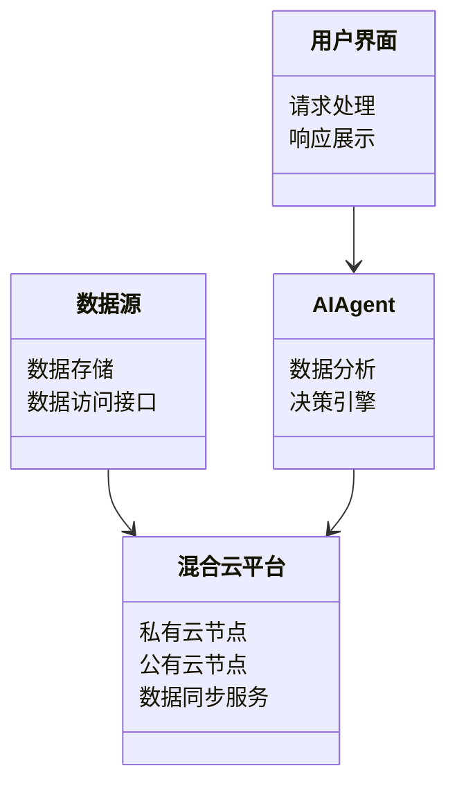
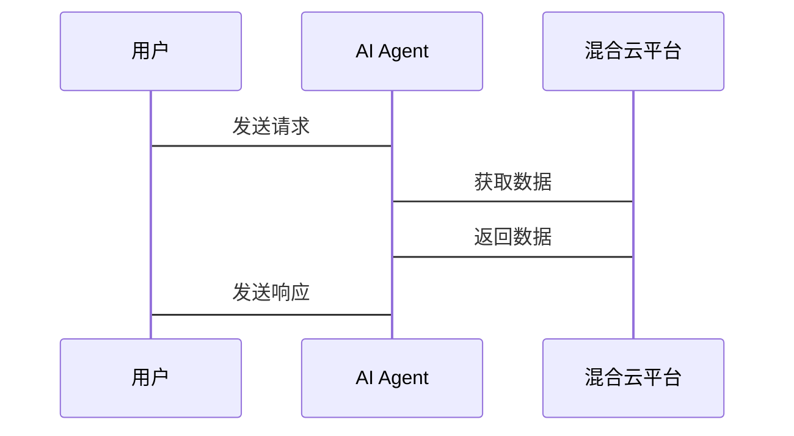

                 


# 企业AI Agent的混合云数据管理策略

## 关键词：企业AI Agent，混合云，数据管理策略，数据安全，系统架构

## 摘要：本文探讨了在混合云环境中管理数据的策略，特别是企业AI Agent在其中的作用。文章从背景介绍、核心概念、算法原理、系统架构、项目实战、最佳实践等方面展开，详细分析了混合云数据管理的挑战与解决方案，并通过具体案例展示了如何实现高效的数据管理。

---

## 第1章：企业AI Agent与混合云数据管理概述

### 1.1 企业AI Agent的基本概念

AI Agent是一种智能代理，能够在企业环境中自动化执行任务，优化资源分配，提高效率。企业AI Agent通过与企业系统、数据源和用户的交互，实现数据处理、决策支持和任务执行。其特点包括自主性、反应性、目标导向和社会能力。

### 1.2 混合云数据管理的背景与重要性

混合云结合了私有云、公有云和本地数据中心的优势，为企业提供了灵活、高效、经济的解决方案。数据管理是混合云环境中的核心挑战，涉及数据存储、同步、安全和性能优化。有效管理混合云数据可以提升企业竞争力，降低成本，并增强数据安全。

---

## 第2章：混合云数据管理的核心概念

### 2.1 混合云数据管理的原理

混合云数据管理通过数据同步、存储优化和安全机制，确保数据在不同云环境中的一致性、可用性和安全性。数据同步算法确保数据在各个节点之间保持一致，存储优化算法降低数据冗余，安全机制保护数据隐私。

### 2.2 AI Agent在数据管理中的作用

AI Agent通过分析数据模式、预测数据需求和优化数据访问路径，提升数据管理效率。AI Agent可以自适应调整数据存储策略，动态分配资源，实时监控数据安全，从而提高混合云数据管理的智能化水平。

---

## 第3章：混合云数据管理的算法与数学模型

### 3.1 数据同步算法

数据同步算法用于确保混合云环境中数据的一致性。一种常见的算法是基于时间戳的乐观并发控制：

1. 每个数据项记录修改时间戳。
2. 在更新数据时，检查本地时间戳是否小于服务器时间戳。
3. 如果冲突，回滚操作或进行合并。

数学模型如下：

$$ \text{时间戳} = \text{Timestamp}(t) $$

$$ \text{冲突检测} = \text{本地时间戳} < \text{服务器时间戳} $$

### 3.2 数据优化算法

数据优化算法通过压缩、归档和归约技术减少数据存储量。例如，使用LZ77算法进行数据压缩：

$$ \text{压缩后数据} = \text{LZ77}(\text{原始数据}) $$

---

## 第4章：系统分析与架构设计

### 4.1 系统架构设计

系统架构包括数据源、AI Agent、混合云平台和用户界面。领域模型如下：



### 4.2 系统交互设计

系统交互流程如下：



---

## 第5章：项目实战

### 5.1 项目背景

某医疗企业希望在混合云环境中管理患者数据，实现数据的安全存储和高效访问。

### 5.2 核心代码实现

以下是数据同步模块的核心代码：

```python
def data_sync(local_timestamp, server_timestamp):
    if local_timestamp < server_timestamp:
        return "同步失败，存在冲突"
    else:
        return "同步成功"
```

### 5.3 案例分析

通过医疗数据管理项目，展示了如何利用AI Agent实现数据同步、存储优化和安全保护。项目的成功实施提高了数据可用性，降低了管理成本。

---

## 第6章：最佳实践与优化技巧

### 6.1 数据安全

确保数据在传输和存储过程中加密，采用AES-256加密算法：

$$ \text{加密数据} = \text{AES}(\text{明文}, \text{密钥}) $$

### 6.2 性能优化

通过数据分区、缓存和负载均衡技术提升系统性能。例如，使用分布式缓存Redis：

$$ \text{缓存命中率} = \frac{\text{缓存命中次数}}{\text{总请求次数}} $$

### 6.3 维护策略

定期备份、监控和优化系统，确保数据管理策略的有效性和可靠性。

---

## 第7章：总结与展望

本文详细探讨了企业AI Agent在混合云数据管理中的应用，分析了其核心概念、算法原理和系统架构，并通过具体案例展示了其实现过程。未来，随着AI技术的不断发展，混合云数据管理将更加智能化、自动化和高效化。

---

## 作者：AI天才研究院/AI Genius Institute & 禅与计算机程序设计艺术 /Zen And The Art of Computer Programming

---

**感谢您的阅读！希望这篇文章能为您提供有价值的信息和启示。**

