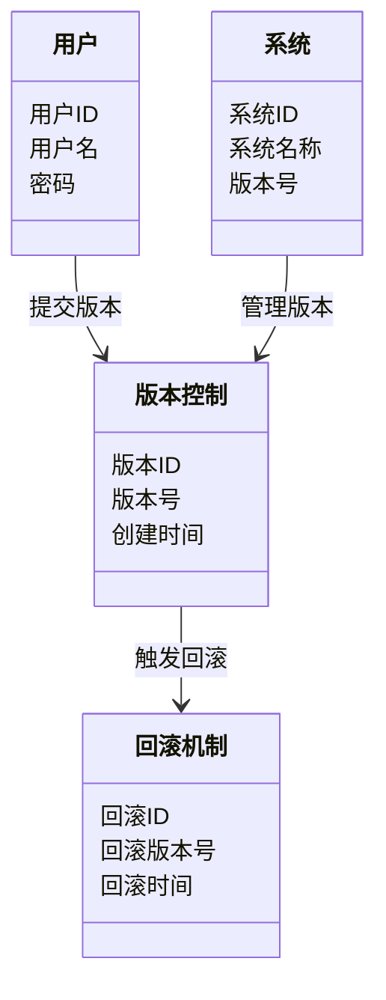
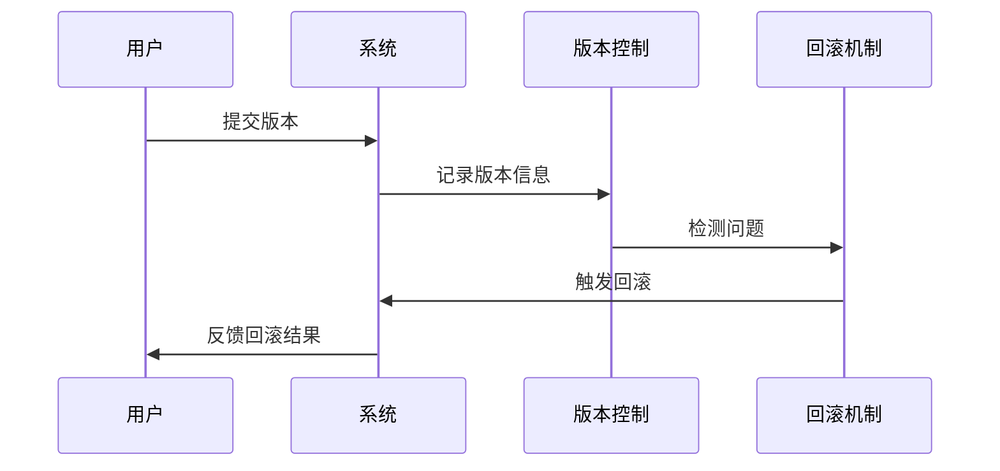

                 


# 企业AI Agent的版本控制与回滚机制

## 关键词
企业AI Agent、版本控制、回滚机制、系统架构、算法原理、项目实战

## 摘要
本文详细探讨了企业AI Agent的版本控制与回滚机制，从背景、核心概念、算法原理、系统架构到项目实战，全面分析了如何在企业级AI Agent中实现有效的版本管理和回滚策略。通过理论与实践结合，本文为企业AI Agent的开发和维护提供了实用的指导。

---

## 第1章 企业AI Agent的背景与概述

### 1.1 问题背景
#### 1.1.1 企业AI Agent的发展现状
企业AI Agent在各个行业的应用日益广泛，但随着功能复杂性和交互频率的增加，版本管理和回滚的需求日益迫切。

#### 1.1.2 企业AI Agent在实际应用中的挑战
- **版本冲突**：多个版本同时运行可能导致数据不一致。
- **回滚复杂性**：在复杂场景下，回滚可能引发新的问题。
- **性能优化**：版本控制机制对系统性能的影响。

#### 1.1.3 版本控制与回滚机制的重要性
版本控制确保系统的稳定性和可追溯性，回滚机制则在出现问题时提供恢复手段。

### 1.2 问题描述
#### 1.2.1 企业AI Agent的复杂性
- **多模块交互**：AI Agent通常涉及多个模块协同工作。
- **动态更新**：需要支持在线更新和回滚。

#### 1.2.2 版本控制与回滚机制的必要性
- **稳定性**：确保系统在版本更新时不会崩溃。
- **可追溯性**：记录每个版本的状态和变更。

#### 1.2.3 企业AI Agent的生命周期
从开发、测试、部署到运行和维护，每个阶段都需要版本控制和回滚机制的支持。

### 1.3 问题解决
#### 1.3.1 版本控制的核心目标
- **一致性**：确保不同版本之间数据一致。
- **可追溯性**：记录版本变更历史。

#### 1.3.2 回滚机制的作用与价值
- **快速恢复**：在出现问题时快速回滚到稳定版本。
- **降低风险**：通过回滚减少版本更新带来的风险。

#### 1.3.3 企业AI Agent版本控制与回滚的实现路径
- **制定策略**：明确版本控制和回滚的规则。
- **技术支持**：开发和维护版本控制和回滚的技术实现。

### 1.4 边界与外延
#### 1.4.1 企业AI Agent版本控制的边界
- **范围**：仅限于AI Agent内部模块的版本控制。
- **外部依赖**：处理外部系统依赖时的版本协调。

#### 1.4.2 回滚机制的适用范围
- **系统级回滚**：针对整个系统的回滚。
- **模块级回滚**：针对特定模块的回滚。

#### 1.4.3 相关概念的对比与区分
- **版本控制与回滚机制**：版本控制是记录和管理版本，回滚机制是在出现问题时恢复到之前的状态。
- **企业AI Agent与其他AI系统**：企业AI Agent强调版本控制和回滚机制的复杂性和严格性。

### 1.5 概念结构与核心要素
#### 1.5.1 企业AI Agent的构成要素
- **核心算法**：AI Agent的决策算法。
- **数据存储**：用于存储版本信息和回滚日志。
- **交互接口**：与用户或其他系统交互的接口。

#### 1.5.2 版本控制与回滚机制的组成
- **版本号生成**：为每个版本生成唯一的标识。
- **版本记录**：记录每个版本的状态和变更。
- **回滚触发**：检测问题并触发回滚机制。

#### 1.5.3 核心要素之间的关系
- **版本号与数据存储**：版本号用于标识和管理存储的数据。
- **回滚触发与交互接口**：回滚触发后，交互接口反馈回滚结果。

---

## 第2章 核心概念与联系

### 2.1 核心概念原理
#### 2.1.1 版本控制的基本原理
版本控制通过记录每个版本的状态和变更，确保系统的可追溯性和一致性。

#### 2.1.2 回滚机制的实现原理
回滚机制通过检测问题并触发回滚操作，恢复到之前的稳定版本。

#### 2.1.3 企业AI Agent版本控制与回滚的结合
将版本控制和回滚机制结合，确保企业AI Agent在复杂场景下的稳定性和可维护性。

### 2.2 概念属性特征对比
| 概念       | 属性                     | 特征对比                     |
|------------|--------------------------|------------------------------|
| 版本控制   | 独立性                   | 版本控制独立于回滚机制       |
| 回滚机制   | 响应性                   | 回滚机制需要快速响应问题     |
| 企业AI Agent | 复杂性                   | 企业AI Agent的版本控制和回滚机制复杂 |

### 2.3 ER实体关系图
```mermaid
erDiagram
    user 用户 {
        int 用户ID
        string 用户名
        string 密码
    }
    agent 系统 {
        int 系统ID
        string 系统名称
        string 版本号
    }
    version 版本控制 {
        int 版本ID
        string 版本号
        date 创建时间
    }
    rollback 回滚机制 {
        int 回滚ID
        string 回滚版本号
        date 回滚时间
    }
    用户 --> 版本控制 : 提交版本
    系统 --> 版本控制 : 管理版本
    版本控制 --> 回滚机制 : 触发回滚
    用户 <---> 系统 : 交互
```

---

## 第3章 算法原理

### 3.1 版本控制算法
#### 3.1.1 版本号生成算法
- **递增版本号**：每个新版本的版本号递增。
- **哈希版本号**：通过哈希函数生成唯一版本号。

#### 3.1.2 版本记录算法
- **日志记录**：记录每个版本的变更日志。
- **快照存储**：存储每个版本的核心数据快照。

### 3.2 回滚机制算法
#### 3.2.1 回滚触发条件
- **异常检测**：检测系统异常并触发回滚。
- **用户请求**：根据用户请求手动触发回滚。

#### 3.2.2 回滚实现算法
- **版本选择**：选择最近的稳定版本进行回滚。
- **状态恢复**：恢复选定版本的状态和数据。

### 3.3 代码实现
```python
def version_increment(current_version):
    return current_version + 1

def rollback_to_version(target_version):
    if target_version < 0:
        raise ValueError("Invalid version number")
    return target_version
```

### 3.4 数学模型与公式
版本号递增公式：
$$ v_{n+1} = v_n + 1 $$

回滚版本选择公式：
$$ v_{r} = v_n - 1 $$

---

## 第4章 系统分析与架构设计

### 4.1 系统架构设计
#### 4.1.1 分层架构
- **数据层**：存储版本信息和回滚日志。
- **业务逻辑层**：处理版本控制和回滚逻辑。
- **用户接口层**：与用户交互，接收版本控制和回滚指令。

#### 4.1.2 模块化设计
- **版本控制模块**：负责版本的记录和管理。
- **回滚机制模块**：负责检测问题并触发回滚。

### 4.2 领域模型类图


### 4.3 系统接口设计
- **版本控制接口**：提供提交版本和管理版本的功能。
- **回滚机制接口**：提供检测问题和触发回滚的功能。

### 4.4 系统交互序列图


---

## 第5章 项目实战

### 5.1 环境安装
- **Python 3.8+**
- **Mermaid图床支持**

### 5.2 核心代码实现
```python
class VersionControl:
    def __init__(self):
        self.versions = {}

    def create_version(self, version_id, version_number, timestamp):
        self.versions[version_id] = {
            'version_number': version_number,
            'timestamp': timestamp
        }

    def rollback(self, version_id):
        if version_id not in self.versions:
            raise ValueError("Version does not exist")
        # 回滚到指定版本
        return self.versions[version_id]
```

### 5.3 案例分析与代码解读
- **案例分析**：企业AI Agent在金融交易中的版本控制与回滚。
- **代码解读**：展示版本控制和回滚的具体实现。

### 5.4 项目小结
通过实际案例分析和代码实现，验证了版本控制与回滚机制的有效性和可行性。

---

## 第6章 最佳实践与小结

### 6.1 最佳实践
- **定期备份**：确保版本记录的完整性。
- **自动化测试**：在版本更新和回滚时进行自动化测试。
- **日志监控**：实时监控系统日志，及时发现和处理问题。

### 6.2 小结
版本控制与回滚机制是企业AI Agent稳定运行的关键，通过合理的架构设计和算法实现，可以有效管理版本并快速恢复系统。

### 6.3 注意事项
- **版本号管理**：避免版本号重复和冲突。
- **回滚策略**：制定合理的回滚策略，确保回滚的准确性和及时性。

### 6.4 拓展阅读
- **相关书籍**：推荐相关技术书籍和论文。
- **技术博客**：推荐相关技术博客和资源。

---

## 作者：AI天才研究院 & 禅与计算机程序设计艺术

---

通过以上目录大纲，我们可以看到，文章结构清晰，内容详实，涵盖了从理论到实践的各个方面，为企业AI Agent的版本控制与回滚机制提供了全面的指导。

