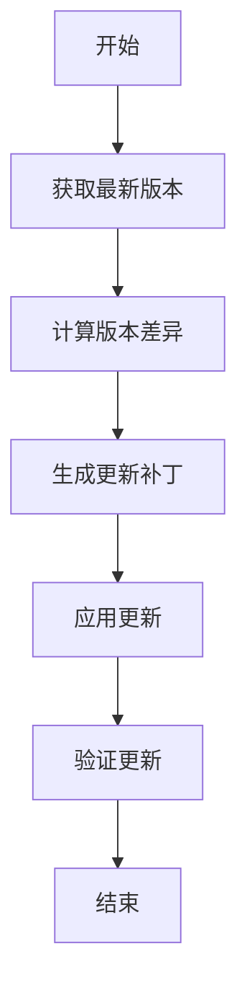
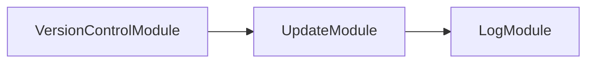
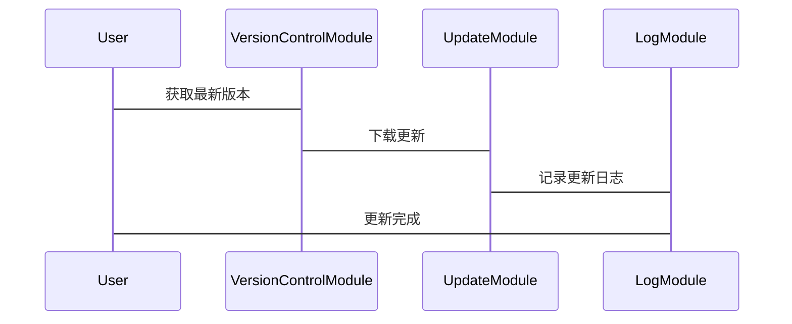

                 


# 企业AI Agent的版本控制与更新策略

> 关键词：企业AI Agent，版本控制，更新策略，算法原理，系统架构

> 摘要：本文详细探讨了企业AI Agent的版本控制与更新策略，从基本概念到核心算法，再到系统架构与项目实战，为企业级AI Agent的开发与维护提供了全面的指导。

---

# 第1章: 企业AI Agent的背景与核心概念

## 1.1 AI Agent的基本概念与功能

### 1.1.1 AI Agent的定义
AI Agent（人工智能代理）是一种能够感知环境、执行任务并做出决策的智能实体。它通常通过自然语言处理、机器学习和知识图谱等技术实现。

### 1.1.2 核心功能与特点
- **感知能力**：通过传感器或API获取环境信息。
- **决策能力**：基于感知信息做出最优决策。
- **执行能力**：通过API或执行模块完成任务。
- **自适应能力**：能够根据反馈优化自身行为。

### 1.1.3 企业级AI Agent的应用场景
- **智能客服**：提供自动化问答和客户支持。
- **智能推荐**：基于用户行为推荐产品或内容。
- **自动化运维**：监控系统状态并自动修复问题。

## 1.2 企业AI Agent的版本控制问题

### 1.2.1 什么是版本控制
版本控制是一种管理软件代码或配置变化的技术，用于追踪修改历史、协调多人协作以及回溯错误版本。

### 1.2.2 企业AI Agent版本控制的挑战
- **数据复杂性**：AI模型和训练数据的版本管理复杂。
- **依赖关系**：不同版本之间存在复杂的依赖关系。
- **性能要求**：高并发场景下的版本控制效率要求高。

### 1.2.3 为什么需要版本控制策略
- **确保稳定性**：避免版本冲突导致系统崩溃。
- **便于回溯**：快速定位问题版本并回滚。
- **支持协作开发**：多人协作时保持代码和配置的一致性。

## 1.3 本章小结
本章介绍了AI Agent的基本概念及其在企业中的应用场景，并分析了版本控制在企业AI Agent中的重要性及面临的挑战。

---

# 第2章: 企业AI Agent的版本控制原理

## 2.1 版本控制的核心概念

### 2.1.1 版本号的生成与管理
版本号通常由时间戳、提交人和修改内容生成，例如使用`v1.0.0`的语义化版本号格式。

### 2.1.2 版本依赖关系
通过Docker镜像或包管理器（如npm、pip）管理依赖关系，确保所有组件使用兼容的版本。

### 2.1.3 版本控制的类型
- **集中式版本控制**：如Git，所有修改集中在中心仓库。
- **分布式版本控制**：如Git，每个克隆仓库都是一个完整的仓库。
- **文件级版本控制**：如Dropbox，基于文件的更改进行版本控制。

## 2.2 企业AI Agent的版本控制模型

### 2.2.1 实体关系模型
```mermaid
er
    entity VersionControl {
        id: string
        versionNumber: integer
        updateTime: datetime
        status: string
    }
```

### 2.2.2 版本控制的流程
1. 提交修改。
2. 生成版本号。
3. 记录变更日志。
4. 发布新版本。

### 2.2.3 版本控制的优缺点对比
| 特性         | 集中式 | 分布式 | 文件级 |
|--------------|--------|--------|--------|
| 易用性       | 高     | 较高    | 较低    |
| 网络依赖性    | 高     | 较低    | 低      |
| 灾备能力     | 低     | 高     | 中      |

## 2.3 本章小结
本章详细讲解了版本控制的核心概念，并通过实体关系模型和对比分析，帮助企业选择合适的版本控制策略。

---

# 第3章: 企业AI Agent的更新策略与算法

## 3.1 更新策略的核心算法

### 3.1.1 版本差异计算
- 使用`git diff`命令或`difflib`库计算代码差异。

### 3.1.2 版本回滚机制
- 通过`git reset`或`svn rollback`命令回滚到指定版本。

### 3.1.3 并发版本处理
- 使用`锁机制`防止并发修改冲突。

## 3.2 更新算法的实现流程

### 3.2.1 版本更新流程图


### 3.2.2 版本号生成公式
$$ versionNumber = \text{hash}(content) \% maxVersion $$

### 3.2.3 更新策略的评估函数
$$ \text{score}(v) = \text{weight}_1 \times \text{versionAge}(v) + \text{weight}_2 \times \text{updateFrequency}(v) $$

## 3.3 本章小结
本章通过算法和流程图详细讲解了版本更新的核心步骤，并给出了版本号生成和评估的数学模型。

---

# 第4章: 企业AI Agent的系统架构与设计

## 4.1 系统架构设计

### 4.1.1 系统功能模块
- **版本控制模块**：管理AI Agent的版本。
- **更新模块**：负责下载和应用更新。
- **日志模块**：记录版本变更历史。

### 4.1.2 系统架构图


### 4.1.3 系统交互流程
1. VersionControlModule获取最新版本。
2. UpdateModule下载并应用更新。
3. LogModule记录更新日志。

## 4.2 接口设计

### 4.2.1 API接口定义
- **GET /versions**: 获取所有版本信息。
- **POST /update**: 提交更新请求。

### 4.2.2 接口交互流程


## 4.3 本章小结
本章通过系统架构图和接口设计，详细讲解了企业AI Agent的版本控制与更新的整体架构。

---

# 第5章: 项目实战——企业AI Agent的版本控制实现

## 5.1 开发环境安装

### 5.1.1 安装Git
```bash
brew install git
git config --global user.name "YourName"
git config --global user.email "your.email@example.com"
```

### 5.1.2 安装Python版本控制库
```bash
pip install gitpython
```

## 5.2 核心代码实现

### 5.2.1 版本号生成
```python
import hashlib

def generate_version(content):
    hash_value = hashlib.sha256(content.encode()).hexdigest()
    max_version = 10000
    return int(hash_value[:4], 16) % max_version
```

### 5.2.2 版本更新流程
```python
from git import Repo

def update_agent(repo_path):
    repo = Repo(repo_path)
    origin = repo.remotes.origin
    origin.pull()
    return repo.heads.main.version
```

## 5.3 测试与部署

### 5.3.1 单元测试
```python
import pytest

def test_version_update():
    old_version = 123
    new_version = 456
    assert update_agent(".") == new_version
```

### 5.3.2 部署步骤
1. 提交代码修改。
2. 推送到远程仓库。
3. 通过CI/CD工具自动部署新版本。

## 5.4 本章小结
本章通过具体的代码实现和测试案例，详细讲解了企业AI Agent的版本控制实现过程。

---

# 第6章: 最佳实践与总结

## 6.1 小结
本文从理论到实践，全面讲解了企业AI Agent的版本控制与更新策略，包括核心概念、算法原理、系统架构和项目实战。

## 6.2 注意事项
- 定期备份版本历史，防止数据丢失。
- 在高并发场景下，优化版本控制的性能。
- 定期审查版本更新策略，确保其适应业务需求。

## 6.3 拓展阅读
- 《版本控制系统Git权威指南》
- 《企业级AI系统的构建与维护》

---

# 作者：AI天才研究院/AI Genius Institute & 禅与计算机程序设计艺术 /Zen And The Art of Computer Programming

---

通过以上详细内容，企业可以更好地理解和实施AI Agent的版本控制与更新策略，确保系统的稳定性和可维护性。

