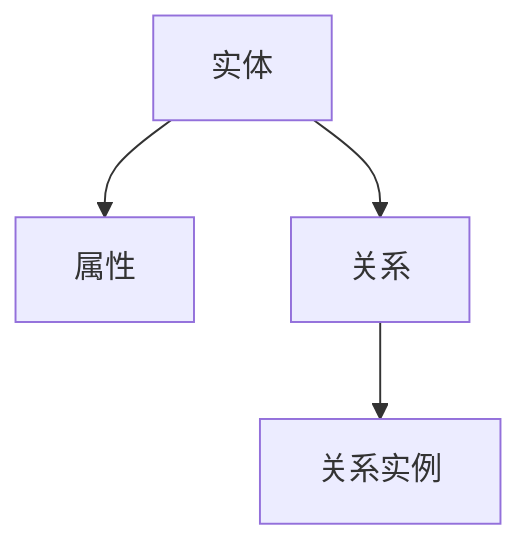
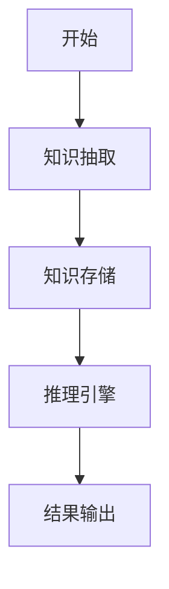
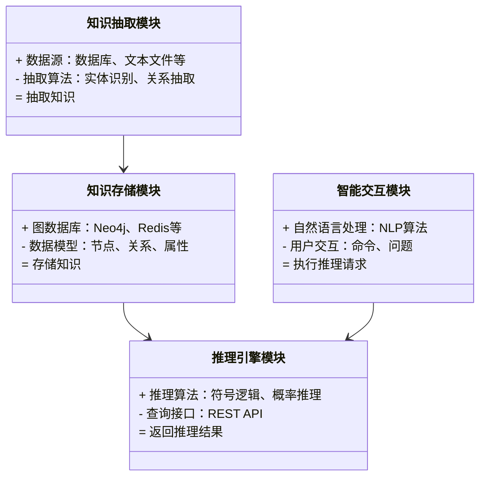
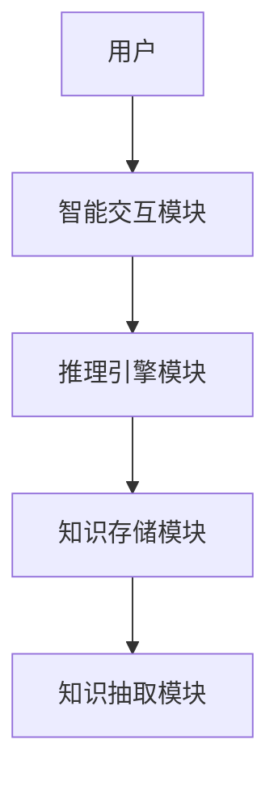

                 

# 企业AI Agent的知识图谱推理引擎

> 关键词：企业AI Agent，知识图谱，推理引擎，系统架构，算法原理，项目实战

> 摘要：本文深入探讨了企业AI Agent在知识图谱推理引擎中的应用，详细分析了知识图谱的构建、推理引擎的原理、系统架构的设计以及实际项目的实现。通过理论与实践相结合，为读者提供了全面的技术指导。

---

# 第1章: 企业AI Agent与知识图谱推理引擎的背景介绍

## 1.1 问题背景与描述

### 1.1.1 传统企业信息处理的局限性

在企业信息化建设中，传统数据库和规则引擎虽然在一定程度上提高了数据处理效率，但面临着以下问题：

- 数据孤岛：各部门之间的数据分散，难以形成统一的语义理解。
- 非结构化数据处理能力有限：传统数据库难以有效处理文本、图像等非结构化数据。
- 动态适应性差：面对市场变化和业务需求的快速调整，传统系统难以迅速响应。

### 1.1.2 知识图谱的提出与应用

知识图谱通过将分散的数据整合成结构化的知识网络，提供了统一的语义表示。其优势包括：

- 高度结构化：将实体及其关系以图结构的形式表示，便于机器理解和推理。
- 融合多源数据：能够整合来自不同来源的数据，构建完整的知识体系。
- 支持复杂查询：通过图结构可以进行多步推理，满足复杂的查询需求。

### 1.1.3 AI Agent在企业中的角色与价值

AI Agent（智能代理）作为企业的数字化助手，能够主动感知环境、理解需求并执行任务。其价值体现在：

- 智能决策支持：通过分析知识图谱中的信息，提供基于数据的决策建议。
- 自动化处理：能够自动执行预设任务，减少人工干预。
- 实时响应：具备快速处理请求和反馈的能力，提升企业效率。

## 1.2 问题解决与边界

### 1.2.1 知识图谱推理引擎的定义

知识图谱推理引擎是一种基于图结构数据的推理系统，通过逻辑推理或概率计算，推导出隐含的知识。其主要功能包括：

- 知识抽取：从文本中提取实体和关系。
- 知识存储：将抽取的知识以图结构形式存储。
- 推理计算：根据知识图谱进行逻辑推理或概率计算。

### 1.2.2 AI Agent在知识图谱中的应用边界

AI Agent的应用范围主要集中在以下领域：

- 数据处理：从多源数据中提取、整合信息。
- 语义理解：通过知识图谱实现对文本的深度理解。
- 智能交互：与用户或系统进行自然语言对话，执行任务。

其边界在于，AI Agent不直接处理业务逻辑，而是提供基于知识图谱的决策支持。

### 1.2.3 知识图谱推理引擎的外延与扩展

知识图谱推理引擎的外延包括：

- 数据源的多样性：支持结构化、半结构化和非结构化数据的接入。
- 推理方法的多样性：支持符号逻辑推理、概率推理和深度学习推理。
- 应用场景的多样性：适用于问答系统、推荐系统、知识管理等多个领域。

## 1.3 核心概念与结构

### 1.3.1 知识图谱的组成要素

知识图谱由以下三部分组成：

- 实体：代表实际存在的对象，如“公司”、“产品”。
- 属性：描述实体的特征，如“公司名称”、“成立时间”。
- 关系：描述实体之间的关联，如“公司-生产-产品”。

### 1.3.2 推理引擎的工作原理

推理引擎通过以下步骤实现知识推理：

1. **知识抽取**：从数据源中提取实体、关系和属性。
2. **知识存储**：将抽取的知识以图结构形式存储。
3. **推理计算**：根据查询需求，调用推理算法进行计算。

### 1.3.3 企业AI Agent的系统架构

企业AI Agent的系统架构通常包括以下几个部分：

- **知识库**：存储企业的知识图谱。
- **推理引擎**：负责根据查询进行推理。
- **交互界面**：与用户或系统进行交互。
- **执行单元**：根据推理结果执行相应操作。

## 1.4 本章小结

本章介绍了企业AI Agent和知识图谱推理引擎的背景，分析了传统企业信息处理的局限性，提出了知识图谱的应用价值，并定义了知识图谱推理引擎的核心概念和系统架构。

---

# 第2章: 知识图谱与推理引擎的核心概念

## 2.1 核心概念与原理

### 2.1.1 知识图谱的定义与特点

知识图谱是一种以图结构形式表示知识的语义网络。其特点包括：

- **结构化**：通过节点和边表示实体及其关系。
- **语义化**：提供统一的语义表示，便于机器理解和推理。
- **动态性**：能够实时更新，反映最新的知识。

### 2.1.2 推理引擎的定义与分类

推理引擎是基于知识图谱进行推理的系统。其分类如下：

- **符号逻辑推理**：基于符号逻辑进行推理，如一阶逻辑。
- **概率推理**：基于概率论进行推理，如贝叶斯网络。
- **深度学习推理**：基于神经网络进行推理，如图神经网络。

### 2.1.3 AI Agent在知识图谱中的作用

AI Agent通过知识图谱实现智能决策和自动化操作。其主要作用包括：

- **知识表示**：将分散的知识整合成结构化的图谱。
- **推理计算**：根据图谱进行推理，获取隐含知识。
- **智能交互**：通过自然语言处理与用户进行交互。

### 2.1.4 知识图谱与数据库的对比

| 特性         | 知识图谱         | 数据库         |
|--------------|------------------|----------------|
| 结构         | 图结构           | 行列式结构     |
| 数据类型     | 支持多种数据类型 | 主要为结构化数据 |
| 查询能力     | 支持复杂查询     | 支持简单查询   |
| 可扩展性     | 高               | 中             |

### 2.1.5 AI Agent与传统代理的对比

| 特性         | AI Agent         | 传统代理         |
|--------------|------------------|------------------|
| 智能性       | 高               | 低               |
| 自适应性     | 强               | 弱               |
| 交互方式     | 支持自然语言     | 支持简单命令     |

### 2.1.6 实体关系图与ER图架构

通过Mermaid图展示知识图谱的实体关系：

---

## 2.2 核心概念对比分析

### 2.2.1 知识图谱与传统数据库的对比

知识图谱与传统数据库在多个方面存在差异，具体如下：

1. **数据模型**：知识图谱采用图模型，传统数据库采用关系模型。
2. **查询能力**：知识图谱支持复杂查询，传统数据库支持简单查询。
3. **应用场景**：知识图谱适用于知识管理和推理，传统数据库适用于事务处理。

### 2.2.2 推理引擎与传统规则引擎的对比

推理引擎与传统规则引擎的主要区别在于：

1. **推理方式**：推理引擎支持多种推理方式，传统规则引擎主要基于规则匹配。
2. **复杂性**：推理引擎处理复杂推理，传统规则引擎处理简单规则。
3. **适应性**：推理引擎能够动态调整推理策略，传统规则引擎规则固定。

### 2.2.3 AI Agent与传统软件代理的对比

AI Agent与传统软件代理的区别在于：

1. **智能性**：AI Agent具备学习和推理能力，传统代理不具备。
2. **自主性**：AI Agent能够自主决策，传统代理主要执行预设任务。
3. **交互方式**：AI Agent支持自然语言交互，传统代理支持简单命令。

---

## 2.3 本章小结

本章详细介绍了知识图谱和推理引擎的核心概念，分析了它们的特点、优势及与传统技术的差异，并通过对比分析明确了知识图谱推理引擎在企业AI Agent中的重要性。

---

# 第3章: 知识图谱推理引擎的算法原理

## 3.1 知识抽取算法

### 3.1.1 实体识别算法

实体识别是知识抽取的第一步，常用算法包括：

1. **基于规则的实体识别**：通过预定义规则匹配文本中的实体。
2. **基于统计的实体识别**：利用机器学习模型进行实体识别。
3. **基于深度学习的实体识别**：使用神经网络模型（如LSTM、BERT）进行实体识别。

### 3.1.2 关系抽取算法

关系抽取旨在识别文本中实体之间的关系。常用算法包括：

1. **基于模板的关系抽取**：通过预定义模板匹配关系。
2. **基于机器学习的关系抽取**：利用特征工程和机器学习模型进行关系分类。
3. **基于深度学习的关系抽取**：使用神经网络模型（如RCNN、BERT）进行关系抽取。

### 3.1.3 知识图谱构建流程

知识图谱的构建流程如下：

1. 数据清洗：去除噪声数据。
2. 数据抽取：从数据源中抽取实体、关系和属性。
3. 数据融合：整合多源数据，消除冲突。
4. 数据存储：将抽取的数据以图结构形式存储。

## 3.2 推理算法

### 3.2.1 基于符号逻辑的推理

符号逻辑推理基于形式逻辑进行推理，常用算法包括：

1. **前向链推理**：从已知事实出发，逐步推导结论。
2. **后向链推理**：从目标结论出发，反向寻找支持的事实。
3. **演绎推理**：从一般性知识推导出特殊性结论。

### 3.2.2 基于概率的推理

概率推理基于概率论进行推理，常用算法包括：

1. **贝叶斯推理**：基于贝叶斯定理进行概率计算。
2. **马尔可夫逻辑网络推理**：结合逻辑和概率的推理方法。

### 3.2.3 基于深度学习的推理

深度学习推理利用神经网络进行推理，常用算法包括：

1. **图神经网络推理**：在图结构上进行消息传递和节点表示学习。
2. **端到端神经推理**：通过神经网络直接进行端到端推理。

## 3.3 算法流程图

知识图谱推理的流程图如下：

## 3.4 数学模型与公式

### 3.4.1 符号逻辑推理公式

符号逻辑推理基于形式逻辑，例如：

$$ \text{如果 } A \rightarrow B \text{ 且 } B \rightarrow C \text{，则 } A \rightarrow C $$

### 3.4.2 概率推理公式

概率推理基于贝叶斯定理：

$$ P(B|A) = \frac{P(A|B)P(B)}{P(A)} $$

---

## 3.5 本章小结

本章详细介绍了知识图谱推理引擎的算法原理，包括知识抽取和推理算法的实现方法，并通过流程图和数学公式对推理过程进行了详细说明。

---

# 第4章: 企业AI Agent的知识图谱推理系统架构

## 4.1 系统分析与设计

### 4.1.1 系统功能

企业AI Agent的知识图谱推理系统主要包括以下功能：

1. **知识抽取**：从企业数据中抽取实体、关系和属性。
2. **知识存储**：将抽取的知识以图结构形式存储。
3. **推理计算**：根据查询需求进行推理计算。
4. **智能交互**：与用户或系统进行自然语言交互。

### 4.1.2 系统功能设计

系统功能设计采用领域模型类图，如下所示：

### 4.1.3 系统架构设计

系统架构采用分层设计，如下所示：

### 4.1.4 系统接口设计

系统主要接口包括：

1. **推理接口**：提供REST API进行推理请求。
2. **知识存储接口**：提供数据存取接口。
3. **智能交互接口**：提供自然语言处理接口。

### 4.1.5 系统交互设计

系统交互流程如下：

1. 用户通过智能交互模块提交请求。
2. 智能交互模块调用推理引擎模块进行推理。
3. 推理引擎模块查询知识存储模块获取知识。
4. 推理引擎模块返回结果给智能交互模块。
5. 智能交互模块将结果反馈给用户。

---

## 4.2 本章小结

本章详细介绍了企业AI Agent的知识图谱推理系统的架构设计，包括系统功能、架构设计、接口设计和交互设计，为后续的实现提供了理论基础。

---

# 作者：AI天才研究院 & 禅与计算机程序设计艺术

---

**摘要**：本文深入探讨了企业AI Agent在知识图谱推理引擎中的应用，详细分析了知识图谱的构建、推理引擎的原理、系统架构的设计以及实际项目的实现。通过理论与实践相结合，为读者提供了全面的技术指导。

**关键词**：企业AI Agent，知识图谱，推理引擎，系统架构，算法原理，项目实战

