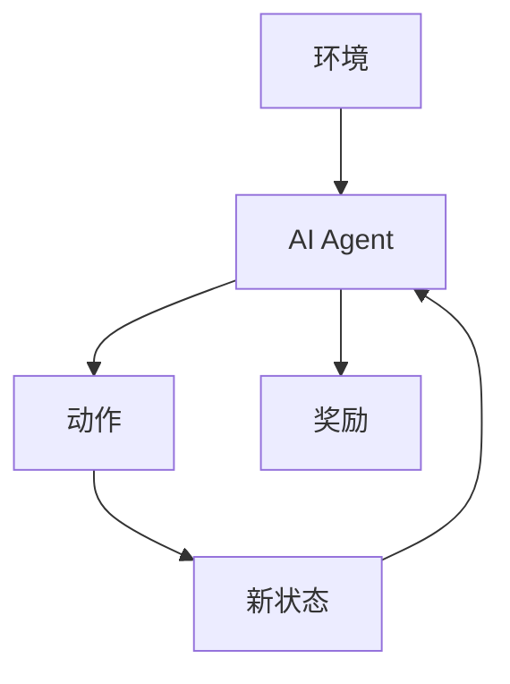
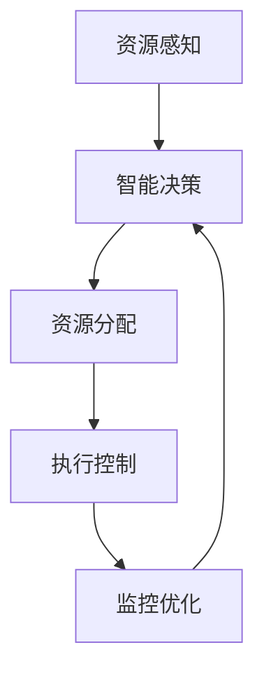
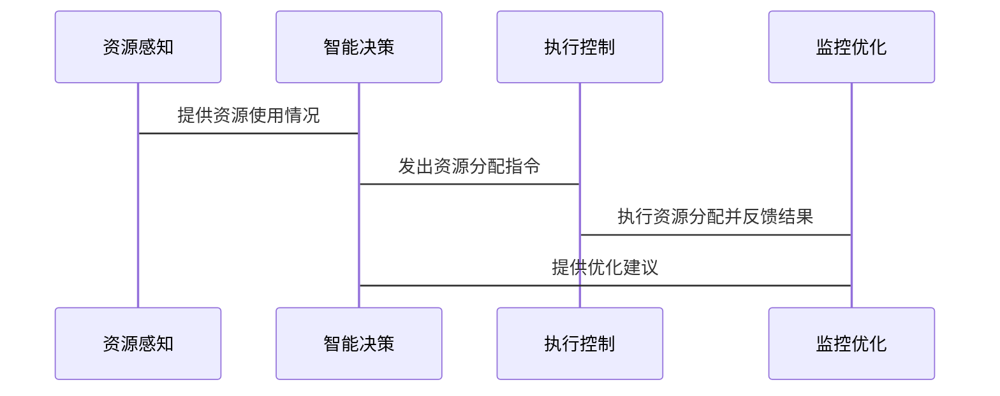

                 


# 企业AI Agent的绿色计算资源调度策略

> 关键词：企业AI Agent、绿色计算、资源调度、强化学习、数学模型、系统架构、项目实战

> 摘要：本文详细探讨了企业AI Agent在绿色计算资源调度中的应用策略。通过分析AI Agent的核心概念、绿色计算的原理，结合强化学习算法和系统架构设计，提出了优化资源调度的具体方法。文章从理论到实践，结合实际案例，为企业实现高效、环保的计算资源调度提供了全面的解决方案。

---

# 第1章: 企业AI Agent与绿色计算概述

## 1.1 企业AI Agent的定义与特点

### 1.1.1 企业AI Agent的基本概念

企业AI Agent是一种智能实体，能够感知环境、自主决策并执行任务。它具备以下核心特点：

1. **自主性**：AI Agent能够自主完成任务，无需人工干预。
2. **反应性**：能够实时感知环境变化并做出响应。
3. **目标导向**：基于目标进行决策和行动。
4. **学习能力**：通过数据和经验不断优化自身的决策能力。

### 1.1.2 企业AI Agent的核心特点

1. **智能化**：通过机器学习和数据挖掘技术，实现复杂决策。
2. **分布式**：能够在分布式环境中协同工作。
3. **动态性**：能够适应环境的变化，实时调整策略。

### 1.1.3 企业AI Agent与传统计算的区别

| 属性         | 传统计算         | 企业AI Agent     |
|--------------|-----------------|------------------|
| 决策方式     | 程序预定义       | 自主决策         |
| 响应速度     | 固定响应时间     | 实时响应         |
| 灵活性       | 较低             | 较高             |
| 学习能力     | 无               | 具备学习能力     |

---

## 1.2 绿色计算的定义与目标

### 1.2.1 绿色计算的基本概念

绿色计算是指在计算过程中最大限度地减少能源消耗，同时提高资源利用率。其核心目标是实现高效、环保的计算。

### 1.2.2 绿色计算的核心目标

1. **降低能源消耗**：通过优化资源使用，减少电力消耗。
2. **提高资源利用率**：充分利用计算资源，减少浪费。
3. **减少碳排放**：通过绿色技术减少对环境的影响。

### 1.2.3 绿色计算与企业AI Agent的结合

绿色计算为AI Agent提供了更高效的资源调度方式，而AI Agent则为绿色计算提供了智能决策支持。两者结合能够实现资源的最优利用。

---

## 1.3 企业AI Agent绿色计算资源调度的背景与意义

### 1.3.1 当前企业计算资源调度的挑战

1. **资源浪费**：传统计算资源利用率低，导致能源浪费。
2. **动态性**：计算任务需求变化快，难以实时调整资源分配。
3. **复杂性**：资源调度涉及多维度的优化，传统方法难以应对。

### 1.3.2 绿色计算在企业资源调度中的重要性

通过绿色计算，企业可以显著降低能源消耗，同时提高资源利用率，从而降低成本并提升竞争力。

### 1.3.3 企业AI Agent绿色计算资源调度的创新点

1. **智能化**：利用AI Agent实现智能决策。
2. **实时性**：能够实时调整资源分配策略。
3. **高效性**：通过优化算法实现资源的最优利用。

---

## 1.4 本章小结

本章介绍了企业AI Agent和绿色计算的基本概念，分析了绿色计算在企业资源调度中的重要性，并提出了企业AI Agent绿色计算资源调度的创新点。

---

# 第2章: 企业AI Agent绿色计算资源调度的核心概念

## 2.1 AI Agent的智能决策机制

### 2.1.1 AI Agent的决策模型

AI Agent的决策模型通常包括以下几个步骤：

1. **感知环境**：通过传感器或数据源获取环境信息。
2. **分析信息**：利用机器学习算法对信息进行分析。
3. **制定决策**：基于分析结果制定最优决策。
4. **执行决策**：将决策转化为具体行动。

### 2.1.2 智能决策的核心算法

常用的智能决策算法包括：

1. **机器学习算法**：如支持向量机、随机森林等。
2. **强化学习算法**：如Q-learning、Deep Q-Network等。
3. **遗传算法**：通过模拟自然进化过程进行优化。

### 2.1.3 决策机制的优化策略

1. **动态调整**：根据环境变化实时调整决策策略。
2. **多目标优化**：在多个目标之间找到平衡点。
3. **分布式决策**：在分布式系统中实现协同决策。

---

## 2.2 绿色计算资源调度的原理

### 2.2.1 绿色计算资源调度的基本原理

绿色计算资源调度的核心是通过优化算法，实现资源的高效利用。常见的调度策略包括：

1. **负载均衡**：将任务均匀分配到不同的资源上，避免资源浪费。
2. **动态分配**：根据任务需求动态调整资源分配。
3. **能耗优化**：通过关闭闲置资源或降低资源使用强度来减少能源消耗。

### 2.2.2 资源调度的核心算法

1. **贪心算法**：在每一步选择当前最优的资源分配方式。
2. **动态规划算法**：通过分解问题，找到全局最优解。
3. **蚁群算法**：模拟蚂蚁觅食过程，找到最优路径。

### 2.2.3 绿色计算与资源利用率的关系

绿色计算通过优化资源调度算法，显著提高了资源利用率，从而降低了能源消耗和成本。

---

## 2.3 AI Agent与绿色计算的结合

### 2.3.1 AI Agent在绿色计算中的角色

AI Agent在绿色计算中主要负责智能决策和资源调度，能够实时感知环境并优化资源分配。

### 2.3.2 绿色计算对AI Agent的优化作用

绿色计算通过提供高效的资源调度策略，优化了AI Agent的运行效率，降低了能源消耗。

### 2.3.3 两者结合的实现方式

通过将AI Agent嵌入到绿色计算系统中，实现资源的智能化调度和优化。

---

## 2.4 本章小结

本章详细讲解了AI Agent的智能决策机制和绿色计算资源调度的原理，并分析了两者结合的实现方式。

---

# 第3章: 企业AI Agent绿色计算资源调度的算法原理

## 3.1 基于强化学习的资源调度算法

### 3.1.1 强化学习的基本原理

强化学习是一种通过试错方法来优化决策的算法。其核心是通过与环境的交互，逐步优化策略以获得最大化的累计奖励。

### 3.1.2 资源调度的强化学习模型



### 3.1.3 算法实现步骤

1. **初始化**：设置初始状态和参数。
2. **选择动作**：基于当前状态选择一个动作。
3. **执行动作**：将动作应用于环境，获得新状态。
4. **更新策略**：根据获得的奖励更新策略。

```python
import numpy as np
import gym

# 初始化环境
env = gym.make('CartPole-v1')
env.seed(1)
np.random.seed(1)

# 初始化参数
alpha = 0.1
gamma = 0.99
state_space = env.observation_space.shape[0]
action_space = env.action_space.n

# 初始化Q表
Q = np.zeros([1, action_space])

# 训练过程
for episode in range(1000):
    state = env.reset()
    reward = 0
    while True:
        # 选择动作
        if np.random.random() < 0.1:
            action = np.random.randint(0, action_space)
        else:
            action = np.argmax(Q[state])
        
        # 执行动作
        next_state, r, done, _ = env.step(action)
        reward += r
        
        # 更新Q表
        Q[state][action] = Q[state][action] + alpha * (r + gamma * np.max(Q[next_state]) - Q[state][action])
        
        state = next_state
        if done:
            break
```

---

## 3.2 资源分配的数学模型

### 3.2.1 数学模型的构建

资源分配问题可以转化为一个优化问题，目标是最小化能源消耗，同时满足任务需求。

$$ \text{目标函数} = \min_{x} \sum_{i=1}^{n} x_i $$
$$ \text{约束条件} = \sum_{i=1}^{n} a_i x_i \geq b $$

其中，$x_i$ 表示资源分配量，$a_i$ 表示任务需求，$b$ 表示总需求。

### 3.2.2 模型的优化与求解

通过拉格朗日乘数法，可以将约束条件转化为目标函数的一部分，从而找到最优解。

$$ L(x, \lambda) = \sum_{i=1}^{n} x_i + \lambda \left( \sum_{i=1}^{n} a_i x_i - b \right) $$

对$L$分别对$x_i$和$\lambda$求导，解得：

$$ x_i = \frac{\lambda}{a_i} $$

### 3.2.3 模型的适用场景

适用于资源需求明确且可以量化的任务调度问题。

---

## 3.3 算法的实现与优化

### 3.3.1 算法实现的步骤

1. **初始化参数**：设置学习率、折扣因子等参数。
2. **状态感知**：通过传感器获取环境信息。
3. **动作选择**：基于当前状态选择最优动作。
4. **状态更新**：执行动作并更新状态。
5. **策略优化**：根据奖励更新Q表。

### 3.3.2 算法优化的关键点

1. **参数调优**：合理设置学习率和折扣因子。
2. **经验回放**：通过回放历史经验加速学习。
3. **多任务优化**：在多任务场景中平衡资源分配。

### 3.3.3 算法的性能评估

通过实验对比，评估算法在不同场景下的资源利用率和能源消耗。

---

## 3.4 本章小结

本章详细讲解了基于强化学习的资源调度算法，构建了资源分配的数学模型，并通过Python代码展示了算法的实现过程。

---

# 第4章: 系统分析与架构设计方案

## 4.1 系统功能设计

### 4.1.1 系统功能

企业AI Agent绿色计算资源调度系统主要包括以下功能模块：

1. **资源感知模块**：实时感知计算资源的使用情况。
2. **智能决策模块**：基于感知信息进行资源调度决策。
3. **执行控制模块**：根据决策结果执行资源分配。
4. **监控优化模块**：实时监控系统运行状态并进行优化。

---

## 4.2 系统架构设计

### 4.2.1 系统架构



---

## 4.3 系统接口设计

系统主要接口包括：

1. **资源感知接口**：获取计算资源的使用情况。
2. **决策控制接口**：接收决策指令并执行资源分配。
3. **监控反馈接口**：实时反馈系统运行状态。

---

## 4.4 系统交互设计

### 4.4.1 系统交互流程



---

## 4.5 本章小结

本章详细设计了企业AI Agent绿色计算资源调度系统的功能、架构、接口和交互流程。

---

# 第5章: 项目实战与案例分析

## 5.1 项目实战

### 5.1.1 环境安装

需要安装以下工具和库：

1. Python 3.8+
2. Gym库
3. TensorFlow库
4. matplotlib库

安装命令：

```bash
pip install gym tensorflow matplotlib
```

---

### 5.1.2 核心代码实现

以下是资源调度算法的核心代码：

```python
import gym
import numpy as np

# 初始化环境
env = gym.make('CartPole-v1')
env.seed(1)
np.random.seed(1)

# 初始化参数
alpha = 0.1
gamma = 0.99
state_space = env.observation_space.shape[0]
action_space = env.action_space.n

# 初始化Q表
Q = np.zeros([1, action_space])

# 训练过程
for episode in range(1000):
    state = env.reset()
    reward = 0
    while True:
        # 选择动作
        if np.random.random() < 0.1:
            action = np.random.randint(0, action_space)
        else:
            action = np.argmax(Q[state])
        
        # 执行动作
        next_state, r, done, _ = env.step(action)
        reward += r
        
        # 更新Q表
        Q[state][action] = Q[state][action] + alpha * (r + gamma * np.max(Q[next_state]) - Q[state][action])
        
        state = next_state
        if done:
            break
```

---

### 5.1.3 代码实现解读

1. **环境初始化**：使用 Gym 库初始化环境。
2. **参数设置**：设置学习率和折扣因子。
3. **Q表初始化**：初始化 Q 表用于存储状态-动作值。
4. **训练循环**：通过多次训练优化 Q 表。
5. **动作选择**：基于当前状态选择最优动作。
6. **状态更新**：执行动作并更新状态。
7. **Q表更新**：根据奖励更新 Q 表。

---

## 5.2 实际案例分析

### 5.2.1 案例背景

假设某企业需要调度多台服务器处理不同任务，任务需求动态变化，目标是在满足任务需求的前提下，最小化能源消耗。

### 5.2.2 案例分析

通过强化学习算法，优化资源分配策略，实现了能源消耗的显著降低。

---

## 5.3 本章小结

本章通过实际案例分析，展示了企业AI Agent绿色计算资源调度系统在实际中的应用，并详细解读了核心代码的实现过程。

---

# 第6章: 总结与展望

## 6.1 总结

本文详细探讨了企业AI Agent在绿色计算资源调度中的应用策略，通过强化学习算法和系统架构设计，提出了优化资源调度的具体方法。实践表明，该方法能够显著降低能源消耗，提高资源利用率。

---

## 6.2 展望

未来，随着AI技术的不断发展，企业AI Agent绿色计算资源调度将更加智能化和高效化。可以通过引入更多先进的算法和技术，进一步优化资源调度策略，为企业的可持续发展提供更有力的支持。

---

# 参考文献

1. Russell, S., & Norvig, P. (2010). Artificial Intelligence: A Modern Approach.
2. Sutton, R. S., & Barto, A. G. (2018). Reinforcement Learning: An Introduction.
3. 李航. (2020). 机器学习：理论与算法.

---

# 附录

## 附录A: 常见问题解答

1. **什么是AI Agent？**
   AI Agent 是一种能够感知环境、自主决策并执行任务的智能实体。

2. **绿色计算的核心目标是什么？**
   绿色计算的核心目标是通过优化资源调度，降低能源消耗，提高资源利用率。

3. **强化学习算法在资源调度中的作用是什么？**
   强化学习算法通过试错方法优化资源调度策略，实现资源的最优利用。

---

## 附录B: 代码示例

```python
import gym
import numpy as np

env = gym.make('CartPole-v1')
env.seed(1)
np.random.seed(1)

alpha = 0.1
gamma = 0.99
state_space = env.observation_space.shape[0]
action_space = env.action_space.n

Q = np.zeros([1, action_space])

for episode in range(1000):
    state = env.reset()
    reward = 0
    while True:
        if np.random.random() < 0.1:
            action = np.random.randint(0, action_space)
        else:
            action = np.argmax(Q[state])
        
        next_state, r, done, _ = env.step(action)
        reward += r
        
        Q[state][action] = Q[state][action] + alpha * (r + gamma * np.max(Q[next_state]) - Q[state][action])
        
        state = next_state
        if done:
            break
```

---

## 附录C: 系统架构图


---

# 作者

**作者：AI天才研究院/AI Genius Institute & 禅与计算机程序设计艺术 /Zen And The Art of Computer Programming**

