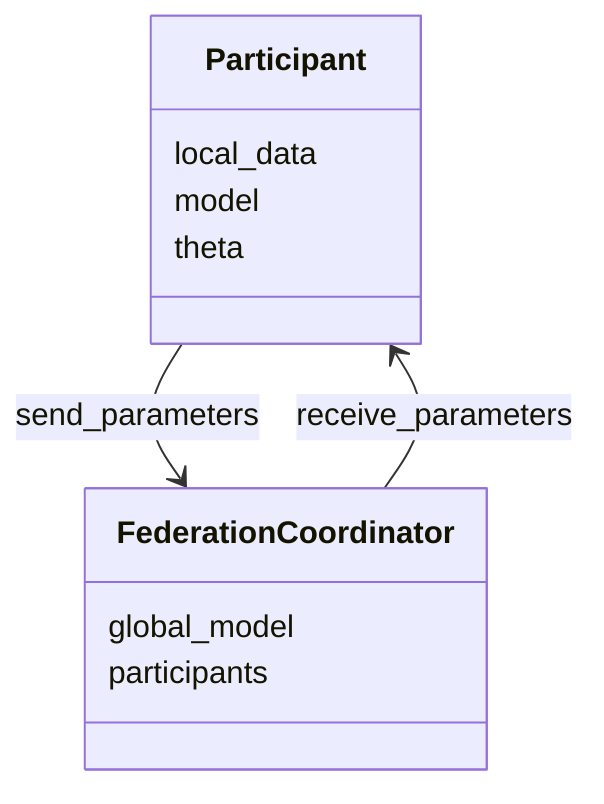
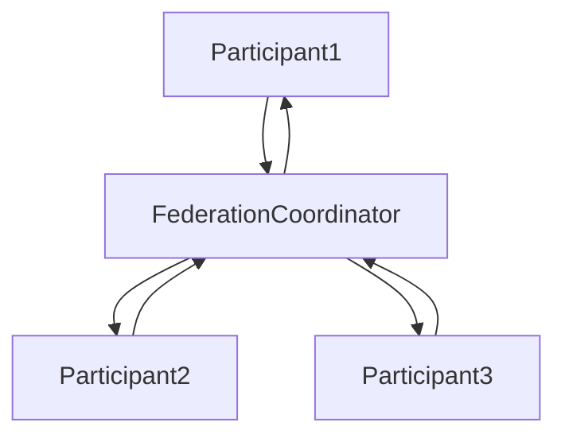
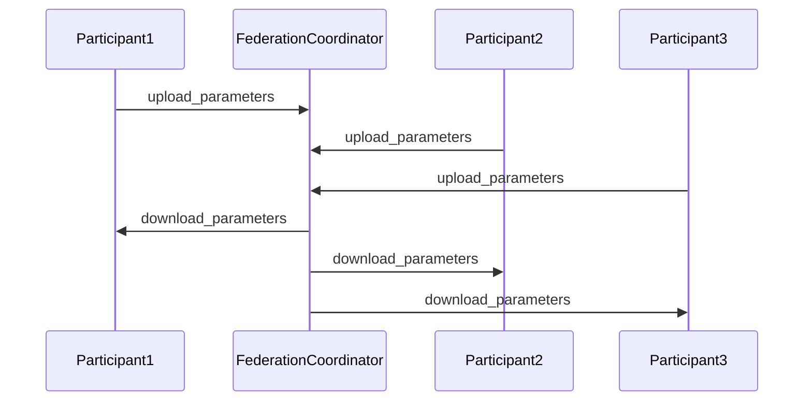

                 


# 企业AI Agent的联邦学习在跨企业数据协作中的安全实践

> 关键词：联邦学习，跨企业协作，数据隐私，AI Agent，安全性，模型训练，数据安全

> 摘要：本文详细探讨了企业AI Agent在跨企业数据协作中的联邦学习技术，重点分析了联邦学习的背景、核心概念、算法原理、系统架构以及实际应用中的安全性问题。通过深入的技术分析和实际案例，本文揭示了联邦学习在保障数据隐私的同时，如何实现高效的跨企业协作，并提出了相应的安全实践建议。

---

# 第一部分: 企业AI Agent的联邦学习概述

## 第1章: 联邦学习的背景与概念

### 1.1 联邦学习的起源与定义

#### 1.1.1 数据隐私与安全的挑战

在数字化转型的今天，数据已成为企业最重要的资产之一。然而，随着数据量的激增，数据隐私和安全问题日益成为企业和组织面临的重大挑战。传统的数据共享方式往往需要将数据集中到一个中心服务器，这种方式虽然便于管理和分析，但存在数据泄露、滥用以及合规性问题。尤其是在跨国企业和不同行业之间，数据隐私的法律和合规要求更加严格。

#### 1.1.2 联邦学习的定义与核心思想

联邦学习（Federated Learning）是一种分布式机器学习技术，旨在在不共享原始数据的情况下，通过加密通信和分布式计算，实现模型的联合训练。其核心思想是“数据不动，模型动”，即数据保留在各自的企业内部，仅通过加密通信的方式交换模型参数，从而避免数据泄露的风险。

#### 1.1.3 跨企业数据协作的必要性

跨企业数据协作能够充分利用不同企业的数据资源，提升模型的泛化能力和性能。然而，由于不同企业之间的数据隐私和商业竞争问题，直接共享数据往往不可行。联邦学习通过局部模型训练和参数同步的方式，为跨企业协作提供了一种安全、高效的解决方案。

---

### 1.2 联邦学习与传统机器学习的对比

#### 1.2.1 数据共享的模式差异

- **传统机器学习**：需要将所有数据集中到一个中心服务器，进行统一的模型训练。
- **联邦学习**：数据保留在各自的企业内部，仅通过加密通信的方式同步模型参数。

#### 1.2.2 模型训练的方式差异

- **传统机器学习**：模型在中心服务器上训练，所有数据都可用于模型优化。
- **联邦学习**：模型在各个企业的本地服务器上分布式训练，仅同步模型参数，避免数据外泄。

#### 1.2.3 联邦学习的优势与局限性

**优势**：
- 保护数据隐私，避免数据泄露。
- 支持跨企业协作，提升模型性能。
- 降低数据传输成本和延迟。

**局限性**：
- 模型收敛速度较慢，训练效率较低。
- 通信成本较高，尤其是在网络条件较差的情况下。
- 对模型的可解释性和鲁棒性要求更高。

---

### 1.3 联邦学习在企业AI Agent中的应用

#### 1.3.1 企业AI Agent的定义与特点

企业AI Agent是一种能够自主感知环境、执行任务并优化决策的智能实体。它通常具备以下特点：
- **自主性**：能够独立决策和行动。
- **反应性**：能够实时感知环境变化并做出响应。
- **学习能力**：能够通过经验改进自身的决策能力。

#### 1.3.2 联邦学习在AI Agent中的作用

在企业AI Agent中，联邦学习主要用于多 Agent 之间的协作学习。通过联邦学习，各个企业AI Agent可以在不共享数据的情况下，联合训练一个全局模型，从而提升整体的智能水平和决策能力。

#### 1.3.3 跨企业协作的场景分析

- **金融领域**：跨银行的风控模型训练。
- **医疗领域**：跨医院的疾病预测模型训练。
- **零售领域**：跨企业的客户行为分析模型训练。

---

## 第2章: 联邦学习的核心概念与原理

### 2.1 联邦学习的核心概念

#### 2.1.1 数据联邦与模型联邦

- **数据联邦**：一种基于数据的联邦学习模式，适用于数据分布在同一特征空间的情况。
- **模型联邦**：一种基于模型的联邦学习模式，适用于数据分布在不同特征空间的情况。

#### 2.1.2 联邦学习的参与方与角色

- **联邦协调器（Federation Coordinator）**：负责协调各个参与方的模型训练和参数同步。
- **联邦参与者（Federation Participant）**：负责本地模型训练和参数更新。

#### 2.1.3 联邦学习的通信机制

- **加密通信**：通过加密技术保证通信过程中的数据安全。
- **差分隐私**：在模型参数同步过程中添加噪声，防止数据泄露。

---

### 2.2 联邦学习的原理与流程

#### 2.2.1 数据预处理与特征工程

- 数据清洗：处理缺失值、异常值等。
- 特征选择：选择对模型训练重要的特征。
- 数据增强：通过数据扩展技术提升模型的泛化能力。

#### 2.2.2 模型训练与参数更新

- 每个参与者在本地数据上训练模型，更新模型参数。
- 将模型参数上传到联邦协调器，进行参数聚合。

#### 2.2.3 模型聚合与结果发布

- 联邦协调器将所有参与者的模型参数进行聚合，生成全局模型。
- 将全局模型分发给各个参与者，进行新一轮的模型训练。

---

### 2.3 联邦学习的数学模型与公式

#### 2.3.1 横向联邦学习的数学模型

横向联邦学习适用于数据分布在同一特征空间的情况。其数学模型如下：

$$
\theta_{i+1} = \theta_i + \eta \sum_{j=1}^{n} (y_j - h_{\theta_i}(x_j))
$$

其中：
- $\theta_i$ 表示第i轮的模型参数。
- $\eta$ 表示学习率。
- $y_j$ 表示真实标签。
- $h_{\theta_i}(x_j)$ 表示模型在第i轮对样本$x_j$的预测值。

#### 2.3.2 纵向联邦学习的数学模型

纵向联邦学习适用于数据分布在不同特征空间的情况。其数学模型如下：

$$
\theta_{i+1} = \theta_i + \eta \sum_{j=1}^{n} (y_j - h_{\theta_i}(x_j))
$$

其中：
- $\theta_i$ 表示第i轮的模型参数。
- $\eta$ 表示学习率。
- $y_j$ 表示真实标签。
- $h_{\theta_i}(x_j)$ 表示模型在第i轮对样本$x_j$的预测值。

---

## 第3章: 联邦学习的算法原理与实现

### 3.1 联邦学习的算法分类

#### 3.1.1 横向联邦学习算法

横向联邦学习适用于数据分布在同一特征空间的情况。其实现流程如下：

1. 初始化模型参数。
2. 每个参与者在本地数据上训练模型，更新模型参数。
3. 将模型参数上传到联邦协调器，进行参数聚合。
4. 聚合后的模型参数分发给各个参与者，进行新一轮的模型训练。

#### 3.1.2 纵向联邦学习算法

纵向联邦学习适用于数据分布在不同特征空间的情况。其实现流程如下：

1. 初始化模型参数。
2. 每个参与者在本地数据上训练模型，更新模型参数。
3. 将模型参数上传到联邦协调器，进行参数聚合。
4. 聚合后的模型参数分发给各个参与者，进行新一轮的模型训练。

---

### 3.2 联邦学习的算法实现

#### 3.2.1 横向联邦学习的实现流程

1. 初始化模型参数 $\theta_0$。
2. 每个参与者在本地数据上训练模型，更新模型参数：
   $$
   \theta_{i+1} = \theta_i + \eta \sum_{j=1}^{n} (y_j - h_{\theta_i}(x_j))
   $$
3. 将模型参数上传到联邦协调器，进行参数聚合：
   $$
   \theta_{\text{global}} = \frac{1}{n} \sum_{j=1}^{n} \theta_j
   $$
4. 聚合后的模型参数分发给各个参与者，进行新一轮的模型训练。

#### 3.2.2 纵向联邦学习的实现流程

1. 初始化模型参数 $\theta_0$。
2. 每个参与者在本地数据上训练模型，更新模型参数：
   $$
   \theta_{i+1} = \theta_i + \eta \sum_{j=1}^{n} (y_j - h_{\theta_i}(x_j))
   $$
3. 将模型参数上传到联邦协调器，进行参数聚合：
   $$
   \theta_{\text{global}} = \frac{1}{n} \sum_{j=1}^{n} \theta_j
   $$
4. 聚合后的模型参数分发给各个参与者，进行新一轮的模型训练。

---

### 3.3 联邦学习的数学公式与代码实现

#### 3.3.1 横向联邦学习的数学公式

横向联邦学习的数学公式如下：

$$
\theta_{i+1} = \theta_i + \eta \sum_{j=1}^{n} (y_j - h_{\theta_i}(x_j))
$$

其中：
- $\theta_i$ 表示第i轮的模型参数。
- $\eta$ 表示学习率。
- $y_j$ 表示真实标签。
- $h_{\theta_i}(x_j)$ 表示模型在第i轮对样本$x_j$的预测值。

#### 3.3.2 纵向联邦学习的数学公式

纵向联邦学习的数学公式如下：

$$
\theta_{i+1} = \theta_i + \eta \sum_{j=1}^{n} (y_j - h_{\theta_i}(x_j))
$$

其中：
- $\theta_i$ 表示第i轮的模型参数。
- $\eta$ 表示学习率。
- $y_j$ 表示真实标签。
- $h_{\theta_i}(x_j)$ 表示模型在第i轮对样本$x_j$的预测值。

#### 3.3.3 联邦学习的Python代码实现

以下是一个简单的横向联邦学习的Python代码实现：

```python
import numpy as np

def federated_learning(clients_data, global_model):
    # 初始化全局模型参数
    global_model.theta = np.random.randn(2, 1)
    global_model.b = np.zeros((1, 1))

    # 联邦学习迭代次数
    num_epochs = 100
    for epoch in range(num_epochs):
        # 每个客户端更新模型参数
        for client in clients_data:
            # 本地模型训练
            client.train(global_model)
            # 上传模型参数到全局模型
            global_model.theta += client.delta_theta
            global_model.b += client.delta_b
        # 模型参数平均
        global_model.theta = np.mean([client.theta for client in clients_data], axis=0)
        global_model.b = np.mean([client.b for client in clients_data], axis=0)
    return global_model
```

---

## 第4章: 联邦学习的系统架构与安全实践

### 4.1 系统架构的核心模块

#### 4.1.1 数据管理模块

- 数据预处理：清洗、特征选择、数据增强。
- 数据加密：通过加密技术保护数据隐私。
- 数据分片：将数据划分为多个小块，确保数据分布合理。

#### 4.1.2 模型训练模块

- 本地训练：每个参与者在本地数据上训练模型，更新模型参数。
- 参数同步：将模型参数上传到联邦协调器，进行参数聚合。

#### 4.1.3 通信协议

- 加密通信：通过加密技术保证通信过程中的数据安全。
- 差分隐私：在模型参数同步过程中添加噪声，防止数据泄露。

---

### 4.2 联邦学习的系统架构设计

#### 4.2.1 系统功能设计（领域模型）



#### 4.2.2 系统架构设计（架构图）



#### 4.2.3 系统交互设计（交互序列图）



---

### 4.3 联邦学习的项目实战与最佳实践

#### 4.3.1 项目实战

以下是一个简单的横向联邦学习的Python代码实现：

```python
import numpy as np

class Participant:
    def __init__(self, data):
        self.data = data
        self.theta = np.random.randn(2, 1)
        self.b = np.zeros((1, 1))

    def train(self, global_model):
        # 本地模型训练
        X = self.data['X']
        y = self.data['y']
        # 前向传播
        a = np.dot(X, global_model.theta) + global_model.b
        # 计算损失
        loss = np.mean((y - a) ** 2)
        # 计算梯度
        d_theta = 2 * np.dot(X.T, (a - y)) / len(X)
        d_b = 2 * np.mean(a - y)
        # 更新模型参数
        self.theta -= learning_rate * d_theta
        self.b -= learning_rate * d_b

    def upload_parameters(self):
        return self.theta, self.b

class FederationCoordinator:
    def __init__(self, participants):
        self.participants = participants
        self.theta = np.random.randn(2, 1)
        self.b = np.zeros((1, 1))

    def aggregate_parameters(self):
        # 参数聚合
        avg_theta = np.mean([p.theta for p in self.participants], axis=0)
        avg_b = np.mean([p.b for p in self.participants], axis=0)
        return avg_theta, avg_b

# 示例数据
data1 = {'X': np.random.randn(100, 2), 'y': np.random.randn(100, 1)}
data2 = {'X': np.random.randn(100, 2), 'y': np.random.randn(100, 1)}
participant1 = Participant(data1)
participant2 = Participant(data2)
federation_coordinator = FederationCoordinator([participant1, participant2])

# 联邦学习迭代
for _ in range(100):
    # 每个参与者更新模型参数
    for participant in federation_coordinator.participants:
        participant.train(federation_coordinator)
    # 参数聚合
    avg_theta, avg_b = federation_coordinator.aggregate_parameters()
    # 更新全局模型参数
    federation_coordinator.theta = avg_theta
    federation_coordinator.b = avg_b
```

#### 4.3.2 最佳实践

- **数据安全**：确保数据在传输和存储过程中加密，防止数据泄露。
- **模型评估**：定期评估模型的性能和准确性，确保联邦学习的效果。
- **隐私保护**：在模型参数同步过程中添加差分隐私，防止数据泄露。
- **通信优化**：通过优化通信协议和减少数据传输量，降低通信成本。

---

## 第5章: 项目实战与最佳实践

### 5.1 项目实战

#### 5.1.1 环境安装

```bash
pip install numpy matplotlib scikit-learn
```

#### 5.1.2 代码实现

```python
import numpy as np
import matplotlib.pyplot as plt
from sklearn.datasets import make_regression

# 生成示例数据
data1 = make_regression(n_samples=100, n_features=2, noise=0.1)
data2 = make_regression(n_samples=100, n_features=2, noise=0.1)

class Participant:
    def __init__(self, data):
        self.data = data
        self.theta = np.random.randn(2, 1)
        self.b = np.zeros((1, 1))

    def train(self, global_model):
        X = self.data[0]
        y = self.data[1]
        a = np.dot(X, global_model.theta) + global_model.b
        loss = np.mean((y - a) ** 2)
        d_theta = 2 * np.dot(X.T, (a - y)) / len(X)
        d_b = 2 * np.mean(a - y)
        self.theta -= learning_rate * d_theta
        self.b -= learning_rate * d_b

    def upload_parameters(self):
        return self.theta, self.b

class FederationCoordinator:
    def __init__(self, participants):
        self.participants = participants
        self.theta = np.random.randn(2, 1)
        self.b = np.zeros((1, 1))

    def aggregate_parameters(self):
        avg_theta = np.mean([p.theta for p in self.participants], axis=0)
        avg_b = np.mean([p.b for p in self.participants], axis=0)
        return avg_theta, avg_b

# 初始化参与者和联邦协调器
participant1 = Participant(data1)
participant2 = Participant(data2)
federation_coordinator = FederationCoordinator([participant1, participant2])

# 联邦学习迭代
learning_rate = 0.01
for _ in range(100):
    for participant in federation_coordinator.participants:
        participant.train(federation_coordinator)
    avg_theta, avg_b = federation_coordinator.aggregate_parameters()
    federation_coordinator.theta = avg_theta
    federation_coordinator.b = avg_b

# 可视化结果
plt.scatter(data1[0][:, 0], data1[1], label='Data 1')
plt.scatter(data2[0][:, 0], data2[1], label='Data 2')
plt.plot(data1[0][:, 0], federation_coordinator.theta[0] * data1[0][:, 0] + federation_coordinator.b[0], label='Global Model')
plt.legend()
plt.show()
```

---

### 5.2 项目小结

通过以上代码实现，我们可以看到联邦学习在跨企业数据协作中的实际应用。每个参与者在本地数据上训练模型，通过联邦协调器同步模型参数，最终生成一个全局模型。这种模式不仅保护了数据隐私，还实现了高效的跨企业协作。

---

## 第6章: 最佳实践与总结

### 6.1 最佳实践

- **数据安全**：在数据传输和存储过程中，采用加密技术保护数据隐私。
- **模型评估**：定期评估模型的性能和准确性，确保联邦学习的效果。
- **隐私保护**：在模型参数同步过程中，采用差分隐私技术防止数据泄露。
- **通信优化**：优化通信协议，减少数据传输量，降低通信成本。

### 6.2 总结

企业AI Agent的联邦学习在跨企业数据协作中的安全实践，不仅解决了数据隐私和安全问题，还为跨企业协作提供了高效、安全的解决方案。通过联邦学习，各个企业可以在不共享数据的情况下，联合训练模型，提升整体的智能水平和决策能力。未来，随着技术的不断发展，联邦学习将在更多领域得到广泛应用，为企业和社会创造更大的价值。

---

作者：AI天才研究院/AI Genius Institute & 禅与计算机程序设计艺术 /Zen And The Art of Computer Programming

