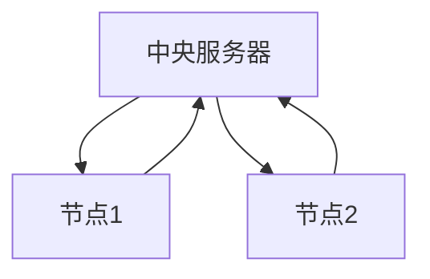
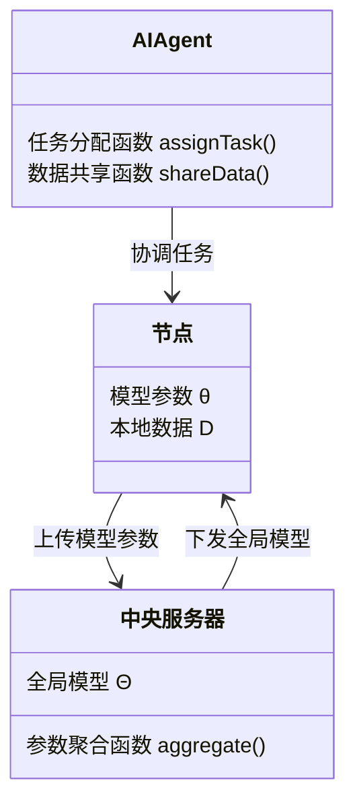
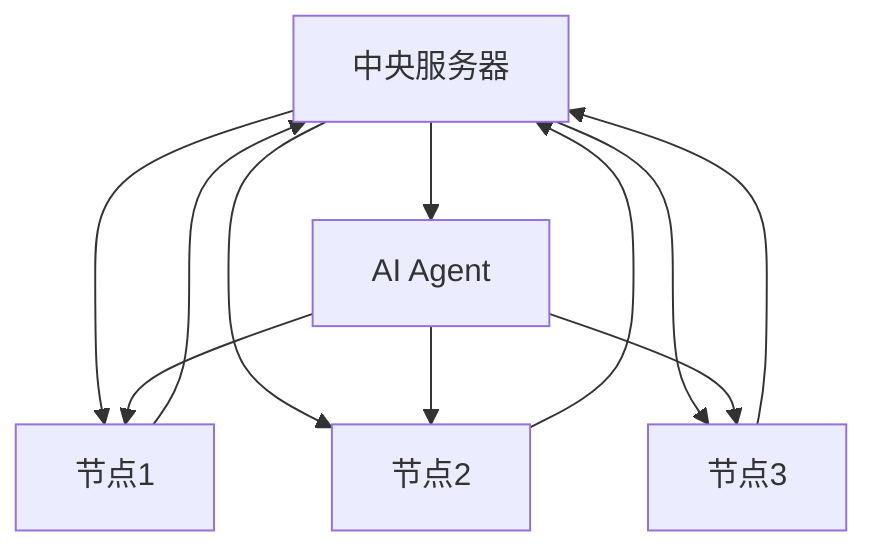
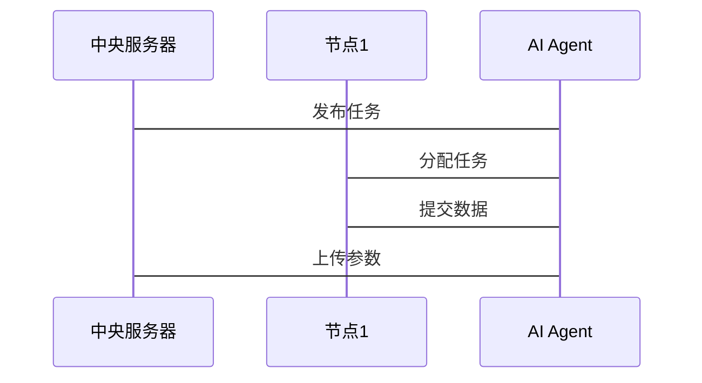
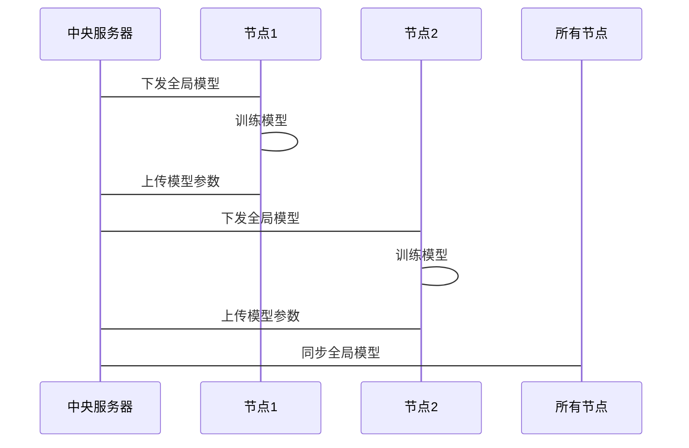

                 


# 企业AI Agent的联邦学习在跨部门数据协作中的实践与挑战

> 关键词：联邦学习，AI Agent，数据协作，跨部门，企业应用，算法优化，数据隐私

> 摘要：  
> 本文深入探讨了企业AI Agent在跨部门数据协作中的应用，结合联邦学习技术，分析其在实践中的优势与挑战。通过系统化的分析与案例研究，本文详细阐述了联邦学习的核心原理、AI Agent的协作机制，以及在实际场景中的实现方法。同时，本文还探讨了数据隐私保护、通信效率优化等关键问题，并展望了未来的发展方向。

---

## 第一部分: 背景与核心概念

### 第1章: 联邦学习与AI Agent概述

#### 1.1 联邦学习的背景与定义

##### 1.1.1 数据孤岛问题与跨部门协作需求
现代企业中，数据通常分散在不同的部门或系统中，形成了数据孤岛。跨部门协作需要整合这些分散的数据，以实现更高效的业务流程和决策。然而，数据孤岛的存在使得跨部门协作变得复杂，数据的共享和利用效率低下。

##### 1.1.2 联邦学习的定义与核心理念
联邦学习（Federated Learning）是一种分布式机器学习技术，旨在在不共享原始数据的情况下，通过在多个计算节点上联合训练模型，实现全局模型的优化。其核心理念是“数据不动，模型动”，即数据保留在本地，仅模型参数在节点之间传输。

##### 1.1.3 AI Agent在企业协作中的角色
AI Agent（人工智能代理）是一种能够感知环境、自主决策并执行任务的智能体。在企业协作中，AI Agent可以作为跨部门协作的桥梁，负责数据的收集、处理、分析和共享，同时确保数据安全和隐私保护。

#### 1.2 AI Agent的定义与功能

##### 1.2.1 AI Agent的基本概念
AI Agent是一种能够执行特定任务的智能体，通常具备感知环境、自主决策和执行操作的能力。在企业协作中，AI Agent可以用于数据处理、任务分配、信息共享和决策支持。

##### 1.2.2 AI Agent的核心功能与特点
- **数据处理**：AI Agent能够对分散在不同部门的数据进行预处理和整合。
- **任务分配**：AI Agent可以根据任务需求，将任务分配给不同的部门或系统。
- **信息共享**：AI Agent能够协调不同部门之间的信息共享，确保数据的一致性和准确性。
- **决策支持**：AI Agent可以基于数据和模型，提供决策支持和建议。

##### 1.2.3 AI Agent与传统协作工具的区别
与传统的协作工具相比，AI Agent具有更强的自主性和智能性，能够主动感知环境并做出决策，而不仅仅是被动地执行任务或提供支持。

#### 1.3 联邦学习与AI Agent的结合

##### 1.3.1 联邦学习在企业协作中的优势
联邦学习通过在分布式节点上联合训练模型，避免了数据的集中共享，保护了数据隐私。同时，联邦学习可以利用各节点的数据多样性，提高模型的泛化能力。

##### 1.3.2 AI Agent在联邦学习中的作用
AI Agent在联邦学习中扮演着协调者的角色，负责任务分配、数据预处理、模型训练和参数同步等关键环节。

##### 1.3.3 联邦学习与AI Agent的协同机制
通过AI Agent的协调，联邦学习可以在分布式环境中高效地进行模型训练和更新，同时确保数据的安全性和隐私性。

---

### 第2章: 联邦学习的核心概念与原理

#### 2.1 联邦学习的基本原理

##### 2.1.1 数据联邦化的基本概念
数据联邦化是联邦学习的核心思想，即通过分布式计算和通信，将分散在不同节点的数据联合起来，形成一个全局模型。

##### 2.1.2 联邦学习的通信机制
联邦学习通过通信协议，将各节点的模型参数同步到中央服务器，实现全局模型的优化。常见的通信机制包括同步联邦学习和异步联邦学习。

##### 2.1.3 联邦学习的模型更新与同步
在联邦学习中，每个节点根据本地数据训练模型，并将模型参数上传到中央服务器。中央服务器对各节点的参数进行聚合，生成全局模型，并将更新后的参数分发给各节点。

#### 2.2 AI Agent的协作机制

##### 2.2.1 AI Agent的任务分配与协同决策
AI Agent可以根据任务需求，将协作任务分配给不同的部门或系统，并协调各节点的行动，确保任务的高效完成。

##### 2.2.2 AI Agent的决策与执行流程
AI Agent通过感知环境和分析数据，做出决策并执行任务。在联邦学习中，AI Agent负责协调模型训练和参数同步的过程。

##### 2.2.3 AI Agent的通信协议与数据共享
AI Agent通过预定义的通信协议，协调各节点之间的数据共享和模型训练，确保数据的安全性和隐私性。

#### 2.3 联邦学习与AI Agent的数学模型

##### 2.3.1 联邦学习的数学模型
在联邦学习中，每个节点的模型更新可以通过以下公式表示：
$$
\theta_{i}^{new} = \theta_{i} + \eta \cdot (梯度下降)
$$
其中，$\theta_{i}$ 表示第 $i$ 个节点的模型参数，$\eta$ 是学习率。

##### 2.3.2 AI Agent的协作模型
AI Agent的协作模型可以表示为：
$$
任务分配 = \text{AI Agent}.assignTask(任务需求)
$$
其中，$assignTask$ 是AI Agent的任务分配函数。

##### 2.3.3 联邦学习与AI Agent的联合优化模型
通过结合联邦学习和AI Agent，可以实现全局模型的优化：
$$
全局模型 = \text{AI Agent}.aggregate(各节点模型参数)
$$
其中，$aggregate$ 是AI Agent的参数聚合函数。

---

## 第二部分: 算法原理与实现

### 第3章: 联邦学习的算法原理

#### 3.1 联邦学习的核心算法

##### 3.1.1 联邦平均算法（FedAvg）
联邦平均算法是一种常用的联邦学习算法，其核心思想是通过各节点的模型参数更新，计算全局模型的平均值。其算法流程如下：



##### 3.1.2 联邦聚合算法（FedAggregation）
联邦聚合算法通过将各节点的模型参数聚合到中央服务器，生成全局模型。其算法流程如下：


##### 3.1.3 联邦分割算法（FedSplit）
联邦分割算法通过将全局模型分割成多个部分，分配给不同的节点进行本地训练。其算法流程如下：


#### 3.2 联邦学习的数学模型

##### 3.2.1 联邦平均算法的数学推导
假设各节点的模型参数为 $\theta_i$，全局模型的参数更新为：
$$
\theta_{global} = \frac{1}{n} \sum_{i=1}^{n} \theta_i
$$
其中，$n$ 是节点的数量。

##### 3.2.2 联邦聚合算法的数学公式
$$
\theta_{global} = \sum_{i=1}^{n} \alpha_i \theta_i
$$
其中，$\alpha_i$ 是节点 $i$ 的权重。

##### 3.2.3 联邦分割算法的数学模型
$$
\theta_i = \text{split}(\theta_{global}, i)
$$
其中，$split$ 是模型参数的分割函数。

#### 3.3 联邦学习的实现流程

##### 3.3.1 数据预处理与模型初始化
数据预处理包括数据清洗、特征提取和数据标准化。模型初始化包括设置初始参数和优化器。

##### 3.3.2 模型训练与参数更新
各节点根据本地数据训练模型，并更新模型参数。

##### 3.3.3 参数聚合与模型优化
中央服务器对各节点的模型参数进行聚合，生成全局模型，并将更新后的参数分发给各节点。

### 第4章: AI Agent的协作算法

#### 4.1 AI Agent的协作机制

##### 4.1.1 任务分配与协同决策
AI Agent根据任务需求，将协作任务分配给不同的部门或系统，并协调各节点的行动。

##### 4.1.2 信息共享与数据同步
AI Agent通过预定义的通信协议，协调各节点之间的数据共享和模型训练。

##### 4.1.3 协作过程中的冲突解决
在协作过程中，可能会出现任务冲突或数据不一致的情况。AI Agent需要通过协商和调整，解决冲突，确保协作的顺利进行。

#### 4.2 AI Agent的数学模型

##### 4.2.1 协作任务分配模型
$$
任务分配 = \text{AI Agent}.assignTask(任务需求)
$$
其中，$assignTask$ 是AI Agent的任务分配函数。

##### 4.2.2 信息共享模型
$$
信息共享 = \text{AI Agent}.shareData(数据)
$$
其中，$shareData$ 是AI Agent的数据共享函数。

##### 4.2.3 冲突解决模型
$$
冲突解决 = \text{AI Agent}.resolveConflict(冲突)
$$
其中，$resolveConflict$ 是AI Agent的冲突解决函数。

#### 4.3 AI Agent的实现流程

##### 4.3.1 任务需求分析与分解
AI Agent首先分析任务需求，将其分解为多个子任务，并分配给不同的部门或系统。

##### 4.3.2 信息共享与数据同步
AI Agent协调各节点之间的数据共享和同步，确保数据的一致性和准确性。

##### 4.3.3 冲突检测与解决
在协作过程中，AI Agent实时检测冲突，并通过协商和调整，解决冲突，确保协作的顺利进行。

---

## 第三部分: 系统分析与架构设计

### 第5章: 系统分析与架构设计

#### 5.1 问题场景介绍
在企业跨部门数据协作中，数据孤岛和隐私保护是两个主要问题。联邦学习和AI Agent可以通过分布式计算和智能协作，解决这些问题。

#### 5.2 系统功能设计

##### 5.2.1 领域模型（领域类图）
以下是领域模型的类图：



#### 5.3 系统架构设计

##### 5.3.1 系统架构图
以下是系统架构图：



#### 5.4 系统接口设计
系统接口包括：
- 节点与中央服务器之间的参数上传和下载接口。
- AI Agent与节点之间的任务分配和数据共享接口。

#### 5.5 系统交互设计

##### 5.5.1 任务分配与数据预处理


##### 5.5.2 模型训练与参数同步


---

## 第四部分: 项目实战

### 第6章: 项目实战

#### 6.1 环境安装

##### 6.1.1 软件环境
- Python 3.8+
- TensorFlow 2.0+
- Federated Learning库（例如，TensorFlow Federated）

##### 6.1.2 依赖安装
```bash
pip install numpy pandas tensorflow matplotlib
```

#### 6.2 核心代码实现

##### 6.2.1 联邦学习实现

```python
import tensorflow as tf
from tensorflow_federated import ClientReplaceableModel, FederatedAggregator

class MyModel(ClientReplaceableModel):
    def __init__(self):
        super(MyModel, self).__init__()
        self.weights = tf.Variable(initial_value=[1.0, 2.0], trainable=True)
        
    def forward_pass(self, x, y):
        y_pred = self.weights[0] * x + self.weights[1]
        loss = tf.reduce_mean(tf.square(y - y_pred))
        return loss, y_pred
        
    def get_weights(self):
        return self.weights
        
    def set_weights(self, weights):
        self.weights = weights

aggregator = FederatedAggregator()
model = MyModel()
aggregator.compile(model, optimizer='sgd', learning_rate=0.1)
```

##### 6.2.2 AI Agent实现

```python
class AI_Agent:
    def __init__(self):
        self.nodes = []
        
    def assign_task(self, task):
        for node in self.nodes:
            node.receive_task(task)
            
    def share_data(self, data):
        for node in self.nodes:
            node.receive_data(data)
```

#### 6.3 代码应用解读与分析
上述代码展示了如何在Python中实现联邦学习和AI Agent。MyModel类定义了一个简单的线性回归模型，AI_Agent类负责任务分配和数据共享。

#### 6.4 实际案例分析
以一个简单的回归任务为例，假设我们有三个节点，每个节点有本地数据。AI Agent将任务分配给各节点，各节点进行本地训练，然后将模型参数上传到中央服务器。中央服务器对各节点的参数进行聚合，生成全局模型。

#### 6.5 项目小结
通过上述实现，我们可以看到联邦学习和AI Agent在跨部门数据协作中的潜力。然而，实际应用中还需要考虑数据隐私、通信效率和模型性能优化等问题。

---

## 第五部分: 总结与展望

### 第7章: 总结与展望

#### 7.1 核心内容回顾
本文深入探讨了企业AI Agent在跨部门数据协作中的应用，结合联邦学习技术，分析了其在实践中的优势与挑战。通过系统化的分析与案例研究，本文详细阐述了联邦学习的核心原理、AI Agent的协作机制，以及在实际场景中的实现方法。

#### 7.2 未来发展方向

##### 7.2.1 数据隐私保护
未来，可以通过同态加密、安全多方计算等技术，进一步增强数据隐私保护。

##### 7.2.2 通信效率优化
可以通过优化通信协议和减少数据传输量，提高联邦学习的通信效率。

##### 7.2.3 模型性能优化
可以通过引入更先进的优化算法和模型架构，提高联邦学习的模型性能。

#### 7.3 最佳实践 Tips

##### 7.3.1 数据预处理
在实际应用中，应充分进行数据预处理，确保数据的质量和一致性。

##### 7.3.2 模型选择
选择适合实际场景的模型和算法，避免过度复杂的模型。

##### 7.3.3 通信优化
通过优化通信协议和减少数据传输量，提高通信效率。

##### 7.3.4 数据隐私保护
在实际应用中，应充分考虑数据隐私保护，采用合适的技术手段。

#### 7.4 作者总结
企业AI Agent的联邦学习在跨部门数据协作中的应用具有广阔的发展前景。通过不断的技术创新和实践积累，我们可以进一步完善联邦学习和AI Agent的协同机制，推动企业数据协作的智能化和高效化。

---

## 作者：AI天才研究院/AI Genius Institute & 禅与计算机程序设计艺术 /Zen And The Art of Computer Programming

