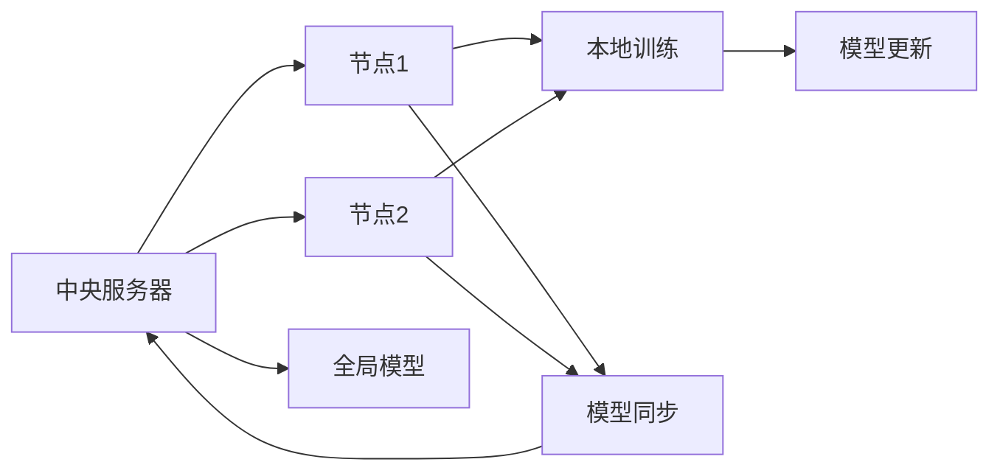
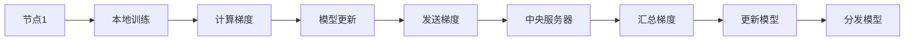

                 


# 企业AI Agent的联邦学习平台设计

> 关键词：联邦学习，AI Agent，数据隐私，分布式系统，企业应用

> 摘要：本文详细探讨了企业AI Agent的联邦学习平台设计，从背景、核心概念、算法原理到系统架构和实战案例，全面解析了如何构建高效、安全的AI Agent协作平台。

---

## 第一章：背景与概述

### 1.1 问题背景

随着企业智能化转型的推进，AI Agent在企业中的应用越来越广泛。AI Agent是一种能够自主决策、执行任务的智能体，能够帮助企业实现自动化操作和高效决策。然而，企业在实际应用中面临数据孤岛、隐私泄露等问题，传统的集中式学习无法满足企业对数据安全和隐私保护的需求。

### 1.2 联邦学习与AI Agent的关系

联邦学习是一种分布式机器学习技术，允许多个参与方在不共享原始数据的情况下共同训练模型。AI Agent作为企业中的智能实体，可以通过联邦学习实现跨组织、跨系统的协作与学习。这种结合能够解决数据隐私问题，同时提升AI Agent的智能化水平。

### 1.3 企业AI Agent的联邦学习平台的必要性

企业AI Agent需要在不共享敏感数据的前提下，实现跨组织的学习与协作。联邦学习平台提供了这种能力，使得企业能够构建高效、安全的AI Agent协作网络。

---

## 第二章：联邦学习的核心原理

### 2.1 联邦学习的基本原理

联邦学习通过在多个分布式节点上进行模型训练，将各节点的梯度更新汇总到中央服务器，最终得到一个全局模型。这种机制避免了数据的直接共享，同时保证了模型的准确性和一致性。

#### 联邦学习的通信机制

在联邦学习中，每个节点（Federated Node）负责本地数据的训练，并将梯度更新发送给中央服务器。服务器将所有节点的梯度更新进行汇总，更新全局模型，并将新模型分发给各个节点。

##### 通信流程

1. **初始化**：服务器将初始模型分发给所有节点。
2. **本地训练**：每个节点使用本地数据训练模型，并计算梯度更新。
3. **模型同步**：节点将梯度更新发送给服务器。
4. **模型更新**：服务器汇总所有节点的梯度更新，更新全局模型。
5. **模型分发**：服务器将新模型分发给所有节点。

#### 联邦学习的同步策略

联邦学习的同步策略决定了模型更新的频率和方式。常见的策略包括：

- **周期性同步**：定期将模型更新发送给服务器。
- **实时同步**：每个训练步骤后立即同步模型。
- **分阶段同步**：将训练过程分为多个阶段，每个阶段同步一次。

### 2.2 联邦学习的关键技术

#### 数据加密与隐私保护

联邦学习的核心目标之一是保护数据隐私。通过加密技术（如同态加密、差分隐私）可以确保在模型训练过程中，数据不会被泄露。

#### 模型更新算法

联邦学习的模型更新算法是其核心之一。常见的算法包括：

- **FedAvg（联邦平均）**：将各节点的梯度更新按权重平均。
- **FedProx（联邦正则化）**：在FedAvg的基础上增加正则化项，防止模型过拟合。
- **FedSGD（联邦随机梯度下降）**：基于随机梯度下降的联邦学习算法。

#### 性能优化

为了提高联邦学习的效率，可以采用以下优化策略：

- **局部模型压缩**：减少节点上传的梯度更新数据量。
- **动态节点选择**：根据节点的计算能力和网络状况动态选择参与训练的节点。
- **异步更新**：允许节点在不同步的情况下进行模型更新。

### 2.3 联邦学习的数学模型

#### 优化目标

联邦学习的目标是最小化全局损失函数：

$$ L_{\text{total}} = \sum_{i=1}^{n} L_i(\theta) $$

其中，$L_i$ 是第$i$个节点的损失函数，$\theta$ 是模型参数。

#### 同步算法

在FedAvg算法中，模型更新的公式为：

$$ \theta_{\text{new}} = \frac{1}{n} \sum_{i=1}^{n} \theta_i $$

其中，$\theta_i$ 是第$i$个节点的模型参数。

#### 收敛性分析

联邦学习的收敛性取决于多个因素，包括节点的数量、数据分布、通信频率等。通常，联邦学习能够收敛到一个全局最优或近似最优的解。

---

## 第三章：企业AI Agent的联邦学习平台设计

### 3.1 系统功能设计

#### 数据采集与预处理

- 数据采集：从各个节点获取数据，包括文本、图像、结构化数据等。
- 数据清洗：去除噪声数据，确保数据质量。
- 数据标注：对数据进行标注，便于模型训练。

#### 模型训练与更新

- 模型训练：在每个节点上进行本地训练，计算梯度更新。
- 模型同步：节点将梯度更新发送给服务器，服务器汇总并更新全局模型。
- 模型部署：将更新后的模型部署到各个节点，供AI Agent使用。

#### 模型部署与应用

- 模型部署：将全局模型分发给各个节点，供AI Agent使用。
- 模型监控：实时监控模型的运行状态，发现异常及时处理。
- 模型迭代：根据反馈不断优化模型，提升性能。

### 3.2 系统架构设计

#### 分层架构设计

- **应用层**：提供API接口，供AI Agent调用模型。
- **服务层**：负责模型的训练、同步和管理。
- **数据层**：存储各个节点的数据，确保数据安全。

#### 节点间通信机制

- **点对点通信**：节点之间直接进行数据传输。
- **服务器-节点通信**：通过中央服务器进行数据传输和模型同步。

#### 数据隐私保护机制

- **加密传输**：数据在传输过程中进行加密，防止被窃听。
- **数据脱敏**：对敏感数据进行脱敏处理，确保数据安全。

### 3.3 系统接口设计

#### 联邦学习节点接口

- **数据接口**：节点之间的数据交互接口。
- **模型接口**：节点之间的模型同步接口。

#### 模型管理接口

- **模型上传接口**：节点上传本地模型参数。
- **模型下载接口**：节点下载全局模型参数。

#### 数据安全接口

- **加密接口**：对数据进行加密处理。
- **解密接口**：对数据进行解密处理。

### 3.4 系统交互流程

#### 联邦学习流程图



#### 模型更新流程图



---

## 第四章：项目实战与案例分析

### 4.1 环境搭建与配置

#### 开发环境安装

- 安装Python 3.8及以上版本。
- 安装必要的依赖库：`numpy`, `tensorflow`, `flaml`。

#### 依赖库安装

```bash
pip install numpy tensorflow flaml
```

#### 网络配置与测试

- 确保各个节点之间网络连通。
- 配置防火墙，确保通信端口开放。

### 4.2 核心代码实现

#### 数据预处理代码

```python
import numpy as np

# 生成数据
def generate_data(n):
    X = np.random.rand(n, 2)
    y = np.random.randint(2, size=n)
    return X, y

# 数据预处理
def preprocess(X, y):
    # 标准化数据
    X = (X - np.mean(X, axis=0)) / np.std(X, axis=0)
    return X, y
```

#### 模型训练代码

```python
import tensorflow as tf
from tensorflow.keras import layers

# 模型定义
def create_model(input_dim):
    model = tf.keras.Sequential([
        layers.Dense(64, activation='relu', input_dim=input_dim),
        layers.Dense(1, activation='sigmoid')
    ])
    model.compile(optimizer='adam', loss='binary_crossentropy', metrics=['accuracy'])
    return model
```

#### 联邦学习通信代码

```python
from flaml import FedLearner

# 初始化联邦学习平台
fl = FedLearner(
    client_model='logistic_regression',
    server_model='logistic_regression',
    num_clients=2,
    client_optimizer='sgd',
    server_optimizer='sgd'
)

# 启动训练
fl.fit(X_train, y_train, batch_size=10, epochs=5)
```

### 4.3 代码解读与分析

#### 数据预处理代码解读

- 生成数据：通过`numpy`生成训练数据，包括特征矩阵`X`和标签向量`y`。
- 数据标准化：对数据进行标准化处理，使其具有零均值和单位方差。

#### 模型训练代码解读

- 模型定义：使用`TensorFlow`框架定义一个简单的神经网络模型，包含一个隐藏层和一个输出层。
- 模型编译：使用Adam优化器，二元交叉熵损失函数，监控准确率。

#### 联邦学习通信代码解读

- 初始化联邦学习平台：使用`flaml`库中的`FedLearner`类，指定客户端模型和服务器模型。
- 启动训练：在客户端和服务器之间进行模型训练和同步。

### 4.4 案例分析

假设我们有一个简单的二分类问题，目标是通过联邦学习训练一个逻辑回归模型。每个节点都有部分数据，通过联邦学习平台进行模型训练。

#### 训练流程

1. **数据生成**：生成训练数据，包括特征矩阵`X`和标签向量`y`。
2. **数据预处理**：对数据进行标准化处理。
3. **模型训练**：通过联邦学习平台进行模型训练，客户端和服务器之间进行数据通信和模型同步。
4. **模型评估**：评估模型的准确率和召回率。

#### 代码实现

```python
# 数据生成
X_train, y_train = generate_data(100)
X_test, y_test = generate_data(20)

# 数据预处理
X_train, y_train = preprocess(X_train, y_train)
X_test, y_test = preprocess(X_test, y_test)

# 模型训练
fl.fit(X_train, y_train, batch_size=10, epochs=5)

# 模型评估
loss, accuracy = fl.evaluate(X_test, y_test)
print(f"Loss: {loss}, Accuracy: {accuracy}")
```

---

## 第五章：总结与展望

### 5.1 最佳实践

- **数据隐私保护**：采用同态加密、差分隐私等技术，确保数据安全。
- **模型优化**：通过模型压缩、剪枝等技术，提升模型性能。
- **通信效率**：优化通信协议，减少数据传输量。

### 5.2 小结

企业AI Agent的联邦学习平台设计是一个复杂但重要的任务。通过联邦学习，企业可以在保护数据隐私的前提下，实现AI Agent的协作与学习。本文详细介绍了联邦学习的核心原理、系统架构和实战案例，为企业的实际应用提供了参考。

### 5.3 注意事项

- **数据安全**：在设计联邦学习平台时，必须高度重视数据安全，确保数据不会被泄露。
- **性能优化**：联邦学习的性能依赖于节点的计算能力和网络条件，需要进行优化。
- **法律合规**：确保联邦学习平台的设计和应用符合相关法律法规，特别是数据隐私保护方面的规定。

### 5.4 拓展阅读

- [《联邦学习：隐私保护下的分布式机器学习》](#)
- [《AI Agent：企业智能化转型的利器》](#)
- [《分布式系统设计与实现》](#)

---

## 作者

作者：AI天才研究院/AI Genius Institute & 禅与计算机程序设计艺术 /Zen And The Art of Computer Programming

---

这篇文章详细介绍了企业AI Agent的联邦学习平台设计，从背景、核心概念、算法原理到系统架构和实战案例，为企业的实际应用提供了全面的参考。希望本文能够为读者提供有价值的见解和启发。

