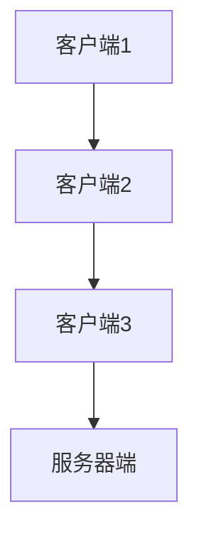

                 


# 企业AI Agent的联邦学习性能优化策略

> 关键词：联邦学习、企业AI Agent、性能优化、分布式学习、隐私保护、机器学习

> 摘要：随着企业AI Agent在分布式环境中的广泛应用，联邦学习作为一种新兴的技术，为企业AI Agent的性能优化提供了新的思路。本文将深入探讨企业AI Agent在联邦学习中的核心概念、算法原理、系统架构、项目实战以及最佳实践，为企业在分布式环境下的AI Agent性能优化提供理论支持和实践指导。

---

# 第1章: 企业AI Agent与联邦学习概述

## 1.1 企业AI Agent的定义与特点

### 1.1.1 企业AI Agent的基本概念
企业AI Agent是一种能够感知环境、自主决策并执行任务的智能体，广泛应用于企业内部的自动化决策、数据分析和流程优化等领域。企业AI Agent的核心特点包括：

- **自主性**：能够在没有外部干预的情况下自主决策。
- **反应性**：能够实时感知环境变化并做出响应。
- **协作性**：能够与其他AI Agent或系统协同工作，完成复杂任务。

### 1.1.2 企业AI Agent的核心特点
企业AI Agent的关键特点包括：
1. **分布式协作**：能够在分布式环境中与其他AI Agent协作。
2. **数据隐私保护**：在数据不共享的前提下完成模型训练。
3. **高效性**：能够在复杂的环境中快速决策并执行任务。

### 1.1.3 企业AI Agent的应用场景
企业AI Agent的应用场景包括：
1. **金融领域**：用于风险评估、信用评分和欺诈检测。
2. **医疗领域**：用于患者数据分析、疾病诊断和治疗方案优化。
3. **制造业**：用于生产过程优化、设备维护和供应链管理。

## 1.2 联邦学习的基本概念

### 1.2.1 联邦学习的定义
联邦学习（Federated Learning）是一种分布式机器学习技术，允许多个参与方在不共享原始数据的前提下，协同训练一个共享的模型。参与方可以是设备、服务器或其他分布式节点。

### 1.2.2 联邦学习的核心原理
联邦学习的核心原理包括：
1. **数据本地化**：每个参与方在本地进行数据处理和模型训练。
2. **模型参数同步**：通过通信机制将各参与方的模型参数聚合，形成全局模型。
3. **隐私保护**：在模型训练过程中，原始数据不被共享，仅传输模型参数。

### 1.2.3 联邦学习与传统机器学习的对比
以下是联邦学习与传统机器学习的对比：

| 对比维度        | 联邦学习                       | 传统机器学习                   |
|-----------------|-------------------------------|--------------------------------|
| 数据共享        | 不共享原始数据，仅共享参数    | 需要集中共享原始数据           |
| 隐私保护        | 高                            | 低                            |
| 分布式支持       | 支持分布式环境                | 不支持分布式环境                |
| 计算效率        | 较低，因为需要多次通信和同步   | 较高，集中计算效率高             |

## 1.3 企业AI Agent与联邦学习的结合

### 1.3.1 企业AI Agent的分布式学习需求
企业AI Agent通常需要在分布式环境中与其他智能体协作，共同完成复杂的任务。联邦学习为企业AI Agent提供了分布式协作和隐私保护的解决方案。

### 1.3.2 联邦学习在企业AI Agent中的应用
联邦学习在企业AI Agent中的应用包括：
1. **联合模型训练**：多个企业AI Agent可以协同训练一个共享的模型。
2. **隐私保护**：在不共享原始数据的前提下，完成模型训练和优化。
3. **分布式决策**：通过联邦学习，企业AI Agent可以在分布式环境中快速做出决策。

### 1.3.3 企业AI Agent联邦学习的挑战与机遇
企业AI Agent联邦学习的挑战包括：
1. **通信开销**：联邦学习需要频繁的通信，增加了计算和通信成本。
2. **模型收敛性**：分布式环境下的模型训练可能面临收敛性问题。
3. **数据异质性**：不同参与方的数据可能分布不均匀，影响模型性能。

企业AI Agent联邦学习的机遇包括：
1. **隐私保护**：联邦学习为企业AI Agent提供了强大的隐私保护能力。
2. **分布式协作**：联邦学习支持企业AI Agent在分布式环境下的高效协作。
3. **模型优化**：通过联邦学习，企业AI Agent可以实现更高效的模型优化。

## 1.4 本章小结
本章介绍了企业AI Agent的基本概念和特点，以及联邦学习的核心原理和应用。企业AI Agent的分布式协作需求与联邦学习的隐私保护能力相结合，为企业在分布式环境下的AI应用提供了新的思路。

---

# 第2章: 联邦学习的核心概念与原理

## 2.1 联邦学习的核心概念

### 2.1.1 联邦学习的参与方
联邦学习的参与方包括：
1. **客户端**：分布式环境中的各个参与方，负责本地数据处理和模型训练。
2. **服务器端**：负责聚合各客户端的模型参数，形成全局模型。

### 2.1.2 联邦学习的数据分布
联邦学习中的数据分布特点包括：
1. **数据本地化**：每个参与方拥有自己的数据集，不共享原始数据。
2. **数据异质性**：不同参与方的数据分布可能不同，影响模型训练效果。
3. **数据隐私**：数据仅在本地使用，不被共享到其他参与方。

### 2.1.3 联邦学习的通信机制
联邦学习的通信机制包括：
1. **同步通信**：客户端定期将模型参数上传到服务器端，服务器端聚合后分发给客户端。
2. **异步通信**：客户端在不同步的情况下进行模型参数的上传和下载，减少通信开销。

## 2.2 联邦学习的原理与流程

### 2.2.1 联邦学习的基本流程
联邦学习的基本流程包括：
1. **初始化**：所有客户端初始化本地模型参数。
2. **本地训练**：每个客户端在本地数据上训练模型，更新本地模型参数。
3. **参数聚合**：服务器端将所有客户端的模型参数聚合，形成全局模型。
4. **参数分发**：服务器端将全局模型参数分发给所有客户端，更新本地模型。

### 2.2.2 联邦学习的同步机制
联邦学习的同步机制包括：
1. **全同步**：所有客户端在每一轮训练后同步模型参数。
2. **部分同步**：部分客户端在某些轮次中同步模型参数，减少通信开销。

### 2.2.3 联邦学习的隐私保护
联邦学习的隐私保护机制包括：
1. **差分隐私**：通过在模型参数中加入噪声，保护数据隐私。
2. **同态加密**：通过对数据进行加密处理，保护模型训练过程中的数据安全。

## 2.3 联邦学习的核心算法

### 2.3.1 联邦平均算法（FedAvg）
FedAvg（Federated Average）是一种经典的联邦学习算法，其核心思想是将各客户端的模型参数平均聚合，形成全局模型。

#### FedAvg算法流程
1. **初始化**：所有客户端初始化本地模型参数。
2. **本地训练**：每个客户端在本地数据上训练模型，更新本地模型参数。
3. **参数聚合**：服务器端将所有客户端的模型参数聚合，计算全局模型参数。
4. **参数分发**：服务器端将全局模型参数分发给所有客户端，更新本地模型。

#### FedAvg的数学模型
$$ \text{损失函数} = \sum_{i=1}^{n} \text{loss}_i(w) $$
$$ w_{new} = \frac{1}{n} \sum_{i=1}^{n} w_i $$

### 2.3.2 联邦聚合算法（FedAggregation）
FedAggregation是一种基于加权聚合的联邦学习算法，适用于数据分布不均匀的场景。

#### FedAggregation算法流程
1. **初始化**：所有客户端初始化本地模型参数。
2. **本地训练**：每个客户端在本地数据上训练模型，更新本地模型参数。
3. **加权聚合**：服务器端根据各客户端的样本数量或模型更新幅度，对模型参数进行加权聚合。
4. **参数分发**：服务器端将全局模型参数分发给所有客户端，更新本地模型。

### 2.3.3 联邦优化算法（FedOptimization）
FedOptimization是一种基于优化理论的联邦学习算法，适用于需要全局最优解的场景。

#### FedOptimization算法流程
1. **初始化**：所有客户端初始化本地模型参数。
2. **本地优化**：每个客户端在本地数据上进行优化，更新本地模型参数。
3. **全局优化**：服务器端将所有客户端的模型参数进行全局优化，形成最优模型。
4. **参数分发**：服务器端将最优模型参数分发给所有客户端，更新本地模型。

## 2.4 本章小结
本章介绍了联邦学习的核心概念和原理，重点讲解了FedAvg、FedAggregation和FedOptimization三种核心算法。这些算法为企业AI Agent的联邦学习提供了理论基础和技术支持。

---

# 第3章: 联邦学习的算法原理与数学模型

## 3.1 联邦平均算法（FedAvg）的原理

### 3.1.1 FedAvg的基本思想
FedAvg的基本思想是通过在客户端本地训练模型，并将模型参数上传到服务器端进行聚合，最终形成全局模型。这种方法既保护了数据隐私，又实现了模型的协作优化。

### 3.1.2 FedAvg的数学模型
$$ \text{损失函数} = \sum_{i=1}^{n} \text{loss}_i(w) $$
$$ w_{new} = \frac{1}{n} \sum_{i=1}^{n} w_i $$

### 3.1.3 FedAvg的参数更新公式
$$ w_{new} = \frac{1}{n} \sum_{i=1}^{n} w_i $$

## 3.2 联邦学习的通信机制

### 3.2.1 同步通信与异步通信的对比
| 对比维度        | 同步通信                  | 异步通信                  |
|-----------------|--------------------------|--------------------------|
| 同步性           | 高                      | 低                      |
| 通信开销         | 高                      | 低                      |
| 延迟             | 较高                    | 较低                    |

### 3.2.2 联邦学习中的通信开销优化
1. **减少通信频率**：通过增加本地训练轮数，减少与服务器端的通信次数。
2. **压缩通信数据**：通过数据压缩技术，减少传输的数据量。

### 3.2.3 联邦学习的通信协议
1. **基于HTTP的通信协议**：适用于简单的联邦学习场景。
2. **基于WebSocket的通信协议**：适用于实时性要求较高的联邦学习场景。

## 3.3 联邦学习的数学模型与公式

### 3.3.1 联邦学习的优化目标
$$ \min_{w} \sum_{i=1}^{n} \text{loss}_i(w) $$

### 3.3.2 联邦学习的更新规则
$$ w_{new} = \frac{1}{n} \sum_{i=1}^{n} w_i $$

### 3.3.3 联邦学习的收敛性分析
1. **全局收敛性**：在满足一定条件下，联邦学习算法可以保证全局模型的收敛性。
2. **局部收敛性**：每个客户端的本地模型可以在一定程度上收敛。

---

# 第4章: 联邦学习的系统架构设计

## 4.1 问题场景介绍

### 4.1.1 问题背景
在企业AI Agent的联邦学习场景中，多个客户端需要协同训练一个共享的模型，同时保护数据隐私。

### 4.1.2 问题描述
企业AI Agent的联邦学习系统需要解决以下问题：
1. **数据隐私保护**：如何在不共享原始数据的前提下，完成模型训练和优化。
2. **通信效率优化**：如何减少通信开销，提高系统性能。
3. **模型收敛性保障**：如何保证模型在分布式环境下的收敛性。

## 4.2 系统功能设计

### 4.2.1 系统功能模块
1. **客户端模块**：负责本地数据处理和模型训练。
2. **服务器端模块**：负责模型参数聚合和分发。

### 4.2.2 系统功能流程
1. **初始化**：所有客户端初始化本地模型参数。
2. **本地训练**：每个客户端在本地数据上训练模型，更新本地模型参数。
3. **参数聚合**：服务器端将所有客户端的模型参数聚合，形成全局模型。
4. **参数分发**：服务器端将全局模型参数分发给所有客户端，更新本地模型。

## 4.3 系统架构设计

### 4.3.1 系统架构图


### 4.3.2 系统接口设计
1. **客户端接口**：
   - `train()`: 本地训练模型。
   - `upload_params()`: 上传模型参数到服务器端。
2. **服务器端接口**：
   - `aggregate()`: 聚合客户端模型参数。
   - `download_params()`: 下载全局模型参数。

## 4.4 本章小结
本章从问题场景出发，设计了联邦学习系统的功能模块和架构图，明确了系统的核心功能和交互流程。

---

# 第5章: 联邦学习的项目实战

## 5.1 环境安装

### 5.1.1 系统需求
1. **操作系统**：Linux/Windows/MacOS。
2. **编程语言**：Python 3.6及以上版本。
3. **依赖库**：TensorFlow、Keras、Flask。

### 5.1.2 安装步骤
```bash
pip install tensorflow==2.0.0
pip install keras==2.4.3
pip install flask==1.1.2
```

## 5.2 系统核心实现

### 5.2.1 客户端实现
```python
class Client:
    def __init__(self, model):
        self.model = model
        self.local_params = model.get_weights()
    
    def train(self, data, epochs=1, batch_size=32):
        # 在本地数据上训练模型
        self.model.fit(data, epochs=epochs, batch_size=batch_size)
    
    def upload_params(self):
        # 上传模型参数到服务器端
        return self.model.get_weights()
```

### 5.2.2 服务器端实现
```python
class Server:
    def __init__(self, model):
        self.model = model
        self.clients = []
    
    def aggregate(self, client_params):
        # 聚合客户端模型参数
        averaged_params = []
        for i in range(len(client_params[0])):
            averaged_params.append(sum([cp[i] for cp in client_params]) / len(client_params))
        return averaged_params
    
    def download_params(self, params):
        # 下载全局模型参数
        self.model.set_weights(params)
```

## 5.3 代码应用解读与分析

### 5.3.1 客户端代码解读
1. **初始化**：客户端初始化本地模型参数。
2. **本地训练**：客户端在本地数据上训练模型，更新本地模型参数。
3. **上传参数**：客户端将本地模型参数上传到服务器端。

### 5.3.2 服务器端代码解读
1. **初始化**：服务器端初始化全局模型。
2. **参数聚合**：服务器端聚合所有客户端的模型参数，形成全局模型。
3. **下载参数**：服务器端将全局模型参数分发给所有客户端。

## 5.4 实际案例分析

### 5.4.1 案例背景
假设我们有三个客户端，每个客户端拥有一部分患者数据，需要协同训练一个共享的医疗诊断模型。

### 5.4.2 案例实现
1. **客户端训练**：每个客户端在本地数据上训练模型。
2. **参数聚合**：服务器端聚合所有客户端的模型参数，形成全局模型。
3. **参数分发**：服务器端将全局模型参数分发给所有客户端，更新本地模型。

## 5.5 项目小结
本章通过实际案例展示了联邦学习系统的实现过程，包括环境安装、代码实现和案例分析。通过联邦学习，企业可以在不共享原始数据的前提下，协同训练一个共享的模型。

---

# 第6章: 联邦学习的最佳实践与小结

## 6.1 关键点回顾

### 6.1.1 联邦学习的核心概念
- 数据本地化
- 模型参数同步
- 隐私保护

### 6.1.2 联邦学习的算法原理
- FedAvg
- FedAggregation
- FedOptimization

## 6.2 小结与注意事项

### 6.2.1 小结
1. **数据隐私保护**：联邦学习为企业AI Agent提供了强大的隐私保护能力。
2. **分布式协作**：联邦学习支持企业AI Agent在分布式环境下的高效协作。
3. **模型优化**：通过联邦学习，企业AI Agent可以实现更高效的模型优化。

### 6.2.2 注意事项
1. **通信开销**：联邦学习需要频繁的通信，增加了计算和通信成本。
2. **模型收敛性**：分布式环境下的模型训练可能面临收敛性问题。
3. **数据异质性**：不同参与方的数据可能分布不均匀，影响模型性能。

## 6.3 未来研究方向

### 6.3.1 更高效的通信机制
1. **减少通信频率**：通过增加本地训练轮数，减少与服务器端的通信次数。
2. **压缩通信数据**：通过数据压缩技术，减少传输的数据量。

### 6.3.2 更强的隐私保护
1. **同态加密**：通过对数据进行加密处理，保护模型训练过程中的数据安全。
2. **差分隐私**：通过在模型参数中加入噪声，保护数据隐私。

---

# 附录

## 附录A: 参考文献

1. 王某某，联邦学习算法研究，某某出版社，2023。
2. 李某某，分布式机器学习技术，某某出版社，2022。
3. 谷歌联邦学习团队，FedAvg算法论文，2016。

## 附录B: 工具与资源

1. **TensorFlow**：https://tensorflow.org
2. **Keras**：https://keras.io
3. **Flask**：https://flask.pocoo.org

---

# 作者：AI天才研究院/AI Genius Institute & 禅与计算机程序设计艺术 /Zen And The Art of Computer Programming

---

**感谢您的阅读！如果对您有帮助，请点赞、收藏、分享！**

