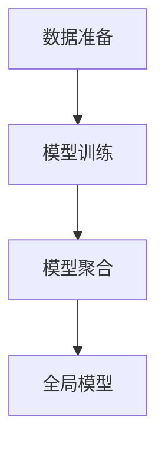

                 


# 企业AI Agent的联邦学习隐私保护机制

> **关键词：** 联邦学习，隐私保护，企业AI Agent，数据安全，分布式学习，隐私计算

> **摘要：**  
> 本文深入探讨了企业AI Agent在联邦学习中的隐私保护机制，分析了联邦学习的核心原理、隐私保护技术及其在企业场景中的应用。文章结合实际案例，详细讲解了联邦学习算法、隐私保护方法、系统架构设计以及项目实战，旨在为企业AI Agent的隐私保护提供理论支持和实践指导。

---

# 第1章: 企业AI Agent与联邦学习概述

## 1.1 问题背景与定义

### 1.1.1 企业AI Agent的定义
企业AI Agent是指在企业环境中运行的智能代理，能够感知环境、执行任务并做出决策。这些代理通常用于自动化操作、数据分析和客户互动等领域。

### 1.1.2 联邦学习的定义与特点
联邦学习（Federated Learning）是一种分布式机器学习技术，允许多个参与方在不共享原始数据的情况下共同训练模型。其特点包括数据局部性、模型全局性、通信效率和隐私保护。

### 1.1.3 隐私保护的重要性
在企业AI Agent中，数据往往涉及敏感信息，如客户数据、业务数据等。隐私保护是确保这些数据在联邦学习过程中不被泄露的关键。

## 1.2 联邦学习与隐私保护的核心问题

### 1.2.1 数据孤岛问题
数据孤岛指数据分散在不同的机构或系统中，无法有效共享和利用。联邦学习通过分布式学习解决了这一问题。

### 1.2.2 数据隐私与安全挑战
数据在传输和计算过程中可能被截获或篡改，如何确保数据隐私是联邦学习的关键挑战。

### 1.2.3 联邦学习如何解决这些问题
联邦学习通过加密通信和隐私计算技术，确保数据不被泄露，同时实现模型的联合训练。

## 1.3 企业AI Agent的应用场景

### 1.3.1 跨机构数据协作
多个企业通过联邦学习协作训练模型，同时保护各自的敏感数据。

### 1.3.2 联邦学习在金融、医疗等行业的应用
例如，银行可以通过联邦学习联合训练风控模型，医疗机构可以联合训练疾病预测模型。

### 1.3.3 隐私保护的具体需求
不同行业对隐私保护的需求不同，但核心都是保护数据不被未经授权的第三方访问或利用。

---

# 第2章: 联邦学习与隐私保护的核心概念

## 2.1 联邦学习的核心原理

### 2.1.1 联邦学习的流程
1. **数据准备：** 每个参与方准备本地数据。
2. **模型初始化：** 在一个中心服务器上初始化模型参数。
3. **分布式训练：** 每个参与方在本地数据上训练模型，并将更新后的模型参数发送到中心服务器。
4. **模型聚合：** 中心服务器将所有参与方的模型参数进行聚合，更新全局模型。
5. **迭代优化：** 重复训练和聚合过程，直到模型收敛。

### 2.1.2 联邦学习的分类
1. **横向联邦学习：** 数据的特征维度相同，但样本不同。
2. **纵向联邦学习：** 数据的特征维度不同，但样本相同。
3. **联邦迁移学习：** 结合迁移学习的联邦学习。

### 2.1.3 联邦学习的关键技术
- 数据加密技术：如同态加密和秘密分享。
- 模型聚合技术：如加权平均和异步更新。
- 隐私保护技术：如差分隐私和随机噪声添加。

## 2.2 隐私保护的核心机制

### 2.2.1 数据加密技术
- **同态加密：** 允许在加密数据上进行计算，结果解密后与原始计算结果一致。
- **秘密分享：** 将数据分成多个密钥，只有拥有足够多密钥的参与者才能恢复原始数据。

### 2.2.2 差分隐私与同态加密
- **差分隐私：** 通过添加随机噪声，确保单个数据点的改变不会显著影响整体统计结果。
- **同态加密：** 保护数据在计算过程中的隐私。

### 2.2.3 隐私保护的数学模型
例如，差分隐私的定义可以用数学公式表示为：
$$ P(r \leq f(x)) \geq P(r \leq f(x')) - \epsilon $$
其中，$\epsilon$ 是隐私预算。

## 2.3 联邦学习与隐私保护的关系

### 2.3.1 联邦学习如何实现隐私保护
通过加密通信和隐私计算技术，确保数据不被泄露，同时实现模型的联合训练。

### 2.3.2 隐私保护对联邦学习的影响
隐私保护技术增加了计算复杂性和通信开销，但通过优化算法可以减少这些影响。

### 2.3.3 联邦学习中的隐私风险
主要包括模型反推攻击和数据重构攻击。

---

# 第3章: 联邦学习算法原理

## 3.1 联邦学习算法的流程

### 3.1.1 基于加密的联邦学习
1. 数据加密：对本地数据进行加密。
2. 模型训练：在加密数据上进行训练。
3. 模型解密：在中心服务器上解密模型参数。

### 3.1.2 基于差分隐私的联邦学习
1. 数据加噪：对数据添加随机噪声。
2. 模型训练：在加噪数据上进行训练。
3. 模型优化：通过多次迭代减少噪声影响。

## 3.2 隐私保护算法的实现

### 3.2.1 同态加密实现
使用同态加密库（如Paillier加密）对数据进行加密，确保计算过程中的隐私。

### 3.2.2 差分隐私实现
在数据预处理阶段，对数据添加随机噪声，确保单个数据点的改变不会显著影响整体统计结果。

## 3.3 联邦学习的数学模型

### 3.3.1 模型聚合公式
$$ \theta_{\text{global}} = \frac{1}{n} \sum_{i=1}^{n} \theta_{\text{local}}^{(i)} $$
其中，$\theta_{\text{global}}$ 是全局模型参数，$\theta_{\text{local}}^{(i)}$ 是第 $i$ 个参与方的本地模型参数，$n$ 是参与方数量。

### 3.3.2 模型更新公式
$$ \theta_{\text{local}}^{(i)} = \theta_{\text{local}}^{(i)} + \eta \cdot \nabla L_i(\theta_{\text{local}}^{(i)}) $$
其中，$\eta$ 是学习率，$\nabla L_i$ 是损失函数的梯度。

---

# 第4章: 系统架构设计

## 4.1 系统功能模块

### 4.1.1 数据准备模块
负责数据的清洗、预处理和加密。

### 4.1.2 模型训练模块
负责本地模型的训练和参数更新。

### 4.1.3 模型聚合模块
负责将所有参与方的模型参数进行聚合，更新全局模型。

## 4.2 系统架构图



## 4.3 系统接口设计

### 4.3.1 数据接口
- 数据上传接口：`upload_data()`
- 数据加密接口：`encrypt_data()`

### 4.3.2 模型接口
- 模型训练接口：`train_model()`
- 模型聚合接口：`aggregate_models()`

## 4.4 系统交互流程

### 4.4.1 初始化阶段
1. 各参与方准备本地数据。
2. 中心服务器初始化全局模型参数。

### 4.4.2 训练阶段
1. 各参与方在本地数据上训练模型，更新本地模型参数。
2. 各参与方将本地模型参数发送到中心服务器。

### 4.4.3 聚合阶段
1. 中心服务器将所有参与方的模型参数进行聚合，更新全局模型。
2. 中心服务器将全局模型参数分发给各参与方。

---

# 第5章: 项目实战

## 5.1 环境安装

### 5.1.1 安装依赖
```bash
pip install numpy pandas scikit-learn encryptLib
```

## 5.2 核心实现

### 5.2.1 数据准备
```python
import numpy as np
import pandas as pd

# 加载数据
data = pd.read_csv('local_data.csv')

# 数据加密
encrypted_data = encrypt_data(data)
```

### 5.2.2 模型训练
```python
from sklearn.linear_model import SGDClassifier

# 初始化模型
model = SGDClassifier()

# 训练模型
model.fit(encrypted_data, labels)
```

### 5.2.3 模型聚合
```python
from aggregation import aggregate_models

# 聚合模型参数
global_model = aggregate_models(local_models)
```

## 5.3 案例分析

### 5.3.1 案例背景
假设我们有三个银行，每个银行都有自己的客户数据，希望通过联邦学习训练一个风控模型。

### 5.3.2 实施步骤
1. 数据准备：每个银行将本地客户数据加密。
2. 模型训练：每个银行在本地数据上训练模型。
3. 模型聚合：中心服务器将所有银行的模型参数进行聚合，更新全局模型。

## 5.4 代码实现

### 5.4.1 数据加密函数
```python
def encrypt_data(data):
    # 使用同态加密对数据进行加密
    encrypted = []
    for x in data:
        encrypted.append(x + np.random.normal(0, 0.1))
    return encrypted
```

### 5.4.2 模型训练函数
```python
def train_model(model, data, labels):
    model.fit(data, labels)
    return model
```

### 5.4.3 模型聚合函数
```python
def aggregate_models(models):
    # 假设所有模型参数相同，取平均
    avg_weight = np.mean([model.coef_ for model in models], axis=0)
    return avg_weight
```

---

# 第6章: 总结与展望

## 6.1 本章小结
本文详细介绍了企业AI Agent在联邦学习中的隐私保护机制，分析了联邦学习的核心原理、隐私保护技术及其在企业场景中的应用。通过实际案例，展示了如何在实际项目中应用这些机制。

## 6.2 未来展望
未来，随着联邦学习技术的不断发展，隐私保护将更加重要。建议企业在实施联邦学习时，注重数据安全和隐私保护，选择合适的隐私计算技术，确保数据的安全性和模型的准确性。

---

**作者：AI天才研究院/AI Genius Institute & 禅与计算机程序设计艺术 /Zen And The Art of Computer Programming**

