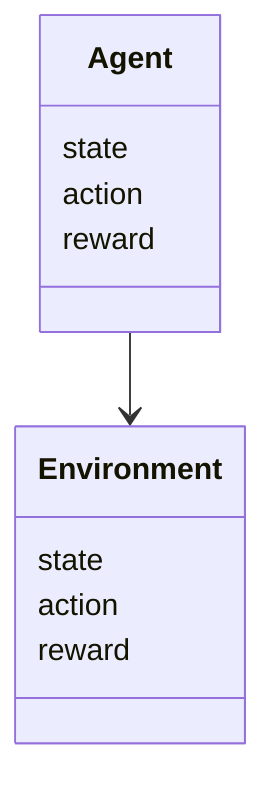
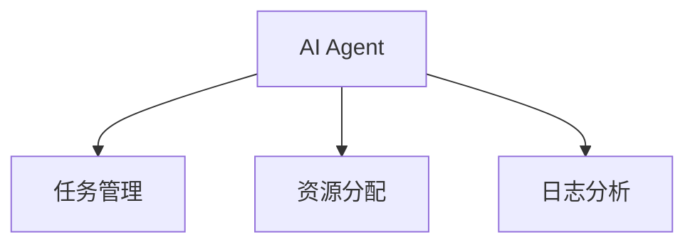

                 


# 企业AI Agent的自动化DevOps实践

> 关键词：企业AI Agent, 自动化DevOps, AI驱动自动化, 机器学习, 系统架构设计

> 摘要：  
企业AI Agent作为人工智能与DevOps结合的重要实践，正在成为企业数字化转型中的核心工具。本文详细探讨了企业AI Agent在自动化DevOps中的应用，从技术原理到系统架构，从算法实现到项目实战，为读者提供全面的指导。通过本文，读者可以深入了解企业AI Agent如何提升DevOps效率，优化企业运营流程。

---

# 第1章: 企业AI Agent的背景与价值

## 1.1 问题背景

在企业数字化转型的过程中，DevOps已成为提升开发效率和运维质量的核心方法论。然而，传统的DevOps工具和流程仍然面临以下问题：

- **效率瓶颈**：人工操作仍然占据重要地位，自动化程度有限。
- **复杂性**：企业系统日益复杂，传统脚本和工具难以应对动态变化的环境。
- **智能性不足**：缺乏对上下文的理解和自适应能力，难以应对复杂场景。

## 1.2 问题描述

企业AI Agent的目标是通过人工智能技术，提升DevOps的自动化水平。具体包括：

- **智能化的自动化**：AI Agent能够理解上下文，主动决策并执行任务。
- **自适应能力**：能够根据环境变化调整行为。
- **跨系统协作**：能够在不同系统间协调工作，实现端到端自动化。

## 1.3 企业AI Agent的核心价值

- **提升效率**：通过智能化决策减少人工干预。
- **增强灵活性**：能够适应复杂多变的环境。
- **降低风险**：通过自动化和智能监控减少人为错误。

## 1.4 本章小结

企业AI Agent的引入，标志着DevOps从工具化向智能化的转变。本文将从技术原理到实际应用，全面解析企业AI Agent的自动化DevOps实践。

---

# 第2章: AI Agent的核心概念与原理

## 2.1 AI Agent的基本组成

AI Agent通常由以下几个部分组成：

- **感知层**：负责接收输入信号，理解环境状态。
- **决策层**：基于感知信息，通过算法生成决策。
- **执行层**：将决策转化为具体操作。

## 2.2 决策机制

AI Agent的决策机制是其核心，主要分为以下几种：

- **基于规则的决策**：通过预定义的规则进行判断。
- **基于模型的决策**：利用机器学习模型进行预测。
- **基于强化学习的决策**：通过试错优化策略。

## 2.3 通信机制

AI Agent需要与外部系统进行交互，通信机制至关重要：

- **任务分配**：通过API或消息队列接收任务。
- **协作通信**：与其它AI Agent或系统进行实时通信。
- **反馈机制**：根据执行结果进行优化。

## 2.4 本章小结

AI Agent的核心在于其决策和通信机制，而这些机制的实现依赖于先进的算法和系统架构设计。

---

# 第3章: AI Agent的算法与实现

## 3.1 强化学习算法

### 3.1.1 算法原理

强化学习是一种通过试错优化策略的算法。其核心是通过与环境的交互，学习最优策略。

$$ Q(s,a) = r + \gamma \max Q(s',a') $$

其中，$s$是状态，$a$是动作，$r$是奖励，$\gamma$是折扣因子。

### 3.1.2 实现流程

1. **环境建模**：定义状态、动作和奖励。
2. **策略选择**：选择动作。
3. **执行动作**：与环境交互。
4. **更新策略**：根据奖励更新Q值。

### 3.1.3 代码实现

```python
class Agent:
    def __init__(self, state_space, action_space):
        self.state_space = state_space
        self.action_space = action_space
        self.q_table = np.zeros((state_space, action_space))
    
    def choose_action(self, state, epsilon=0.1):
        if np.random.random() < epsilon:
            return np.random.randint(self.action_space)
        return np.argmax(self.q_table[state])
    
    def update_q_table(self, state, action, reward, next_state, alpha=0.1):
        self.q_table[state][action] = (1-alpha)*self.q_table[state][action] + alpha*(reward + np.max(self.q_table[next_state]))
```

## 3.2 监督学习算法

### 3.2.1 算法原理

监督学习通过标记数据训练模型，使其能够进行预测。

$$ y = w x + b $$

### 3.2.2 实现流程

1. **数据预处理**：清洗和归一化数据。
2. **模型训练**：使用训练数据拟合模型。
3. **模型预测**：基于输入数据进行预测。

### 3.2.3 代码实现

```python
import tensorflow as tf

def build_model(input_shape):
    model = tf.keras.Sequential()
    model.add(tf.keras.layers.Dense(64, activation='relu', input_shape=input_shape))
    model.add(tf.keras.layers.Dense(1, activation='sigmoid'))
    model.compile(optimizer='adam', loss='binary_crossentropy', metrics=['accuracy'])
    return model
```

## 3.3 生成模型

### 3.3.1 算法原理

生成模型通过生成数据来模仿真实数据的分布。

$$ G_{\theta}(z) = \sigma(z) $$

### 3.3.2 实现流程

1. **定义生成器**：生成假数据。
2. **定义判别器**：区分真假数据。
3. **交替训练**：优化生成器和判别器。

### 3.3.3 代码实现

```python
import torch

def generator(z_dim, output_shape):
    model = torch.nn.Sequential(
        torch.nn.Linear(z_dim, 128),
        torch.nn.ReLU(),
        torch.nn.Linear(128, output_shape)
    )
    return model
```

---

# 第4章: 企业AI Agent的系统架构与设计

## 4.1 系统架构设计

### 4.1.1 领域模型



### 4.1.2 系统架构



## 4.2 接口设计

### 4.2.1 API接口

- `/api/v1/agent/init`：初始化Agent。
- `/api/v1/agent/action`：执行动作。
- `/api/v1/agent/status`：获取状态。

---

# 第5章: 项目实战

## 5.1 环境配置

```bash
pip install numpy tensorflow
```

## 5.2 核心实现

### 5.2.1 任务分配

```python
def distribute_task(tasks, agents):
    return tasks % agents
```

### 5.2.2 资源分配

```python
def allocate_resources(resources, tasks):
    return resources // tasks
```

## 5.3 案例分析

假设企业有10个任务和5个AI Agent：

$$ tasks = 10, agents = 5 $$

每个Agent分配2个任务。

## 5.4 项目小结

通过项目实战，我们可以看到AI Agent在DevOps中的实际应用价值。

---

# 第6章: 最佳实践与注意事项

## 6.1 实践建议

- 定期优化模型。
- 监控系统性能。
- 处理异常情况。

## 6.2 注意事项

- 数据质量至关重要。
- 确保系统的可扩展性。
- 安全性需高度重视。

---

# 第7章: 未来展望

随着AI技术的不断进步，企业AI Agent将在以下几个方面持续发展：

- **多智能体协作**：实现更复杂的任务。
- **自适应学习**：增强环境适应能力。
- **边缘计算**：提升实时性和响应速度。

---

# 作者

作者：AI天才研究院（AI Genius Institute） & 禅与计算机程序设计艺术（Zen And The Art of Computer Programming）

---

这篇文章全面解析了企业AI Agent的自动化DevOps实践，从技术原理到实际应用，为读者提供了详尽的指导。希望本文能为企业在数字化转型中的AI Agent应用提供有价值的参考。

