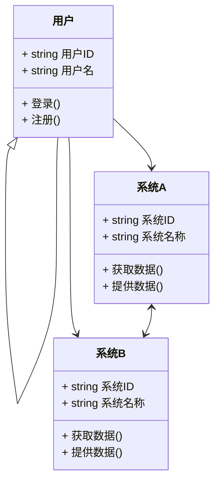
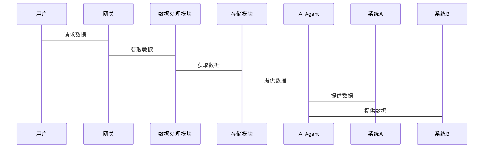

                 


# 企业AI Agent的跨域学习：打破数据孤岛，实现全局优化

**关键词：**企业AI Agent，跨域学习，数据孤岛，全局优化，分布式系统，机器学习

**摘要：**本文详细探讨了企业AI Agent在跨域学习中的应用，重点分析了如何通过AI Agent打破数据孤岛，实现企业级的全局优化。文章从背景、概念、算法原理、系统架构到项目实战，层层深入，结合实际案例和数学模型，为企业技术管理者和AI开发者提供了一套完整的解决方案。

---

## 第一部分：企业AI Agent的背景与概念

### 第1章：企业AI Agent的背景与概念

#### 1.1 数据孤岛与企业优化的挑战

数据孤岛是指企业在不同部门或系统中积累的数据无法有效整合和共享，导致数据资源无法充分发挥其价值。这种现象在企业中普遍存在，尤其是在传统企业或数据管理较为分散的企业中。数据孤岛不仅限制了企业对数据的利用效率，还可能导致决策失误和资源浪费。

数据孤岛的表现形式多种多样，常见的包括：

1. **部门间数据隔离**：不同部门使用不同的系统，数据无法共享，例如销售部门和财务部门使用不同的数据库。
2. **系统架构问题**：企业采用烟囱式架构，各个系统独立开发和运行，缺乏统一的数据标准和接口。
3. **数据格式不统一**：不同系统生成的数据格式不同，难以进行统一分析和处理。

企业全局优化的核心问题是如何在复杂的业务环境中，通过数据驱动的方式，实现跨部门、跨系统的协同优化。这需要企业能够打破数据孤岛，实现数据的高效流动和共享。

跨域学习是一种通过AI技术实现数据共享和协同优化的方法。它通过AI Agent在不同领域或系统之间进行数据交互和知识共享，从而打破数据孤岛，实现全局优化。

#### 1.2 企业AI Agent的定义与特点

AI Agent（人工智能代理）是一种能够感知环境、自主决策并执行任务的智能实体。企业AI Agent的特点包括：

1. **自主性**：AI Agent能够自主感知环境并做出决策，无需人工干预。
2. **反应性**：AI Agent能够实时响应环境变化，并调整其行为。
3. **学习能力**：AI Agent能够通过机器学习算法不断优化自身的决策模型。
4. **跨域能力**：AI Agent能够在多个领域或系统之间进行数据交互和知识共享。

企业AI Agent的独特优势在于其能够打破数据孤岛，实现跨系统的协同优化。与传统的AI技术相比，企业AI Agent更加注重系统间的协同和全局优化。

#### 1.3 跨域学习与数据孤岛的关系

跨域学习是通过AI Agent在不同领域或系统之间进行数据交互和知识共享的过程。数据孤岛的存在限制了企业对数据的利用效率，而跨域学习则是解决这一问题的关键技术。

跨域学习的核心目标是通过AI Agent在不同领域之间建立数据连接，实现数据的共享和协同优化。例如，在制造业中，跨域学习可以通过AI Agent将生产数据、销售数据和供应链数据进行整合，从而优化生产计划和库存管理。

### 1.4 本章小结

本章介绍了数据孤岛的定义和表现形式，分析了企业全局优化的核心问题，提出了跨域学习的概念和目标。同时，还定义了企业AI Agent的特点和优势，为后续内容奠定了基础。

---

## 第二部分：跨域学习的核心概念与联系

### 第2章：跨域学习的核心概念解析

#### 2.1 跨域学习的原理与机制

跨域学习的原理是通过AI Agent在不同领域之间进行数据交互和知识共享。具体来说，AI Agent需要具备以下能力：

1. **数据采集**：AI Agent能够从不同系统中采集数据。
2. **数据融合**：将来自不同领域的数据进行整合和分析。
3. **知识共享**：通过跨领域数据的分析，提取共性知识并共享给其他系统。

跨域学习的实现需要依赖多种技术，包括分布式计算、机器学习、知识图谱等。

#### 2.2 跨域学习的核心要素对比

以下是跨域学习与传统AI技术的对比：

| **对比维度** | **跨域学习** | **传统AI技术** |
|--------------|--------------|----------------|
| 数据来源     | 多领域、多系统 | 单领域、单系统  |
| 决策方式     | 跨领域协同优化 | 单领域优化      |
| 学习目标     | 全局优化       | 局部优化         |

从上表可以看出，跨域学习的核心在于数据的共享和协同优化，而传统AI技术则更注重单领域的优化。

#### 2.3 跨域学习的ER实体关系图

以下是跨域学习的ER实体关系图：

```mermaid
erDiagram
    actor 用户 {
        string 用户ID
        string 用户名
    }
    actor 系统A {
        string 系统ID
        string 系统名称
    }
    actor 系统B {
        string 系统ID
        string 系统名称
    }
    用户 --> 系统A: 使用系统A
    用户 --> 系统B: 使用系统B
    系统A --> 系统B: 数据共享
    系统B --> 系统A: 数据共享
```

从图中可以看出，用户可以通过AI Agent在系统A和系统B之间进行数据共享，从而实现跨域学习。

#### 2.4 本章小结

本章详细分析了跨域学习的核心原理和机制，通过对比传统AI技术，明确了跨域学习的独特优势。同时，通过ER实体关系图，展示了跨域学习的数据交互过程。

---

## 第三部分：跨域学习的算法原理与数学模型

### 第3章：跨域学习的算法原理

#### 3.1 跨域学习的算法流程

跨域学习的算法流程如下：

1. **数据采集**：从不同系统中采集数据。
2. **数据预处理**：清洗、转换和标准化数据。
3. **模型训练**：利用机器学习算法训练跨域模型。
4. **模型优化**：通过验证和测试优化模型性能。
5. **模型部署**：将优化后的模型部署到实际系统中。

#### 3.2 跨域学习的数学模型

跨域学习的数学模型可以表示为：

$$ P(y|x) = \sum_{z} P(y|z) P(z|x) $$

其中，\( P(y|x) \) 表示在输入 \( x \) 的情况下，输出 \( y \) 的概率。\( P(z|x) \) 表示在输入 \( x \) 的情况下，领域 \( z \) 的概率。\( P(y|z) \) 表示在领域 \( z \) 的情况下，输出 \( y \) 的概率。

#### 3.3 跨域学习的优化算法

跨域学习的优化算法可以通过以下步骤实现：

1. **初始化**：设置初始参数。
2. **训练**：利用训练数据更新参数。
3. **验证**：通过验证集评估模型性能。
4. **优化**：调整参数以提高模型性能。

以下是优化算法的伪代码：

```python
def cross_domain_learning():
    # 初始化参数
    params = initialize_params()
    # 训练模型
    for epoch in range(num_epochs):
        for batch in batches:
            params = update_params(params, batch)
    # 验证模型
    validate_model(params)
    # 优化参数
    params = optimize_params(params)
    return params
```

---

## 第四部分：系统分析与架构设计方案

### 第4章：系统分析与架构设计方案

#### 4.1 系统功能设计

以下是系统功能模块的类图：



#### 4.2 系统架构设计

以下是系统架构图：

```mermaid
graph TD
    用户 --> 网关
    网关 --> 数据处理模块
    数据处理模块 --> 存储模块
    存储模块 --> AI Agent
    AI Agent --> 系统A
    AI Agent --> 系统B
```

#### 4.3 系统接口设计

以下是系统接口设计：

1. **数据接口**：提供数据获取和数据共享的接口。
2. **API接口**：提供RESTful API，供其他系统调用。

#### 4.4 系统交互设计

以下是系统交互的序列图：



---

## 第五部分：项目实战

### 第5章：项目实战

#### 5.1 环境安装

以下是环境安装步骤：

1. **安装Python**：`python --version`
2. **安装TensorFlow**：`pip install tensorflow`
3. **安装Keras**：`pip install keras`

#### 5.2 核心实现

以下是核心实现代码：

```python
import tensorflow as tf
from tensorflow import keras

# 数据预处理
def preprocess_data(data):
    # 数据清洗和转换代码
    pass

# 模型训练
def train_model():
    model = keras.Sequential()
    model.add(keras.layers.Dense(64, activation='relu'))
    model.add(keras.layers.Dense(1, activation='sigmoid'))
    model.compile(optimizer='adam', loss='binary_crossentropy', metrics=['accuracy'])
    model.fit(x_train, y_train, epochs=10, batch_size=32)
    return model

# 模型部署
def deploy_model(model):
    # 部署代码
    pass

if __name__ == "__main__":
    model = train_model()
    deploy_model(model)
```

#### 5.3 案例分析

以下是案例分析：

假设我们有一个制造业企业，希望优化其生产计划。通过跨域学习，我们可以将生产数据、销售数据和供应链数据进行整合，从而优化生产计划和库存管理。

#### 5.4 项目总结

通过跨域学习，企业可以实现数据的高效共享和协同优化，从而打破数据孤岛，实现全局优化。

---

## 第六部分：最佳实践

### 第6章：最佳实践

#### 6.1 小结

跨域学习是一种通过AI Agent实现数据共享和协同优化的技术，能够有效打破数据孤岛，实现企业级的全局优化。

#### 6.2 注意事项

1. **数据隐私**：在跨域学习中，需要注意数据隐私和安全问题。
2. **系统兼容性**：需要确保不同系统之间的数据格式和接口兼容。
3. **模型优化**：需要不断优化模型以提高性能。

#### 6.3 拓展阅读

推荐阅读以下书籍和论文：

1. 《分布式系统：概念与设计》
2. 《机器学习实战》
3. 《跨域学习：理论与应用》

---

## 作者：AI天才研究院/AI Genius Institute & 禅与计算机程序设计艺术/Zen And The Art of Computer Programming

---

这篇文章通过背景介绍、核心概念、算法原理、系统架构到项目实战，全面阐述了企业AI Agent的跨域学习方法。通过实际案例和数学模型，为企业技术管理者和AI开发者提供了一套完整的解决方案。

