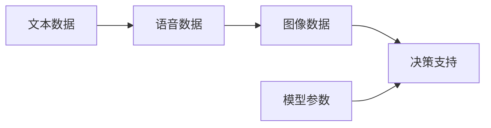
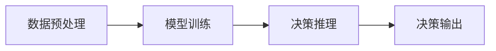
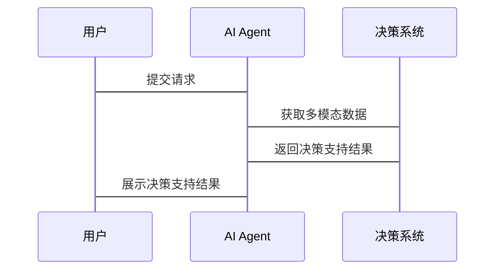

                 


# 企业AI Agent的跨模态学习：融合非结构化数据的决策支持

> **关键词**：企业AI Agent，跨模态学习，非结构化数据，决策支持，多模态数据，机器学习，智能系统

> **摘要**：本文详细探讨了企业AI Agent在跨模态学习中的应用，重点分析了如何通过融合非结构化数据来提升决策支持能力。文章从背景、核心概念、算法原理、系统架构到项目实战，全面解析了跨模态学习在企业智能化转型中的重要作用，并通过具体案例和代码实现，展示了如何构建高效的AI Agent系统。

---

## 第一部分：企业AI Agent的背景与问题背景

### 第1章：企业AI Agent的背景

#### 1.1 从传统AI到AI Agent的演进

传统AI系统通常基于规则和预定义的逻辑进行决策，但随着企业数据的多样性和复杂性增加，这种单一模态的处理方式已无法满足需求。AI Agent的出现，通过多模态数据的融合，为企业提供了更智能、更灵活的决策支持。

#### 1.2 企业智能化转型的需求

企业智能化转型的核心目标是通过数据驱动的方式优化业务流程、提升决策效率。然而，企业中存在大量非结构化数据（如文本、图像、语音等），这些数据难以被传统AI系统处理。AI Agent通过跨模态学习，能够将这些非结构化数据转化为决策支持的依据。

#### 1.3 跨模态学习的兴起

跨模态学习是一种通过多种数据模态（如文本、图像、语音等）进行信息融合的学习方式。随着深度学习技术的发展，跨模态学习在自然语言处理、计算机视觉等领域取得了显著成果，为企业AI Agent的应用提供了技术基础。

---

### 第2章：跨模态学习的核心概念与联系

#### 2.1 跨模态学习的定义与特点

- **定义**：跨模态学习是指在多个数据模态之间建立关联，通过信息共享和特征融合来提升模型的表达能力。
- **特点**：
  - 多模态数据的融合
  - 模态间信息互补性强
  - 能够处理非结构化数据

#### 2.2 跨模态学习的核心原理

- **多模态嵌入**：将不同模态的数据映射到一个共享的嵌入空间，使得不同模态的数据可以进行对比和融合。
- **对比学习**：通过对比不同模态的数据，学习其共同特征和差异特征。
- **图神经网络**：利用图结构表示数据间的关联关系，进一步提升跨模态学习的效果。

#### 2.3 跨模态学习的实体关系图



---

### 第3章：跨模态学习的算法原理

#### 3.1 多模态嵌入的数学表示

- 文本数据嵌入：使用词嵌入（如Word2Vec）或句嵌入（如BERT）将文本数据映射到向量空间。
- 图像数据嵌入：使用CNN或GAN将图像数据映射到向量空间。
- 语音数据嵌入：使用Mel-Frequency Cepstral Coefficients (MFCC)提取语音特征。

#### 3.2 对比学习的损失函数

- **对比损失函数**：
  $$ L = -\frac{1}{N} \sum_{i=1}^{N} \log(\text{sim}(x_i, y_i)) $$
  其中，$$ \text{sim}(x_i, y_i) $$ 是模态i的正样本相似度。

#### 3.3 图神经网络的应用

- 图结构表示：将多模态数据建模为图结构，节点表示为数据样本，边表示为数据间的关联关系。
- 图神经网络模型：如GraphSAGE和GAT（Graph Attention Networks）。

---

### 第4章：跨模态学习的系统设计与架构

#### 4.1 系统功能设计

- **数据预处理模块**：对多模态数据进行清洗、标准化处理。
- **模型训练模块**：基于多模态数据训练跨模态学习模型。
- **决策推理模块**：根据模型输出进行决策推理，生成决策支持结果。

#### 4.2 系统架构设计



#### 4.3 系统交互流程



---

### 第5章：项目实战

#### 5.1 环境安装与配置

- Python版本：Python 3.8+
- 深度学习框架：TensorFlow或PyTorch
- 其他依赖：numpy、pandas、scikit-learn

#### 5.2 核心代码实现

```python
import tensorflow as tf
from tensorflow.keras import layers

def contrastive_loss(y_true, y_pred):
    margin = 1.0
    loss = tf.reduce_mean(tf.square(y_true - y_pred))
    return loss

def multi_modal_model():
    # 文本分支
    text_input = layers.Input(shape=(128,))
    text_embed = layers.Dense(64, activation='relu')(text_input)
    
    # 图像分支
    image_input = layers.Input(shape=(224, 224, 3))
    image_embed = layers.Conv2D(64, (3,3), activation='relu')(image_input)
    image_embed = layers.Flatten()(image_embed)
    
    # 合并分支
    merged = layers.Concatenate()([text_embed, image_embed])
    dense_layer = layers.Dense(32, activation='relu')(merged)
    output = layers.Dense(2)(dense_layer)
    
    model = tf.keras.Model(inputs=[text_input, image_input], outputs=output)
    model.compile(optimizer='adam', loss=contrastive_loss, metrics=['accuracy'])
    return model
```

---

### 第6章：最佳实践与小结

#### 6.1 小结

本文详细探讨了企业AI Agent在跨模态学习中的应用，通过融合非结构化数据，提升了决策支持能力。从算法原理到系统设计，再到项目实战，全面解析了跨模态学习在企业智能化转型中的重要作用。

#### 6.2 注意事项

- 数据质量：多模态数据的预处理和清洗至关重要。
- 模型调优：需要根据实际场景调整模型参数和架构。
- 安全与隐私：多模态数据的处理需要考虑隐私保护。

#### 6.3 拓展阅读

- 《Deep Learning》 —— Ian Goodfellow
- 《Neural Networks and Deep Learning》 —— Michael Nielsen
- 《Cross-Modal Learning: Methods and Applications》 —— Zhang et al.

---

**作者：AI天才研究院 & 禅与计算机程序设计艺术**

