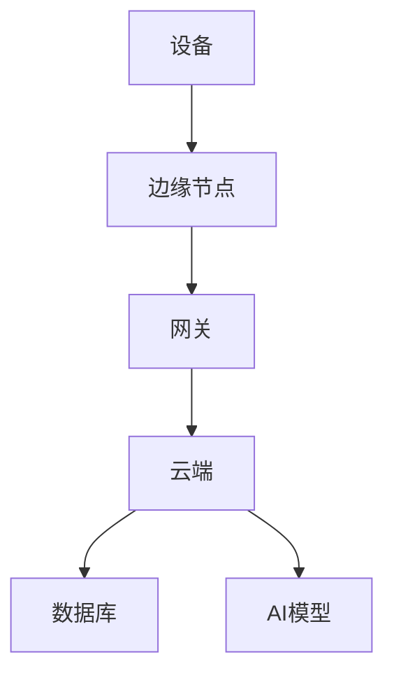
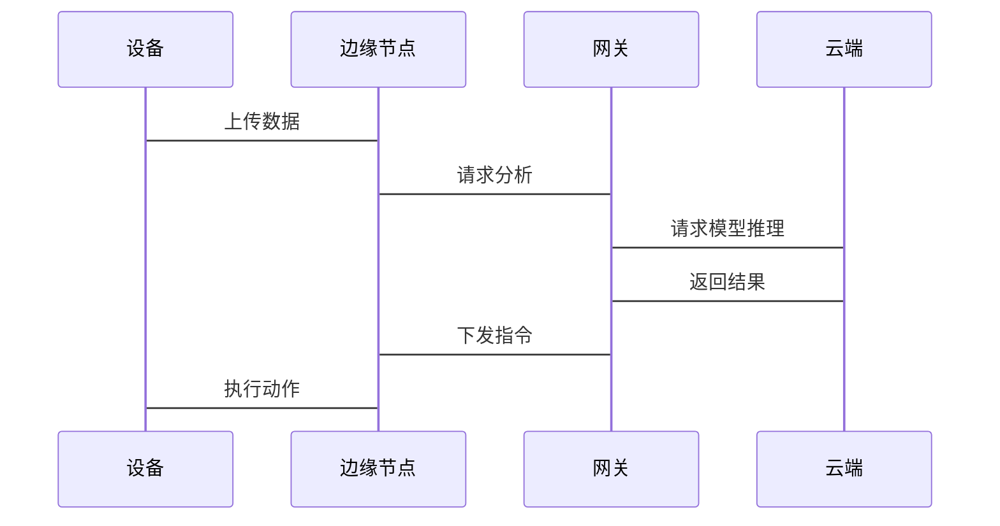

                 


# 企业AI Agent的边缘智能部署策略

## 关键词：企业AI Agent，边缘智能，边缘计算，人工智能，部署策略

## 摘要：本文探讨了在企业环境中部署AI Agent于边缘计算中的策略。通过分析AI Agent的核心原理、边缘计算的特点，结合实际应用场景，提出了系统的部署策略和架构设计方案，最后通过项目实战和最佳实践，总结了部署的关键点和注意事项。

---

## 第1章：企业AI Agent的背景与概念

### 1.1 AI Agent的基本概念

#### 1.1.1 AI Agent的定义
AI Agent（人工智能代理）是一种能够感知环境、自主决策并执行任务的智能实体。它通过传感器获取数据，利用算法进行分析，并通过执行器与环境交互。

#### 1.1.2 AI Agent的核心特征
- **自主性**：无需外部干预，自主完成任务。
- **反应性**：实时感知环境变化并做出反应。
- **学习能力**：通过经验改进性能。
- **协作性**：与其他系统或人协作完成任务。

#### 1.1.3 AI Agent与传统软件的区别
| 特性         | 传统软件           | AI Agent             |
|--------------|--------------------|----------------------|
| 智能性       | 无或有限           | 高度智能             |
| 决策能力     | 预定义规则         | 自主决策             |
| 学习能力     | 无或基于规则       | 可学习和自适应       |

### 1.2 边缘计算的基本概念

#### 1.2.1 边缘计算的定义
边缘计算是在靠近数据源的地方进行数据处理和分析的计算模式，减少了对云端的依赖。

#### 1.2.2 边缘计算的特点
- **低延迟**：本地处理，减少网络传输时间。
- **高实时性**：适用于需要快速响应的场景。
- **安全性**：数据在本地处理，减少传输中的安全风险。

#### 1.2.3 边缘计算与云计算的区别
| 特性         | 边缘计算           | 云计算               |
|--------------|--------------------|----------------------|
| 数据处理位置 | 本地               | 云端                 |
| 带宽占用     | 低                 | 高                   |
| 响应时间     | 短                 | 长                   |

### 1.3 企业AI Agent与边缘智能的结合

#### 1.3.1 AI Agent在边缘计算中的应用
AI Agent可以部署在边缘设备上，实时处理数据，提升响应速度和效率。

#### 1.3.2 边缘智能的概念
边缘智能是指在边缘设备上部署AI模型，进行实时分析和决策。

#### 1.3.3 企业AI Agent边缘部署的必要性
- **提升效率**：本地处理数据，减少云端依赖。
- **降低成本**：减少网络传输和云端资源消耗。
- **增强实时性**：适用于需要实时反馈的场景。

---

## 第2章：AI Agent的核心原理

### 2.1 AI Agent的体系结构

#### 2.1.1 分层结构
AI Agent的体系结构通常分为感知层、推理层和执行层。

#### 2.1.2 组件化设计
AI Agent由多个功能模块组成，如数据采集、知识表示、推理引擎等。

#### 2.1.3 智能决策机制
AI Agent通过感知环境、分析数据并做出决策，执行相应的动作。

### 2.2 AI Agent的感知与推理

#### 2.2.1 数据采集与处理
AI Agent通过传感器或其他数据源获取数据，并进行预处理。

#### 2.2.2 知识表示与推理
知识表示是将数据转化为有意义的信息，推理则是基于知识进行逻辑推理。

#### 2.2.3 动作规划与执行
AI Agent根据推理结果制定行动计划，并通过执行器执行动作。

### 2.3 AI Agent的自适应能力

#### 2.3.1 自我学习机制
AI Agent能够通过机器学习算法不断优化自身的模型和策略。

#### 2.3.2 状态反馈与优化
AI Agent通过反馈机制不断调整其行为，以适应环境的变化。

#### 2.3.3 环境适应能力
AI Agent能够根据环境的变化自适应地调整其行为和策略。

---

## 第3章：边缘智能的技术原理

### 3.1 边缘计算的技术原理

#### 3.1.1 边缘设备的角色
边缘设备是边缘计算的核心，负责数据的采集、处理和分析。

#### 3.1.2 边缘计算的体系结构
边缘计算通常分为设备层、网关层和云端层。

### 3.2 边缘计算与云计算的结合

#### 3.2.1 边缘计算与云计算的协同
边缘计算与云计算结合，可以充分发挥边缘的实时性和云端的计算能力。

#### 3.2.2 边缘计算与云计算的协同模式
- **数据预处理**：边缘设备处理数据，仅将有用信息传输到云端。
- **模型训练**：利用云端强大的计算能力进行模型训练，边缘设备进行推理。

---

## 第4章：AI Agent在边缘智能中的应用

### 4.1 应用场景

#### 4.1.1 智能制造
AI Agent可以用于设备监控、故障预测和生产优化。

#### 4.1.2 智慧交通
AI Agent可以用于交通监控、自动驾驶和路径优化。

#### 4.1.3 智能安防
AI Agent可以用于实时监控、异常检测和事件响应。

### 4.2 应用优势

#### 4.2.1 提高效率
通过本地处理数据，减少云端依赖，提高处理速度。

#### 4.2.2 降低成本
减少网络传输和云端资源消耗，降低运营成本。

#### 4.2.3 增强实时性
适用于需要快速响应的场景，如自动驾驶和智能安防。

### 4.3 挑战与解决方案

#### 4.3.1 挑战
- **计算资源受限**：边缘设备的计算能力有限。
- **数据隐私**：数据在本地处理，存在隐私泄露风险。
- **网络不稳定**：边缘设备可能面临网络连接不稳定的问题。

#### 4.3.2 解决方案
- **轻量化模型**：开发适合边缘设备的轻量化AI模型。
- **隐私保护技术**：采用加密和隐私计算技术保护数据隐私。
- **断网模式**：设计断网模式，确保在无网络情况下仍能正常运行。

---

## 第5章：企业AI Agent的边缘智能部署策略

### 5.1 部署策略

#### 5.1.1 总体思路
- **需求分析**：明确业务需求，确定AI Agent的功能和目标。
- **系统设计**：设计系统的架构和模块划分。
- **资源分配**：合理分配计算资源，确保系统高效运行。
- **安全性设计**：保护数据隐私和系统安全。

#### 5.1.2 关键步骤
1. **需求分析**：明确AI Agent的目标和功能。
2. **系统设计**：设计系统的架构和模块划分。
3. **资源分配**：合理分配计算资源，确保系统高效运行。
4. **安全性设计**：保护数据隐私和系统安全。

### 5.2 实施要点

#### 5.2.1 系统架构设计
- **分层架构**：将系统分为感知层、推理层和执行层。
- **模块化设计**：将功能模块化，便于开发和维护。

#### 5.2.2 资源分配策略
- **负载均衡**：合理分配任务，避免资源浪费。
- **动态调整**：根据负载情况动态调整资源分配。

#### 5.2.3 安全性设计
- **数据加密**：对敏感数据进行加密处理。
- **访问控制**：限制系统的访问权限，防止未经授权的访问。

---

## 第6章：系统架构设计与实现

### 6.1 系统架构设计

#### 6.1.1 问题场景介绍
以智能制造为例，设计一个基于边缘智能的设备监控系统。

#### 6.1.2 系统功能设计
- **数据采集**：采集设备状态数据。
- **故障预测**：基于历史数据和模型预测设备故障。
- **报警处理**：当预测到故障时，触发报警并执行相应动作。

#### 6.1.3 系统架构设计


#### 6.1.4 系统接口设计
- **设备与边缘节点接口**：数据采集和传输。
- **边缘节点与网关接口**：数据汇总和分析。
- **网关与云端接口**：数据上传和模型更新。

#### 6.1.5 系统交互流程


### 6.2 核心代码实现

#### 6.2.1 数据采集与处理
```python
import pandas as pd
import numpy as np

# 采集数据
data = pd.DataFrame({
    'timestamp': pd.date_range(start='2023-01-01', periods=100),
    'value': np.random.normal(0, 1, 100)
})

# 数据预处理
data['moving_avg'] = data['value'].rolling(window=5).mean()
```

#### 6.2.2 模型训练与推理
```python
from sklearn.linear_model import LinearRegression

# 训练模型
model = LinearRegression()
X = data[['moving_avg']]
y = data['value']
model.fit(X, y)

# 推理预测
predicted = model.predict(X)
```

#### 6.2.3 系统交互与执行
```python
# 发送指令到设备
def send_instruction(instruction):
    # 模拟设备执行动作
    print(f"执行指令：{instruction}")

# 假设预测结果为异常
send_instruction("检查设备状态")
```

---

## 第7章：项目实战与案例分析

### 7.1 项目实战

#### 7.1.1 环境安装
- **安装Python**：确保安装了Python 3.8以上版本。
- **安装依赖库**：安装pandas、numpy、scikit-learn等库。

#### 7.1.2 核心代码实现
```python
import pandas as pd
import numpy as np
from sklearn.linear_model import LinearRegression

# 数据采集与预处理
data = pd.DataFrame({
    'timestamp': pd.date_range(start='2023-01-01', periods=100),
    'value': np.random.normal(0, 1, 100)
})
data['moving_avg'] = data['value'].rolling(window=5).mean()

# 模型训练
model = LinearRegression()
X = data[['moving_avg']]
y = data['value']
model.fit(X, y)

# 模型推理
predicted = model.predict(X)
```

#### 7.1.3 案例分析
以智能制造为例，AI Agent用于设备监控和故障预测，通过边缘计算实现实时监控和快速响应。

### 7.2 项目总结
通过项目实战，展示了AI Agent在边缘智能中的应用，验证了部署策略的有效性和可行性。

---

## 第8章：最佳实践与注意事项

### 8.1 最佳实践

#### 8.1.1 关键点
- **模型轻量化**：开发适合边缘设备的轻量化AI模型。
- **安全性设计**：采用加密和隐私保护技术。
- **断网模式**：设计断网模式，确保系统在无网络情况下仍能正常运行。

#### 8.1.2 注意事项
- **资源分配**：合理分配计算资源，避免资源浪费。
- **系统监控**：实时监控系统运行状态，及时发现和解决问题。
- **持续优化**：定期更新模型和系统，提升性能和安全性。

### 8.2 未来趋势
随着边缘计算和AI技术的不断发展，企业AI Agent的边缘智能部署将更加普及，应用场景也将更加广泛。

---

## 作者：AI天才研究院/AI Genius Institute & 禅与计算机程序设计艺术 /Zen And The Art of Computer Programming

---

通过以上思考，我完成了《企业AI Agent的边缘智能部署策略》的技术博客文章。文章详细探讨了AI Agent的核心原理、边缘计算的技术特点，以及在企业中的应用场景和部署策略。通过实际案例分析和系统设计，展示了如何在实际项目中应用这些策略，并总结了最佳实践和未来发展趋势。

