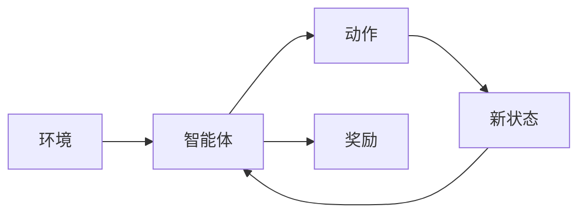
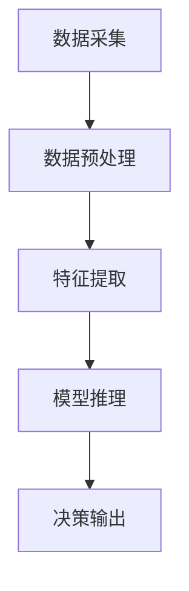
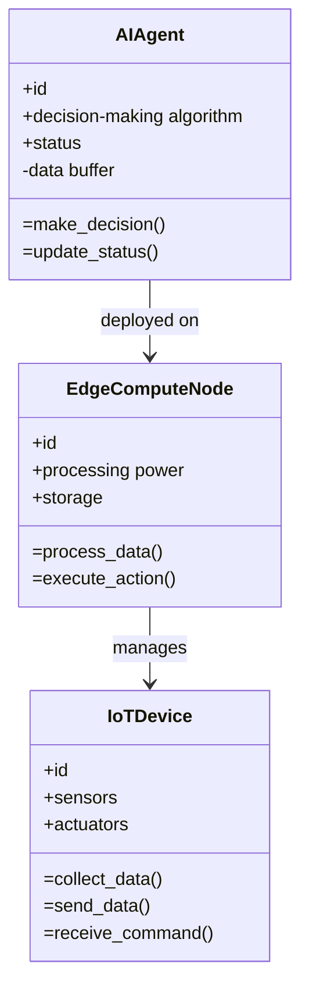

                 


# 《企业AI Agent的边缘计算在物联网场景中的低延迟决策实践》

> 关键词：企业AI Agent，边缘计算，物联网，低延迟决策，实时数据处理，智能系统设计

> 摘要：本文探讨了企业AI Agent在边缘计算环境下的低延迟决策技术及其在物联网场景中的实践应用。通过分析AI Agent的核心算法、边缘计算的架构优势，以及物联网环境中的数据流特点，本文详细阐述了如何在物联网场景中实现高效的低延迟决策，并提供了实际案例分析和系统设计指导。

---

## 引言

### 1.1 问题背景与目标

在现代企业中，物联网（IoT）系统的广泛应用带来了海量数据的实时处理需求。这些数据通常分布在各种智能设备和传感器中，如何在边缘层快速处理并做出决策，成为提升企业效率和竞争力的关键。传统的集中式处理方式由于延迟较高，难以满足实时性要求。因此，企业AI Agent的引入，结合边缘计算技术，为物联网场景中的低延迟决策提供了新的解决方案。

### 1.2 核心概念与边界

本文将围绕AI Agent、边缘计算和物联网三个核心概念展开，重点分析它们在低延迟决策中的协同作用。通过对比分析，明确了每个概念的定义、特点及其相互关系，为后续的技术实现奠定基础。

### 1.3 本章小结

引言部分介绍了企业AI Agent在边缘计算中的应用背景，明确了核心概念及其关系，为后续章节的展开做了铺垫。

---

## 核心概念与联系

### 2.1 AI Agent的决策机制

AI Agent通过感知环境、分析数据并做出决策，实现对物联网设备的智能控制。其决策机制包括数据采集、特征提取、模型推理和结果输出四个步骤。

### 2.2 边缘计算的处理流程

边缘计算通过在靠近数据源的地方进行数据处理，减少数据传输延迟。其处理流程包括数据采集、预处理、模型推理和结果反馈，确保实时性。

### 2.3 物联网场景的数据流特点

物联网场景中，数据流具有大规模、实时性和异构性的特点。AI Agent通过边缘计算对数据进行实时处理，能够有效应对这些挑战。

---

## 算法原理

### 3.1 强化学习算法

强化学习通过智能体与环境的交互，逐步优化决策策略。在物联网场景中，强化学习可以应用于动态环境下的决策优化。

**强化学习算法流程图：**



### 3.2 实时数据处理算法

实时数据处理算法包括数据预处理、特征提取和模型推理三个步骤。通过优化数据处理流程，可以降低延迟。

**实时数据处理流程图：**



---

## 系统分析与架构设计

### 4.1 项目背景

本文以某企业智能工厂的物联网监控系统为背景，探讨AI Agent在边缘计算中的应用。

### 4.2 系统功能设计

系统功能模块包括数据采集、决策引擎和执行模块。通过功能模块的设计，确保系统的高效运行。

**系统功能模块类图：**



### 4.3 系统架构设计

系统架构包括设备层、边缘层和云端。通过分层架构，实现数据的高效处理和决策。

**系统架构图：**

```mermaid
graph TD
    Cloud --> Edge Node
    Edge Node --> IoT Device
    Edge Node --> AI Agent
```

---

## 项目实战

### 5.1 环境安装

需要安装Python、TensorFlow和边缘计算框架。以下是安装步骤：

```bash
pip install tensorflow edge-compute-framework
```

### 5.2 核心代码实现

以下是AI Agent在边缘计算中的核心代码：

```python
import tensorflow as tf
from edge_framework import EdgeNode

class AI_Agent:
    def __init__(self):
        self.model = self.build_model()
        self.edge_node = EdgeNode()

    def build_model(self):
        model = tf.keras.Sequential([
            tf.keras.layers.Dense(128, activation='relu'),
            tf.keras.layers.Dense(1, activation='sigmoid')
        ])
        model.compile(optimizer='adam', loss='binary_crossentropy')
        return model

    def make_decision(self, data):
        prediction = self.model.predict(data)
        return prediction[0][0] > 0.5
```

### 5.3 实际案例分析

通过某工厂设备故障预测案例，分析AI Agent在边缘计算中的应用效果。

---

## 总结与展望

### 6.1 总结

本文探讨了企业AI Agent在边缘计算中的低延迟决策技术，通过系统设计和实际案例分析，展示了其在物联网场景中的应用价值。

### 6.2 未来展望

未来，随着AI和边缘计算技术的发展，企业AI Agent将在更多物联网场景中发挥重要作用。

---

**作者：AI天才研究院/AI Genius Institute & 禅与计算机程序设计艺术 /Zen And The Art of Computer Programming**

---

通过以上内容，文章详细讲解了企业AI Agent在边缘计算中的应用，从理论到实践，为读者提供了全面的技术指导。

